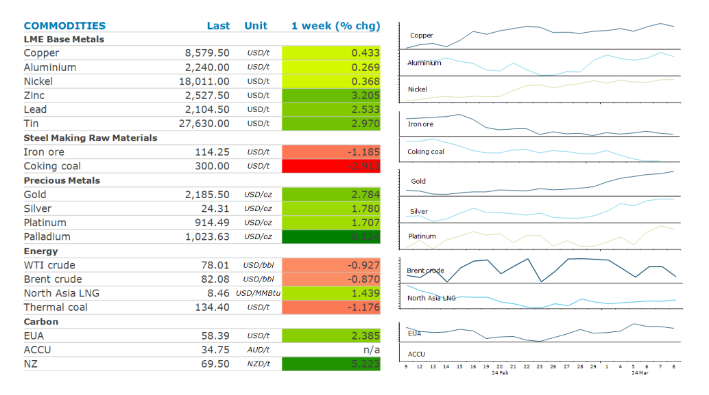

# China's shifting consumptions patterns pushed metals higher

**Date:** March 11, 2024  
**Publisher:** Breakwave Advisors | **Category:** Market Insights  
**Original URL:** [https://www.breakwaveadvisors.com/insights/2024/3/11/chinas-shifting-consumptions-patterns-pushed-metals-higher](https://www.breakwaveadvisors.com/insights/2024/3/11/chinas-shifting-consumptions-patterns-pushed-metals-higher)  

---

**Commodity prices lifted across the sector, aided by a sharp fall in the USD, which helped increase investor appetite.**

*By*[*Daniel Hynes*](https://www.linkedin.com/in/dahynes/)

> **Figure 1: Screenshot 2024 03 11 09.44.14**  
> [Local Asset](file:///C:/Users/Dell/Github/Shipping/corpus/03-breakwave/insights/2024/assets/2024-03-11_chinas-shifting-consumptions-patterns-pushed-metals-higher_img_screenshot2024-03-11094414_26d7a432383a.png)

The latest National People’s Congress meeting failed to excite the market, with no new stimulus measures announced, despite setting an aggressive growth target of 5%. However, China’s focus on high quality development in new, emerging sectors is likely to see the country’s[**consumption of commodities continue to shift and evolve**](../pdfs/2024-03-11_chinas-shifting-consumptions-patterns-pushed-metals-higher_commodity-call-out-with-old-commodit_e8ce5179a55d.pdf). We see demand for metals & critical minerals and cleaner burning fuels such as gas continuing to rise. At the same time, there is likely to be less support for demand of commodities such as oil, steel and iron ore.

The**base metals**sector ended the week higher, led by a solid gain in copper amid signs of tightness. Stockpiles held in LME warehouses fell sharply last week. Refined copper monthly imports were 2.5% y/y in January-February 2024. Imports of copper ore & concentrates were also up only marginally, highlighting tightness in the international market following recent mine closures.**Zinc**gained after orders to withdraw the metal from LME warehouses surged. This follows reports that South Korea’s Young Poong Corp has cut refined zinc production at its Seokpo smelter by 20%.

**Gold**maintained market momentum, with prices hitting fresh highs towards USD2,200/oz. Mounting geopolitical concerns and political developments are supporting safe-haven demand. Signs of a Federal Reserve rate cut later this year also aided market sentiment. It seems some macro funds are rotating their money from equity to gold to diversify risk. Speculative net-long positions increased by 152t for the week ending 5 March. However, gold backed ETF outflows continued, with total gold ETF holdings declining by 6.2t last week. Central banks remain strong buyers.

**Brent crude oil**continued to hover near USD82/oz despite tensions in the Middle East. Oil tankers are taking alternative routes via the Cape of Good Hope, increasing shipping costs. The delay in shipments is creating a regional arbitrage for both oil and products. Europe remains the most impacted region as oil product shipments from Asia have fallen since January. Europe has become more dependent on Asian oil products due to the war in Ukraine. Saudi Arabia increased its oil selling price for the next month. With OPEC+ extending its voluntary production cut agreement until the end of Q2 2024, this could tighten the market as demand recovers from its seasonal lull.

Data source:[Commodities Wrap](https://www.linkedin.com/newsletters/commodities-wrap-6692196755876012032/?fbclid=IwAR3kiXJqZdxmp9ZcRwBNI7FsBySI-XSC0pfPur1qzjt7OZp7PTE59Tsl1QI)

---

**Tags:** Commodities, Crude Oil, Ironore  
