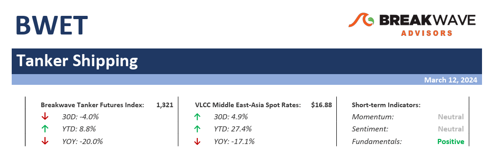
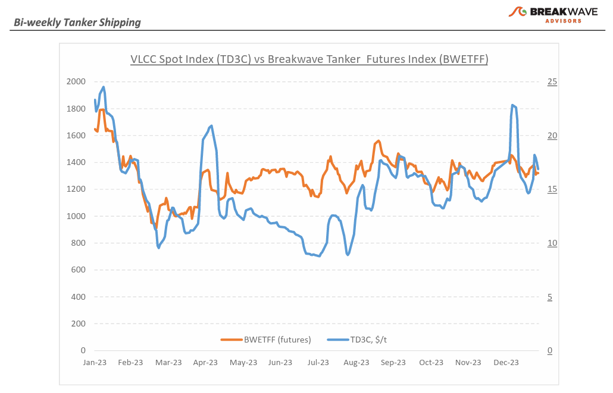
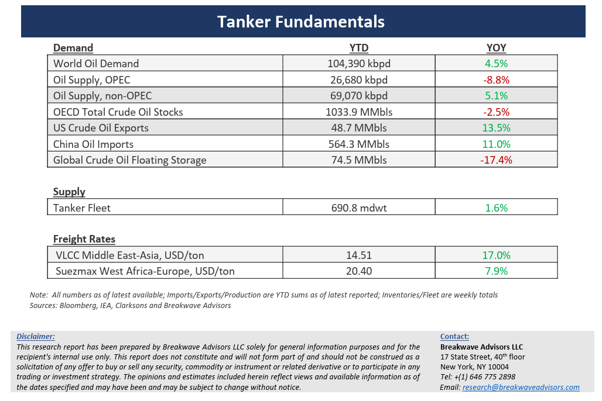

# Breakwave Bi-Weekly Tanker Report - March 12, 2024

**Date:** March 12, 2024  
**Publisher:** Breakwave Advisors | **Category:** Market Insights  
**Original URL:** [https://www.breakwaveadvisors.com/insights/2024312wet](https://www.breakwaveadvisors.com/insights/2024312wet)  

---

> **Figure 1: Tankerreporttop**  
> [Local Asset](file:///C:/Users/Dell/Github/Shipping/corpus/03-breakwave/insights/2024/assets/2024-03-12_2024312wet_img_tankerreporttop_112f95375875.png)

**· Another short term spike comes to an end as the Atlantic market fails to inspire –**The late February uptick in VLCC rates ended up**being short lived**and rightly so: The increasingly important**Atlantic market**that has recently been of great support to the broader crude tanker segment**failed to inspire**and thus the Middle East VLCC market turned lower as the pace of cargo flow tapered off and owners lost the upper hand, at least for now. Despite this,**March**has entered with a**firmer sentiment**compared to February and spot prices for VLCCs MEG-China crude oil shipments by the end of the first week were nearly 8% higher than the previous month. There is optimism**for continued firmness**, as remaining March cargoes need coverage and any increase in activity could once again push rates upward, considering the reduced availability of ships. Time and again, the crude segment, especially for the large VLCCs, has**shown its ability to rally on the slightest indication of imbalance**between supply and demand, something that we attribute to the strong underlying fundamentals of the sector (i.e. very limited new vessel supply in the face of steady demand). With OPEC+ production remaining at the reduced pace of the last year,**any increase in demand that leads to more oil flows**should naturally help the crude tanker market, but obviously broader macroeconomic factors need to improve globally for such an outcome to take place. For the time being, small-scale spikes should remain the case as long as positional imbalances provide the necessary ingredients for owners to push rates higher, in the process supporting a strong average spot market.

**·****Crude oil demand moves upward as China shows early signs of strength**– February ended on a positive note with China's crude oil imports experiencing a rise during the initial two months of the year compared to the same period in 2023.**Official customs data revealed Chinese crude oil imports**totaling about 88.3 million metric tons during January-February, marking**a 5% increase**from 2023 (although when analyzed on a barrels per day (bpd) basis, the increase amounted to only 3.3%, factoring in the additional day this year in February due to the leap year). Yet, OPEC+ decided to extend last year’s production cuts through the second quarter of the year, as the oil market looks better balanced than initially thought. Oil prices remain on the upper end of the recent range (approximately $70-$80 for WTI), reflecting**the tightening of the global oil balance**, better macro-related data and of course the ongoing geopolitical disruptions in the oil supply (Red Sea tanker divergences) that contribute to lower onshore inventories and higher on the water stocks. Of course, with lower oil production comes**higher perceived excess capacity**which should continue to put a lid on prices, at least until more solid oil demand growth develops into a base case.

**· Our long-term view –**The tanker market is recovering from a long period of staggered rates as the growth in new vessel supply shrinks while oil demand is recovering in line with the global economy. A historically low orderbook combined with favorable demand fundamentals should continue to support increased spot rate volatility, which combined with the ongoing geopolitical turmoil, should support freight rates in the medium to long term.

> **Figure 2: Tankerreportchart**  
> [Local Asset](file:///C:/Users/Dell/Github/Shipping/corpus/03-breakwave/insights/2024/assets/2024-03-12_2024312wet_img_tankerreportchart_afe24cb8e8ee.png)

> **Figure 3: Tankerreportbottom**  
> [Local Asset](file:///C:/Users/Dell/Github/Shipping/corpus/03-breakwave/insights/2024/assets/2024-03-12_2024312wet_img_tankerreportbottom_d0af1f346c7c.png)

### Subscribe:
