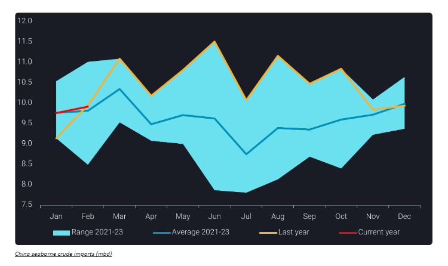
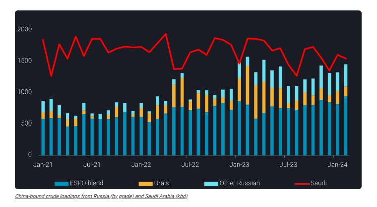
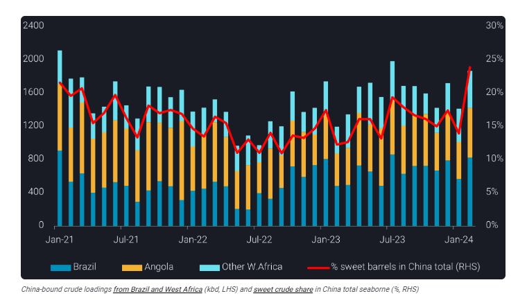

# Is the rebound in China’s demand on the horizon?

**Date:** March 12, 2024  
**Publisher:** Breakwave Advisors | **Category:** Market Insights  
**Original URL:** [https://www.breakwaveadvisors.com/insights/2024/3/12/is-the-rebound-in-chinas-demand-on-the-horizon](https://www.breakwaveadvisors.com/insights/2024/3/12/is-the-rebound-in-chinas-demand-on-the-horizon)  

---

**China’s seaborne crude imports remained subtle in February, but a rebound from restocking looms.**

*By*[*Emma Li*](https://www.linkedin.com/search/results/all/?fetchDeterministicClustersOnly=true&heroEntityKey=urn%3Ali%3Afsd_profile%3AACoAAAkUwhQBM44CbK7vxCDU3lmN3qvn09Ud8y8&keywords=emma%20li&origin=RICH_QUERY_SUGGESTION&position=0&searchId=9a3500db-6c88-4386-8caf-a8f0635209bb&sid=Uci&spellCorrectionEnabled=false)

China’s seaborne crude imports stayed below the 10mbd mark for a fourth consecutive month in February, prompting questions about whether the downturn has reached its nadir. Despite a moderate year-on-year rise driven by base effects and robust travel demand during Chinese New Year holidays, indications suggest that China’s crude demand is poised to remain within the confines of last year’s figures and the seasonal average.

> **Figure 1: Screenshot 2024 03 12 14.58.10**  
> **Interactive Data & Source:** [Analytics Vortexa](https://analytics.vortexa.com/?dateRange=2021-01-01T00%3A00%3A00.000Z__2024-03-06T23%3A59%3A59.999Z&hiddenSeries=%5B%22a63890260e29d859390fd1a23c690181afd4bd152943a04c00cd6a5ecf3f7d1e%22%2C%22781cacc7033f877caa4b4106d096b74afe006a96391bf5a56a4f55b849359a42%22%2C%22b5fafce6e20de2dc307fb7e0b89978ee91a49a7b6ec6f5461daf2633f3c56674%22%5D&onshoreInventoriesLocations=%5B%22b5fafce6e20de2dc307fb7e0b89978ee91a49a7b6ec6f5461daf2633f3c56674%22%2C%220fddbfd0d90bad306a92fcb483a19276f101a5f7f0783363f9f2a9d40c10558d%22%5D&page=OnShoreCrudeInventories&selectedRegion=%5B%22b5fafce6e20de2dc307fb7e0b89978ee91a49a7b6ec6f5461daf2633f3c56674%22%5D&tabId=0cd16ff6-30e9-4ff7-a5c6-915250d00cc2&tankCrude=%5B%22confirmed%22%2C%22probable%22%5D) | [Local Asset](file:///C:/Users/Dell/Github/Shipping/corpus/03-breakwave/insights/2024/assets/2024-03-12_is-the-rebound-in-chinas-demand-on-the-horizon_img_screenshot2024-03-12145810_671bcf98b11d.png)

Anticipating Sinopec’s inventories hitting a 2-year low in March, earlier projections highlighted the need for Chinese oil majors to replenish crude stocks. However, the absence of visible signs of building[crude storage](https://analytics.vortexa.com/?dateRange=2021-01-01T00%3A00%3A00.000Z__2024-03-06T23%3A59%3A59.999Z&hiddenSeries=%5B%22a63890260e29d859390fd1a23c690181afd4bd152943a04c00cd6a5ecf3f7d1e%22%2C%22781cacc7033f877caa4b4106d096b74afe006a96391bf5a56a4f55b849359a42%22%2C%22b5fafce6e20de2dc307fb7e0b89978ee91a49a7b6ec6f5461daf2633f3c56674%22%5D&onshoreInventoriesLocations=%5B%22b5fafce6e20de2dc307fb7e0b89978ee91a49a7b6ec6f5461daf2633f3c56674%22%2C%220fddbfd0d90bad306a92fcb483a19276f101a5f7f0783363f9f2a9d40c10558d%22%5D&page=OnShoreCrudeInventories&selectedRegion=%5B%22b5fafce6e20de2dc307fb7e0b89978ee91a49a7b6ec6f5461daf2633f3c56674%22%5D&tabId=0cd16ff6-30e9-4ff7-a5c6-915250d00cc2&tankCrude=%5B%22confirmed%22%2C%22probable%22%5D)in recent months, coupled with unchanged clean fuel export quotas from the previous year, raises questions about China’s anticipations for a year-on-year demand rally. Moreover, despite expectations of supply tightness due to steepening backwardation on crude benchmarks, recent flow data indicates that Chinese refiners remain well supplied.

### Accelerating Russian Crude Loadings Challenges Saudi’s Market Share

Russia’s accelerated exports to China have become a focal point, with China-bound Russian crude loadings reaching near 1.4mbd in February. This surge is attributed to the resilience of Russian Baltic and Arctic crude flows, which experienced minimal interruptions despite Red Sea attacks. Furthermore, Russian Far East crude rekindled interest from Chinese teapot refiners amid tightness in other discounted feedstocks.

Adding to the fresh loaders, more stranded Sokol crude, loaded in November and December, including cargoes carried on[recently sanctioned vessels](https://analytics.vortexa.com/?filtersEnabled=%5B%22s%22%2C%22v%22%2C%22l_c%22%2C%22o%22%2C%22d%22%2C%22sts_o%22%2C%22c_o%22%2C%22l%22%2C%22v_r%22%2C%22v_cg_st%22%2C%22v_o%22%5D&latestProducts=%5B%22a6c0a31f361b480bddfb93b1b93f38f4989013ae54b2b147ab18116fdfbebdb7%22%5D&page=Map&tabId=928f3c3a-b561-4a1d-8e13-4697187d09ab&v=3&vesselRiskLevel=%5B%22sanctioned%22%5D&voyageStatus=%5B%22laden%22%5D), also found an alternative route towards China. This strategic diversion underscores the adaptability and resilience in China’s supply chain amidst challenging geopolitical scenarios.

In contrast, Saudi Arabia crude exports to China declined to near 1.5mbd, despite Saudi Aramco’s efforts to stimulate demand by cutting its February official formula prices for Asian buyers to 27-month lows. As the dynamics between Russia and Saudi Arabia evolve, following the unexpected decision by Saudi to maintain unchanged March-loading prices and slightly increase April-loading prices to Aisa, Chinese refiners are poised to make strategic decisions.

Potential higher Saudi volume may not necessarily come at the expense of Russian crude. While Chinese oil majors will likely increase crude loadings from Saudi, Chinese teapot refiners, who are not entitled to use Saudi crude, will stick to discounted barrels. In addition, the sweeter characteristics of Russian Far East crude add a layer of complexity to the decision-making process.

> **Figure 2: Screenshot 2024 03 12 14.58.19**  
> **Interactive Data & Source:** [Analytics Vortexa](https://analytics.vortexa.com/?dateRange=2023-01-01T00%3A00%3A00.000Z__2024-02-29T23%3A59%3A59.999Z&filtersEnabled=%5B%22l%22%2C%22v%22%2C%22l_c%22%2C%22o%22%2C%22d%22%2C%22v_v_st%22%5D&from=%5B%22b5fafce6e20de2dc307fb7e0b89978ee91a49a7b6ec6f5461daf2633f3c56674%22%5D&geoBreakdownDestinationGlobal=destination_country&geoBreakdownOriginGlobal=origin_country&latestProducts=%5B%22b68cbb746f8b9098c50e2ba36bcad83001a53bd362e9031fb49085d02c36659c%22%5D&page=FleetDistribution&tabId=885e817c-be01-4a15-94de-c3d2162929f0&toExcluded=%5B%22b5fafce6e20de2dc307fb7e0b89978ee91a49a7b6ec6f5461daf2633f3c56674%22%5D&v=3&vesselClasses=%5B%22oil%22%5D&voyageStatus=%5B%22ballast%22%2C%22laden%22%5D) | [Local Asset](file:///C:/Users/Dell/Github/Shipping/corpus/03-breakwave/insights/2024/assets/2024-03-12_is-the-rebound-in-chinas-demand-on-the-horizon_img_screenshot2024-03-12145819_90affb44f241.png)

### China’s Crude Slate Temporarily Turns Sweeter on Robust Ab Loadings

In February, China witnessed a notable shift in its crude slate as robust loadings from the Atlantic Basin saw significant increase. The surge included a 45% month-on-month increase in Brazilian volume, along with a 30% surge in Angolan crude and around 10% in other West African barrels.

Meanwhile, crude loadings from the Middle East extended m-o-m losses and fell below the seasonal norm. Consequently, the proportion of sweet crude in China’s overall seaborne crude slate soared to a multi-year high of 25% in February, a significant jump from the typical 15-20%.

However, this shift is anticipated to be temporary. The widening Brent-Dubai spread, exceeding $2/b at end February from less than $1/b just a month ago, driven by increasing demand for AB crude from European buyers amidst the Red Sea crisis, is likely to prompt China to revert to its “baseload” sour grades from Middle Eastern countries.

> **Figure 3: Screenshot 2024 03 12 14.58.27**  
> **Interactive Data & Source:** [Analytics Vortexa](https://analytics.vortexa.com/?dateRange=2023-01-01T00%3A00%3A00.000Z__2024-02-29T23%3A59%3A59.999Z&filtersEnabled=%5B%22l%22%2C%22v%22%2C%22l_c%22%2C%22o%22%2C%22d%22%2C%22v_v_st%22%5D&from=%5B%22b5fafce6e20de2dc307fb7e0b89978ee91a49a7b6ec6f5461daf2633f3c56674%22%5D&geoBreakdownDestinationGlobal=destination_country&geoBreakdownOriginGlobal=origin_country&latestProducts=%5B%22b68cbb746f8b9098c50e2ba36bcad83001a53bd362e9031fb49085d02c36659c%22%5D&page=FleetDistribution&tabId=885e817c-be01-4a15-94de-c3d2162929f0&toExcluded=%5B%22b5fafce6e20de2dc307fb7e0b89978ee91a49a7b6ec6f5461daf2633f3c56674%22%5D&v=3&vesselClasses=%5B%22oil%22%5D&voyageStatus=%5B%22ballast%22%2C%22laden%22%5D) | [Local Asset](file:///C:/Users/Dell/Github/Shipping/corpus/03-breakwave/insights/2024/assets/2024-03-12_is-the-rebound-in-chinas-demand-on-the-horizon_img_screenshot2024-03-12145827_90e405480d1b.png)

### Product Exports Are Expected to Rebound Post Festival Season, But Quota Limits the Upticks

[Destinations for ballast clean oil tankers](https://analytics.vortexa.com/?dateRange=2023-01-01T00%3A00%3A00.000Z__2024-02-29T23%3A59%3A59.999Z&filtersEnabled=%5B%22l%22%2C%22v%22%2C%22l_c%22%2C%22o%22%2C%22d%22%2C%22v_v_st%22%5D&from=%5B%22b5fafce6e20de2dc307fb7e0b89978ee91a49a7b6ec6f5461daf2633f3c56674%22%5D&geoBreakdownDestinationGlobal=destination_country&geoBreakdownOriginGlobal=origin_country&latestProducts=%5B%22b68cbb746f8b9098c50e2ba36bcad83001a53bd362e9031fb49085d02c36659c%22%5D&page=FleetDistribution&tabId=885e817c-be01-4a15-94de-c3d2162929f0&toExcluded=%5B%22b5fafce6e20de2dc307fb7e0b89978ee91a49a7b6ec6f5461daf2633f3c56674%22%5D&v=3&vesselClasses=%5B%22oil%22%5D&voyageStatus=%5B%22ballast%22%2C%22laden%22%5D)after discharging in China indicate a rebound in China’s clean fuel exports after the festival season. The combination of improving export margins and a decrease in domestic demand post the festival travel rush suggests potential support for China’s product exports in the coming months. However, the anticipated upticks face significant constraints due to the persistence of tight export quotas.

Anticipating limited promising prospects, along with China’s slow economic recovery and a cautious outlook on China’s crude demand in 2024, oil exporters are gearing up to compete for shares in the restocking process. Notably, those with steadfast ties to Beijing are likely to emerge as the potential winners in this complex and competitive landscape.

Data Source:[Vortexa](https://www.vortexa.com//oil-gas-data-traders-analysts-data-scientists?gclid=Cj0KCQjw8_qRBhCXARIsAE2AtRZKOvMnbilZ_6_91d7huSFFy71pWLrnPwGwOHVzXsmsG-1a1mZnQw8aAt89EALw_wcB&hsa_acc=1782073842&hsa_ad=548425387665&hsa_cam=14746637662&hsa_grp=125038601902&hsa_kw=&hsa_mt=&hsa_net=adwords&hsa_src=g&hsa_tgt=dsa-1431852288425&hsa_ver=3&utm_campaign=%5BCD%5D%20-%20DSA%20-%20EMEA&utm_medium=cpc&utm_medium=ppc&utm_source=google&utm_source=adwords&utm_term=)

---

**Tags:** Tankers, Shipping, Crude Oil  
