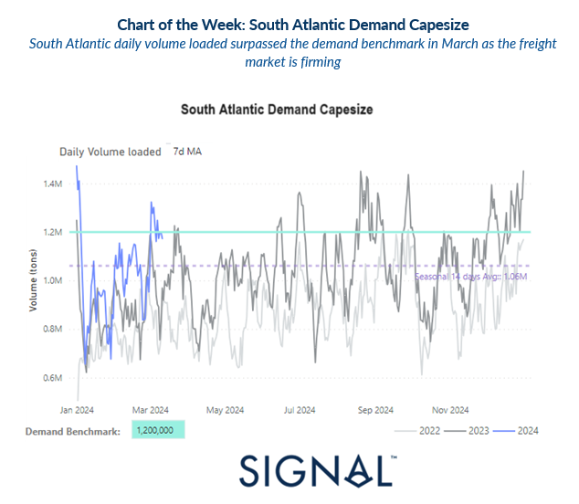
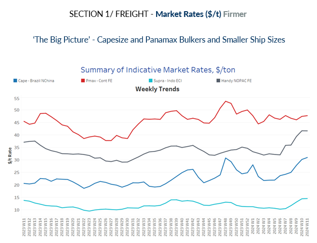
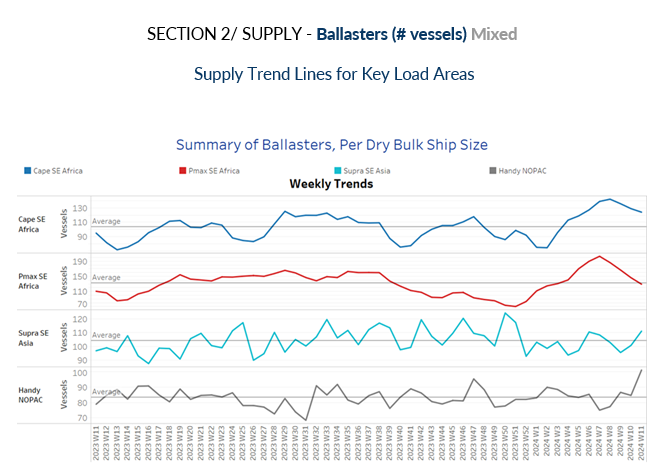
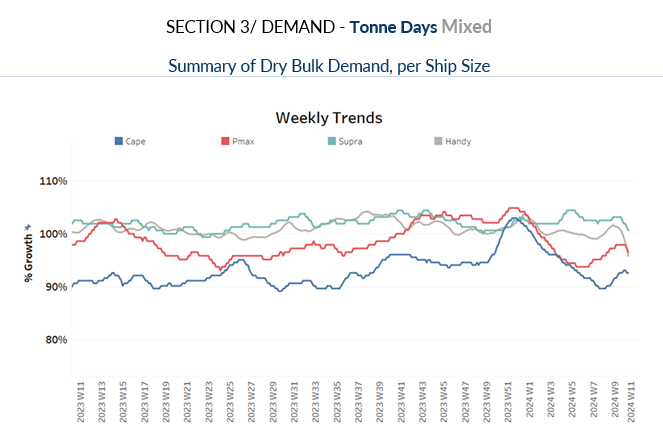
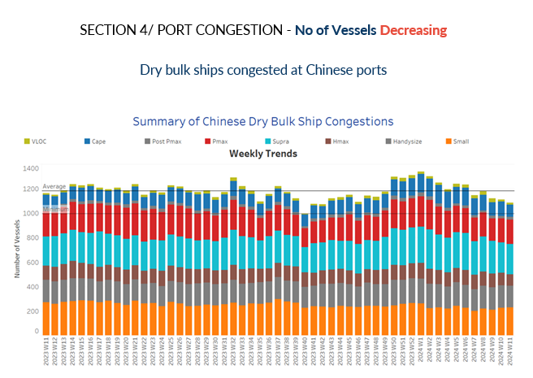

# South Atlantic Demand Capesize

**Date:** March 13, 2024  
**Publisher:** Breakwave Advisors | **Category:** Market Insights  
**Original URL:** [https://www.breakwaveadvisors.com/insights/2024/3/13/south-atlantic-demand-capesize](https://www.breakwaveadvisors.com/insights/2024/3/13/south-atlantic-demand-capesize)  

---

> **Figure 1: Screenshot 2024 03 13 17.01.38**  
> **Interactive Data & Source:** [Signal Ocean Platform](https://www.thesignalgroup.com/signal-ocean-platform) | [Local Asset](file:///C:/Users/Dell/Github/Shipping/corpus/03-breakwave/insights/2024/assets/2024-03-13_south-atlantic-demand-capesize_img_screenshot2024-03-13170138_1da2b878cb0f.png)

During the second week of March, there's a notable surge in freight rates, particularly in the larger vessel categories, accentuated by a diminishing number of ballasters. The demand indicator reflected in the volume of South Atlantic daily loaded shipments appeared robust and exceeded the benchmark demand as indicated by the 7-day moving average.

In the iron market, iron ore futures prices continued their downward trend for a second consecutive session on Monday, reaching their lowest levels in over four months. This decline was primarily driven by the persistent weakness in the fundamentals of this vital steelmaking component, particularly in China, the largest consumer of iron ore globally. This downward pressure on prices is mainly attributed to a temporary supply glut stemming from better-than-expected shipments in the first quarter of the year, coupled with a slower-than-anticipated demand recovery. This combination has exerted significant downward pressure on iron ore prices, underscoring the delicate balance between supply and demand dynamics in the global steel industry.

> **Figure 2: Screenshot 2024 03 13 17.04.04**  
> **Interactive Data & Source:** [Signal Ocean Platform](https://www.thesignalgroup.com/signal-ocean-platform) | [Local Asset](file:///C:/Users/Dell/Github/Shipping/corpus/03-breakwave/insights/2024/assets/2024-03-13_south-atlantic-demand-capesize_img_screenshot2024-03-13170404_9ae6754fd28e.png)

Capesize Brazil to North China rates have sustained their upward trajectory, building upon the significant spike observed in preceding days. Recent levels reflect one of the peak points reached in the past 12 months, underscoring the strength and resilience of this shipping route.

- **Capesize**vessel freight rates for shipments from Brazil to North China rose to $32 per ton, showcasing a 30% increase compared to the rates observed a month ago.

- **Panamax**vessel freight rates from the Continent to the Far East maintained stability around $48 per ton. There's anticipation regarding whether these rates will surge to the anticipated peak of $50 per ton as we progress through March.
- **Supramax**vessel freight rates on the Indo-ECI route rose to $15/ton, 40% higher than a comparable week of a month ago.

- **Handysize**freight rates for the NOPAC Far East route held levels above $40 per ton, 27% stronger than rates observed a month ago.

> **Figure 3: Screenshot 2024 03 13 17.04.13**  
> **Interactive Data & Source:** [Signal Ocean Platform](https://www.thesignalgroup.com/signal-ocean-platform) | [Local Asset](file:///C:/Users/Dell/Github/Shipping/corpus/03-breakwave/insights/2024/assets/2024-03-13_south-atlantic-demand-capesize_img_screenshot2024-03-13170413_b2595410018a.png)

The number of ballast vessels continued a significant declining trend for both Capesize and Panamax vessels, while the increase is persisting for Supramax vessels in the SE Asia region and for Handysize in the NOPAC.

- **Capesize SE Africa**: The number of ballast ships fell below the 130 mark, while the trend is heading to the annual average, while the last bottom was seen at the end of the previous year.

- **Panamax SE Africa**: The count of ballast ships decreased to 129, with indications of a continued downward trend in the coming days, while today’s figures are almost below the annual average.
- **Supramax SE Asia**: The number of ballast ships has recently surpassed the annual average of 100, contrary to expectations of a downward trend in March. It remains uncertain whether this upward trajectory will continue in the coming days.

- **Handysize NOPAC**: The count of ballast ships surged to 100, even surpassing the highs recorded in the previous week, and now trending to a new spike not seen over the last year.

> **Figure 4: Screenshot 2024 03 13 17.04.22**  
> **Interactive Data & Source:** [Signal Ocean Platform](https://www.thesignalgroup.com/signal-ocean-platform) | [Local Asset](file:///C:/Users/Dell/Github/Shipping/corpus/03-breakwave/insights/2024/assets/2024-03-13_south-atlantic-demand-capesize_img_screenshot2024-03-13170422_e981b8a8832c.png)

The downward trajectory in demand tonne days that persisted across all vessel size categories has now started to reverse to an upward trend for the Capesize segment.

- **Capesize:**The current growth is now higher than the lows observed in February fuelling expectations for a firmer momentum in the freight market as the supply of vessels indicated a decrease in the number of ballasters.
- **Panamax:**The decline appeared in the previous week is still maintaining the same pace of growth as observed at the end of February, with not yet signs for a prompt recovery.
- **Supramax:**The growth rate recently indicated a decline compared to an almost steady pace of growth in the weeks of February.

- **Handysize:**The growth rate of tonne days continues with weakness, while a firmer pace was recorded two weeks ago.

> **Figure 5: Screenshot 2024 03 13 17.04.31**  
> **Interactive Data & Source:** [Signal Ocean Platform](https://www.thesignalgroup.com/signal-ocean-platform) | [Local Asset](file:///C:/Users/Dell/Github/Shipping/corpus/03-breakwave/insights/2024/assets/2024-03-13_south-atlantic-demand-capesize_img_screenshot2024-03-13170431_e7c215a66bda.png)

In the second week of March, there was a continuous decline recorded of congestion seen in the Capesize, Panamax and Supramax vessel segments.

- **Capesize:**Capesize ship congestion dipped to 100 mark, signaling a decrease of 46 vessels from the peak observed in week 6.

- **Panamax:**In the case of Panamax vessels, the number has been reduced below 200, while it remains to be seen if there will be a further decrease below 190 mark as recorded in week 9.
- **Supramax:**Congestion hovered below 250, almost 20 lower than the level recorded in the past two weeks.

- **Handysize:**Congestion levels settled below 180, while in the previous weeks, levels floated higher, but still the recent trend provokes an upward trend.

Data Source:[Signal Ocean Platform](https://www.thesignalgroup.com/signal-ocean-platform)

---

**Tags:** Drybulk, Shipping, Freightrates  
