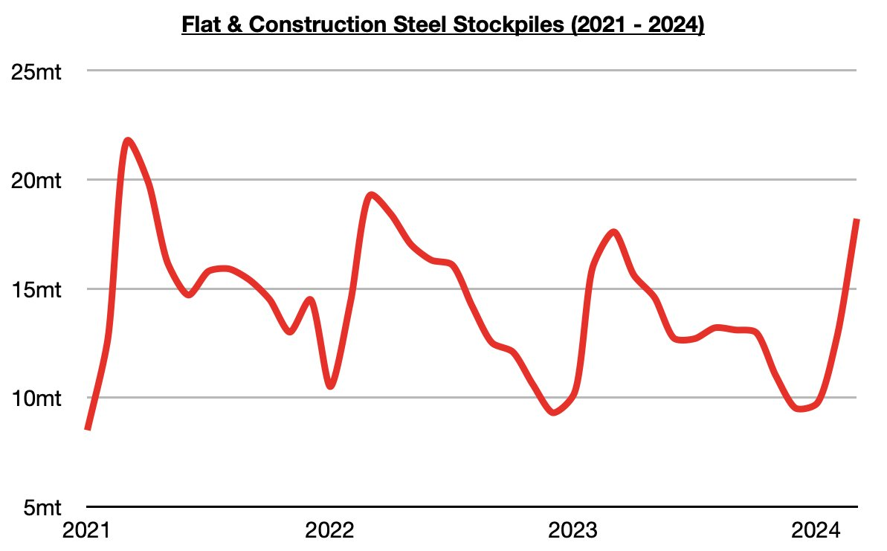
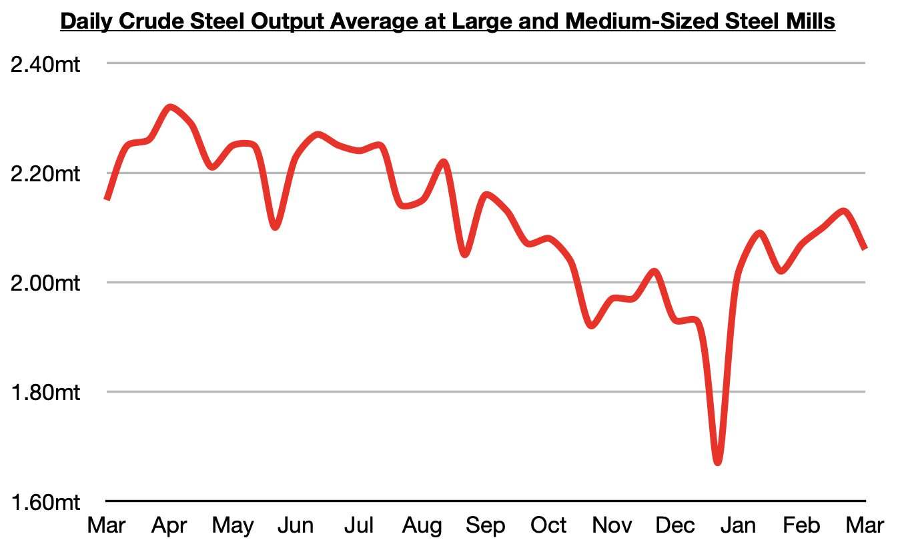

# Chinese Steel Stockpiles Now Up On a Year-On-Year Basis

**Date:** March 14, 2024  
**Publisher:** Breakwave Advisors | **Category:** Market Insights  
**Original URL:** [https://www.breakwaveadvisors.com/insights/2024/3/14/chinese-steel-stockpiles-now-up-on-a-year-on-year-basis](https://www.breakwaveadvisors.com/insights/2024/3/14/chinese-steel-stockpiles-now-up-on-a-year-on-year-basis)  

---

*By*[*Jeffrey Landsberg*](https://www.linkedin.com/in/jeffrey-landsberg-70ab957/)

As we discussed in Commodore Research's most recent Weekly China Report, stockpiles of flat and construction steel products at warehouses in major cities in China have now climbed to approximately 18.2 million tons. This is 600,000 tons (3%) more than was stockpiled a week ago and is up year-on-year by 1.1 million tons (6%).

> **Figure 1: 241**  
> [Local Asset](file:///C:/Users/Dell/Github/Shipping/corpus/03-breakwave/insights/2024/assets/2024-03-14_chinese-steel-stockpiles-now-up-on-a-year-on-year-basis_img_241_98aed1968411.jpg)

Overall, stockpiles continue to rise and are finally up on a year-on-year basis. As we have also been discussing in recent client notes, China’s steel production has reverted back to a year-on-year contraction and also most recently declined. Crude steel production at large and medium-sized mills most recently averaged 2.06 million tons during March 1 - March 10. This is 3% lower than was seen during late February and is down year-on-year by 4%.

> **Figure 2: 242**  
> [Local Asset](file:///C:/Users/Dell/Github/Shipping/corpus/03-breakwave/insights/2024/assets/2024-03-14_chinese-steel-stockpiles-now-up-on-a-year-on-year-basis_img_242_3028802c56d4.jpg)

It has been Commodore Research's view that China's 2024 steel production could easily peak this month, and this remains our view. The 2.13 million ton production average seen in late February could easily end up being this year's peak. Chinese steel prices have continued to decline this week and are now at their lowest level since October.

---

**Tags:** China, Drybulk, Shipping  
