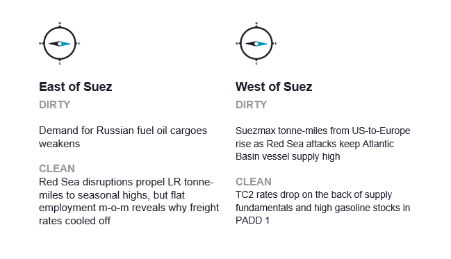
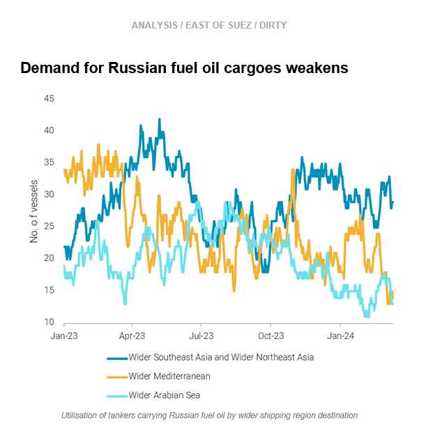
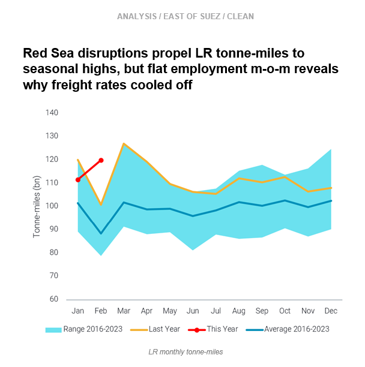
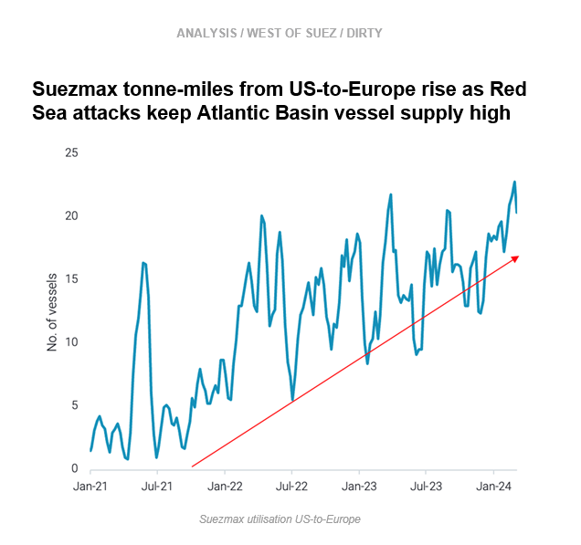
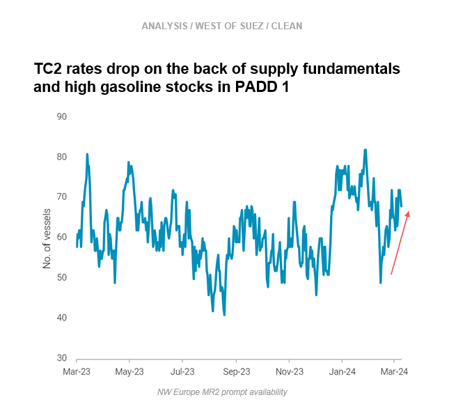

# Russian fuel oil demand weakens || Global LR tonne-miles at seasonal high

**Date:** March 14, 2024  
**Publisher:** Breakwave Advisors | **Category:** Market Insights  
**Original URL:** [https://www.breakwaveadvisors.com/insights/2024/3/14/russian-fuel-oil-demand-weakens-global-lr-tonne-miles-at-seasonal-high](https://www.breakwaveadvisors.com/insights/2024/3/14/russian-fuel-oil-demand-weakens-global-lr-tonne-miles-at-seasonal-high)  

---

**This week, in the East, we investigate weakening demand for Russian fuel oil cargoes. On the clean side, we explain why LR rates have cooled off despite seasonal highs in global tonne-miles. In the West, we discuss increased Suezmax employment from US-to-Europe, and we look at why demand on TC2 is likely to remain muted.**

*By*[*Mary Melton*](https://www.linkedin.com/search/results/all/?fetchDeterministicClustersOnly=true&heroEntityKey=urn%3Ali%3Afsd_profile%3AACoAABXVyecBtg-pRnIrZe0BoWk0ygPiUfbvhsw&keywords=mary%20melton&origin=RICH_QUERY_SUGGESTION&position=0&searchId=40e8d7d2-c4d0-4022-81e7-176f6eba418b&sid=H_Y&spellCorrectionEnabled=false)

> **Figure 1: Screenshot 2024 03 14 10.33.15**  
> **Interactive Data & Source:** [Marketingmail Vortexa](https://marketingmail.vortexa.com/ODM3LU1aRS01NzgAAAGR18A4C60GWYJqH9tGj_7H47P0Asz2sCj9w1kwhuDDHE4PzmTa4RnSMOqA7lvUHeRWP6SET0Q=) | [Local Asset](file:///C:/Users/Dell/Github/Shipping/corpus/03-breakwave/insights/2024/assets/2024-03-14_russian-fuel-oil-demand-weakens-global-lr-tonne-miles-at-seasonal-high_img_screenshot2024-03-14103315_ee31fd748221.png)

> **Figure 2: Screenshot 2024 03 14 10.33.52**  
> **Interactive Data & Source:** [Marketingmail Vortexa](https://marketingmail.vortexa.com/ODM3LU1aRS01NzgAAAGR18A4C60GWYJqH9tGj_7H47P0Asz2sCj9w1kwhuDDHE4PzmTa4RnSMOqA7lvUHeRWP6SET0Q=) | [Local Asset](file:///C:/Users/Dell/Github/Shipping/corpus/03-breakwave/insights/2024/assets/2024-03-14_russian-fuel-oil-demand-weakens-global-lr-tonne-miles-at-seasonal-high_img_screenshot2024-03-14103352_0705caa58da0.png)

- [Utilisation of tankers carrying Russian fuel oil](https://marketingmail.vortexa.com/ODM3LU1aRS01NzgAAAGR18A4C60GWYJqH9tGj_7H47P0Asz2sCj9w1kwhuDDHE4PzmTa4RnSMOqA7lvUHeRWP6SET0Q=)has declined compared to highs in Q2 2023. Though slightly increased from one-year lows in mid-Feb 2024, low overall utilisation is driven by declines in employment to the Med and Middle East.

- At the same time, increased exports of fuel oil to Asia are displacing Russian volumes to some extent. As MEG refineries return from maintenance, more fuel oil exports are heading to Asia.[Fuel oil exports MEG-to-Asia](https://marketingmail.vortexa.com/ODM3LU1aRS01NzgAAAGR18A4DNOh92ay9fEFEfVxdtjVrf3iWPe9nI_qkgpOz9iUQlea7NsVK4qoOIgVXXo8IRItLXo=)increased 30% m-o-m from January to February and remains high so far in March (days 1-11). February departures of[Russian fuel oil to SE and NE Asia](https://marketingmail.vortexa.com/ODM3LU1aRS01NzgAAAGR18A4DHnGnAvzuxrlctyaYlSEX65T17Eaa6Uikm1ZSWGpNmTKCipCVkxiKk28V4SNYRaTyzY=)were high, but a drastic decline so far in March of almost 75% m-o-m points to reduced tanker demand for these voyages.
- Additionally, some vessels currently laden with fuel oil cargoes from Russia are in floating storage in the Med. As these are operated by entities recently targeted by sanctions, this could indicate difficulty in finding buyers for these cargoes. If SE and NE Asia’s appetite for Russian fuel oil cargoes remains muted, demand for these tankers will similarly drop.

> **Figure 3: Screenshot 2024 03 14 10.34.02**  
> **Interactive Data & Source:** [Marketingmail Vortexa](https://marketingmail.vortexa.com/ODM3LU1aRS01NzgAAAGR18A4Cy2SUbQk7Bu9TC_-qldcVfKXYkzmEOQATwtl3sfV6P2NXV_av3MEPRZcwHHJAJXHnlM=) | [Local Asset](file:///C:/Users/Dell/Github/Shipping/corpus/03-breakwave/insights/2024/assets/2024-03-14_russian-fuel-oil-demand-weakens-global-lr-tonne-miles-at-seasonal-high_img_screenshot2024-03-14103402_0a96fc3fdd79.png)

- Diversions around the Cape of Good Hope became the norm for middle distillates going East of Suez-to-Europe after US/UK retaliatory strikes began on 12 Jan. February was the first full month of this new reality, and it is dramatically reflected in tonne-miles.[Global LR tonne-miles](https://marketingmail.vortexa.com/ODM3LU1aRS01NzgAAAGR18A4Cy2SUbQk7Bu9TC_-qldcVfKXYkzmEOQATwtl3sfV6P2NXV_av3MEPRZcwHHJAJXHnlM=)for the month of February reached record-setting levels on a seasonal basis: February values were 35% above the 8-year average and 20% above the 8-year high.

- However, despite these record-setting tonne-mile values, employment of vessels has remained relatively steady m-o-m. This is reflected in[tonne-days](https://marketingmail.vortexa.com/ODM3LU1aRS01NzgAAAGR18A4Cy2SUbQk7Bu9TC_-qldcVfKXYkzmEOQATwtl3sfV6P2NXV_av3MEPRZcwHHJAJXHnlM=), which were flat m-o-m from January to February, but still above seasonal levels. This has to do with a slight decline in utilisation for East-West middle distillate flows, mostly driven from declines in[jet/kero](https://marketingmail.vortexa.com/ODM3LU1aRS01NzgAAAGR18A4C8Hmh8M2A2oN7HrKE-FJcwcx4VHGOA5vYAvvGxcTclp5gkLUxTpjJLVvgcQIruEPqGw=)exports. Also, weaker naphtha flows to Northeast Asia have cooled off[tanker demand](https://marketingmail.vortexa.com/ODM3LU1aRS01NzgAAAGR18A4DKrur3vtTNAbxIL7h7ykdmR_gZjCN5_hj6rM3chhzH3KsYHHATYcXCab4rJrIy5uUYc=)on TC1 and TC5.
- Even though LRs diverting from the Red Sea are employed for longer and tonne-miles are high, some decline in tanker demand from these other areas is easing the high global fleet requirement and explains why LR freight rates have fallen from sky-high levels seen in late January.

> **Figure 4: Screenshot 2024 03 14 10.34.12**  
> **Interactive Data & Source:** [Marketingmail Vortexa](https://marketingmail.vortexa.com/ODM3LU1aRS01NzgAAAGR18A4DJ06MF7cm9XaP4wnhliit7EesVt3DWhUEVp_1wDrVHfw58f5HiS0wzKx1IcAVxKusX4=) | [Local Asset](file:///C:/Users/Dell/Github/Shipping/corpus/03-breakwave/insights/2024/assets/2024-03-14_russian-fuel-oil-demand-weakens-global-lr-tonne-miles-at-seasonal-high_img_screenshot2024-03-14103412_01548f4356bb.png)

Europe’s imports of US crude carried on Suezmaxes were almost 60% higher in March (days 1-10) compared to February. This has resulted in an increase in[Suezmax tonne-miles from the US-to-Europe](https://marketingmail.vortexa.com/ODM3LU1aRS01NzgAAAGR18A4DJ06MF7cm9XaP4wnhliit7EesVt3DWhUEVp_1wDrVHfw58f5HiS0wzKx1IcAVxKusX4=), which were 40% higher than the 2023 average for the week ending 10 March. This increase reflects the higher demand for US crude in Europe, a result of three factors: substituting Russian barrels, WTI inclusion in the Brent basket and Red Sea diversions increasing marginal demand for US crude.

- From a vessel supply-side perspective, high accumulation of tonnage in the Atlantic Basin incentivises Suezmaxes to compete on the traditional Aframax route from USG-to-Europe ([TD25](https://marketingmail.vortexa.com/ODM3LU1aRS01NzgAAAGR18A4CzUFdnqjvbBIlZQN0_oe435fJWBbPtHLdIZy9NBab_H4YOFKIK2eRwRsRWFvlZPC09w=)), explaining why Aframax rates remain muted despite continued tanker demand.
- Moving forward, high vessel supply in the Atlantic Basin is likely to continue, as Suezmax diversions on the route MEG-to-Europe which avoid the Red discourage repositioning back to MEG once cargo is discharged,[keeping prompt vessel supply in the MEG](https://marketingmail.vortexa.com/ODM3LU1aRS01NzgAAAGR18A4C52RMzjc4ot8xN4YdJ5-eTqiR-yMw1o9I_q6gyZW_v4nFru5i9pXw8kJDvpYaS-5sAg=)low.

> **Figure 5: Screenshot 2024 03 14 10.34.20**  
> **Interactive Data & Source:** [Marketingmail Vortexa](https://marketingmail.vortexa.com/ODM3LU1aRS01NzgAAAGR18A4CzZSfRQkZiIXv9qISyNZxulpcSisYovEwa-1tPs980ieqkTd8qrQAcTriaBYYgK0txs=) | [Local Asset](file:///C:/Users/Dell/Github/Shipping/corpus/03-breakwave/insights/2024/assets/2024-03-14_russian-fuel-oil-demand-weakens-global-lr-tonne-miles-at-seasonal-high_img_screenshot2024-03-14103420_8bcccf7094eb.png)

- [Higher prompt MR supply](https://marketingmail.vortexa.com/ODM3LU1aRS01NzgAAAGR18A4CzZSfRQkZiIXv9qISyNZxulpcSisYovEwa-1tPs980ieqkTd8qrQAcTriaBYYgK0txs=)in Northwest Europe last week at the same time as[flagging demand for transatlantic voyages](https://marketingmail.vortexa.com/ODM3LU1aRS01NzgAAAGR18A4C4-FMOzyurI8fJceMPTH5Ccn8tBFWxGKAbbujy0C-zc389LyIcLfpz1z9Y-nUfGFLuQ=)to the US Atlantic Coast pulled down[TC2 rates](https://marketingmail.vortexa.com/ODM3LU1aRS01NzgAAAGR18A4DP_M72iGaFOEiyjsTeB-IxeT8wL7y5E03wAbfnNlM_S9io3JzgQ-AxV81Iiqi-ahPfQ=).

- Even though prompt tonnage is currently thinning and easing some of the supply side pressure in NW Europe, gasoline stocks in PADD 1 are at the top of the five-year seasonal range (source: EIA). This could indicate less demand for transatlantic voyages, which usually increases in late March in preparation for the US summer driving season.
- Moving forward,[availability for natural fixing windows in NW Europe](https://marketingmail.vortexa.com/ODM3LU1aRS01NzgAAAGR18A4DGSFpXEJe7LE37VZalKnAP1zZIMeaYQAIaVZcdDZyUT04FlNMGz6L2GBjvv7JDLQ13A=)is on the rise, pointing to no enduring supply-side relief for MRs in the region. However, recent increases in US Gulf MR rates and the winding down of US refinery maintenance season could provide some supply-side alleviation in Europe in the medium term.

Data Source:[Vortexa](https://www.vortexa.com//oil-gas-data-traders-analysts-data-scientists?gclid=Cj0KCQjw8_qRBhCXARIsAE2AtRZKOvMnbilZ_6_91d7huSFFy71pWLrnPwGwOHVzXsmsG-1a1mZnQw8aAt89EALw_wcB&hsa_acc=1782073842&hsa_ad=548425387665&hsa_cam=14746637662&hsa_grp=125038601902&hsa_kw=&hsa_mt=&hsa_net=adwords&hsa_src=g&hsa_tgt=dsa-1431852288425&hsa_ver=3&utm_campaign=%5BCD%5D%20-%20DSA%20-%20EMEA&utm_medium=cpc&utm_medium=ppc&utm_source=google&utm_source=adwords&utm_term=)

---

**Tags:** Tankers, Shipping, Crude Oil  
