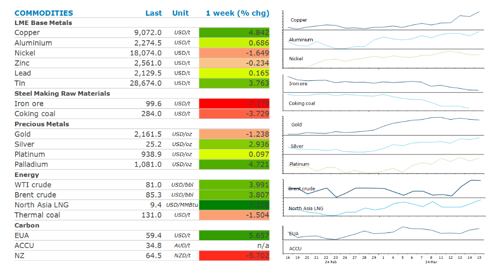

# Metals gains as signs of tightness strengthen

**Date:** March 18, 2024  
**Publisher:** Breakwave Advisors | **Category:** Market Insights  
**Original URL:** [https://www.breakwaveadvisors.com/insights/2024/3/18/metals-gains-as-signs-of-tightness-strengthen](https://www.breakwaveadvisors.com/insights/2024/3/18/metals-gains-as-signs-of-tightness-strengthen)  

---

**Signs of tightness helped bolster sentiment across energy and metals. However, China’s property woes continue to remain a concern.**

*By*[*Daniel Hynes*](https://www.linkedin.com/in/dahynes/)

> **Figure 1: Screenshot 2024 03 18 17.40.42**  
> **Interactive Data & Source:** [Linkedin](https://www.linkedin.com/in/soni-kumari-caia-20638717/) | [Local Asset](file:///C:/Users/Dell/Github/Shipping/corpus/03-breakwave/insights/2024/assets/2024-03-18_metals-gains-as-signs-of-tightness-strengthen_img_screenshot2024-03-18174042_f3b06d28b1be.png)

**Crude oil**pushed higher last week as confidence grows of increasing tightness in the market. The International Energy Agency warned of a supply deficit in the market, a change from its previous estimate of a surplus. It revised up its demand growth forecast to 1.3mb/d from 1.2mb/d for 2024 due to stronger than expected demand. That was evident in data that showed US inventories recorded their first weekly decline this year, according to the Energy Information Administration. Geopolitical risks also remain elevated. Ukrainian drone attacks took out three Russian refineries last week, which account for 12% of Russia’s total oil processing capacity. This has seen refinery margins pick up amid tighter availability of oil products in Europe.

**Global gas**prices gained amid increasing competition for the cleaner burning fossil fuel. Asian buyers remain active as they look to take advantage of the fall in prices over the past month. This comes as storms threaten to disrupt supply. Two storms off the coast of northern Australia are likely to turn into cyclones, which has seen LNG export facilities such as Gorgon, Wheatstone and Prelude partially or fully close. Disruptions to US supply are also emerging, with flows to the Corpus Christi LNG export terminal falling. North Asian LNG spot prices moved higher. However, strong storage levels limited the gains in the European market.

**Copper**led the base metals sector higher last week as concerns of supply tightness continue to mount. Chinese copper smelters are threatening to reduce output due to falling treatment charges. This has been triggered by a tight concentrate market following cutbacks at mining operations late last year. Investors are also becoming increasingly confident that the worst of the global downturn is behind it as demand from renewables and EVs grow strongly. This helped offset concerns of weak demand in China. Data showed inventories in SFE warehouses rose to its highest level since 2020.[Soni Kumari, CAIA](https://www.linkedin.com/in/soni-kumari-caia-20638717/)discusses these issues in[today's edition of the #5in5 podcast](https://aus01.safelinks.protection.outlook.com/?url=https%3A%2F%2F5in5withanz.substack.com%2Fp%2Fmonday-eyes-on-bank-of-japan-for%3Futm_source%3Dpodcast-email%252Csubstack%26publication_id%3D1791807%26post_id%3D142696096%26utm_campaign%3Demail-play-on-substack%26utm_medium%3Demail%26r%3D2l0ir3%26triedRedirect%3Dtrue&data=05%7C02%7Cdaniel.hynes%40anz.com%7C4d3387cc3d9c41ceca0808dc46c3f7a0%7C1f4f7eda6e51425ea0f94c2fcef58a52%7C0%7C0%7C638463054688992400%7CUnknown%7CTWFpbGZsb3d8eyJWIjoiMC4wLjAwMDAiLCJQIjoiV2luMzIiLCJBTiI6Ik1haWwiLCJXVCI6Mn0%3D%7C0%7C%7C%7C&sdata=ptEEyJN%2FGOa%2FbWcjzpYlHWbirZW9vj5z968exEKx98s%3D&reserved=0).

This is in stark contrast to sentiment in the**iron ore**market. Signs of weakness in demand continue to emerge, with Chinese smelters announcing output cuts. Six mills in the Guangdong province will undertake maintenance, reducing output by 10-20% over the next month. Stockpiles of the steel making raw material are also rising, hitting their highest level in 12 months at Chinese ports. This saw futures dip below USD100/t for the first time in seven months.

**Gold’s**rally was halted last week following stronger-than-expected inflation. The market’s expectations of an imminent rate cut in the US were dashed following the CPI and PPI data. This is likely to see the Fed remain on hold until there is more evidence of inflation falling. Nevertheless, it remains near record highs amid strong demand from China. Trade data shows strong imports from Hong Kong and Switzerland in the first two months of the year.

Data source:[Commodities Wrap](https://www.linkedin.com/newsletters/commodities-wrap-6692196755876012032/?fbclid=IwAR3kiXJqZdxmp9ZcRwBNI7FsBySI-XSC0pfPur1qzjt7OZp7PTE59Tsl1QI)

---

**Tags:** Commodities, Crude Oil, Ironore  
