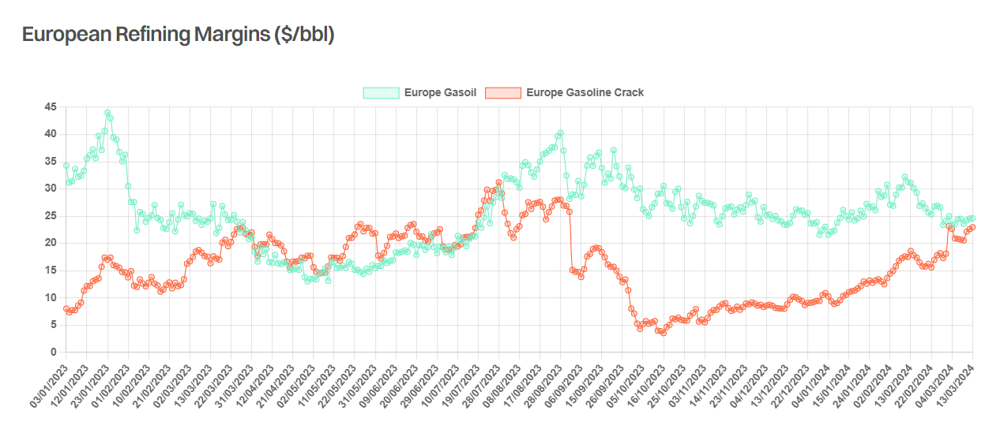

# On the Margin

**Date:** March 18, 2024  
**Publisher:** Breakwave Advisors | **Category:** Market Insights  
**Original URL:** [https://www.breakwaveadvisors.com/insights/2024/3/18/on-the-margin](https://www.breakwaveadvisors.com/insights/2024/3/18/on-the-margin)  

---

> **Figure 1: Gibson Report**  
> **Interactive Data & Source:** [Gibsons Co](https://www.gibsons.co.uk/market-reports) | [Local Asset](file:///C:/Users/Dell/Github/Shipping/corpus/03-breakwave/insights/2024/assets/2024-03-18_on-the-margin_img_gibsonreport_05592be74e93.jpg)

Refining margins across the world surged to record levels in 2022, following Russia’s invasion of Ukraine. Although margins have declined since then, they have generally remained healthy, even in Europe, where the structural shortage of middle distillates prevailed over the competitive disadvantage of relatively simple and ageing refineries compared to large and sophisticated plants in the Middle East and Asia.

However, going forward European refining sector will face renewed challenges, with more modern refining capacity coming online. According to the IEA, Middle East refining throughput is anticipated to increase by 650 kbd this year due to recently commissioned facilities. Kuwait’s 615kbd Al Zour plant reached full operational status last month, whilst the 230kbd Duqm refinery in Oman was also formally inaugurated in early February, with product exports starting in September last year. Bahrain’s expansion of its Sitra refinery is also expected to increase regional runs later in 2024.

In the Atlantic Basin, we should see gradual increases in refining runs at Nigeria’s 650kbd Dangote refinery. The plant has been importing crude since December and earlier this month exported two naphtha cargoes. The IEA expects throughput to average 200 kbd in 2024, considering the long lead times to ramp up a new refinery. Meanwhile, in early February Shell Nigeria reported that it supplied circa 475,000 bbls into the recently refurbished 210kbd Port Harcourt refinery, with the facility initially planning to process 60kbd. Elsewhere, the start-up of the 340,000 kbd Olmeca refinery in Mexico is another major wild card. Although company officials recently stated that the facility will begin initial operations during Q1, reaching fullscale operations in 2025/26, there is no apparent decline in the country’s crude exports, which suggests that even initial runs are still some time away.

Perhaps with this in mind, some European refining capacity is already pencilled in to close. In November last year, Petroineos announced its plans to cease refining operations at its 150kbd Grangemouth refinery in 2025 (following an 18-month conversion to a fuel import terminal) due to growing international competition and the energy transition. More recently, Shell has announced the plan to convert the hydrocracker at its 150 kbd Wesseling site in Germany and to cease crude oil processing at the facility by the end of 2025. BP has also announced plans to shut or convert several units at its admittedly uncompetitive Gelsenkirchen refinery in Germany in 2025, which will reduce its processing capacity by around a third.

Announced refinery closures will reduce regional crude intake, freeing more Atlantic Basin barrels for longhaul shipments East. Product imports into the region are also expected to increase, although this depends on domestic demand levels, which are facing headwinds due to decarbonisation efforts. Yet, with sales of battery electric vehicles in the EU and the UK sharply falling in January, as a number of European countries removed costly subsidies, perhaps the much-predicted decline in European gasoline and diesel consumption will be somewhat slower and shallower than previously thought.

> **Figure 2: Screenshot 2024 03 18 17.55.56**  
> **Interactive Data & Source:** [Gibsons Co](https://www.gibsons.co.uk/market-reports) | [Local Asset](file:///C:/Users/Dell/Github/Shipping/corpus/03-breakwave/insights/2024/assets/2024-03-18_on-the-margin_img_screenshot2024-03-18175556_a75c32674df1.png)

Data source:[Gibson Shipbrokers](https://www.gibsons.co.uk/market-reports)

---

**Tags:** Tankers, Shipping  
