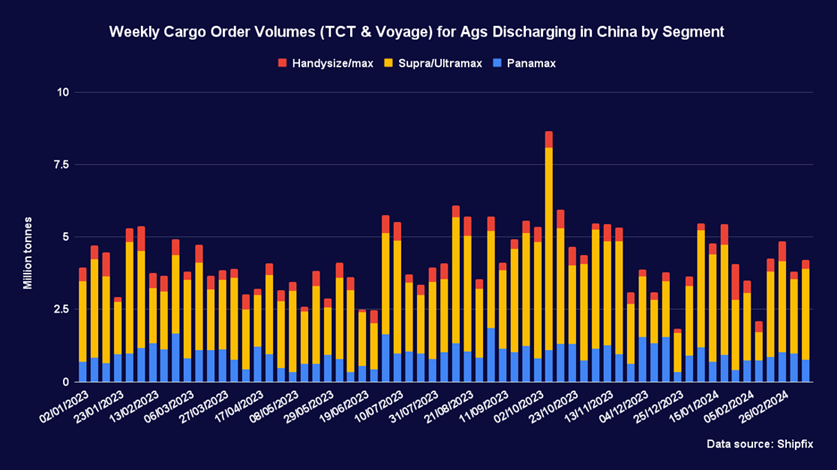

# Positive news for the Chinese economy

**Date:** March 18, 2024  
**Publisher:** Breakwave Advisors | **Category:** Market Insights  
**Original URL:** [https://www.breakwaveadvisors.com/insights/2024/3/18/positive-news-for-the-chinese-economy](https://www.breakwaveadvisors.com/insights/2024/3/18/positive-news-for-the-chinese-economy)  

---

**The Baltic dry Index remained in the black for a sixth consecutive week, albeit with a relatively modest weekly gain as the capesizes offset a robust performance for the panamaxes. The commodities had a week with many sizeable moves, with a steep decline for iron ore among the more notable developments.**

*By*[*Ulf Bergman*](https://www.linkedin.com/in/ulf-bergman-81570425/)

### Macro/geopolitics

The new week has begun with positive news for the Chinese economy. According to data released earlier today, the country’s industrial production expanded by more than expected during the year’s first two months. In addition, both fixed-asset investments and retail sales during the same period surprised on the upside.

Chinese industrial production grew by 7.0 per cent during January and February compared to the same period last year. This reading was somewhat higher than in December and well above the market consensus of 5.0 per cent. Likewise, fixed-asset investments were also above market expectations and December’s reading. On the other hand, while retail sales were marginally higher than expected, growth was lower than at the end of last year. Sales expanded by 5.5 per cent during the past two months, with markets having expected 5.2 per cent growth. The limited upside surprise for the retail sales, compared to the industrial output, was probably because of the continued headwinds for the Chinese property market.

The release of better-than-expected data is likely to reduce the sense of urgency for further stimulus programmes among China’s leadership. However, as the real estate sector continues to weigh on sentiments in the world’s second-largest economy, the year’s ambitious economic growth target will likely require further support from the Chinese government.

### Commodity Markets

Crude oil bounced back last week after the International Energy Agency published a bullish demand outlook. Despite remaining broadly unchanged on Friday, the May Brent futures recorded a weekly gain of 4.0 per cent as they settled at 85.34 dollars per barrel. The contracts have continued to gain during today’s session and are trading around one per cent above Friday’s close.

Gains during the second half of the week contributed to higher European natural gas prices. Production outages in Norway and continued concerns over LNG exports from the US contributed to the front-month TTF futures ending the week at 27.03 euros per MWh, 2.4 per cent above the preceding week’s close. The positive momentum from Thursday and Friday has been maintained in today’s session, with gains of around six per cent.

The markets for coal bound for Europe and Asia experienced mixed fortunes over the past week. The front-month futures for delivery in Rotterdam recorded a weekly gain of 1.9 per cent, as they settled at 111.25 dollars per tonne on Friday, supported by rising natural gas prices. In contrast, the contracts for delivery in Newcastle next month shed 4.7 per cent over the week as concerns over the Chinese demand outlook rose, ending Friday’s session at 130.10 dollars per tonne.

Iron ore declined sharply last week as traders remained cautious about the outlook for Chinese demand. Additionally, reports of high inventory levels contributed to the bearish sentiments. After four out of five sessions in the red, the April futures listed on the SGX recorded a weekly decline of 13.3 per cent, ending Friday’s trading at 99.91 dollars per tonne. Today’s better-than-expected Chinese economic data have contributed to a reversal of fortunes, with the contracts gaining around four per cent.

In contrast to iron ore, and despite a weekly gain for the dollar, base metals moved higher last week. An improving demand outlook and tighter global supplies contributed to the positive developments. The three-month copper futures listed on the LME led the way higher with a 5.7 per cent gain for the week. The aluminium and zinc contracts saw gains of around 1.5 per cent over the past five sessions, while the nickel futures edged up by 0.4 per cent.

Continued improvements to the global supply situation weighed on the grain futures listed on the CBOT during the past week. The May wheat futures declined by 1.7 per cent over the course of the week, while the corn contracts shed 0.7 per cent. On the other hand, the soybean futures for delivery in May recorded a weekly advance of 1.2 per cent in the wake of a downgrade to the Brazilian harvest.

### Freight and Bunker Markets

The Baltic Dry Index advanced by 1.2 per cent over the past five sessions, a sixth consecutive week in the black. However, the mildly positive reading hid considerable divergence among the vessel segments. The sub-index for the capesizes recorded a weekly decline of 5.3 per cent amid weak cargo order volumes in the Atlantic. In contrast, the freight gauge for the panamaxes surged by 20.0 per cent as demand in the Atlantic remained relatively robust and market lead times shortened. The gauges for the supramaxes and handysizes recorded more modest weekly gains, with the former advancing 0.6 per cent and the latter by 2.5 per cent.

The Baltic Exchange’s wet freight indices all ended the past week in the black, albeit to varying extent. The dirty tanker index recorded a weekly gain of 1.3 per cent, while the gauge for the LNG carriers edged up by 0.4 per cent. The clean and the LPG tankers were the past week’s winners. The index for the former advanced by 28.2 per cent, while the latter surged by 31.2 per cent.

Bunker prices moved higher in Rotterdam last week, while the picture was more mixed in Houston and Singapore. The VLSFO recorded a weekly gain of 2.1 per cent in the European port, while the MGO advanced by 2.8 per cent. In Singapore and Houston, the former fuel advanced by more than one per cent. In contrast, the MGO retreated marginally over the past week in the Asian and US maritime hubs.

### The View From the Shipfix Desk

Grains and oilseed have faced significant headwinds since the beginning of the year as a bullish global supply outlook has weighed on prices. While corn and soybeans have recovered some of the losses recently amid downgrades to expected harvest sizes, the May futures for the two crops listed on the CBOT are currently trading around ten per cent below the levels at the end of December. However, while the wheat contracts have experienced some volatility in recent weeks, expectations of abundant global supplies have seen them shedding around seventeen per cent year-to-date.

While the supply side has received much of the attention for the price developments for grains and oilseeds, the lack of demand growth from Chinese buyers is also likely to have contributed. Aggregate cargo order volumes for agricultural commodities discharging in Chinese ports since the beginning of January are broadly in line with what was recorded a year ago. Hence, stable Chinese demand has yet to absorb solid supplies of grains and oilseeds. The past week saw a minor increase in demand for seaborne transportation of agricultural commodities bound for China. However, should recent years’ seasonal patterns see a repeat, the rebound is likely to be relatively short-lived. As a result, Chinese demand is unlikely to provide any support for grain and oilseed prices in the near term.

> **Figure 1: Screenshot 2024 03 18 18.16.15**  
> **Interactive Data & Source:** [Shipfix](https://shipfix.com/) | [Local Asset](file:///C:/Users/Dell/Github/Shipping/corpus/03-breakwave/insights/2024/assets/2024-03-18_positive-news-for-the-chinese-economy_img_screenshot2024-03-18181615_4270e6537c07.png)

Data Source:[Shipfix](https://shipfix.com/)

---

**Tags:** Markets, Shipping, Commodities  
