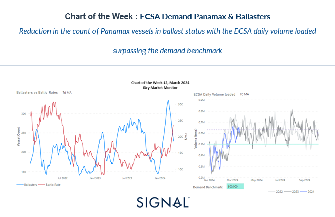
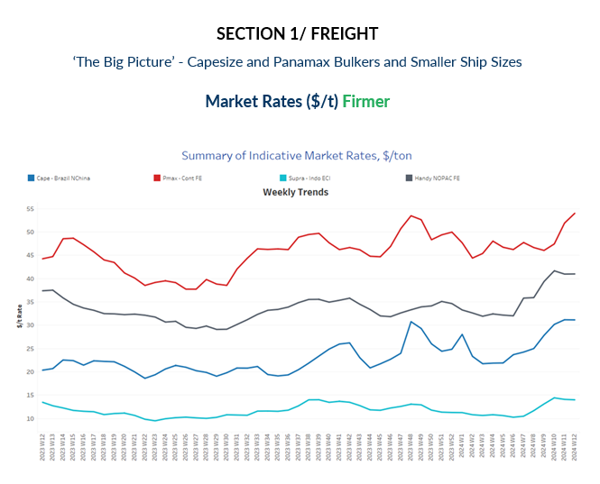
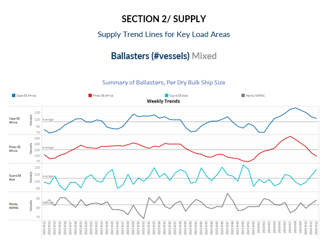
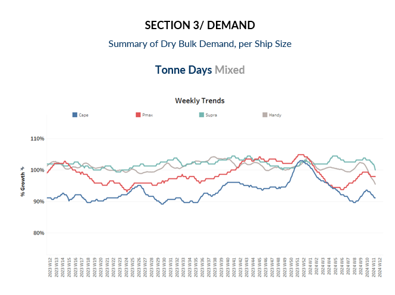
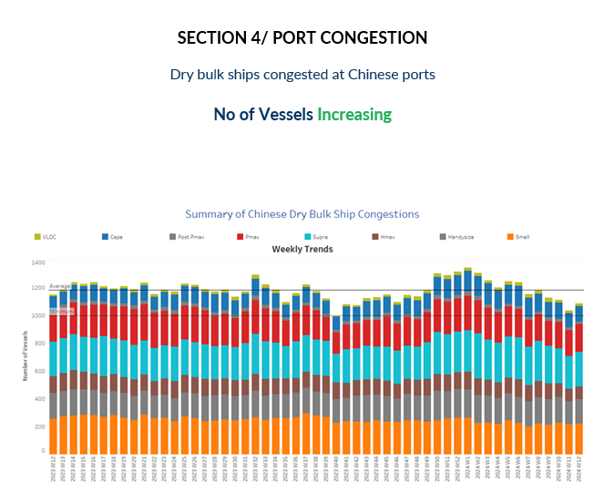

# East Coast South America Demand Panamax

**Date:** March 20, 2024  
**Publisher:** Breakwave Advisors | **Category:** Market Insights  
**Original URL:** [https://www.breakwaveadvisors.com/insights/2024/3/20/east-coast-south-america-demand-panamax](https://www.breakwaveadvisors.com/insights/2024/3/20/east-coast-south-america-demand-panamax)  

---

> **Figure 1: Screenshot 2024 03 20 18.15.55**  
> **Interactive Data & Source:** [Signal Ocean Platform](https://www.thesignalgroup.com/signal-ocean-platform) | [Local Asset](file:///C:/Users/Dell/Github/Shipping/corpus/03-breakwave/insights/2024/assets/2024-03-20_east-coast-south-america-demand-panamax_img_screenshot2024-03-20181555_c91f40fbdf1c.png)

In the latter half of March, the freight market for large vessel sizes displayed a notable increase in momentum, particularly evident as the vessel count in terms of ballasters experienced an unexpected decline compared to the peak levels observed nearly four weeks prior. Amidst discussions surrounding whether the recent surge in Capesize and Panamax market rates stems from supply or demand dynamics, it becomes evident that the recent tightening of vessel supply serves as a significant upward catalyst. This trend is underscored by recent data indicating a surpassing of demand benchmarks, such as the South Atlantic Capesize daily volume loading observed last week and the ECSA Panamax daily volume loaded this week (referencing the 7-day moving average depicted in the provided image).

Consequently, it becomes apparent that the momentum in Baltic rates isn't solely driven by supply dynamics, as evidenced by the decreasing trend in the number of ballasters and the concurrent improvement in daily volume loaded. This confluence of factors contributes to a stronger underpinning for Baltic rates. However, looking ahead to the end of March, uncertainties loom, particularly concerning the resilience of the current buoyant sentiment. Challenges persist, notably reflected in the ongoing struggles of the Chinese economy within its real sector and the downward trajectory of iron ore prices. Additionally, a notable surge in Chinese port inventories, attributed to waning demand for steelmaking materials, further clouds the outlook for the near term. As such, the evolution of these factors will be crucial in determining the trajectory of the market moving forward.

​

> **Figure 2: Screenshot 2024 03 20 18.16.16**  
> **Interactive Data & Source:** [Signal Ocean Platform](https://www.thesignalgroup.com/signal-ocean-platform) | [Local Asset](file:///C:/Users/Dell/Github/Shipping/corpus/03-breakwave/insights/2024/assets/2024-03-20_east-coast-south-america-demand-panamax_img_screenshot2024-03-20181616_1ec243b5e2d4.png)

Capesize Brazil to North China rates have continued their upward trend for the third consecutive week, while there's been a notable increase in momentum across other vessel size categories, exemplified by the Panamax Continent FE rates reaching a new peak.

- **Capesize**vessel freight rates for shipments from Brazil to North China remained steady at approximately $31 per ton, representing a substantial 30% increase compared to rates observed just a month ago.
- **Panamax**vessel freight rates from the Continent to the Far East surged to a new peak, surpassing $50 per ton and bolstering the optimism witnessed in the previous week, signalling a robust rebound in the market.
- **Supramax**vessel freight rates on the Indo-ECI route held sentiment around $14/ton, 30% higher than a comparable week of a month ago.
- **Handysize**freight rates for the NOPAC Far East route remained above $40 per ton for the second consecutive week, marking a 10% increase compared to rates recorded during a similar week last year.

> **Figure 3: Screenshot 2024 03 20 18.16.25**  
> **Interactive Data & Source:** [Signal Ocean Platform](https://www.thesignalgroup.com/signal-ocean-platform) | [Local Asset](file:///C:/Users/Dell/Github/Shipping/corpus/03-breakwave/insights/2024/assets/2024-03-20_east-coast-south-america-demand-panamax_img_screenshot2024-03-20181625_2c4a791c7b51.png)

The count of ballast vessels continues to decline for both Capesize and Panamax vessels, with the Panamax vessel count dropping below its annual average.

- **Capesize SE Africa**: The number of ballast ships has dropped below the 115 mark, with the trend now approaching the annual average. This decline represents a notable 20% decrease from the peak observed in week 8.
- **Panamax SE Africa**: The count of ballast ships has dipped to less than 100, marking the lowest level since the beginning of the year. It remains uncertain whether today's level represents the bottom for March.
- **Supramax SE Asia**: The number of ballast ships has exceeded the 100 mark, maintaining its upward trajectory throughout March.
- **Handysize NOPAC**: The count of ballast ships has remained above the annual average for the past three weeks, with recent figures indicating a trend approaching 90. The lowest point observed was during week 7, with fewer than 80 ballast ships.

> **Figure 4: Screenshot 2024 03 20 18.16.32**  
> **Interactive Data & Source:** [Signal Ocean Platform](https://www.thesignalgroup.com/signal-ocean-platform) | [Local Asset](file:///C:/Users/Dell/Github/Shipping/corpus/03-breakwave/insights/2024/assets/2024-03-20_east-coast-south-america-demand-panamax_img_screenshot2024-03-20181632_977116e58463.png)

Although there were initial indications of a reversal towards an upward trend in the weekly growth of Capesize tonne days, it eventually exhibited signs of decrease once more. Meanwhile, the positive momentum persists in the Panamax segment.

- **Capesize**: The current growth has reverted to a weaker momentum, yet expectations for a stronger momentum in the freight market remain intact for the remainder of March. This optimism stems from the continued decrease in the number of ballasters, signalling a tightening supply of vessels.
- **Panamax**: The third week of March sustained a positive momentum, with the weekly percentage growth of tonne days maintaining a similar pace to the previous week and not dropping to a lower level. The recent growth is notably higher than the bottom recorded during weeks 5 and 6.
- **Supramax**: The growth rate indicated a further decline to levels lower than growth in the weeks of February.
- **Handysize**: The growth rate of tonne days continues with weakness over the last three weeks, while the recent pace seems to be the weakest for this year.

> **Figure 5: Screenshot 2024 03 20 18.16.39**  
> **Interactive Data & Source:** [Signal Ocean Platform](https://www.thesignalgroup.com/signal-ocean-platform) | [Local Asset](file:///C:/Users/Dell/Github/Shipping/corpus/03-breakwave/insights/2024/assets/2024-03-20_east-coast-south-america-demand-panamax_img_screenshot2024-03-20181639_9739853b824d.png)

In the third week of March, there was a notable increase in all vessel size categories following the lows witnessed in the previous week.

- **Capesize**: Capesize ship congestion has risen to 111, marking an increase of 10 from the previous week and signalling a decrease of 40 vessels from the peak observed in week 6.
- **Panamax**: In the case of Panamax vessels, the number has held steady at around 200, contrary to previous weekly estimates suggesting a potential drop below the 190 mark.
- **Supramax**: Congestion rose one step below the 250 mark, almost 15 higher than the level recorded in the previous week.
- **Handysize**: Congestion levels settled above 170, 10 more than in the previous week, while March’sl trend still provokes an upward trend.

Data Source:[Signal Ocean Platform](https://www.thesignalgroup.com/signal-ocean-platform)

---

**Tags:** Drybulk, Shipping, Freightrates  
