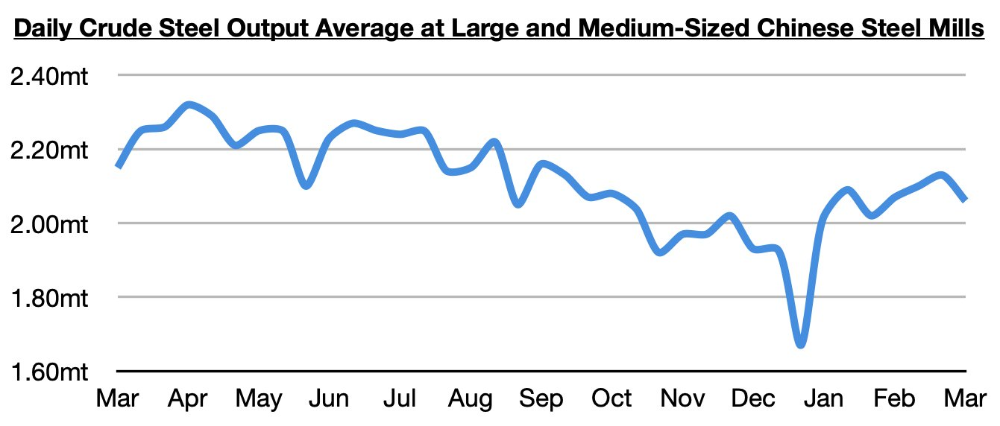
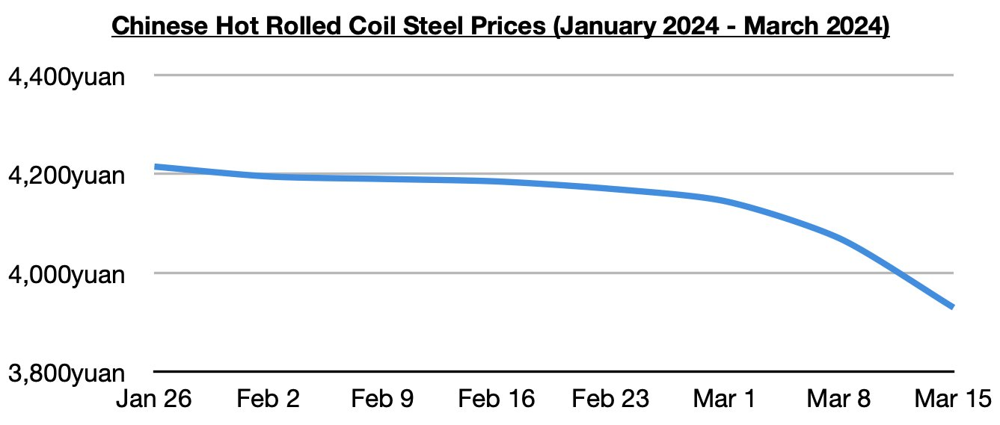
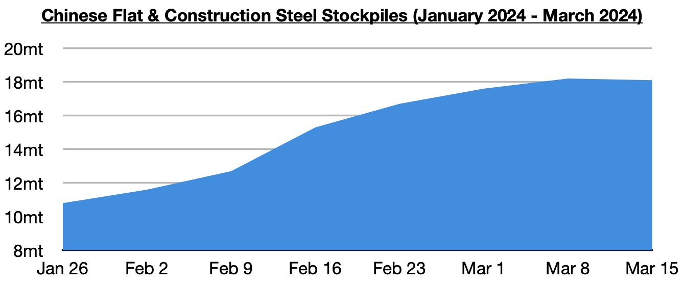

# Recent Reversal in China's Steel Production

**Date:** March 20, 2024  
**Publisher:** Breakwave Advisors | **Category:** Market Insights  
**Original URL:** [https://www.breakwaveadvisors.com/insights/2024/3/20/recent-reversal-in-chinas-steel-production](https://www.breakwaveadvisors.com/insights/2024/3/20/recent-reversal-in-chinas-steel-production)  

---

*By*[*Jeffrey Landsberg*](https://www.linkedin.com/in/jeffrey-landsberg-70ab957/)

Daily crude steel production at large and medium-sized mills in China most recently averaged 2.06 million tons during March 1 - March 10. This is 3% lower than was seen during late February, is down year-on-year by 4%, and marks the lowest production average seen since late January.

> **Figure 1: 241**  
> [Local Asset](file:///C:/Users/Dell/Github/Shipping/corpus/03-breakwave/insights/2024/assets/2024-03-20_recent-reversal-in-chinas-steel-production_img_241_745381a60906.jpg)

Overall, Commodore Research remains of its view that the 2.13 million ton production average seen in late February could easily end up being this year's peak. Steel prices have continued to decline and are now at their lowest level since October. China’s steel production continues to very clearly exceed demand.

> **Figure 2: 242**  
> [Local Asset](file:///C:/Users/Dell/Github/Shipping/corpus/03-breakwave/insights/2024/assets/2024-03-20_recent-reversal-in-chinas-steel-production_img_242_4c06a67c9a6c.jpg)

A bit more positive, at least, is that steel stockpiles have finally reversed. Stockpiles of flat and construction steel products at major cities in China have fallen to 18.1 million tons. This is 100,000 tons (-1%) less than a week ago but is still up year-on-year by 1.4 million tons (8%).

> **Figure 3: 243**  
> [Local Asset](file:///C:/Users/Dell/Github/Shipping/corpus/03-breakwave/insights/2024/assets/2024-03-20_recent-reversal-in-chinas-steel-production_img_243_83d2e2881dbe.jpg)

---

**Tags:** China, Steel, Drybulk  
