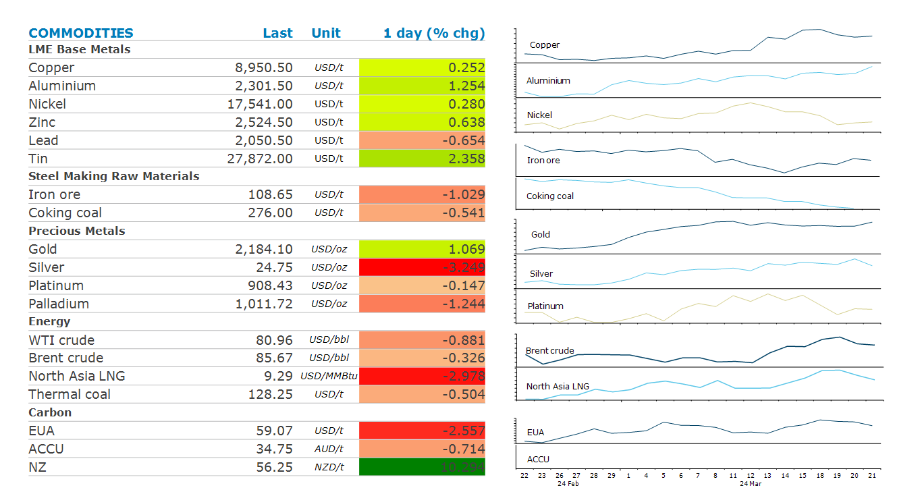
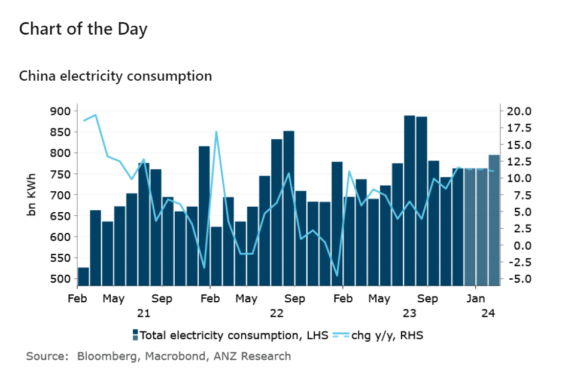

# Positive economic data pushes metals higher

**Date:** March 22, 2024  
**Publisher:** Breakwave Advisors | **Category:** Market Insights  
**Original URL:** [https://www.breakwaveadvisors.com/insights/2024/3/22/positive-economic-data-pushes-metals-higher](https://www.breakwaveadvisors.com/insights/2024/3/22/positive-economic-data-pushes-metals-higher)  

---

**Investors were buoyed by positive economic data that raised the prospect of a global soft landing. However, the subsequent stronger USD created some headwinds for the commodity sector.**

*By*[*Daniel Hynes*](https://www.linkedin.com/in/dahynes/)

> **Figure 1: Screenshot 2024 03 22 11.22.28**  
> [Local Asset](file:///C:/Users/Dell/Github/Shipping/corpus/03-breakwave/insights/2024/assets/2024-03-22_positive-economic-data-pushes-metals-higher_img_screenshot2024-03-22112228_408b19061249.png)

**Gold**surged to a record high as the prospect of rate cuts from the Fed rose. The precious metal hit USD2,220.89/oz before giving back some gains late in the session as the USD rose. The Fed maintained its outlook for three rate cuts this year at Wednesday’s FOMC meeting, suggesting it hasn’t been concerned with the recent up-tick in inflation. This was a green light for investors, with holdings of gold-backed ETFs recording strong inflows. The SPDR Gold Shares ETF, the world’s largest, rose for the fourth day. These[**flows have been absent in this year’s gold prices rally**](../pdfs/2024-03-22_positive-economic-data-pushes-metals-higher_the-vault-what-s-next-for-gold_b23234cf91af.pdf), with other factors including heightened geopolitical risks and buying from central banks underpinning the gains. However, increased demand from gold-backed ETFs suggests the current rally could be the start of something more sustainable.

**Base metals**rose strongly in early trading amid a risk-on tone across markets. US existing homes sales surged 9.5% last month, while US manufacturing activity expanded the most since June 2022. In China, electric vehicle sales may almost double month-on-month in March on price cuts, according to China’s Passenger Car Association.**Zinc**led the gains after Glencore announced it would temporarily cease operations at its McArthur River mine in Australia due to a cyclone. Rainfall at the site this week has exceeded a previous record set in 1974.

**Iron ore**extended recent gains on views the first quarter rout has run its course. This came amid a broad pick up in risk appetite following better than expected economic data. Iron ore prices have been under pressure amid little prospect a near term solution to China’s property market woes. However, the fall in steel demand from the residential real estate sector will be more than offset by[**demand from other sectors of the economy**](../pdfs/2024-03-22_positive-economic-data-pushes-metals-higher_commodity-call-iron-ore-s-steely-res_4dd6f116f6c9.pdf). Investment in social housing should increase. Infrastructure investment remains strong, bolstered by government efforts to build out the country’s renewable energy sector. China’s automotive industry, the largest in the world, will receive further support measures, with particular focus on the electric vehicle market. Combined with low supply growth, the iron ore market should be relatively balanced and keep prices from falling much below current levels.

**Crude oil**was steady as a stronger USD outweighed the optimism of rate cuts by the Fed. Traders are also taking stock following strong gains over the past week amid signs of strong demand. US crude oil inventories continue to fall, while Chinese buyers have been active since the Lunar New Year holiday. This has been exacerbated by ongoing supply side issues.

**Global gas**fell as robust stockpiles eased concerns of strong restocking for next winter.

> **Figure 2: Screenshot 2024 03 22 11.22.46**  
> **Interactive Data & Source:** [Linkedin](https://www.linkedin.com/newsletters/commodities-wrap-6692196755876012032/?fbclid=IwAR3kiXJqZdxmp9ZcRwBNI7FsBySI-XSC0pfPur1qzjt7OZp7PTE59Tsl1QI) | [Local Asset](file:///C:/Users/Dell/Github/Shipping/corpus/03-breakwave/insights/2024/assets/2024-03-22_positive-economic-data-pushes-metals-higher_img_screenshot2024-03-22112246_5821c12f2851.png)

Data source:[Commodities Wrap](https://www.linkedin.com/newsletters/commodities-wrap-6692196755876012032/?fbclid=IwAR3kiXJqZdxmp9ZcRwBNI7FsBySI-XSC0pfPur1qzjt7OZp7PTE59Tsl1QI)

---

**Tags:** Commodities, Crude Oil, Ironore  
