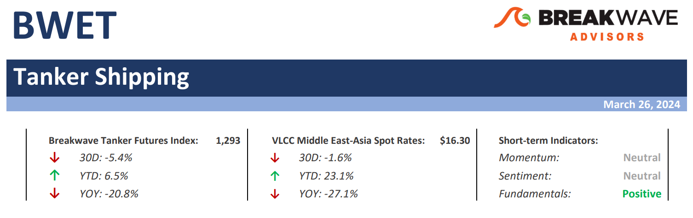
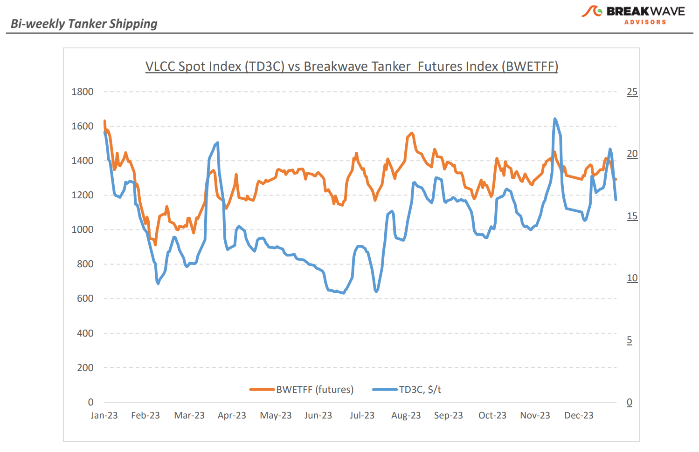
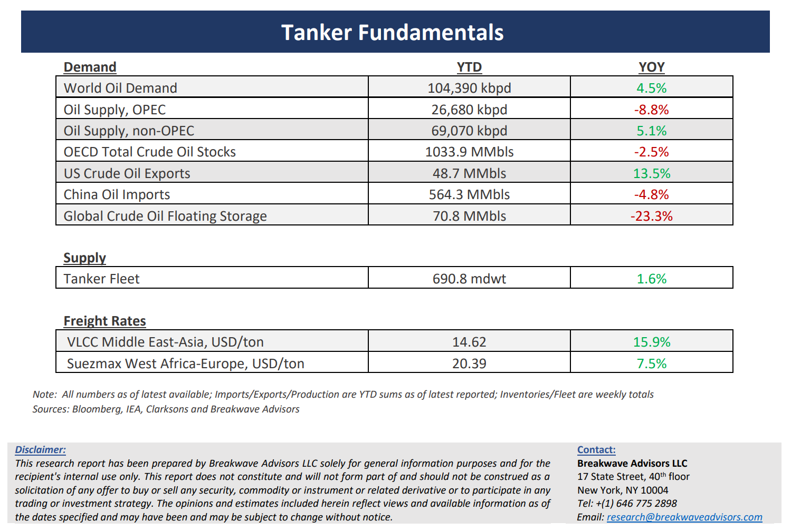

# Breakwave Bi-Weekly Tanker Report - March 26, 2024

**Date:** March 26, 2024  
**Publisher:** Breakwave Advisors | **Category:** Market Insights  
**Original URL:** [https://www.breakwaveadvisors.com/insights/2024326wet](https://www.breakwaveadvisors.com/insights/2024326wet)  

---

> **Figure 1: Tankerreporttop**  
> [Local Asset](file:///C:/Users/Dell/Github/Shipping/corpus/03-breakwave/insights/2024/assets/2024-03-26_2024326wet_img_tankerreporttop_7ecda29ad127.png)

**· Spot volatility increases but follow-through fails on muted fundamentals –**The third week of March dealt a harsh blow to VLCC owners, as their**hopes**for a surge in cargo demand were**dashed**, leaving market dynamics working against them. Despite some initial optimism earlier in the month, whispers began to circulate of a**sudden influx**of vessel relets flooding the market, all vying for lucrative returns. Such increased supply**put pressure**on owners from charterers, igniting a frantic competition to**slash rates**for available vessels. Market conditions softened across all regions, casting doubt on earlier projections of sustained strength, also evident by a rather optimistic freight futures curve at the time. Hopes for continued stability, buoyed by expectations of a substantial volume of March cargoes needing coverage and an anticipated uptick in activity driving rates higher, were left unfulfilled as the first quarter nearing its end.**Both the Atlantic and Pacific**routes saw**downward adjustments**, as charterers scrambled to secure cargo opportunities at the prevailing reduced rates.Although**spot rates**remain at relatively**heathy levels**, at least compared to the last few years, the reduced export rates out of the Middle East due to the ongoing**OPEC+ production cuts remain a relatively high hurtle**for the VLCC market to overcome. Yet, the recent rate volatility points to a**tight supply/demand balance**, which can rapidly tighten further the market if more oil supply becomes available. With oil demand projections being revised higher, it is**not inconceivable**to see such**increased oil production**hitting the market in the second half of the year, thus benefiting tanker owners.

**· Upward oil demand revisions continue, with IEA being latest to change tune**– As the global economy remains resilient to various recent negative shocks,**oil demand**forecasts have been**trending higher**, with the International Energy Agency (IEA) being the latest one to project a supply deficit later in the year. The IEA's Oil Market Report for March reflected the assumption that OPEC+ will prolong the current voluntary cuts through 2024, prompting a revision in the agency's outlook on the supply-demand balance for the year.**Oil demand has been reaching new highs**year after year, despite all the projections for**peak oil demand**, a notion that was recently**dismissed**by the largest oil company in the world,**Saudi****Aramco**. Oil prices remain in an uptrend, reflecting both the recent expectations for a tightening on the global oil market balance but also the continuing geopolitical uncertainty around the world. With the**outlook**on**Chinese****demand****improving**into the summer, $90 per barrel is no longer that far away, a level that would most certainly raise eyebrows given the fact that the last time the market reached such level, the Russian war was in its early stages and uncertainty was much higher than it is today let alone that**inflation expectations**were running hotter than current projections.

**· Our long-term view****–**The tanker market is recovering from a long period of staggered rates as the growth in new vessel supply shrinks while oil demand is recovering in line with the global economy. A historically low orderbook combined with favorable demand fundamentals should continue to support increased spot rate volatility, which combined with the ongoing geopolitical turmoil, should support freight rates in the medium to long term.

> **Figure 2: Tankerreportchart**  
> [Local Asset](file:///C:/Users/Dell/Github/Shipping/corpus/03-breakwave/insights/2024/assets/2024-03-26_2024326wet_img_tankerreportchart_2a5175a98048.png)

> **Figure 3: Tankerreportbottom**  
> [Local Asset](file:///C:/Users/Dell/Github/Shipping/corpus/03-breakwave/insights/2024/assets/2024-03-26_2024326wet_img_tankerreportbottom_ef35400142f2.png)

### Subscribe:
