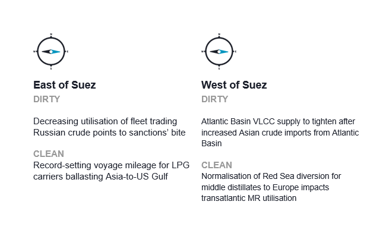
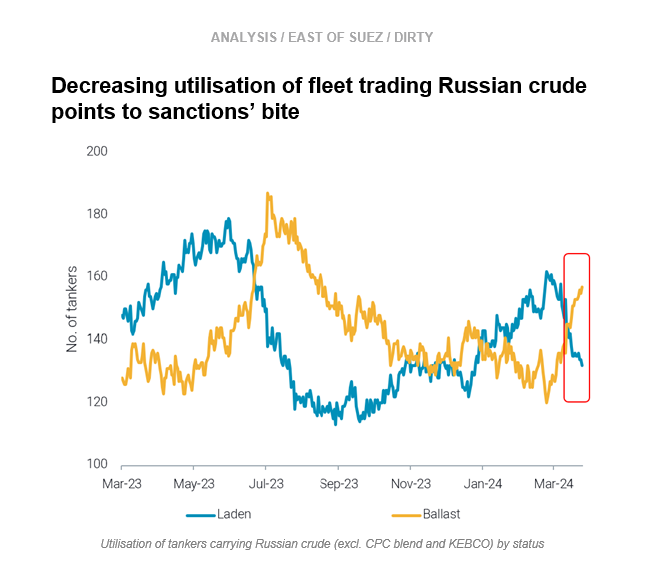
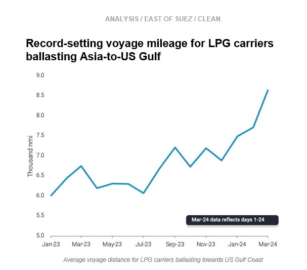
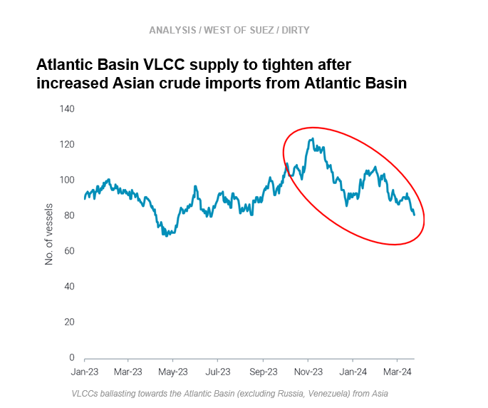
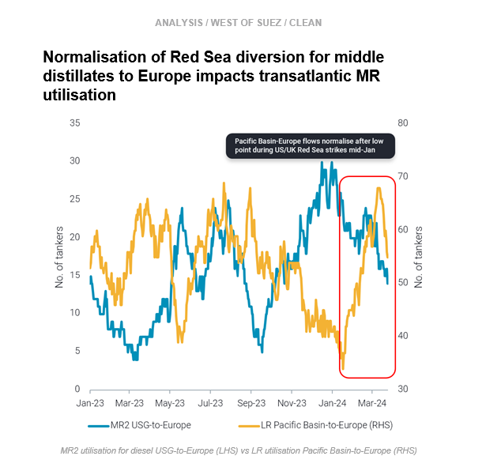

# Sanctions affect Russian crude fleet utilisation || Tighter Atlantic Basin VLCC supply?

**Date:** March 28, 2024  
**Publisher:** Breakwave Advisors | **Category:** Market Insights  
**Original URL:** [https://www.breakwaveadvisors.com/insights/2024/3/28/sanctions-affect-russian-crude-fleet-utilisation-tighter-atlantic-basin-vlcc-supply](https://www.breakwaveadvisors.com/insights/2024/3/28/sanctions-affect-russian-crude-fleet-utilisation-tighter-atlantic-basin-vlcc-supply)  

---

**This week, in the East, we discuss increasing signs that sanctions are affecting the utilisation of the fleet trading Russian crude, and we look at record-setting voyage mileage for VLGCs returning to the USG from Asia. Over in the West, we question whether signs might be pointing to tightening Atlantic Basin VLCC supply, and we explore why the normalisation of LR diversions around the Cape of Good Hope means less employment for TC14 MRs.**

*By*[*Mary Melton*](https://www.linkedin.com/search/results/all/?fetchDeterministicClustersOnly=true&heroEntityKey=urn%3Ali%3Afsd_profile%3AACoAABXVyecBtg-pRnIrZe0BoWk0ygPiUfbvhsw&keywords=mary%20melton&origin=RICH_QUERY_SUGGESTION&position=0&searchId=40e8d7d2-c4d0-4022-81e7-176f6eba418b&sid=H_Y&spellCorrectionEnabled=false)

> **Figure 1: Screenshot 2024 03 28 11.01.25**  
> **Interactive Data & Source:** [Marketingmail Vortexa](https://marketingmail.vortexa.com/ODM3LU1aRS01NzgAAAGSH-FZgqe2pYxWWH-ef_QuKWXwDZJP4HxzsXU77frNt3bLD67TOUImQUqJoFF-rodQBsJiVdQ=) | [Local Asset](file:///C:/Users/Dell/Github/Shipping/corpus/03-breakwave/insights/2024/assets/2024-03-28_sanctions-affect-russian-crude-fleet-utilisation-tighter-atlantic-basin-vlcc-sup_img_screenshot2024-03-28110125_a0ec68e2d524.png)

> **Figure 2: Screenshot 2024 03 28 11.01.33**  
> **Interactive Data & Source:** [Marketingmail Vortexa](https://marketingmail.vortexa.com/ODM3LU1aRS01NzgAAAGSH-FZgqe2pYxWWH-ef_QuKWXwDZJP4HxzsXU77frNt3bLD67TOUImQUqJoFF-rodQBsJiVdQ=) | [Local Asset](file:///C:/Users/Dell/Github/Shipping/corpus/03-breakwave/insights/2024/assets/2024-03-28_sanctions-affect-russian-crude-fleet-utilisation-tighter-atlantic-basin-vlcc-sup_img_screenshot2024-03-28110133_63fb955db2db.png)

- Sanctions enforcement is now visibly affecting the utilisation of the fleet carrying Russian crude. In late February, the number of ballast vessels which last lifted Russian crude grades (excl. CPC blend and KEBCO) began increasing significantly. Ballast vessels have now surpassed laden vessels for the first time in three months, pointing to less utilisation of the Russian fleet.

- Massive increases of[Sokol discharges in China](https://marketingmail.vortexa.com/ODM3LU1aRS01NzgAAAGSH-FZgqe2pYxWWH-ef_QuKWXwDZJP4HxzsXU77frNt3bLD67TOUImQUqJoFF-rodQBsJiVdQ=)have increased ballast tonnage, because a majority of these vessels had been in floating storage offshore China after diverting from India following US sanctions on Sovcomflot. As of 20 March, 15 tankers discharged Sokol crude in China in March, and 8 of those tankers had loaded the cargo over 2 months ago, with one tanker laden for 5 months. The higher risk profile of a lot of these newly ballast tankers (half of which were sanctioned by the US) indicates that fears about price cap compliance are not likely to deter future Russian crude loadings on these vessels.
- After this week’s announcement that Indian buyers will not take Russian crude on Sovcomflot-linked tankers (Bloomberg), our analysis reveals this will have minimal impact, as most of India’s imports of Russian crude are not on these tankers (read more[here](https://marketingmail.vortexa.com/ODM3LU1aRS01NzgAAAGSH-FZhAByJxH1Cynj19Rq-NN34PJu1dFA4VuMoaGTSU-cuIoujq8gwjoHMfZChNuJgEDCjSk=)). Though Russian crude exports remain high due to[China’s increased Russian imports](https://marketingmail.vortexa.com/ODM3LU1aRS01NzgAAAGSH-FZg8h80EZoqx6swy18xdtjY8ZCiGy81yzGhhzeynht9Y_0wnFZsrL9OjxSJAg2C7NY0ss=), it is likely moving forward that Russian crude could be offered at increasing discounts to entice both lower-risk vessel operators and Indian buyers.

> **Figure 3: Screenshot 2024 03 28 11.01.41**  
> **Interactive Data & Source:** [Marketingmail Vortexa](https://marketingmail.vortexa.com/ODM3LU1aRS01NzgAAAGSH-FZg_VuKSnCu0Yq2DlJm0n7cWvbK-5sK7BDo1nDFTyybAqaPbPArJLEvB2z0qabPRxES1g=) | [Local Asset](file:///C:/Users/Dell/Github/Shipping/corpus/03-breakwave/insights/2024/assets/2024-03-28_sanctions-affect-russian-crude-fleet-utilisation-tighter-atlantic-basin-vlcc-sup_img_screenshot2024-03-28110141_90bb447412f5.png)

- [Asia's LPG imports](https://marketingmail.vortexa.com/ODM3LU1aRS01NzgAAAGSH-FZg_VuKSnCu0Yq2DlJm0n7cWvbK-5sK7BDo1nDFTyybAqaPbPArJLEvB2z0qabPRxES1g=)increased in March, with China notably posting an increase of 300kbd, about 30% m-o-m. Though Asia’s healthy demand is expected to continue, logistical constraints are affecting the LPG carriers ballasting back to the US Gulf Coast from Asia. The Panama Canal drought followed by the Red Sea attacks is causing ballast voyage distances to skyrocket.[Average voyage distance for LPG carriers towards the US Gulf Coast](https://marketingmail.vortexa.com/ODM3LU1aRS01NzgAAAGSH-FZgkoQmvBdhDD3ABIAWNtcaalOdmvUrWswvClV3bHA1r1ek_FZXkGaqPouiFI3BX3NIW4=)reached an all-time high of 8.6k nautical miles (nmi) in March, up 25% from 6.9k nmi in December 2023.

- Facing this long voyage west, ballasting vessels are opting to stay East of Suez and head towards the[Middle East Gulf](https://marketingmail.vortexa.com/ODM3LU1aRS01NzgAAAGSH-FZg-WXg2pCanGruqQYcY6d6d6PJm0UbVY9JtJEqCRlClDWTdNdih35zgGFQGB1MWItC44=)to load instead of the[US Gulf](https://marketingmail.vortexa.com/ODM3LU1aRS01NzgAAAGSH-FZg6s9HfYepwbVtlNIn7r-VWmZ6J4UifZz3xc54UJSbAqs47FEnhi2Ng7NmNoo0gAwrPs=). As a result,[loadings from the US Gulf towards Asia](https://marketingmail.vortexa.com/ODM3LU1aRS01NzgAAAGSH-FZg1aqpJccbVwiwZEp3j67T8-lr4YkvaR40pb3yCtHd3ErUhLQB9AT2z0eDPhpSFGXt_E=)in March are already experiencing a slowdown.
- VLGC freight rates for loadings in the USG have remained relatively stable (Argus) due to tighter vessel supply. If the long voyage requirements due to these logistical issues continue, it is likely Asia will increasingly source LPG from the MEG instead of the USG.

> **Figure 4: Screenshot 2024 03 28 11.01.57**  
> **Interactive Data & Source:** [Marketingmail Vortexa](https://marketingmail.vortexa.com/ODM3LU1aRS01NzgAAAGSH-FZgpCjVGws7Aztn8rRUlwD406SgO5b4Ps6EXnKgYAvmhLmsOAuFY_rshignUWoRgKcY5U=) | [Local Asset](file:///C:/Users/Dell/Github/Shipping/corpus/03-breakwave/insights/2024/assets/2024-03-28_sanctions-affect-russian-crude-fleet-utilisation-tighter-atlantic-basin-vlcc-sup_img_screenshot2024-03-28110157_8c4b46eee8bb.png)

- [Asian crude imports from the Atlantic Basin](https://marketingmail.vortexa.com/ODM3LU1aRS01NzgAAAGSH-FZgpCjVGws7Aztn8rRUlwD406SgO5b4Ps6EXnKgYAvmhLmsOAuFY_rshignUWoRgKcY5U=)increased 17% m-o-m and are now closer to historical levels imported in the past 6 months. Driving this increase are volumes from Brazil and Kazakhstan (CPC blend cargoes which rerouted around the Cape of Good Hope). However, these high import levels are unlikely to be sustained as refinery maintenance season in Europe winds down and pulls barrels away from Asia. Additionally, when Brazil’s own refinery turnarounds end, Brazil’s total exports are likely to soften.

- After discharging in Asia, the count of VLCCs ballasting to Atlantic Basin destinations (excl. Russia and Venezuela) is declining as more head to the Middle East.
- As a result, total[supply of VLCCs in Atlantic Basin](https://marketingmail.vortexa.com/ODM3LU1aRS01NzgAAAGSH-FZgp21lXQUJ1xIG-OzdeNLRLTdR_no_RBwBmM-Toc7zVK6050zrZuo4U5E5K3Dss3z64o=)is set to tighten, which is likely to support freight rates and limit arbitrage opportunities for Atlantic Basin flows to Asia. At the same time, falling prices for WTI delivered to Europe will likely compete with arb flows to Asia.

> **Figure 5: Screenshot 2024 03 28 11.02.26**  
> **Interactive Data & Source:** [Marketingmail Vortexa](https://marketingmail.vortexa.com/ODM3LU1aRS01NzgAAAGSH-FZgrXH_piIByn3b4JF5RwI3nABF9_QHq5SM-kKehZl_NmN7w2ql9hwe9x9YyEtsvyRNjM=) | [Local Asset](file:///C:/Users/Dell/Github/Shipping/corpus/03-breakwave/insights/2024/assets/2024-03-28_sanctions-affect-russian-crude-fleet-utilisation-tighter-atlantic-basin-vlcc-sup_img_screenshot2024-03-28110226_bd51ccd3e9e9.png)

- Rerouting via the Cape of Good Hope (COGH) is now[the norm for LRs](https://marketingmail.vortexa.com/ODM3LU1aRS01NzgAAAGSH-FZgrXH_piIByn3b4JF5RwI3nABF9_QHq5SM-kKehZl_NmN7w2ql9hwe9x9YyEtsvyRNjM=)carrying middle distillates to Europe. After a steep decline in utilisation coinciding with the beginning of the US/UK retaliatory strikes in the Red Sea in mid-Jan, LR voyages on the East-West route via the COGH normalised, and[utilisation continued trending upwards](https://marketingmail.vortexa.com/ODM3LU1aRS01NzgAAAGSH-FZg4_D5x2tPqka3emkStE7chx8fudaWW1bxpQH97A0QiQ7XtiCRNyEo5HuzSrKVcWzW5g=).

- At the same time, Europe’s demand for US Gulf diesel has softened and[MR utilisation for diesel USG-to-Europe](https://marketingmail.vortexa.com/ODM3LU1aRS01NzgAAAGSH-FZhE8V1Ga7S_VDyjW_6l4eenP_5_AUDpzU2cMNhX2gF67mD-2fs_CV2gNWSwgpvoMFns0=)is around 6-month lows. Instead, more[US Gulf diesel ended up in the Caribbean](https://marketingmail.vortexa.com/ODM3LU1aRS01NzgAAAGSH-FZgncz2pOWywdFZhUjy3cv8NZBb4nLdQVLnFDTyYdDhp73y6G0FibbKPF-P4f8bJfnsOA=), where arrivals increased about 35% m-o-m so far in March (days 1-25) and are approaching a 3-year high. This short-haul employment has not significantly increased freight rates in the region due to the decline in long-haul transatlantic employment.
- Moving forward, the uncertain outlook for Russian diesel exports resulting from Ukrainian strikes on refineries and regular seasonal maintenance could mean Brazil turns to the USG for diesel.[Departures towards Brazil](https://marketingmail.vortexa.com/ODM3LU1aRS01NzgAAAGSH-FZg7_x8mlnTB1iuyZ9EAlRpbgOMlNtXkrXrpKmj2MjjY26Sy8Y9Z7MB_HgJEJHleQk1O4=)have increased so far in March, but the volumes are still too low to positively impact MR demand in the USG. However, with the likelihood of continued reduced European demand for diesel, if increased demand for voyages to Brazil materialises, it could sustain MR demand in the region.

Data Source:[Vortexa](https://www.vortexa.com//oil-gas-data-traders-analysts-data-scientists?gclid=Cj0KCQjw8_qRBhCXARIsAE2AtRZKOvMnbilZ_6_91d7huSFFy71pWLrnPwGwOHVzXsmsG-1a1mZnQw8aAt89EALw_wcB&hsa_acc=1782073842&hsa_ad=548425387665&hsa_cam=14746637662&hsa_grp=125038601902&hsa_kw=&hsa_mt=&hsa_net=adwords&hsa_src=g&hsa_tgt=dsa-1431852288425&hsa_ver=3&utm_campaign=%5BCD%5D%20-%20DSA%20-%20EMEA&utm_medium=cpc&utm_medium=ppc&utm_source=google&utm_source=adwords&utm_term=)

---

**Tags:** Tankers, Shipping, Crude Oil  
