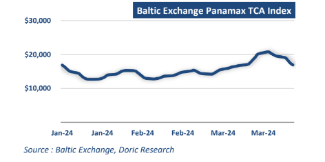
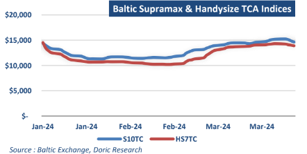
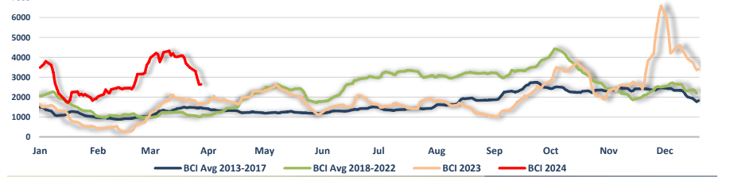

# The first quarter of 2024 has been quite fruitful

**Date:** April 01, 2024  
**Publisher:** Breakwave Advisors | **Category:** Market Insights  
**Original URL:** [https://www.breakwaveadvisors.com/insights/2024/4/1/the-first-quarter-of-2024-has-been-quite-fruitful](https://www.breakwaveadvisors.com/insights/2024/4/1/the-first-quarter-of-2024-has-been-quite-fruitful)  

---

*By*[*Michalis Voutsinas*](https://www.linkedin.com/in/michalis-voutsinas-587544163/)

The downward correction that began a couple of weeks ago persisted throughout the thirteenth trading week, further driving the Baltic Dry Index down to 1821 points. Reflecting the severity of this correction, Thursday's closing was approximately 600 points lower than the recent March highs. Despite the recent sell-off, the gauge of activity in the dry bulk spectrum remained 23 percent higher than its value a year ago. On average terms, the first quarter of 2024 has been quite fruitful, with the BDI averaging at 1824 points compared to an average of just 1011 points a year ago.

By dissecting the general index, two main trends have become apparent in the last ten days of March. On one hand, the market for gearless bulkers has been ensnared in a downward spiral. On the other hand, the spot market for geared bulkers has managed to maintain its levels, largely trending sideways. Specifically, after reaching multi-month highs of $35,780 daily in early March, the leading Capesize TC index plummeted to $21,866 daily today, a figure last observed in mid-February. Similarly, Panamax levels have shed approximately $3,800 of their value within the last seven trading days, closing at $16,913 daily this Friday. In stark contrast, Supramax and Handysize markets concluded March at $14,638 and $13,898 daily, respectively, tick below their highest values of the first quarter.

> **Figure 1: Market Chart 1**  
> **Interactive Data & Source:** [Doric](https://www.doric.gr/) | [Local Asset](file:///C:/Users/Dell/Github/Shipping/corpus/03-breakwave/insights/2024/assets/2024-04-01_the-first-quarter-of-2024-has-been-quite-fruitful_img_image1doric_f4dedfda9203.png)

Against this backdrop, the segment most influenced by China, Capesizes, achieved a notably robust average of $24,286 daily for the first quarter of 2024, marking a significant increase of 165.6 percent year-on-year. Furthermore, this average surpassed the Q1 performance of Capesizes in the fertile year of 2022. Moving to the Panamax segment, the BPI 82 TCA recorded a respectable quarterly average of $15,447 daily, reflecting a 36.4 percent improvement over the previous year. However, the three-month performance of Panamaxes fell considerably short of the impressive Q1 2022 average levels of $23,218 daily. Supramaxes and Handies maintained a solid footing this quarter with three-month averages of $12,961 daily and $11,998 daily, respectively. These figures denote increases of 27.4 percent and 23.7 percent over their averages from the previous year. Furthermore, when examining a broader timeframe, all segments except Capesizes reported their best Q1 performances in recent years. Capesize Q1 performance was even more impressive, surpassing not only the seasonally weakest Q1 periods of previous years but also outperforming the majority of the typically stronger Q3 and Q4 periods.

> **Figure 2: Market Chart 2**  
> **Interactive Data & Source:** [Doric](https://www.doric.gr/) | [Local Asset](file:///C:/Users/Dell/Github/Shipping/corpus/03-breakwave/insights/2024/assets/2024-04-01_the-first-quarter-of-2024-has-been-quite-fruitful_img_image2doric_b4fe40c7a754.png)

On the SandP front, modern eco five-year-old Capesize units commanded an average price of $58 million for the first quarter of 2024, representing an increase of approximately twelve million dollars compared to the previous year. With the spot market maintaining solid levels for a significant portion of the first quarter, the end-March price for such units reached $62 million, marking a seven million dollar increase from early January. Similarly, modern Kamsarmaxes averaged a price of $35.25 million during the last three months, indicating a five million dollar increase over the respective average of the previous year's Q1. A plethora of grain and coal orders not only sustained the buoyancy of the spot market but also supported the Kamsarmax SandP market during the first quarter. Moving down the ladder to the geared tonnage, the market for fiveyear-old Ultras and same-aged large Handies maintained an average price of $32.25 million and $27 million, respectively, representing increases of 10.5 percent and 8 percent year-on-year. It's noteworthy that market expectations at the close of this quarter significantly differ from those at the beginning. Consequently, asset prices are currently balancing above the aforementioned Q1 average levels in most of the cases.

As the market bids farewell to a flourishing first quarter, the dynamics of the previous three months have infused the market with generous doses of optimism. Data from commodity analysts Kpler and LSEG Oil Research reveals that China's imports of crude oil, liquefied natural gas (LNG), coal, and iron ore were all stronger in the first two months of 2024 compared to the same period last year. Furthermore, during the same timeframe, China experienced a robust start in foreign trade. According to the General Administration of Customs, exports exhibited significant growth, rising by 10.3 percent year-on-year to reach 3.75 trillion yuan, while imports also witnessed a notable increase. Looking ahead to the seasonally strongest periods of Q2 and Q3, market sentiment remains rather mixed. There is a sense of anticipation for increased trading activity, albeit tempered by cautiousness regarding the high expectations set by the exceptionally strong performance in Q1.

> **Figure 3: Market Chart 3**  
> **Interactive Data & Source:** [Doric](https://www.doric.gr/) | [Local Asset](file:///C:/Users/Dell/Github/Shipping/corpus/03-breakwave/insights/2024/assets/2024-04-01_the-first-quarter-of-2024-has-been-quite-fruitful_img_image3doric_dc92d9c031b3.png)

Data source:[Doric](https://www.doric.gr/)

---

**Tags:** Drybulk, Shipping  
