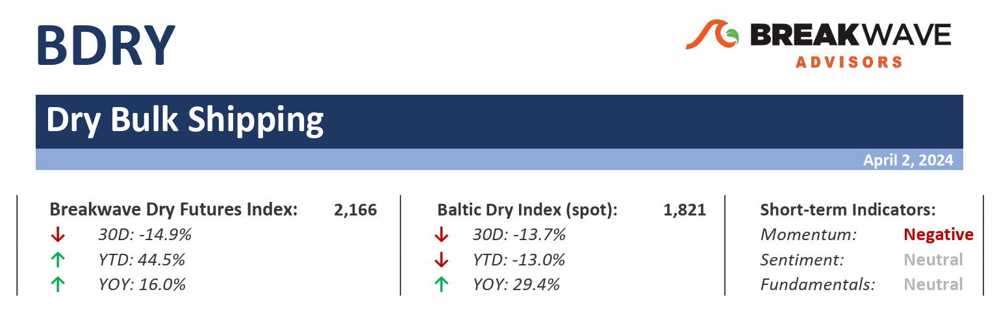
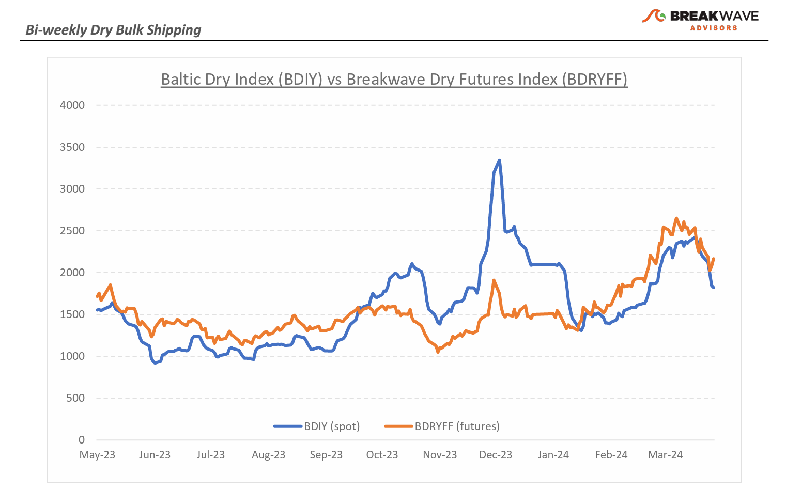
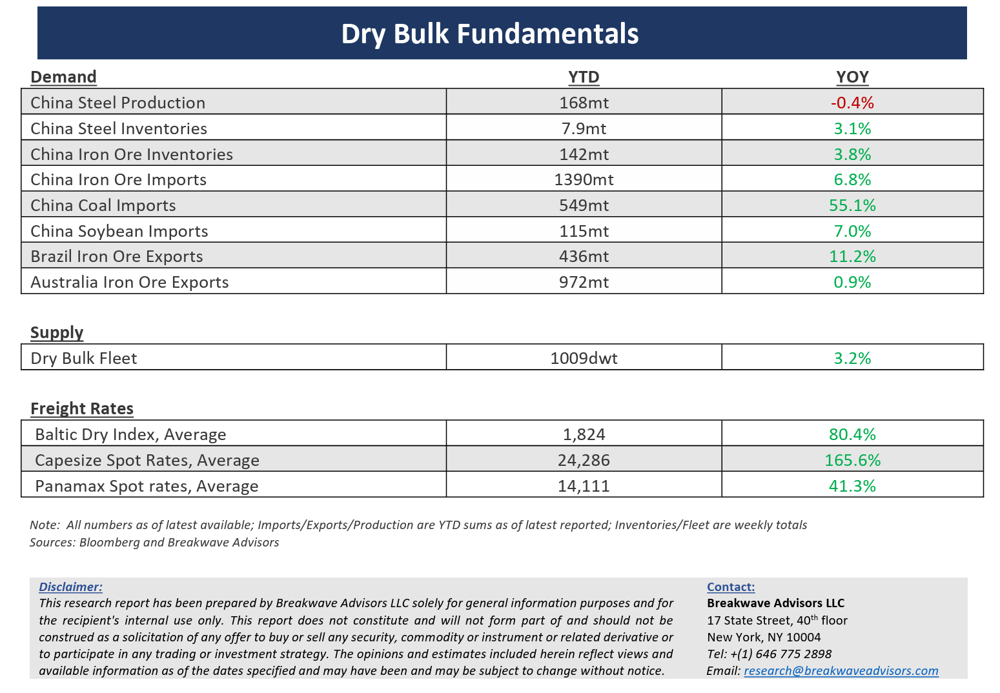

# Breakwave Bi-Weekly Dry Bulk Report - April 2, 2024

**Date:** April 02, 2024  
**Publisher:** Breakwave Advisors | **Category:** Market Insights  
**Original URL:** [https://www.breakwaveadvisors.com/insights/202442dry](https://www.breakwaveadvisors.com/insights/202442dry)  

---

> **Figure 1: Dryreporttop**  
> [Local Asset](file:///C:/Users/Dell/Github/Shipping/corpus/03-breakwave/insights/2024/assets/2024-04-02_202442dry_img_dryreporttop_148f39658256.png)

**· The correction in dry bulk is here as spot rates look for a bottom****–**Although the**excitement**in dry bulk shipping remains**unabated**, Capesize**spot rates**have now**declined by about 40%**from recent highs, but remain above comparable last year’s levels, at least at the time of writing. As we have discussed lately, the fundamentals of the dry bulk sector did not warrant the recent elevated spot rate levels, and it was the disruptions in vessel supply, especially in the Atlantic market, that led to the recent**strength in spot rates**, especially in such a**counter-seasonal**way. The market has now rebalanced, and the supply/demand equilibrium has tilted the other way with the Capesize market facing headwinds from increasing vessel supply in the Atlantic market. In addition, the**coal export disruption**due to the**Baltimore**bridge collapse has released a number of pre-committed Capesize ships, that would have otherwise loaded coal in Baltimore, to the Atlantic market, while whispers of delays and potential force majeure in Guinea is also putting additional pressure on future bauxite-led demand. Combining the above with the considerable and above-trend iron ore and coal shipments in the past few months, a reversion to the mean for bulk volumes is about to put some pressure on spot freight rates.**Market participants remain optimistic**but given the backward-looking nature of the shipping markets, not a lot can be inferred.**Our view is that the correction has yet to reach a bottom**, and a sequential upswing in the summer might be at play, subject to real demand coming out of China, a normalization in inventory levels, and the continuation of the recent disruptions in vessel availability (Red Sea diversions, Panama Canal drought). For now, the**bottoming process**in spot rates should be the focus, as the Capesize market tends to overshoot on the upside and undershoot during corrections, something we cannot rule out even this time around.

**· Chinese economic data shows signs of recovery, but steel markets remain depressed – Recent economic data**out of China has**surprised to the upside**, with March PMI numbers coming better than expected, industrial production moving above trend, and retail sales also stronger than anticipated. On the other hand,**real estate remains depressed**and home sales continue to drift lower, in the process keeping the broader steel sector under pressure.**Iron ore prices**have experienced some**heightened volatility**, around the psychologically important $100/ton price level, while steel production probably remains flattish on a year-to-year basis. The**industrial economy in China is doing better**, and such a trend helps to offset the weakness in the real estate sector, but there is little support coming out of such balance for a continuation of the recent strength in iron ore imports, something that remains a major obstacle for a more sustained upcycle in dry bulk shipping.

**· Our long-term view****–**The last few years have been characterized by increased geopolitical uncertainty. Going forward, we expect such events to continue to affect global trade and have a meaningful impact on effective vessel supply. Combined with the potential for a multi-year rebound in China’s economic activity following the recent economic turmoil, dry bulk shipping should experience higher volatility on top of a secular tightness driven by increasing bulk commodity demand and a slower fleet growth as a result of a relatively low orderbook.

> **Figure 2: Dryreportchart**  
> [Local Asset](file:///C:/Users/Dell/Github/Shipping/corpus/03-breakwave/insights/2024/assets/2024-04-02_202442dry_img_dryreportchart_b8636d00dba2.png)

> **Figure 3: Dryreportbottom**  
> [Local Asset](file:///C:/Users/Dell/Github/Shipping/corpus/03-breakwave/insights/2024/assets/2024-04-02_202442dry_img_dryreportbottom_c8a50e0ef837.png)

### Subscribe:
