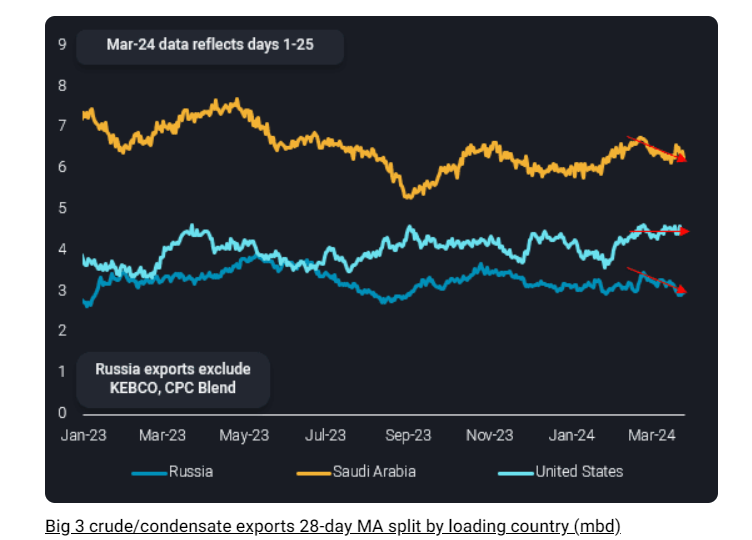
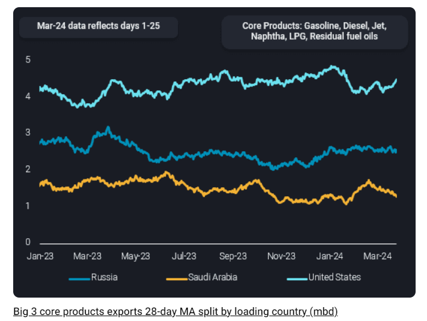

# Big three oil exporters add tightness to global supplies in March

**Date:** April 02, 2024  
**Publisher:** Breakwave Advisors | **Category:** Market Insights  
**Original URL:** [https://www.breakwaveadvisors.com/insights/2024/4/2/big-three-oil-exporters-add-tightness-to-global-supplies-in-march](https://www.breakwaveadvisors.com/insights/2024/4/2/big-three-oil-exporters-add-tightness-to-global-supplies-in-march)  

---

**Crude and refined products exports from the top seaborne exporters are lower so far in March and adding supply tightness to global oil markets.**

*By*[*Jay Maroo*](https://www.linkedin.com/in/jay-m-336a3633/)

Crude/condensate exports from Saudi Arabia and Russia (excluding Kazakh origin) have each fallen by just over 400kbd m-o-m, when viewing a 28-day rolling moving average, while US exports are also lower by around 100kbd over the same period (see chart). In total, this means the big three’s combined seaborne crude/condensate exports fell by around 1mbd m-o-m to 13.7mbd, as of March 25 (28-day MA).

> **Figure 1: Chart 1**  
> **Interactive Data & Source:** [Vortexa](https://www.vortexa.com/insights/crude/exclusive-report-sanctions-impact-review-of-russian-crude-flows-to-asia/) | [Local Asset](file:///C:/Users/Dell/Github/Shipping/corpus/03-breakwave/insights/2024/assets/2024-04-02_big-three-oil-exporters-add-tightness-to-global-supplies-in-march_img_chart1_008c53e97284.png)

The short-term outlook for crude exports among the top three nations is a mixed one. For Russia, extensive damage to downstream infrastructure after numerous attacks has curbed refinery throughput and could potentially “free up” crude for export. However, in the current environment of tightening restrictions on freight/sanctions compliance there may be difficulties in maintaining exports at current levels (around 3mbd).

China imported recorded volumes of Sokol crude in March (after redirections from India) and this is unlikely to be repeated again. At the same time, the nation has sought more Middle East crude given comparatively low Saudi OSPs in recent months. For India, the only other major buyer of Russian crude, there is ongoing uncertainty over whether crude imports from Russia will fall due to self-imposed financial/legal restrictions. Indian refiners are reportedly no longer taking cargoes on Sovcomflot tankers, though this may not make a large volumetric impact ([read our latest insight for more](https://www.vortexa.com/insights/crude/exclusive-report-sanctions-impact-review-of-russian-crude-flows-to-asia/)), it does suggest a change in tone from the previous approach.

For Saudi Arabia, the upcoming seasonal rise in power-gen demand would support increased crude burn. But an alternative view is that Saudi Arabia may, like last year, use the summer demand uptick as an opportunity to import more fuel oil from international export markets (e.g. Russia). This could potentially free up crude for export. Early indications show no Saudi imports of Russian fuel have happened so far this year, but volumes arriving into Fujairah (from Russia) have grown m-o-m in March.

Compared to Saudi and Russia, the short-term picture for US crude exports is somewhat more straightforward. The latest data (EIA) for gross refinery inputs indicates refiners running harder with summer gasoline demand looming. Meanwhile, domestic production at over 13mbd is just shy of all-time historical highs, suggesting there is very little wiggle room for further export rises in the short term. Anyhow, widening discounts for WTI delivered to Europe suggest a limited appetite for cargoes in its closest core market.

Turning attention briefly to products, the big three nations’ combined exports of light, middle and heavy distillates products are also lower m-o-m, but to a lesser extent than seen on crude. Total combined seaborne exports of LPG, gasoline, naphtha, jet, diesel and residual fuel oils from Russia, Saudi Arabia and the US stood at 8.4mbd, down from around 8.6mbd a month earlier.

> **Figure 2: Chart 2**  
> **Interactive Data & Source:** [Vortexa](https://www.vortexa.com//oil-gas-data-traders-analysts-data-scientists?gclid=Cj0KCQjw8_qRBhCXARIsAE2AtRZKOvMnbilZ_6_91d7huSFFy71pWLrnPwGwOHVzXsmsG-1a1mZnQw8aAt89EALw_wcB&hsa_acc=1782073842&hsa_ad=548425387665&hsa_cam=14746637662&hsa_grp=125038601902&hsa_kw=&hsa_mt=&hsa_net=adwords&hsa_src=g&hsa_tgt=dsa-1431852288425&hsa_ver=3&utm_campaign=%5BCD%5D%20-%20DSA%20-%20EMEA&utm_medium=cpc&utm_medium=ppc&utm_source=google&utm_source=adwords&utm_term=) | [Local Asset](file:///C:/Users/Dell/Github/Shipping/corpus/03-breakwave/insights/2024/assets/2024-04-02_big-three-oil-exporters-add-tightness-to-global-supplies-in-march_img_chart2_2e4a461993e2.png)

Unlike crude exports, product exports for Saudi Arabia and the US have clear upsides. Saudi Arabia’s refined products exports have likely bottomed out in March at around the 1.3mbd mark (28-day MA), as the impact of seasonal refinery maintenance fades. And US refiners are likely to keep run rates elevated to meet rising gasoline demand, which means more diesel freed up for the export market. To some extent we are already seeing this in jet markets, with a slowdown in US PADD5 jet imports as domestic supplies pick up.

Zooming out, the broader picture for oil exports (combined crude and products) is one where each of the big three nations is likely reducing in market share. Non-Opec suppliers such as Brazil and (more recently) Guyana have rapidly and consistently been increasing crude oil exports in recent months while on refined products the continued flow of exports from new Middle East downstream projects (Al Zour, Duqm) are adding to the market. The most recent example we see is the addition of naphtha and fuel oil from Nigeria’s Dangote refinery. Be it crude or products, the big three’s exports are facing increasing competition.

Data Source:[Vortexa](https://www.vortexa.com//oil-gas-data-traders-analysts-data-scientists?gclid=Cj0KCQjw8_qRBhCXARIsAE2AtRZKOvMnbilZ_6_91d7huSFFy71pWLrnPwGwOHVzXsmsG-1a1mZnQw8aAt89EALw_wcB&hsa_acc=1782073842&hsa_ad=548425387665&hsa_cam=14746637662&hsa_grp=125038601902&hsa_kw=&hsa_mt=&hsa_net=adwords&hsa_src=g&hsa_tgt=dsa-1431852288425&hsa_ver=3&utm_campaign=%5BCD%5D%20-%20DSA%20-%20EMEA&utm_medium=cpc&utm_medium=ppc&utm_source=google&utm_source=adwords&utm_term=)

---

**Tags:** Tankers, Shipping, Crude Oil  
