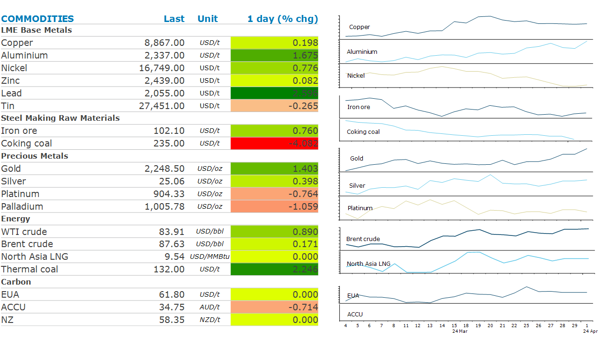
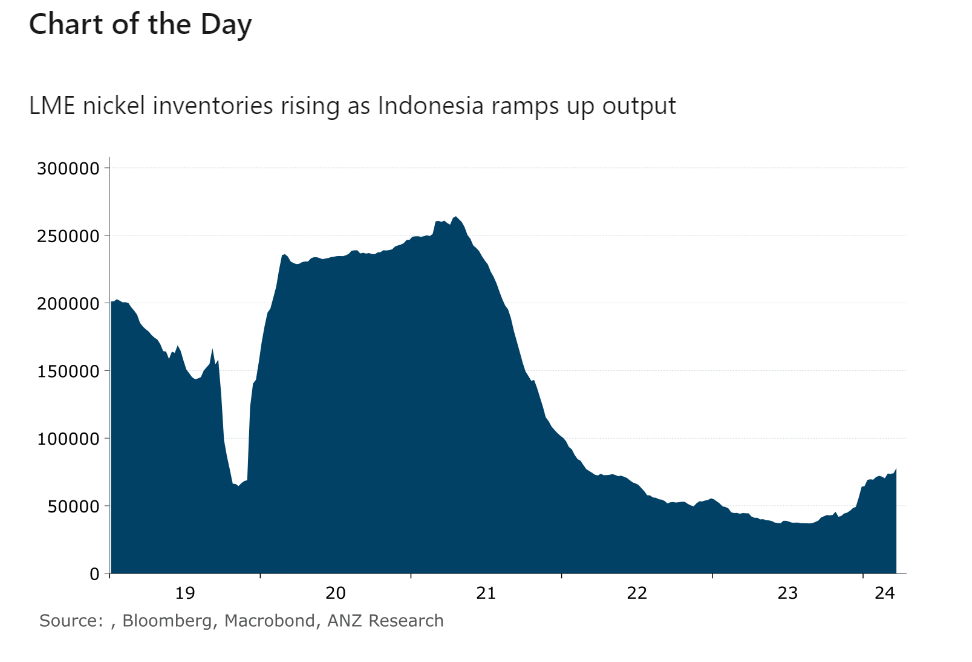

# Oil gains as the geopolitical backdrop worsens

**Date:** April 02, 2024  
**Publisher:** Breakwave Advisors | **Category:** Market Insights  
**Original URL:** [https://www.breakwaveadvisors.com/insights/2024/4/2/oil-gains-as-the-geopolitical-backdrop-worsens](https://www.breakwaveadvisors.com/insights/2024/4/2/oil-gains-as-the-geopolitical-backdrop-worsens)  

---

**Geopolitical risks pushed energy prices higher. Supply side issues remained the focus for metals, while low inflation supported precious metal markets.**

> **Figure 1: Bydaniel Hynes**  
> [Local Asset](file:///C:/Users/Dell/Github/Shipping/corpus/03-breakwave/insights/2024/assets/2024-04-02_oil-gains-as-the-geopolitical-backdrop-worsens_img_image_be601d31de1d.png)

With the London Metal Exchange closed,**base metal**markets were subdued in Asia and the US. Nevertheless, sentiment is improving in the**copper**market amid the prospect of further supply tightness. This has seen the difference between spot and near-dated future contracts reach their largest margin, in records that go back to 1994. The spot market was not yet feeling the impact of the tightness in supply of concentrate because of plentiful stocks built up ahead of China’s National People’s Congress. The**nickel**market got a reminder of what could be in store, with Indonesia pressing ahead with plans to expand nickel output despite a supply glut. The country’s production capacity for battery-grade nickel was expected to quadruple to 1 million tonnes by 2030, said Septian Hario Seto, the deputy co-ordinating minister for investment and mining. However, there are risks to the market that could hinder that[**wave of supply**](../pdfs/2024-04-02_oil-gains-as-the-geopolitical-backdrop-worsens_commodity-call-nickel-deluge-not-ine_050759fd0575.pdf). The recent collapse in prices has made more than half the industry sub-economic. Producers responded rapidly, with up to 100kt of capacity likely to close this year. In Indonesia itself, the new projects face Environmental, Social and Governance issues, such as poor safety, delays in getting government permits and issues with environmental impact that may delay delivery. So, a tighter market is not out of the question.

**Iron ore**extended last weeks’ losses amid warning of weaker demand. The China Iron and Steel Association warned last week that China’s property downturn could delay a recovery in steel demand. This follows the steel industry Purchasing Managers Index sinking to 44.2, its lowest reading since May last year.

**Gold**started the week strongly, after the Fed’s preferred gauge of underlying inflation cooled in February. Gold traded as high as USD2,265/oz, as the market priced in a 57% chance of the Fed cutting rates in June. However, it lost some of these gains following stronger than expected US manufacturing data.

**Crude oil**rose amid rising tensions in the Middle East. In a sign of a possible escalation in the Israel-Hamas war, an Israeli airstrike on Iran’s embassy in Syria killed a top military commander. To date, the market hasn’t been worried about supply disruptions, with the war remaining contained. Iran’s involvement could see its oil supply under threat. This comes ahead of a meeting by the OPEC Joint Monitoring Ministerial Committee this Wednesday, where there are expectations the group will reaffirm its current supply policy. Supply could be curtailed, after Mexico’s Pemex said it plans to halt some crude oil exports over the next few months.

**North Asian LNG**edged higher on signs of stronger demand. Shipments of LNG to Asia rose to about 24mt in March, up 12% y/y according to ship tracking data from Kpler.

> **Figure 2: Chart**  
> **Interactive Data & Source:** [Linkedin](https://www.linkedin.com/newsletters/commodities-wrap-6692196755876012032/?fbclid=IwAR3kiXJqZdxmp9ZcRwBNI7FsBySI-XSC0pfPur1qzjt7OZp7PTE59Tsl1QI) | [Local Asset](file:///C:/Users/Dell/Github/Shipping/corpus/03-breakwave/insights/2024/assets/2024-04-02_oil-gains-as-the-geopolitical-backdrop-worsens_img_chart_8dc63c8b0b73.png)

Data source:[Commodities Wrap](https://www.linkedin.com/newsletters/commodities-wrap-6692196755876012032/?fbclid=IwAR3kiXJqZdxmp9ZcRwBNI7FsBySI-XSC0pfPur1qzjt7OZp7PTE59Tsl1QI)

---

**Tags:** Commodities, Crude Oil, Ironore  
