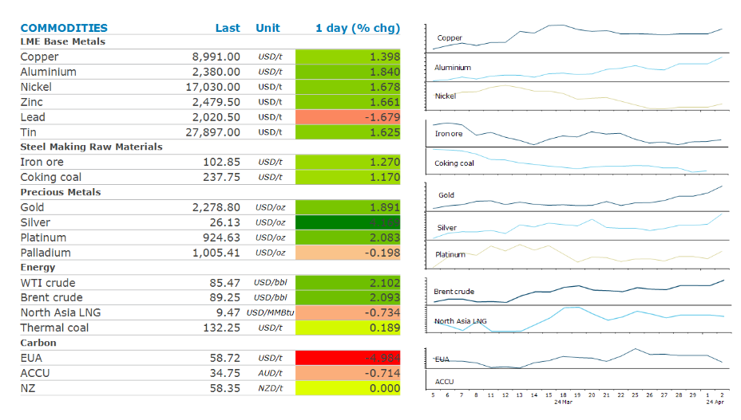
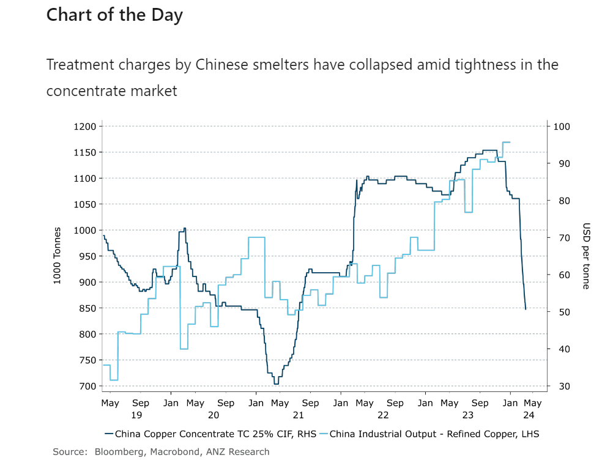

# Strong economic data boosts sentiment

**Date:** April 03, 2024  
**Publisher:** Breakwave Advisors | **Category:** Market Insights  
**Original URL:** [https://www.breakwaveadvisors.com/insights/2024/4/3/strong-economic-data-boosts-sentiment](https://www.breakwaveadvisors.com/insights/2024/4/3/strong-economic-data-boosts-sentiment)  

---

Optimism about stronger demand from China boosted sentiment across the complex. This was aided by supply side issues, predominately centred around geopolitical risks.

*By*[*Daniel Hynes*](https://www.linkedin.com/in/dahynes/)

> **Figure 1: Imgστιγμιότυπο Οθόνης 2024 04 03 125241**  
> [Local Asset](file:///C:/Users/Dell/Github/Shipping/corpus/03-breakwave/insights/2024/assets/2024-04-03_strong-economic-data-boosts-sentiment_img_imgcea3cf84ceb9ceb3cebcceb9cf8ccf84c_deb1bbe9b89b.png)

### Market Commentary

**Crude oil**prices rallied amid heightened geopolitical risks and[**signs of strong demand**](../pdfs/2024-04-03_strong-economic-data-boosts-sentiment_commodity-tracker-demand-improving_dd8f96d608ef.pdf). Iran vowed revenge on Israel for an airstrike on its embassy in Syria which killed a top commander. Hezbollah, the Lebanese militia backed by Iran, that’s launched rocket attacks on northern Israel also vowed that the strike will not go without punishment. Little sign of escalation in the Israel-Hamas war has kept the risk of supply disruptions low. However, the market is becoming increasingly concerned[the risks have risen sharply](../pdfs/2024-04-03_strong-economic-data-boosts-sentiment_commodities-in-ten-charts-supply-cur_9a0e28388a76.pdf). The geopolitical backdrop isn’t expected to prompt OPEC to change its supply policy when it meets later today. Sentiment was also bolstered by stronger than expected economic data in China. The Caixin manufacturing purchasing managers index rose to 51.1 for March, which indicates expansion for a fifth month. This should bode well for crude oil demand from the world’s biggest oil importer.

**Global gas**prices were also higher in early trading. However, prices quickly reversed as signs of slowing demand emerged. Europe’s natural gas storage withdrawal has largely eased, as attention shifts to the summer refill campaign. And with storage sites nearly 59% full, the task is significantly easier than in previous years. Nevertheless, they will have to compete with rising demand for LNG from Asia. Buyers in the**North Asian LNG**market are active, particularly in emerging markets. Still, prices at USD9/mmBtu are a little too high to spur more purchase.

**Copper**rallied above USD9,000/t as the strong economic data from China raised hope of a pick-up in demand. The strong Caixin PMI came after the release of the official index over the weekend also showed expansion in the manufacturing sector. This was aided by an unexpected rise in US factory activity. The ISM’s manufacturing gauge rose to 50.3 last month, indicating expansion for the first time since 2022. Any rise in demand would be met with a more constrained supply side. The copper concentrate market has tightened up significantly following some cutbacks to output from copper mines. This has led Chinese smelters, which produce over half the world’s refined copper, to consider output cuts after treatment charges fell close to zero. Reports suggest BHP recently sold a cargo of copper concentrate at treatment and refining charges of USD3/t and USc0.3/lb respectively to at least one Chinese smelter.

The strong economic data failed to halt**gold’s**rally. The prospect of interest rate remaining higher for longer were overshadowed by strong safe haven buying amid rising geopolitical risks. Gold was trading at a record high of USD2,278/oz near the end of the session.

> **Figure 2: Img Chart Στιγμιότυπο Οθόνης 2024 04 03 125440**  
> **Interactive Data & Source:** [Linkedin](https://www.linkedin.com/newsletters/commodities-wrap-6692196755876012032/?fbclid=IwAR3kiXJqZdxmp9ZcRwBNI7FsBySI-XSC0pfPur1qzjt7OZp7PTE59Tsl1QI) | [Local Asset](file:///C:/Users/Dell/Github/Shipping/corpus/03-breakwave/insights/2024/assets/2024-04-03_strong-economic-data-boosts-sentiment_img_imgchartcea3cf84ceb9ceb3cebcceb9cf8c_83e8c28bbb64.png)

Data source:[Commodities Wrap](https://www.linkedin.com/newsletters/commodities-wrap-6692196755876012032/?fbclid=IwAR3kiXJqZdxmp9ZcRwBNI7FsBySI-XSC0pfPur1qzjt7OZp7PTE59Tsl1QI)

---

**Tags:** Commodities, Crude Oil, Ironore  
