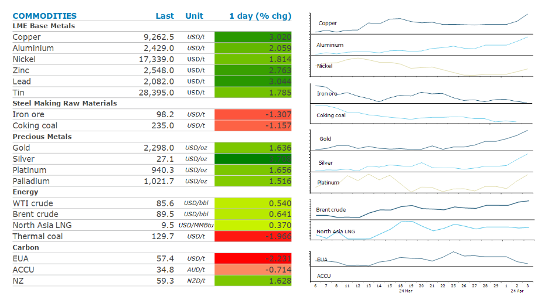
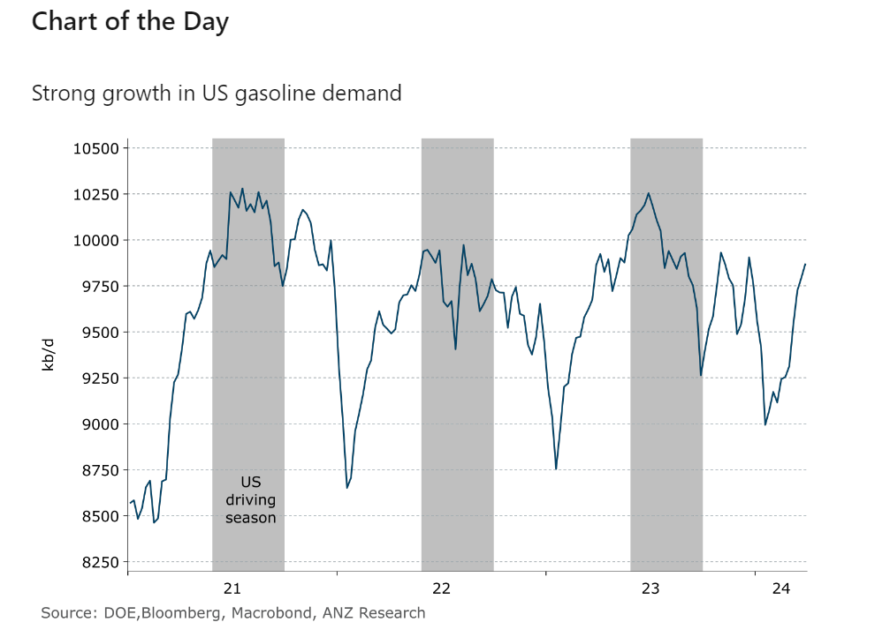

# Oil gains after OPEC reaffirms supply cutbacks

**Date:** April 04, 2024  
**Publisher:** Breakwave Advisors | **Category:** Market Insights  
**Original URL:** [https://www.breakwaveadvisors.com/insights/2024/4/4/kxhwgjmaycih1oomm4vopwjc297qak](https://www.breakwaveadvisors.com/insights/2024/4/4/kxhwgjmaycih1oomm4vopwjc297qak)  

---

Markets remained buoyed by signs of stronger economic growth. Supply side issues were also supportive. This saw drawdowns from inventories across metals and energy.

*By*[*Daniel Hynes*](https://www.linkedin.com/in/dahynes/)

> **Figure 1: Στιγμιότυπο Οθόνης 2024 04 04 102337**  
> **Interactive Data & Source:** [Aus01 Safelinks Protection Outlook](https://aus01.safelinks.protection.outlook.com/?url=https%3A%2F%2Fsubstack.com%2Fapp-link%2Fpost%3Fpublication_id%3D1791807%26post_id%3D143231562%26utm_source%3Dpodcast-email%26play_audio%3Dtrue%26r%3D271n4a%26utm_campaign%3Demail-play-on-substack%26token%3DeyJ1c2VyX2lkIjoxMzI3NjYyODIsInBvc3RfaWQiOjE0MzIzMTU2MiwiaWF0IjoxNzEyMTcwOTI4LCJleHAiOjE3MTQ3NjI5MjgsImlzcyI6InB1Yi0xNzkxODA3Iiwic3ViIjoicG9zdC1yZWFjdGlvbiJ9.xNWfZ1CJk-5whYWIU_ENn_3fEpkNJx9y5qc7XVrbTxk%26utm_source%3Dsubstack%26utm_medium%3Demail%23play&data=05%7C02%7Cdaniel.hynes%40anz.com%7Cd568bd8793e845ec498a08dc54201b64%7C1f4f7eda6e51425ea0f94c2fcef58a52%7C0%7C0%7C638477744083418024%7CUnknown%7CTWFpbGZsb3d8eyJWIjoiMC4wLjAwMDAiLCJQIjoiV2luMzIiLCJBTiI6Ik1haWwiLCJXVCI6Mn0%3D%7C0%7C%7C%7C&sdata=l2egQYsSUO4cBw35JUETkQ9P5tfvEpk9AFjkhsXw6p0%3D&reserved=0) | [Local Asset](file:///C:/Users/Dell/Github/Shipping/corpus/03-breakwave/insights/2024/assets/2024-04-04_kxhwgjmaycih1oomm4vopwjc297qak_img_cea3cf84ceb9ceb3cebcceb9cf8ccf84cf85_92cea570b3e4.png)

**Crude oil**extended this week’s gains after OPEC affirmed its current supply policy. The Joint Ministerial Monitoring Committee recommended no changes to the 2mb/d cut to output which has been in place since the start of the year. The current agreement is scheduled to continue until the end of June 2024. While this was widely expected, it provides some assurance that the recent rise in tension in the Middle East has not altered the group’s view on the market. Sentiment was also buoyed by signs of stronger demand. In the US, the Energy Information Administration’s weekly report showed nationwide stockpiles of gasoline fell 4256kbbl last week. Distillate fuel oil inventories were also lower (-1268kbbl). Overall, commercial crude oil inventories gained 3,210kbbl, in contrast to an industry group report earlier in the week showing a decline. The market remains on edge as tension in the Middle East flared following an airstrike on the Iranian embassy in Syria. Iran and local militia groups have vowed revenge.

**European gas**prices fell for a third day amid weak demand and high inventories. The industrial sector remains weak, with demand down as much as 20%. Compounding this is warmer than normal weather, which has curbed heating demand. High storage levels have relieved traders of any sense of urgency. The**North Asian LNG**market made a small gain, as price-sensitive buyers were active. Shipments to Asia rose to about 24mt in March, up 12% y/y (the highest ever for the month) according to ship tracking data from Kpler. However, while prices have come off sharply since Russia’s invasion of Ukraine, they remain 30% higher than the 2015–20 average. This may not be low enough to sustain strong buying.

**Copper**hit its highest level since January 2023 as strong demand and supply tightness buoyed sentiment. The rally was supported by economic data showing a slowdown in the US services sector, which reinforced hopes the Federal Reserve may cut rates soon. The outlook for demand in China continues to improve. China made it easier for households to borrow to buy cars by allowing banks to set their own loan ratios. This comes after data showed auto sales rose 7% y/y in March, according to the PCA. Earlier this week, data showed growth has remerged in the manufacturing sector. The Caixin PMI and the official measure both moved into expansionary territory.

**Gold**rose to another record after Chair Jerome Powell stated it will be appropriate for the Fed to begin lower interest rates some time this year. In today’s[**5in5 podcast**](https://aus01.safelinks.protection.outlook.com/?url=https%3A%2F%2Fsubstack.com%2Fapp-link%2Fpost%3Fpublication_id%3D1791807%26post_id%3D143231562%26utm_source%3Dpodcast-email%26play_audio%3Dtrue%26r%3D271n4a%26utm_campaign%3Demail-play-on-substack%26token%3DeyJ1c2VyX2lkIjoxMzI3NjYyODIsInBvc3RfaWQiOjE0MzIzMTU2MiwiaWF0IjoxNzEyMTcwOTI4LCJleHAiOjE3MTQ3NjI5MjgsImlzcyI6InB1Yi0xNzkxODA3Iiwic3ViIjoicG9zdC1yZWFjdGlvbiJ9.xNWfZ1CJk-5whYWIU_ENn_3fEpkNJx9y5qc7XVrbTxk%26utm_source%3Dsubstack%26utm_medium%3Demail%23play&data=05%7C02%7Cdaniel.hynes%40anz.com%7Cd568bd8793e845ec498a08dc54201b64%7C1f4f7eda6e51425ea0f94c2fcef58a52%7C0%7C0%7C638477744083418024%7CUnknown%7CTWFpbGZsb3d8eyJWIjoiMC4wLjAwMDAiLCJQIjoiV2luMzIiLCJBTiI6Ik1haWwiLCJXVCI6Mn0%3D%7C0%7C%7C%7C&sdata=l2egQYsSUO4cBw35JUETkQ9P5tfvEpk9AFjkhsXw6p0%3D&reserved=0), Bernard Hickey discusses what’s been behind the recent rally with Daniel Hynes.

> **Figure 2: Στιγμιότυπο Οθόνης 2024 04 04 102416**  
> **Interactive Data & Source:** [Linkedin](https://www.linkedin.com/newsletters/commodities-wrap-6692196755876012032/?fbclid=IwAR3kiXJqZdxmp9ZcRwBNI7FsBySI-XSC0pfPur1qzjt7OZp7PTE59Tsl1QI) | [Local Asset](file:///C:/Users/Dell/Github/Shipping/corpus/03-breakwave/insights/2024/assets/2024-04-04_kxhwgjmaycih1oomm4vopwjc297qak_img_cea3cf84ceb9ceb3cebcceb9cf8ccf84cf85_334c5ebfe1a4.png)

Data source:[Commodities Wrap](https://www.linkedin.com/newsletters/commodities-wrap-6692196755876012032/?fbclid=IwAR3kiXJqZdxmp9ZcRwBNI7FsBySI-XSC0pfPur1qzjt7OZp7PTE59Tsl1QI)

---

**Tags:** Commodities, Crude Oil, Ironore  
