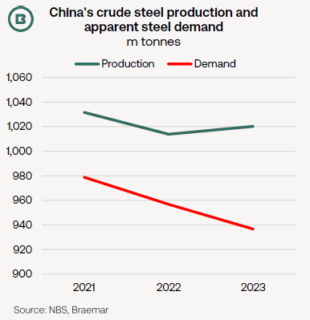
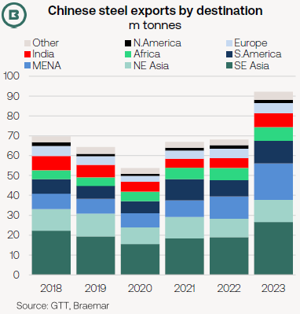
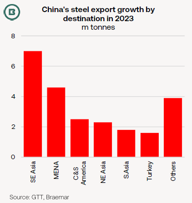
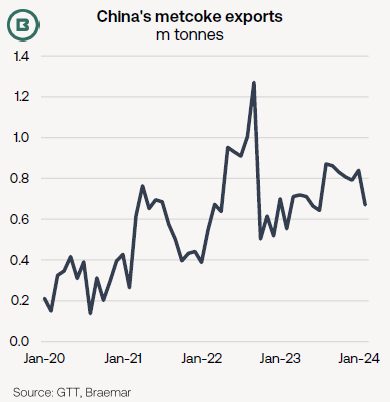

# The Big Picture: China’s steel sector and export outlook

**Date:** April 05, 2024  
**Publisher:** Breakwave Advisors | **Category:** Market Insights  
**Original URL:** [https://www.breakwaveadvisors.com/insights/2024/4/5/the-big-picture-chinas-steel-sector-and-export-outlook](https://www.breakwaveadvisors.com/insights/2024/4/5/the-big-picture-chinas-steel-sector-and-export-outlook)  

---

- *Though overshadowed by enormous imports of iron ore and coking coal, China exported around 100m tonnes of steel-related dry bulk cargo last year.*
- *China’s authorities have indicated this year’s steel production will be “managed”, and price-competitive exports from China can repeat last year’s extraordinary performance.*
- *Another dry bulk export cargo from China is metcoke, and the shift in destinations reflect global changes in blast furnace locations.*

Although no explicit production targets for Chinese steel mills in 2024 have been publicised as yet, a statement from the highly influential National Development and Reform Commission on 3 April advised**output would be “managed” this year**—signalling potential constraints on growth.

Thanks in part to December’s monthly dive of 11%, as reported by the National Bureau of Statistics, annual output was broadly flat in 2023.

> **Figure 1: Market Chart 1**  
> [Local Asset](file:///C:/Users/Dell/Github/Shipping/corpus/03-breakwave/insights/2024/assets/2024-04-05_the-big-picture-chinas-steel-sector-and-export-outlook_img_image1_26494b16b772.png)

However, after allowing for net export growth, last year’s apparent steel demand slid by -2.1%, a figure more reflective of the domestic demand picture.

Official data for the**first two months of 2024**show**China’s crude steel production up 1.6% YoY and exports up 3.1%**.

This has led to comments within the steel industry that**China has been “exporting its downturn”**.

The result is displayed in the chart below, a jump in steel product exports to 91m tonnes, supported by substantial growth into**key export markets of South East Asia and the Middle East/North Africa**.

> **Figure 2: Market Chart 2**  
> [Local Asset](file:///C:/Users/Dell/Github/Shipping/corpus/03-breakwave/insights/2024/assets/2024-04-05_the-big-picture-chinas-steel-sector-and-export-outlook_img_image0_41320d647f21.png)

This was achieved, in some respects,**at the expense of other steel producers**.

Exported steel from**India**, for example, suffered an overall YoY decline of 1.1m tonnes in 2023, losing out to Chinese suppliers in South East Asia.

Indeed, last year’s increase from China was particularly eye-catching given the mixture elsewhere of meagre/flat growth or contraction.

Using customs data as a basis, a steep drop in steel exports was apparent from Russia (owing to the impact from sanctions) and**Turkey**(where domestic demand has leapt owing to post-earthquake reconstruction), alongside milder declines from**Brazil**and.

> **Figure 3: Taiwan**  
> [Local Asset](file:///C:/Users/Dell/Github/Shipping/corpus/03-breakwave/insights/2024/assets/2024-04-05_the-big-picture-chinas-steel-sector-and-export-outlook_img_image2_a2650a2f5f8b.png)

The chart above shows last year’s annual growth in steel exports by destination. South East Asia and MENA countries predominate, but gains were in evidence to a wide range of countries.

Although colossal, China’s steel export total in 2023 was not an annual record, but it was a**seven-year high**. Previous export peaks in 2015 and 2016 (of 112m tonnes and 109m tonnes, respectively) came against a background of diminishing steel demand and the creation of an exportable surplus.

Braemar anticipates that**price-competitive exports from China can repeat last year’s extraordinary performance**.

### Metcoke Exports From China

While 2023 exports in annual terms were flat YoY, last year was notable for reflecting new growth markets for metcoke imports.

Three Asian countries, accounting for 3.0m tonnes, recorded annual all-time highs for metcoke from China: (1) Indonesia, which overtook India last year to become China’s largest customer, with 2.4m tonnes, (2) Oman and (3) the Philippines.

India remains a leading destination for Chinese metcoke with 1.3m tonnes, but sources from a range of countries, including Poland.

> **Figure 4: Market Chart 4**  
> [Local Asset](file:///C:/Users/Dell/Github/Shipping/corpus/03-breakwave/insights/2024/assets/2024-04-05_the-big-picture-chinas-steel-sector-and-export-outlook_img_image3_efa9a4360e97.png)

---

**Tags:** Drybulk, China, Coal  
