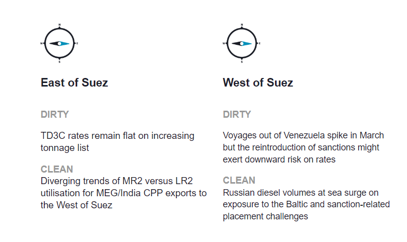
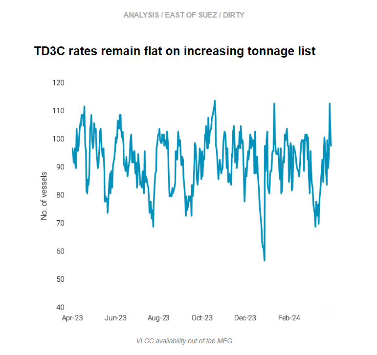
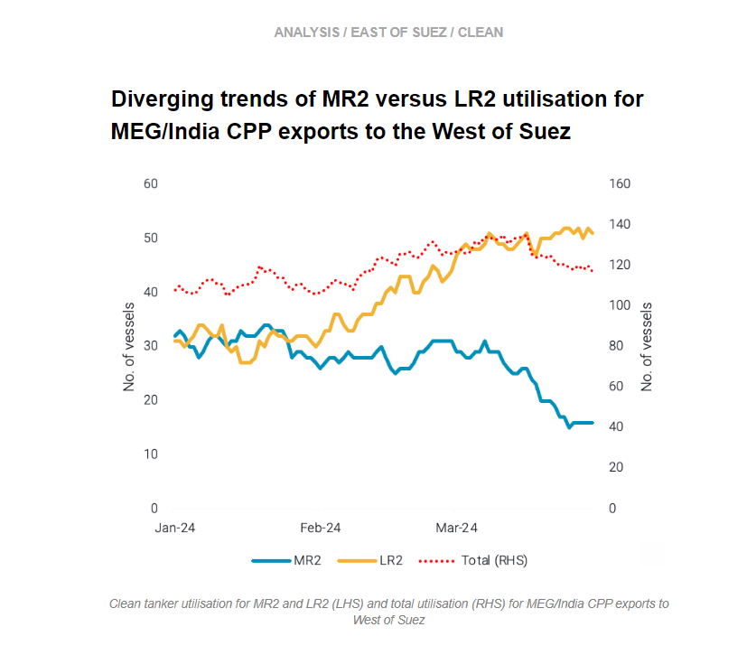
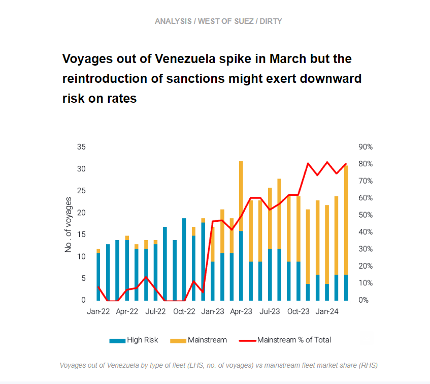
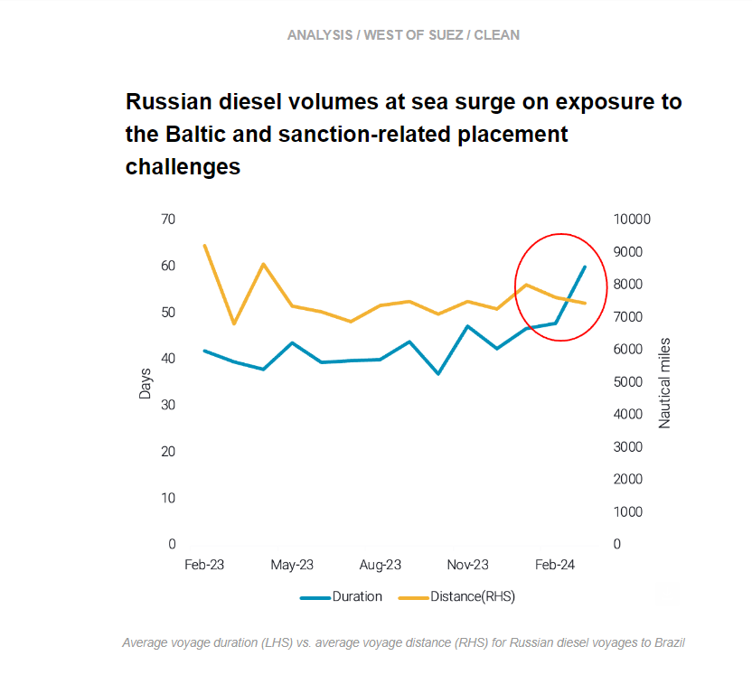

# MEG-to-East Asia VLCC voyages displayed a rebound in March

**Date:** April 05, 2024  
**Publisher:** Breakwave Advisors | **Category:** Market Insights  
**Original URL:** [https://www.breakwaveadvisors.com/insights/2024/4/5/v3sg748q9111vsjah6q53tu01gypjw](https://www.breakwaveadvisors.com/insights/2024/4/5/v3sg748q9111vsjah6q53tu01gypjw)  

---

This week, in the East, we discuss the reasons behind the muted activity on TD3C and divergent MR and LR2 behaviour on the East/West routes. Over in the West, we focus on the role that a prospective sanctioning of Venezuela could play in the freight market, and we examine the drivers behind the recent surge of Russia diesel at sea.

*By*[*Ioannis Papadimitriou*](https://www.linkedin.com/in/ipapadimitriou/)

> **Figure 1: Στιγμιότυπο Οθόνης 2024 04 05 094908**  
> **Interactive Data & Source:** [Marketingmail Vortexa](https://marketingmail.vortexa.com/ODM3LU1aRS01NzgAAAGSSAGJAV7QMK39sLgO3u1kcE0LcgYw-IVHYLfEmk8muNLFr0tDMMbt4AP-wiPzA54s9xDKdP8=) | [Local Asset](file:///C:/Users/Dell/Github/Shipping/corpus/03-breakwave/insights/2024/assets/2024-04-05_v3sg748q9111vsjah6q53tu01gypjw_img_cea3cf84ceb9ceb3cebcceb9cf8ccf84cf85_7aed1d297631.png)

> **Figure 2: 1**  
> **Interactive Data & Source:** [Marketingmail Vortexa](https://marketingmail.vortexa.com/ODM3LU1aRS01NzgAAAGSSAGJAV7QMK39sLgO3u1kcE0LcgYw-IVHYLfEmk8muNLFr0tDMMbt4AP-wiPzA54s9xDKdP8=) | [Local Asset](file:///C:/Users/Dell/Github/Shipping/corpus/03-breakwave/insights/2024/assets/2024-04-05_v3sg748q9111vsjah6q53tu01gypjw_img_1_0ef2bf6038c2.png)

- MEG-to-East Asia[VLCC voyages](https://marketingmail.vortexa.com/ODM3LU1aRS01NzgAAAGSSAGJAV7QMK39sLgO3u1kcE0LcgYw-IVHYLfEmk8muNLFr0tDMMbt4AP-wiPzA54s9xDKdP8=)displayed a rebound in March, indicating a bounce back of enquiries from the East although loadings still remain below 2023 averages.

- [TD3C freight rates](https://marketingmail.vortexa.com/ODM3LU1aRS01NzgAAAGSSAGJA4BcDRGTcr5_7d0xet3vOaNcM9pxnh_56khpnQ-MyL-tySEJaRx_qegpWo2cHBgSACY=)remain flat on a w-o-w basis, partly due to the Easter break lull and a lower number of enquiries for April loading dates which has brought an increase in the[available tonnage](https://marketingmail.vortexa.com/ODM3LU1aRS01NzgAAAGSSAGJAgvQ4EnzICjagZIf7qtZtyAIn2hr6w7IQD6NCq4Cd-WU0zSsFBRE5i635fl4lDKCSkw=); currently at the highest levels for the year.
- After the recent sanctioning activity which brought payment delays and diversion of Russian-origin cargoes, Indian refiners have reportedly turned increasingly to spot cargoes. This could create an additional pocket of demand for VLCCs on the MEG-to-India route, supporting rates out of the Middle East. However for now, our analysis reveals that most of India’s imports of Russian crude are not on these tankers (read more[here](https://marketingmail.vortexa.com/ODM3LU1aRS01NzgAAAGSSAGJAlD83NCDP7Jb3acrtwY3tqrxyB_n0oYJTwfUOnmSETh7XLPPMUXL8rXZ3Kk2tRgHcJ8=)).

> **Figure 3: 3**  
> **Interactive Data & Source:** [Marketingmail Vortexa](https://marketingmail.vortexa.com/ODM3LU1aRS01NzgAAAGSSAGJAaGHMOUO-BQ9dAOe8i8URgLMZshmExQQF4w_dYoYf5HaGmtUQukVjO4iyzHIXndH7Bo=) | [Local Asset](file:///C:/Users/Dell/Github/Shipping/corpus/03-breakwave/insights/2024/assets/2024-04-05_v3sg748q9111vsjah6q53tu01gypjw_img_3_81ffbcedd52b.png)

- LR2[utilisation](https://marketingmail.vortexa.com/ODM3LU1aRS01NzgAAAGSSAGJAaGHMOUO-BQ9dAOe8i8URgLMZshmExQQF4w_dYoYf5HaGmtUQukVjO4iyzHIXndH7Bo=)for MEG/India CPP exports to the West of Suez have climbed to multi-year highs in March.

- This is due to higher diesel/gasoil and naphtha exports to Europe, with combined CPP exports reaching the highest level since last September. Additionally, diversion of vessels through the Cape of Good Hope amid the Red Sea attacks boosted voyage distances.
- Conversely,[MR2 utilisation](https://marketingmail.vortexa.com/ODM3LU1aRS01NzgAAAGSSAGJAtpXRv-QwHP-B2Lv744KsVqF9BbVLPcl644rmJ0QeSxsOdsGPijQXn98VC63EwLOyuQ=)from MEG/India to the West of Suez has sunk to multi-year lows as of end March, weighing on[overall tanker utilisation](https://marketingmail.vortexa.com/ODM3LU1aRS01NzgAAAGSSAGJAhZ2GSXpBZkGz9tPdzGFkiG_xcbCRU1PjrnkVo_jsq-nit1hqSABzo9bSwRygU0SI5I=)on this route. As a result, MR2 vessels may pivot to more lucrative routes especially in the Asia Pacific region where utilisation[remains high](https://marketingmail.vortexa.com/ODM3LU1aRS01NzgAAAGSSAGJAhZ2GSXpBZkGz9tPdzGFkiG_xcbCRU1PjrnkVo_jsq-nit1hqSABzo9bSwRygU0SI5I=).

> **Figure 4: 4**  
> **Interactive Data & Source:** [Marketingmail Vortexa](https://marketingmail.vortexa.com/ODM3LU1aRS01NzgAAAGSSAGJAn3OD87fIvAYauQrSNsGx4DITynRbmgI_fgS7fiBICi9iUsrxQr__8EqJpJndUDoFVg=) | [Local Asset](file:///C:/Users/Dell/Github/Shipping/corpus/03-breakwave/insights/2024/assets/2024-04-05_v3sg748q9111vsjah6q53tu01gypjw_img_4_392aeba22edd.png)

- [Crude tanker voyages out of Venezuela increased by 30% m-o-m](https://marketingmail.vortexa.com/ODM3LU1aRS01NzgAAAGSSAGJAn3OD87fIvAYauQrSNsGx4DITynRbmgI_fgS7fiBICi9iUsrxQr__8EqJpJndUDoFVg=), reaching an 11-month high, with fears of the re-imposition of sanctions post 18th April looming. As the chart below shows, the share of the non-high risk vessels (i.e “mainstream” fleet) operating in the trade has increased from 5% to 80% at the end of 2022.

- The increase of the mainstream fleet employment has predominantly[materialised on Aframaxes](https://marketingmail.vortexa.com/ODM3LU1aRS01NzgAAAGSSAGJAfxhmfQpw_oKi0PxbprjchffZJGhuZ-QiE6N9Rnt0d_ZdUVELkNbChBUxQXZA1iy5nQ=)which are headed towards the US or performing STS operations offshore Venezuela for cargoes headed towards India.
- The prospective US sanctions on Venezuela will likely be a regulator on how logistics in Russia will also unfold. A re-application of sanctions from the US to Venezuela would mean that the high-risk fleet would once again raise their share in the Merey trade, predominantly on VLCCs. This, however, could pave the way for mainstream operators to increase their exposure to Russian trade, should the sanctioning activity of entities led by the US and the West continue to take place.

> **Figure 5: 5**  
> **Interactive Data & Source:** [Marketingmail Vortexa](https://marketingmail.vortexa.com/ODM3LU1aRS01NzgAAAGSSAGJAgKWh9oQaDgHTJOkZYojQ8fd8YIgmWzUhO-sBZ4OB9k0u172XZe2-tgrFbcHEVFr13o=) | [Local Asset](file:///C:/Users/Dell/Github/Shipping/corpus/03-breakwave/insights/2024/assets/2024-04-05_v3sg748q9111vsjah6q53tu01gypjw_img_5_7933e8a0de3e.png)

- [Russian CPP volumes at sea](https://marketingmail.vortexa.com/ODM3LU1aRS01NzgAAAGSSAGJAgKWh9oQaDgHTJOkZYojQ8fd8YIgmWzUhO-sBZ4OB9k0u172XZe2-tgrFbcHEVFr13o=)have seen a surge recently, mostly propelled by diesel/gasoil volumes, with a couple of factors likely at play.

- Looking at Turkey, which is a key buyer of Russian diesel, we observe a higher exposure[to Baltic instead of Black sea cargoes](https://marketingmail.vortexa.com/ODM3LU1aRS01NzgAAAGSSAGJAgKWh9oQaDgHTJOkZYojQ8fd8YIgmWzUhO-sBZ4OB9k0u172XZe2-tgrFbcHEVFr13o=)since February, which naturally has boosted the[average voyage mileage](https://marketingmail.vortexa.com/ODM3LU1aRS01NzgAAAGSSAGJAbLZjm461W9sq5aGb696A5st4IaSLw7GckhTBHZyNifvgP2uFDjIhijB4cdpEbXoteY=)and in turn the higher diesel volumes at sea.
- On the other hand, in Brazil, there are currently more than[15 vessels offshore Brazil](https://marketingmail.vortexa.com/ODM3LU1aRS01NzgAAAGSSAGJAlKRjqSQBcbgXsmXeJB2qwiiPtUshMMMTJTwkzsSUYRq7lqikFpQAXtpq4MDVC2__FA=)carrying diesel. Looking at our[voyages dynamics screen](https://marketingmail.vortexa.com/ODM3LU1aRS01NzgAAAGSSAGJAzYnxTAkmLs2f1jntL3ilUsd5ByI8LKOj9kmLkp3RI27olQNR_amYjH5F9_6TKuG11k=)for March arrivals, the average voyage mileage for Russian diesel towards Brazil remains relatively flat, whilst the average voyage duration has spiked, which could indicate that Russia is struggling to administer all logistics amidst increased scrutiny due to sanctions.

Data Source:[Vortexa](https://www.vortexa.com//oil-gas-data-traders-analysts-data-scientists?gclid=Cj0KCQjw8_qRBhCXARIsAE2AtRZKOvMnbilZ_6_91d7huSFFy71pWLrnPwGwOHVzXsmsG-1a1mZnQw8aAt89EALw_wcB&hsa_acc=1782073842&hsa_ad=548425387665&hsa_cam=14746637662&hsa_grp=125038601902&hsa_kw=&hsa_mt=&hsa_net=adwords&hsa_src=g&hsa_tgt=dsa-1431852288425&hsa_ver=3&utm_campaign=%5BCD%5D%20-%20DSA%20-%20EMEA&utm_medium=cpc&utm_medium=ppc&utm_source=google&utm_source=adwords&utm_term=)

---

**Tags:** Tankers, Shipping, Crude Oil  
