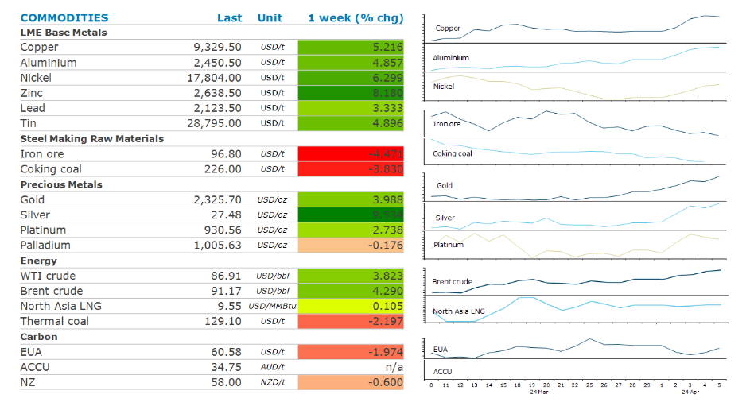
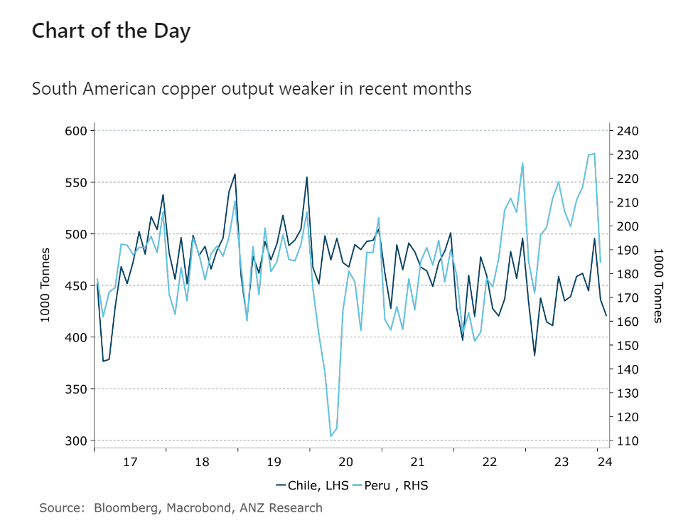

# Fundamental tightness pushed markets higher

**Date:** April 08, 2024  
**Publisher:** Breakwave Advisors | **Category:** Market Insights  
**Original URL:** [https://www.breakwaveadvisors.com/insights/2024/4/8/fundamental-tightness-pushed-markets-higher](https://www.breakwaveadvisors.com/insights/2024/4/8/fundamental-tightness-pushed-markets-higher)  

---

**Supply risks continued to dominate sentiment in commodity markets, aided by a weaker USD, which supported investor appetite.**

*By*[*Daniel Hynes*](https://www.linkedin.com/in/dahynes/)

> **Figure 1: Στιγμιότυπο Οθόνης 2024 04 08 104049**  
> [Local Asset](file:///C:/Users/Dell/Github/Shipping/corpus/03-breakwave/insights/2024/assets/2024-04-08_fundamental-tightness-pushed-markets-higher_img_cea3cf84ceb9ceb3cebcceb9cf8ccf84cf85_22fd4094ce87.png)

**Crude oil**held on recent gains as rising tensions in the Middle East raise concerns of supply disruptions. Israel scrambled navigational signals over Tel Aviv as the country prepares for a potential Iranian attack. This follows an airstrike on Iran’s embassy in Syria. Iran and Hezbollah both vowed retaliation. Geopolitical risks have been an ongoing issue for the oil market after a period of relative stability. The increased hostility has damped hopes that the war might remain contained. There have also been small, but not insignificant, disruptions in other parts of the oil market. This has not deterred OPEC, which reaffirmed production cuts last week. Clampdowns on adherence to quotas should see output fall in Q2. A broad improvement in the macro backdrop has also boosted sentiment. The prospect of a tighter market during the second quarter should[**support crude oil prices**](../pdfs/2024-04-08_fundamental-tightness-pushed-markets-higher_commodity-call-the-good-oil_01bdabd50b6e.pdf)in coming months.

**North Asian LNG**managed to hold above its six-week high on stronger demand from buyers. Demand was sustained due to colder-than-normal weather driving gas demand in northeast Asia. Indonesia said it may start importing LNG local supplies fell short in the face of strong demand. There was also increased interest following an earthquake in Taiwan that raised concerns about a disruption to nuclear power generation. However, the recent gains have seen some Chinese buyers wait for further price declines.

**Copper**prices ended the week up sharply as risks to supply emerged amid an improvement in global economy. Codelco Chair, Maximo Pacheco Matte, said the world’s biggest copper producer churned out almost 300kt in the first quarter. This suggests it’s yet to bounce back from the lowest levels in a quarter of a century. It officially produced 326kt in the same period last year. Meanwhile, Canada’s Ivanhoe Mines reported a 6.5% quarterly drop in output at its Kamoa-Kakula mine in the DRC. Drought conditions in neighbouring Zambia are also putting the country’s planned expansion of mined output at risk. This comes following cutbacks to Anglo’s copper mines in Chile and the closure of the Cobre Panama copper mine late last year.

**Iron ore**futures extended recent losses last week despite tentative signs of improvement in China’s economy. Instead, ongoing weakness from the property sector is weighing on sentiment. Huge levels of debt at the local government level are delaying a rebound in construction activity. This has seen Chinese mills, including Angang Steel and Maanshan, report worse than expected net losses in their 2023 reports.

**Gold**surged to another record high despite a strong US jobs report. Momentum in the market remains strong amid the prospect of rate cuts by the Fed later this year.

> **Figure 2: Στιγμιότυπο Οθόνης 2024 04 08 104127**  
> **Interactive Data & Source:** [Linkedin](https://www.linkedin.com/newsletters/commodities-wrap-6692196755876012032/?fbclid=IwAR3kiXJqZdxmp9ZcRwBNI7FsBySI-XSC0pfPur1qzjt7OZp7PTE59Tsl1QI) | [Local Asset](file:///C:/Users/Dell/Github/Shipping/corpus/03-breakwave/insights/2024/assets/2024-04-08_fundamental-tightness-pushed-markets-higher_img_cea3cf84ceb9ceb3cebcceb9cf8ccf84cf85_a48a29e6c93c.png)

Data source:[Commodities Wrap](https://www.linkedin.com/newsletters/commodities-wrap-6692196755876012032/?fbclid=IwAR3kiXJqZdxmp9ZcRwBNI7FsBySI-XSC0pfPur1qzjt7OZp7PTE59Tsl1QI)

---

**Tags:** Commodities, Crude Oil, Ironore  
