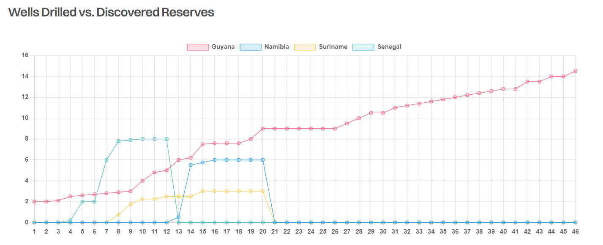

# New Frontier

**Date:** April 08, 2024  
**Publisher:** Breakwave Advisors | **Category:** Market Insights  
**Original URL:** [https://www.breakwaveadvisors.com/insights/2024/4/8/new-frontier](https://www.breakwaveadvisors.com/insights/2024/4/8/new-frontier)  

---

> **Figure 1: Στιγμιότυπο Οθόνης 2024 04 08 121244**  
> **Interactive Data & Source:** [Gibsons Co](https://www.gibsons.co.uk/market-reports) | [Local Asset](file:///C:/Users/Dell/Github/Shipping/corpus/03-breakwave/insights/2024/assets/2024-04-08_new-frontier_img_cea3cf84ceb9ceb3cebcceb9cf8ccf84cf85_584dd3a04cbc.png)

Much of the focus over the past few years has been on the impressive ramp up of oil production in Guyana where production is on track to rise to 800kbd next year from zero in 2019. Yet in the years ahead, new frontiers in the oil market could emerge and one such region with potential is Namibia.

The South West African country sits between oil rich Angola and oil poor South Africa, highlighting its hydrocarbon potential or lack of. The region was explored back in the 1970s and 1980s but declared unviable at the time. Although the Kudu gas field was discovered 50 years ago, it was never developed, but this could be about to change with production starting between 2026 and 2028, should FID be taken this year.

Up until 2022, most exploration activity resulted in dry wells; however, a breakthrough occurred in early 2022 with Shell and TotalEnergies finding oil in the Graff and Venus blocks. The latter could be the largest ever discovery in Sub-Saharan Africa and one of the top 10 finds this century. Exploration activity has continued since 2022; yet, Majors operating in the region have remained tight lipped on the outcome of their activities. Nonetheless, with TotalEnergies spending 50% of its exploration budget in the country last year and planning to spend 30% of its budget there this year, the region clearly has significant potential. In addition to TotalEnergies and Shell, Galp is drilling 2 exploration wells, whilst Chevron and Woodside have undertaken seismic surveys.

The development process is likely to be similar to Guyana, with FPSOs deployed to extract the oil and transfer it onto tankers for export. Consultancy WoodMackenzie estimates that production could exceed 500kbd within a decade and continue to grow thereafter with first production likely towards the end of this decade (2028 or 2029). The government is keen to see first oil as soon as feasibly possible and is said to have sought advice from Guyana on how to structure production sharing agreements. The region has also become increasingly attractive to major oil companies, who view the country as more politically and fiscally stable compared to its neighbours to the North.

For the tanker market, Namibia is unlikely to have an impact this decade. However, it provides a new frontier for the oil market which will require tankers to deliver oil to export markets. Whilst little is known about the specific properties of the grades, the demand for such crude is likely to be primarily in the East, with VLCCs and Suezmaxes the most likely beneficiaries.

> **Figure 2: Στιγμιότυπο Οθόνης 2024 04 08 120942**  
> **Interactive Data & Source:** [Gibsons Co](https://www.gibsons.co.uk/market-reports) | [Local Asset](file:///C:/Users/Dell/Github/Shipping/corpus/03-breakwave/insights/2024/assets/2024-04-08_new-frontier_img_cea3cf84ceb9ceb3cebcceb9cf8ccf84cf85_3b76591ab089.png)

Data source:[Gibson Shipbrokers](https://www.gibsons.co.uk/market-reports)

---

**Tags:** Tankers, Shipping  
