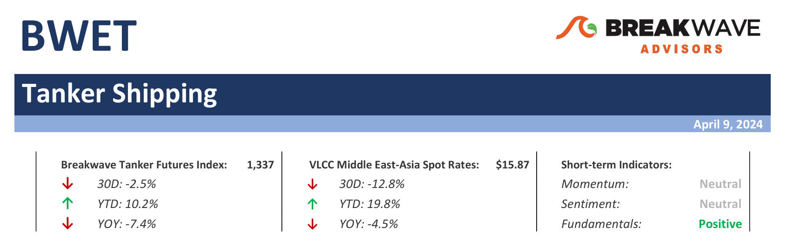
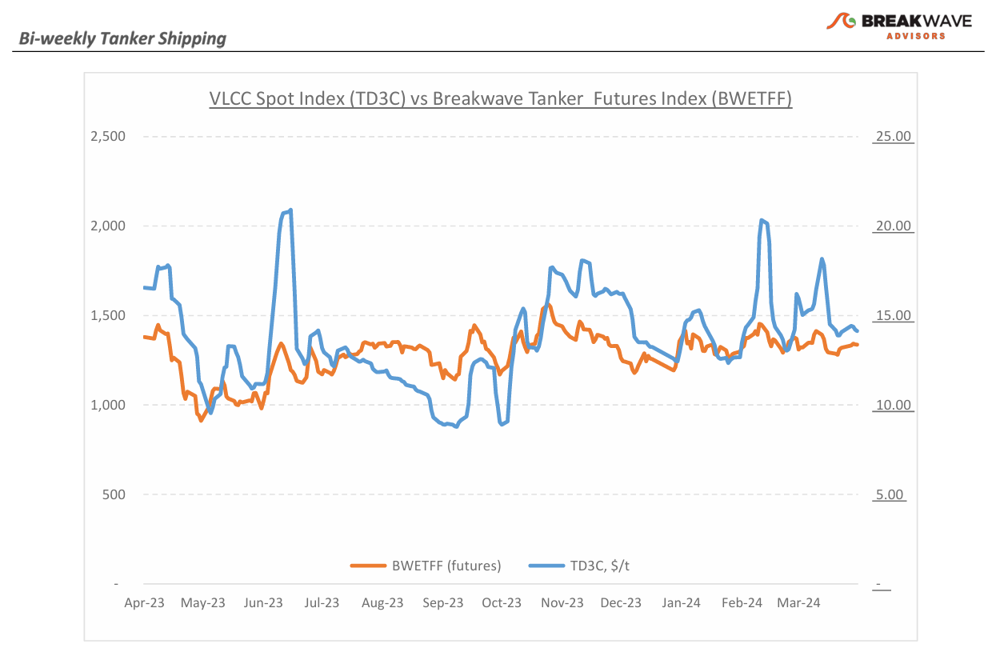
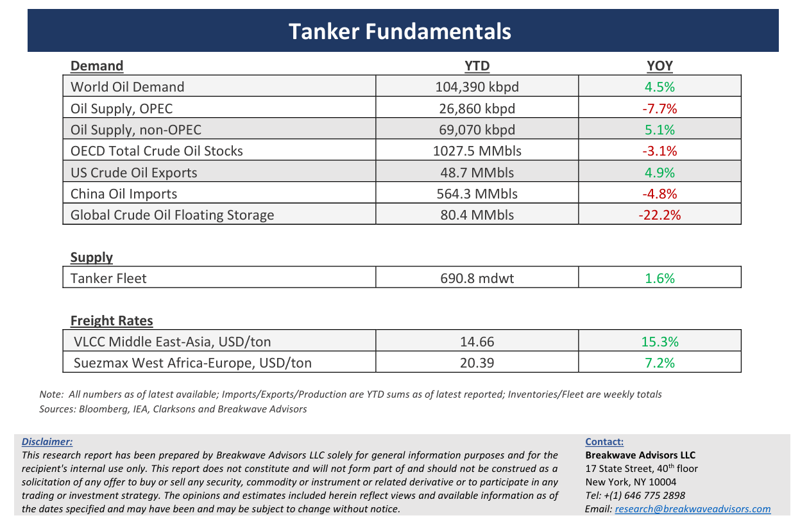

# Breakwave Bi-Weekly Tanker Report - April 9, 2024

**Date:** April 09, 2024  
**Publisher:** Breakwave Advisors | **Category:** Market Insights  
**Original URL:** [https://www.breakwaveadvisors.com/insights/202449wet](https://www.breakwaveadvisors.com/insights/202449wet)  

---

> **Figure 1: Tankerreporttop**  
> [Local Asset](file:///C:/Users/Dell/Github/Shipping/corpus/03-breakwave/insights/2024/assets/2024-04-09_202449wet_img_tankerreporttop_ae4ed56d817a.png)

**· VLCC Market Slows Down Post-Chinese Holidays but Owners Remain Resilient Amid Softening Rates, Rising Oil Prices****–**The VLCC market has become rather inactive following the conclusion of the Chinese holidays. Recent spot fixture activity suggests a**softening momentum**in market prices across the Atlantic and Pacific regions, although**owners remain optimistic**about a potential resurgence in activity soon. Despite this, the first week of April saw relatively stable rate levels, with owners displaying resilience through off-market negotiations. Furthermore, the**possibility of further increases in oil**and bunker prices has**motivated owners to resist**significant drops in freight rates, leading to the current rather unexciting market. While the present vessel position list remains relatively balanced, prolonged inactivity could potentially lead to further declines in spot freight rates for oil tankers. In the West African region, the VLCC market continues to be subdued, with Charterers predominantly utilizing their own or chartered-in tonnage, stirring away from hiring third party tonnage, thus exerting some downward pressure on rates. Although with the approach of the Eid holidays in the Middle East there are potential scenarios of an even softer market sentiment, the**VLCC market's shrinking growth**in new vessel supply, coupled with**recovering oil demand**, raises expectations for a resilient momentum, potentially reversing the current downward pressure on spot rates.

**· Oil Prices Break Out as Geopolitical Risk Increases on Top of Improving Fundamentals –**Driven by a whirlwind of positive developments, the Brent crude prices experienced a remarkable surge, surpassing the significant threshold of $90 per barrel and reaching over $91 per barrel by the end of the first week of April. This surge marked a notable milestone in the trajectory of oil prices, reflecting a**buoyant market sentiment**influenced by several key factors. One of the primary drivers behind this upward momentum is the heightened anticipation surrounding**Iran’s potential response**to recent events involving Israel. As**geopolitical tensions simmer**, market participants are closely monitoring the situation for any potential disruptions to oil supply routes or increased geopolitical risk premiums. Moreover, there is the anticipation of**increasing crude oil imports**out of**Asia**, primarily fueled by the robust purchasing activities of key players such as**China**and**India**, particularly from Russia. Despite the current surge, concerns linger regarding the sustainability of these elevated import levels, especially given the rather subdued economic growth activity in China so far this year. Maintenance schedules and the**persistent ascent in oil prices pose significant challenges**, potentially hindering sustained momentum in import volumes moving forward.

**· Our Long-term View –**The tanker market is recovering from a long period of staggered rates as the growth in new vessel supply shrinks while oil demand is recovering in line with the global economy. A historically low orderbook combined with favorable demand fundamentals should continue to support increased spot rate volatility, which combined with the ongoing geopolitical turmoil, should support freight rates in the medium to long term.

> **Figure 2: Tankerreportchart**  
> [Local Asset](file:///C:/Users/Dell/Github/Shipping/corpus/03-breakwave/insights/2024/assets/2024-04-09_202449wet_img_tankerreportchart_76011c0fe152.png)

> **Figure 3: Tankerreportbottom**  
> [Local Asset](file:///C:/Users/Dell/Github/Shipping/corpus/03-breakwave/insights/2024/assets/2024-04-09_202449wet_img_tankerreportbottom_c65918c2372d.png)

### Subscribe:
