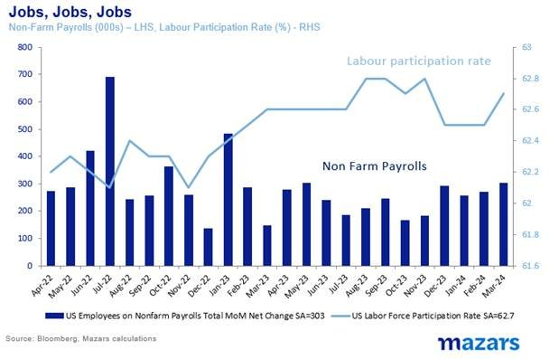
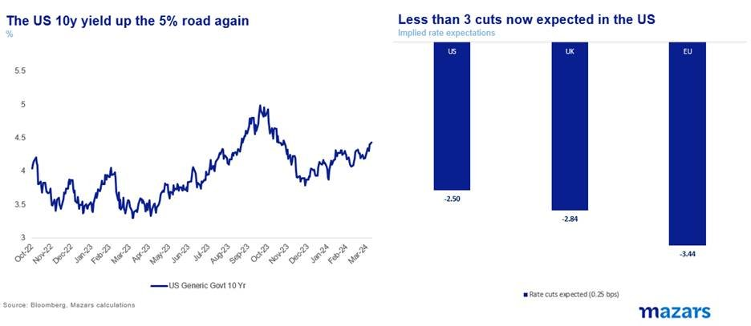
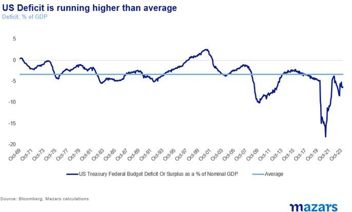
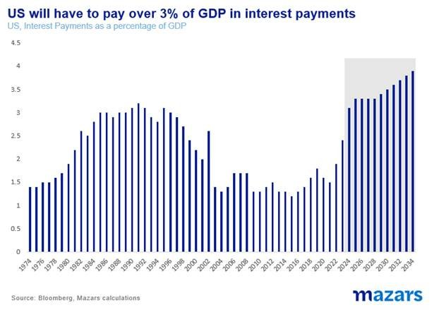
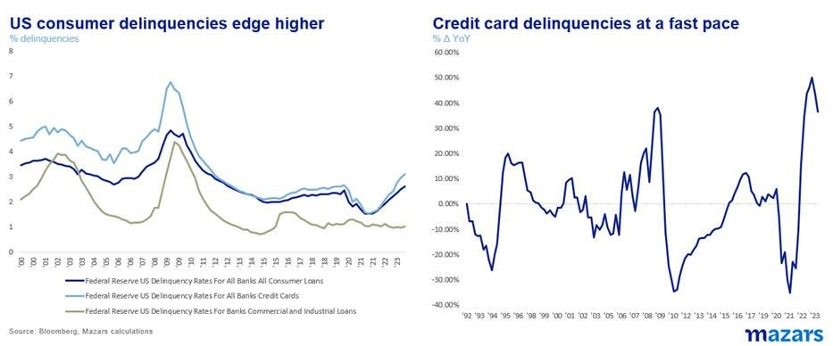
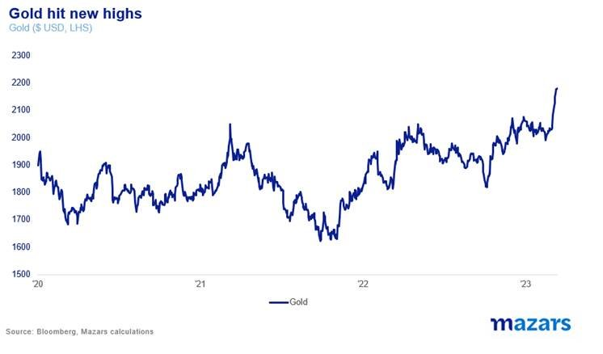
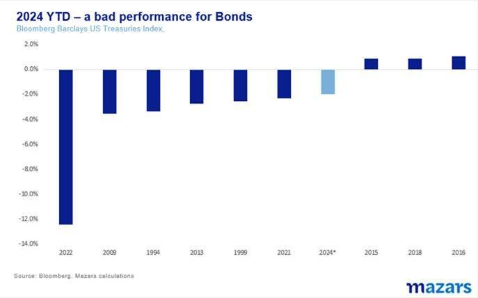

# The US government’s poison pill

**Date:** April 09, 2024  
**Publisher:** Breakwave Advisors | **Category:** Market Insights  
**Original URL:** [https://www.breakwaveadvisors.com/insights/2024/4/9/the-us-governments-poison-pill](https://www.breakwaveadvisors.com/insights/2024/4/9/the-us-governments-poison-pill)  

---

*The three things investors need to know this week:*

1. *It’s a strong US economy, producing strong jobs report, but pushing back rate cut expectations. For the first time in five months, bond markets are pricing in less than three rate cuts for 2024, starting in July.*
2. *Bond markets are now having a bad year again (although nothing close to 2022).*
3. *To keep growth up and go to the election with a good economy, the US government isn’t waiting for inflation to come down, and prefers increasing debt.*

*By*[*George Lagarias*](https://www.linkedin.com/in/george-lagarias-mba-3baa769/)

A “poison pill” is a corporate tactic where companies resisting a hostile takeover somehow dilute shareholder worth. A common tactic is to take on large debt to make the company unattractive and scare the corporate raiders away.

On a not-so-separate subject, the economic miracle that is the US ploughs on. Against all odds, forecasts, projections and even its peers, the American economy persists in growing at a pace which allows for a strong labour market and, unavoidably, stickier inflation.

The business world watches, enthralled, at another strong set of employment numbers.

> **Figure 1: Market Chart 1**  
> [Local Asset](file:///C:/Users/Dell/Github/Shipping/corpus/03-breakwave/insights/2024/assets/2024-04-09_the-us-governments-poison-pill_img_image008_4664039ab0b3.jpg)

As a result, the bond market tanked again (now -2.7% since the beginning of the year), and is pricing in less than three rate cuts for 2024 for the first time since October. The equity market, more captivated by the AI narrative than interest rates persists on its own course.

> **Figure 2: Market Chart 2**  
> [Local Asset](file:///C:/Users/Dell/Github/Shipping/corpus/03-breakwave/insights/2024/assets/2024-04-09_the-us-governments-poison-pill_img_image009_e13320ceffd1.jpg)

But why is this? Why is the US defying all odds? And is this sustainable? The answer to the former is mostly clear.

Private and Public Debt.

The US average deficit since 1969 has been 3.2%. Yet in the years since the pandemic, the average deficit was been 8.2%, and has never really fallen below 4%.

> **Figure 3: Market Chart 3**  
> [Local Asset](file:///C:/Users/Dell/Github/Shipping/corpus/03-breakwave/insights/2024/assets/2024-04-09_the-us-governments-poison-pill_img_image010_d78c421ba780.jpg)

At this pace, the US is expected to run a public debt at 131% of GDP by the end of the decade, and be forced to pay nearly double its annual growth in interest payments.

> **Figure 4: Market Chart 4**  
> [Local Asset](file:///C:/Users/Dell/Github/Shipping/corpus/03-breakwave/insights/2024/assets/2024-04-09_the-us-governments-poison-pill_img_image011_874dccbc5df1.jpg)

And it’s not just the state, it’s consumers too, racking up credit card debt at 30% interest. It should be no surprise that consumer delinquencies are rising at the fastest pace in years.

> **Figure 5: Market Chart 5**  
> [Local Asset](file:///C:/Users/Dell/Github/Shipping/corpus/03-breakwave/insights/2024/assets/2024-04-09_the-us-governments-poison-pill_img_image012_9cec244149e9.jpg)

The US government seems resolved not to lose this election on account of the economy and doesn’t have the time to wait for inflation to drop to 2%. Put it differently, the difference between 2% and 3% inflation is less important than the difference between a recession and 2% growth, especially when you know that we have reached the sticky part of the inflation cycle.

It is perhaps a consequence of politics becoming so acerbic, that public finances are so thoughtlessly sacrificed to keep “the wrong crowd” out of office. It is the second consecutive government to do so.

And once again, as it has done so many times in history, the US is banking on the Dollar’s unrivalled status as a global reserve currency to keep demand for its debt high, especially now that the Fed is running down its balance sheet. This has of course propelled China and other countries to diversify away from the Dollar somewhat, pushing gold prices at the highest levels ever.

> **Figure 6: Market Chart 6**  
> [Local Asset](file:///C:/Users/Dell/Github/Shipping/corpus/03-breakwave/insights/2024/assets/2024-04-09_the-us-governments-poison-pill_img_image013_c08c90d23afc.jpg)

But the question for investors is: is it enough? Can the US stand such high debt at higher yields and milder rate cuts (which means higher interest payments) from the Fed? Is the Dollar such an indefinite source of wealth that no matter how much one borrows, markets will always fund it?

History says no. There are limits.

A “poison pill” strategy always leaves shareholders worse off. In a democracy, “shareholders” are its citizens. Its creditors are other foreign states and banks.

Investors are presently looking towards the bull equity market. But they should also look at the bond market which is having another bad year, as well as all the accruing debt.

> **Figure 7: Significant Factor in the Ongoing Optimism Is the Apparent**  
> *A significant factor in the ongoing optimism is the apparent strength and relative resilience of the global economy, especially in the US, coupled with inflation that continues to trend down towards the effective 2% target.*  
> [Local Asset](file:///C:/Users/Dell/Github/Shipping/corpus/03-breakwave/insights/2024/assets/2024-04-09_the-us-governments-poison-pill_img_image014_c8e4beac9a63.jpg)

And in that consider whether this is the rally where one pulls all stops, or whether it is one where we should participate with a modicum of caution.

I’m borrowing from Ben Seager-Scott's (our new CIO) latest letter, which I think sums our position.

*So far, so good, but there are two important counterpoints against joining the optimists from here. Firstly, valuations seem to have a lot of good news baked in and markets could be at risk of becoming complacent. Secondly, whilst inflation has indeed been coming down, we may be facing a bit of a last-mile problem getting from an inflation print starting with a 3 to prints starting with a 2. Indeed, short-term readings are suggesting the fall in inflation could be levelling off and as a result bond markets have been scaling back expectations for interest rate cuts for this year. We still see opportunities in markets and continue to maintain our current exposures, but are resisting the urge to lean any further into this potentially fragile rally.*

*At our latest quarterly investment committee meeting, we agreed to increase our exposure to government bonds with a more normalised duration – which means greater sensitivity to average expected interest rates over the next roughly ten years, rather than the next few years, as is the case with shorter-duration exposures. The yields on offer in this part of the market look attractive relative to the risks as we see them, and they can also be expected to provide some downside mitigation in portfolios if we do see economic growth shocks.*

---

**Tags:** Markets, Economy, Macro  
