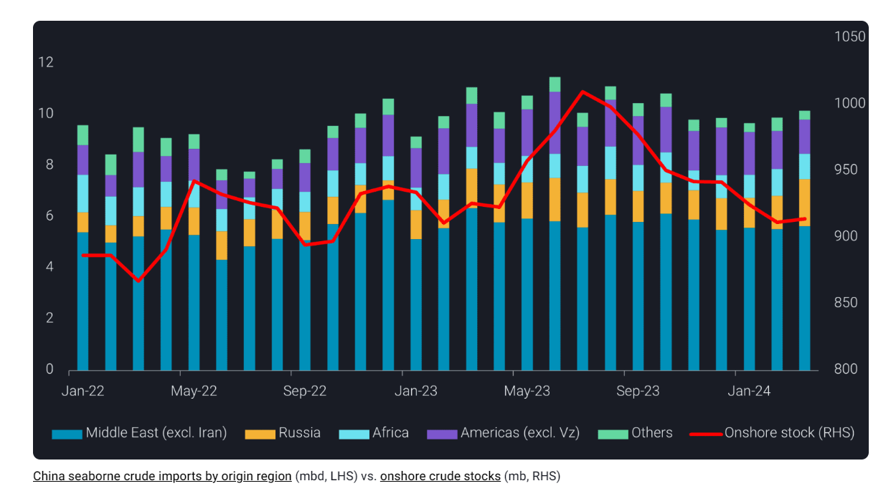
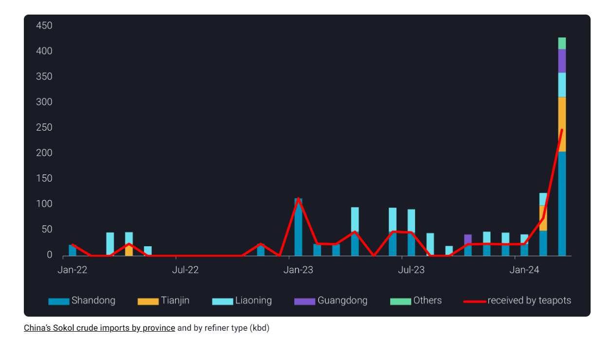
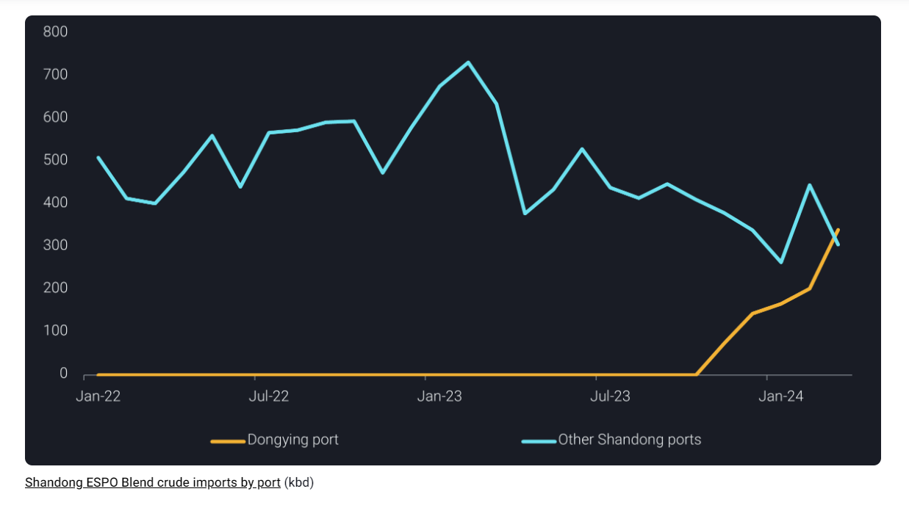

# China’s crude imports rebound on record Russian barrels

**Date:** April 10, 2024  
**Publisher:** Breakwave Advisors | **Category:** Market Insights  
**Original URL:** [https://www.breakwaveadvisors.com/insights/2024/4/10/chinas-crude-imports-rebound-on-record-russian-barrels](https://www.breakwaveadvisors.com/insights/2024/4/10/chinas-crude-imports-rebound-on-record-russian-barrels)  

---

China’s Russian crude imports surged to an all-time high in March, masking the underlying sluggishness in overall demand.

*By*[*Emma Li*](https://www.linkedin.com/in/emma-li-73003443/)

China’s seaborne crude imports surged above the 10mbd mark in March, marking the first time since October 2023, albeit with an 8% year-on-year decrease, buoyed by record Russian barrels.

The month saw a 280kbd increase in crude imports, while onshore crude inventories rose by 2.5mb (or 80kbd), indicating a moderate pickup in monthly crude throughput. However, this implied throughput increase of 200kbd is notably lower than the 650kbd and 1.17mbd recorded in the same period in the past two years, reflecting subdued oil demand below seasonal norms.

> **Figure 1: 1 Στιγμιότυπο Οθόνης 2024 04 10 133307**  
> **Interactive Data & Source:** [Analytics Vortexa](https://analytics.vortexa.com/?dateRange=2021-01-01T00%3A00%3A00.000Z__2024-03-31T23%3A59%3A59.999Z&frequency=month&hiddenSeries=%5B%22a63890260e29d859390fd1a23c690181afd4bd152943a04c00cd6a5ecf3f7d1e%22%2C%22781cacc7033f877caa4b4106d096b74afe006a96391bf5a56a4f55b849359a42%22%2C%22b5fafce6e20de2dc307fb7e0b89978ee91a49a7b6ec6f5461daf2633f3c56674%22%5D&onshoreInventoriesLocations=%5B%22b5fafce6e20de2dc307fb7e0b89978ee91a49a7b6ec6f5461daf2633f3c56674%22%2C%220fddbfd0d90bad306a92fcb483a19276f101a5f7f0783363f9f2a9d40c10558d%22%2C%22af9a3e69d9e3c22c1da30cb671a3594765e48a6848f9dc61d3cede34cb28ae9a%22%5D&page=OnShoreCrudeInventories&selectedRegion=%5B%22af9a3e69d9e3c22c1da30cb671a3594765e48a6848f9dc61d3cede34cb28ae9a%22%5D&splitSelected=storage_terminal&tabId=0cd16ff6-30e9-4ff7-a5c6-915250d00cc2&tankCrude=%5B%22confirmed%22%2C%22probable%22%5D&tankStorageType=%5B%22commercial%22%5D) | [Local Asset](file:///C:/Users/Dell/Github/Shipping/corpus/03-breakwave/insights/2024/assets/2024-04-10_chinas-crude-imports-rebound-on-record-russian-barrels_img_1cea3cf84ceb9ceb3cebcceb9cf8ccf84cf8_7abf0bf93017.png)

## Flush of Russian Sokol Crude Boosts Gasoline Production

China received a record 430kbd of Russian Far East Sokol crude in March, as Chinese refiners expedited the discharge of stranded Sokol cargos carried on sanctioned vessels within the waiver period granted by Washington. Meanwhile, Indian refiners retreated from purchases amidst tighter US sanctions, diverting more March-loaders to China.

The heavy discounts on Sokol barrels attracted new buyers, including some state-run refiners, keen on the light-distillate-rich grade to augment gasoline production in April, anticipating driving spikes during the Chinese Memorial Day holiday and upcoming Labor Day Golden Week holidays.

However, the enthusiasm for such sweet-light grade may wane in April as discounts narrow, and teapot refiners, accustomed to heavy-sour feedstocks, may opt to avoid excess Sokol barrels amid impending maintenance work and poor margins.

> **Figure 2: 2 Στιγμιότυπο Οθόνης 2024 04 10 133403**  
> **Interactive Data & Source:** [Analytics Vortexa](https://analytics.vortexa.com/?dateRange=2021-01-01T00%3A00%3A00.000Z__2024-03-31T23%3A59%3A59.999Z&frequency=month&hiddenSeries=%5B%22a63890260e29d859390fd1a23c690181afd4bd152943a04c00cd6a5ecf3f7d1e%22%2C%22781cacc7033f877caa4b4106d096b74afe006a96391bf5a56a4f55b849359a42%22%2C%22b5fafce6e20de2dc307fb7e0b89978ee91a49a7b6ec6f5461daf2633f3c56674%22%5D&onshoreInventoriesLocations=%5B%22b5fafce6e20de2dc307fb7e0b89978ee91a49a7b6ec6f5461daf2633f3c56674%22%2C%220fddbfd0d90bad306a92fcb483a19276f101a5f7f0783363f9f2a9d40c10558d%22%2C%22af9a3e69d9e3c22c1da30cb671a3594765e48a6848f9dc61d3cede34cb28ae9a%22%5D&page=OnShoreCrudeInventories&selectedRegion=%5B%22af9a3e69d9e3c22c1da30cb671a3594765e48a6848f9dc61d3cede34cb28ae9a%22%5D&splitSelected=storage_terminal&tabId=0cd16ff6-30e9-4ff7-a5c6-915250d00cc2&tankCrude=%5B%22confirmed%22%2C%22probable%22%5D&tankStorageType=%5B%22commercial%22%5D) | [Local Asset](file:///C:/Users/Dell/Github/Shipping/corpus/03-breakwave/insights/2024/assets/2024-04-10_chinas-crude-imports-rebound-on-record-russian-barrels_img_2cea3cf84ceb9ceb3cebcceb9cf8ccf84cf8_0780f607731a.png)

## Cnooc Dongying Storage Expands on Espo Blend Crude

China also saw record ESPO blend crude imports from the Russian Far East, reaching 910kbd in March, compared to a 12-month average of 780kbd. While Shandong teapot refiners remain primary buyers, more teapots opted for receiving ESPO cargos on Aframaxes from Dongying port, boosting Dongying imports to 340kbd in the month, representing over 50% of Shandong imports.

> **Figure 3: 3 Στιγμιότυπο Οθόνης 2024 04 10 133442**  
> **Interactive Data & Source:** [Analytics Vortexa](https://analytics.vortexa.com/?dateRange=2021-01-01T00%3A00%3A00.000Z__2024-03-31T23%3A59%3A59.999Z&frequency=month&hiddenSeries=%5B%22a63890260e29d859390fd1a23c690181afd4bd152943a04c00cd6a5ecf3f7d1e%22%2C%22781cacc7033f877caa4b4106d096b74afe006a96391bf5a56a4f55b849359a42%22%2C%22b5fafce6e20de2dc307fb7e0b89978ee91a49a7b6ec6f5461daf2633f3c56674%22%5D&onshoreInventoriesLocations=%5B%22b5fafce6e20de2dc307fb7e0b89978ee91a49a7b6ec6f5461daf2633f3c56674%22%2C%220fddbfd0d90bad306a92fcb483a19276f101a5f7f0783363f9f2a9d40c10558d%22%2C%22af9a3e69d9e3c22c1da30cb671a3594765e48a6848f9dc61d3cede34cb28ae9a%22%5D&page=OnShoreCrudeInventories&selectedRegion=%5B%22af9a3e69d9e3c22c1da30cb671a3594765e48a6848f9dc61d3cede34cb28ae9a%22%5D&splitSelected=storage_terminal&tabId=0cd16ff6-30e9-4ff7-a5c6-915250d00cc2&tankCrude=%5B%22confirmed%22%2C%22probable%22%5D&tankStorageType=%5B%22commercial%22%5D) | [Local Asset](file:///C:/Users/Dell/Github/Shipping/corpus/03-breakwave/insights/2024/assets/2024-04-10_chinas-crude-imports-rebound-on-record-russian-barrels_img_3cea3cf84ceb9ceb3cebcceb9cf8ccf84cf8_b98b35061813.png)

Since November 2023, when the three 100kt crude oil jetties were officially put into operation, Dongying port has discharged 29mb of ESPO crude carried on 39 Aframax-size vessels. The steady stockpiling rate at the new CNOOC Dongying South commercial crude storage, receiving oil since March 2023,[averaged around 2.1mb/month since November](https://analytics.vortexa.com/?dateRange=2021-01-01T00%3A00%3A00.000Z__2024-03-31T23%3A59%3A59.999Z&frequency=month&hiddenSeries=%5B%22a63890260e29d859390fd1a23c690181afd4bd152943a04c00cd6a5ecf3f7d1e%22%2C%22781cacc7033f877caa4b4106d096b74afe006a96391bf5a56a4f55b849359a42%22%2C%22b5fafce6e20de2dc307fb7e0b89978ee91a49a7b6ec6f5461daf2633f3c56674%22%5D&onshoreInventoriesLocations=%5B%22b5fafce6e20de2dc307fb7e0b89978ee91a49a7b6ec6f5461daf2633f3c56674%22%2C%220fddbfd0d90bad306a92fcb483a19276f101a5f7f0783363f9f2a9d40c10558d%22%2C%22af9a3e69d9e3c22c1da30cb671a3594765e48a6848f9dc61d3cede34cb28ae9a%22%5D&page=OnShoreCrudeInventories&selectedRegion=%5B%22af9a3e69d9e3c22c1da30cb671a3594765e48a6848f9dc61d3cede34cb28ae9a%22%5D&splitSelected=storage_terminal&tabId=0cd16ff6-30e9-4ff7-a5c6-915250d00cc2&tankCrude=%5B%22confirmed%22%2C%22probable%22%5D&tankStorageType=%5B%22commercial%22%5D), equivalent to 3 ESPO cargos/month

.

## State-Run Refiners Accelerate Urals Purchasing, Draining Off Teapot Supplies

China’s Russian crude imports from Baltic, Black Sea and Arctic regions have rebounded to above 400kbd in March, as Russia-China vessels experience minimal interruptions in Red Sea attacks.

However,[only 10% of the above arrived in Shandong](https://analytics.vortexa.com/?dateRange=2022-01-01T00%3A00%3A00.000Z__2024-03-31T23%3A59%3A59.999Z&metric=bpd&movementEvent=unloading_start&page=Flows&products=%5B%22c8803c073c2980d9849784c16bcd41d7f7b7561d2c8c1799a16166527b120242%22%2C%2220c87d7477f8cfe103904d9af911668c9a69bd03690e74e52e4386ad34e054ee%22%2C%220c703e0e14d99572c62f15a26fdf2c9f0c00e111e625cd40b8b337154e81d46d%22%2C%227cab5376bbb441feabdafc7b9f6272c2f9cbd10deb604bed8fa7f9986b2a39a9%22%2C%220fff12441aa3bf28aa568134ef527d09f741c543a49c0db8c03a195a0bbc481e%22%2C%224aebc156649b4c9691cdf3a9c81758426d10ffc944ba441f907f9fbe0964e879%22%2C%224ff810b966104a658d22e7155596c11bedcd1e3e81594e6187ab88ec816d95d6%22%2C%221dfa78c965d56ab9d7b953e424d9160e9f79d0275e460c74994193a328f51537%22%2C%22054b79baa9a54171be2582c9b4f8fa82d0386d41c1914700a498dc5b95e8daba%22%2C%22c56c8a9d8404573236950b3644825b6928bf0c1f47abccc08e5aeff1afeabb5c%22%2C%2274a8bc823d4742318d38072f81068fac1ac02ac66e0d491ea4366007bb95c602%22%5D&sortField=unloading_start&tabId=322effd9-f0d3-418e-b741-d06c2b79b85a&timeSeriesHiddenSeries=%5B%22ea4d2edbcb3bc04fd81255124e7861aae375daaf21b0a78dc1a879cca97f88e3%22%5D&timeSeriesProperty=destination_trading_sub_region&to=%5B%22b5fafce6e20de2dc307fb7e0b89978ee91a49a7b6ec6f5461daf2633f3c56674%22%5D&v=3)for teapot refiners, as Chinese state-run refiners and Indian refiners proved more resilient to narrowing discounts in Urals-led long-haul Russian crude.

More teapot refiners may consider reducing run rates in April as they struggle to replace Urals with other discounted sour grades, with Iran and Venezuela also raising selling prices to China.

As more refining capacities commence seasonal maintenance (as sluggish diesel demand from mining and infrastructure constrains refining runs) and crude benchmark prices are nearing the $90/b mark, Chinese refiners are expected to curb crude purchases.

Data Source:[Vortexa](https://www.vortexa.com//oil-gas-data-traders-analysts-data-scientists?gclid=Cj0KCQjw8_qRBhCXARIsAE2AtRZKOvMnbilZ_6_91d7huSFFy71pWLrnPwGwOHVzXsmsG-1a1mZnQw8aAt89EALw_wcB&hsa_acc=1782073842&hsa_ad=548425387665&hsa_cam=14746637662&hsa_grp=125038601902&hsa_kw=&hsa_mt=&hsa_net=adwords&hsa_src=g&hsa_tgt=dsa-1431852288425&hsa_ver=3&utm_campaign=%5BCD%5D%20-%20DSA%20-%20EMEA&utm_medium=cpc&utm_medium=ppc&utm_source=google&utm_source=adwords&utm_term=)

---

**Tags:** China, Oil, Shipping  
