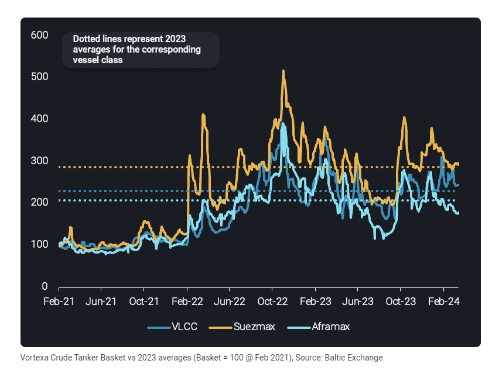
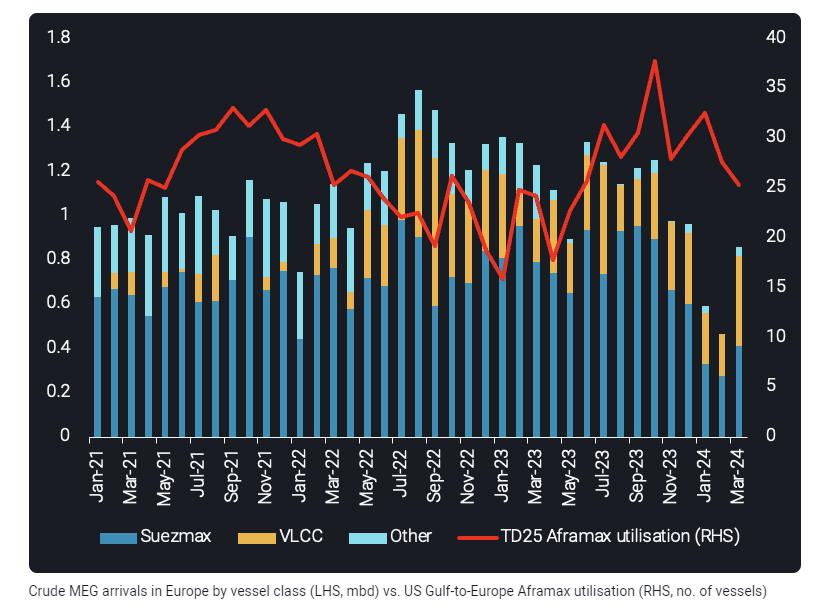
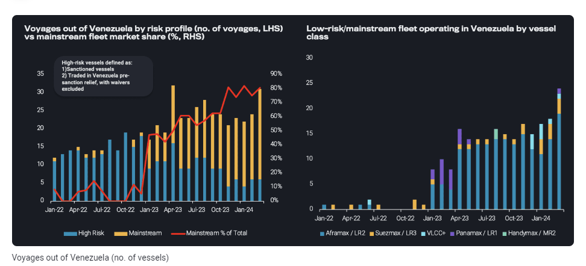
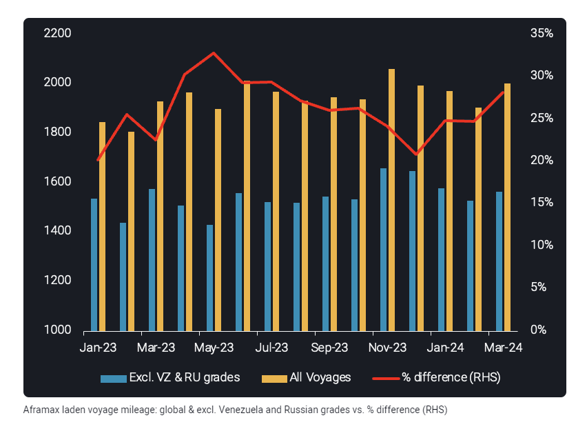

# Aframax rates could face further weakening in Q2 2024

**Date:** April 11, 2024  
**Publisher:** Breakwave Advisors | **Category:** Market Insights  
**Original URL:** [https://www.breakwaveadvisors.com/insights/2024/4/11/aframax-rates-could-face-further-weakening-in-q2-2024](https://www.breakwaveadvisors.com/insights/2024/4/11/aframax-rates-could-face-further-weakening-in-q2-2024)  

---

Seasonal factors in the Atlantic Basin and increasing sanctioning activity could play a vital role in shaping the trajectory of freight rates in Q2 2024

*By*[*Ioannis Papadimitriou*](https://www.linkedin.com/in/ipapadimitriou/)

Crude tanker rates have remained quite healthy for owners in the last couple of years, especially post the Russian invasion and the changes to trade flow and fleet behaviour patterns that followed suit.

However, seasonal and regulatory downside risks could be on the cards in the months to follow for Aframax tankers with rates currently hovering below 2023 averages, according to Vortexa Tanker Basket composed from Baltic Exchanges freight assessments.

> **Figure 1: Στιγμιότυπο Οθόνης 2024 04 11 101408**  
> **Interactive Data & Source:** [Analytics Vortexa](https://analytics.vortexa.com/?dateRange=2021-01-01T00%3A00%3A00.000Z__2024-03-31T23%3A59%3A59.999Z&frequency1=month&frequency3=month&from=%5B%224e79eb8e84d26f5c3c0006283bc1aa52c170b58d667be9848e136afea91a57e9%22%5D&latestProducts=%5B%2254af755a090118dcf9b0724c9a4e9f14745c26165385ffa7f1445bc768f06f11%22%5D&page=FleetUtilisation&tabId=5b56a377-fa58-4934-b6a4-fdcef57d398f&to=%5B%22f39d455f5d38907394d6da3a91da4e391f9a34bd6a17e826d6042761067e88f4%22%5D&v=4&vesselClasses=%5B%22oil_aframax_lr2%22%5D&voyageStatus=%5B%22laden%22%5D) | [Local Asset](file:///C:/Users/Dell/Github/Shipping/corpus/03-breakwave/insights/2024/assets/2024-04-11_aframax-rates-could-face-further-weakening-in-q2-2024_img_cea3cf84ceb9ceb3cebcceb9cf8ccf84cf85_d941aa3bd47a.png)

The bedrock of Aframax employment has mainly been the transatlantic US Gulf-to-Europe crude trade. In March 2024,[Aframax utilisation](https://analytics.vortexa.com/?dateRange=2021-01-01T00%3A00%3A00.000Z__2024-03-31T23%3A59%3A59.999Z&frequency1=month&frequency3=month&from=%5B%224e79eb8e84d26f5c3c0006283bc1aa52c170b58d667be9848e136afea91a57e9%22%5D&latestProducts=%5B%2254af755a090118dcf9b0724c9a4e9f14745c26165385ffa7f1445bc768f06f11%22%5D&page=FleetUtilisation&tabId=5b56a377-fa58-4934-b6a4-fdcef57d398f&to=%5B%22f39d455f5d38907394d6da3a91da4e391f9a34bd6a17e826d6042761067e88f4%22%5D&v=4&vesselClasses=%5B%22oil_aframax_lr2%22%5D&voyageStatus=%5B%22laden%22%5D)on this route recorded the lowest point since June 2023, a 10-month low. The return of US refineries from turnaround aligned with the start of maintenance in Europe, as well as the pickup of crude[supplies sourced from the Middle East Gulf on Suezmaxes](https://analytics.vortexa.com/?dateRange=2021-01-01T00%3A00%3A00.000Z__2024-03-31T23%3A59%3A59.999Z&filtersEnabled=%5B%22p%22%2C%22o%22%2C%22d%22%2C%22d_r%22%2C%22v%22%2C%22intra_d%22%2C%22sts_o%22%2C%22c_o%22%2C%22sts%22%2C%22v_t%22%2C%22w%22%5D&from=%5B%220427e0f9d52b38c1a98b68c59b8fd80cb1c508e44882e96611e48ef5b140d927%22%5D&metric=bpd&movementEvent=unloading_start&page=Flows&products=%5B%2254af755a090118dcf9b0724c9a4e9f14745c26165385ffa7f1445bc768f06f11%22%5D&tabId=ea19f710-d29e-4ce6-aac3-91efb3414058&timeSeriesProperty=vessel_class_coarse&to=%5B%22f39d455f5d38907394d6da3a91da4e391f9a34bd6a17e826d6042761067e88f4%22%5D&v=3), all led to a reduction in transatlantic crude flows to Europe.

> **Figure 2: 11 Στιγμιότυπο Οθόνης 2024 04 11 101556**  
> **Interactive Data & Source:** [Analytics Vortexa](https://analytics.vortexa.com/?frequency=month&onshoreInventoriesLocations=%5B%22a50f4a476665d3d507f54398b1a1aed1746c5469619c83c3398716724f8dda27%22%2C%22934c47f36c16a58d68ef5e007e62a23f5f036ee3f3d1f5f85a48c572b90ad8b2%22%2C%22e9e556620469f46a4dc171aef71073f5286a288da35c5883cac760446b0ceb46%22%2C%224e79eb8e84d26f5c3c0006283bc1aa52c170b58d667be9848e136afea91a57e9%22%2C%2250182d9d05051a6c8d24f0514d4ee828da6eaa29eacbb11cfe368f51526328ce%22%2C%2243a70ba6b21894cd24165d9d7ee59b012e698cf97e22fd275ccdd05a556e7061%22%2C%222aaad41b89dfad19e5668918018ae02695d7710bcbe5f2dc689234e8da492de3%22%2C%225e0cb0b66780a00576309aecff1b65934fc580d775bab29ac2a79397d8544e04%22%2C%2212fbd144f28603e5b024c1915a1d2bddf110645589f591e0b9cad4843eb61df5%22%2C%2280aa9e4f3014c3d96559c8e642157edbb2b684ea0144ed76cd20b3af75110877%22%2C%2270425373a1836d6d0390dc6fef838a468717fba7776d66065a5043488f9f041b%22%2C%22043b3b0acb039514160625a525d76eb8942bd5aa44daa52c4ad1cbd363d52366%22%2C%22f39d455f5d38907394d6da3a91da4e391f9a34bd6a17e826d6042761067e88f4%22%5D&page=OnShoreCrudeInventories&selectedRegion=%5B%22f39d455f5d38907394d6da3a91da4e391f9a34bd6a17e826d6042761067e88f4%22%5D&tabId=84817c29-d64a-4fa3-8a11-44122d13cafd&tankCrude=%5B%22confirmed%22%2C%22probable%22%5D) | [Local Asset](file:///C:/Users/Dell/Github/Shipping/corpus/03-breakwave/insights/2024/assets/2024-04-11_aframax-rates-could-face-further-weakening-in-q2-2024_img_11cea3cf84ceb9ceb3cebcceb9cf8ccf84cf_2c43d447c9da.png)

The restart of European refineries from May onwards could provide some support for transatlantic flows but the already[high crude inventories in Europe](https://analytics.vortexa.com/?frequency=month&onshoreInventoriesLocations=%5B%22a50f4a476665d3d507f54398b1a1aed1746c5469619c83c3398716724f8dda27%22%2C%22934c47f36c16a58d68ef5e007e62a23f5f036ee3f3d1f5f85a48c572b90ad8b2%22%2C%22e9e556620469f46a4dc171aef71073f5286a288da35c5883cac760446b0ceb46%22%2C%224e79eb8e84d26f5c3c0006283bc1aa52c170b58d667be9848e136afea91a57e9%22%2C%2250182d9d05051a6c8d24f0514d4ee828da6eaa29eacbb11cfe368f51526328ce%22%2C%2243a70ba6b21894cd24165d9d7ee59b012e698cf97e22fd275ccdd05a556e7061%22%2C%222aaad41b89dfad19e5668918018ae02695d7710bcbe5f2dc689234e8da492de3%22%2C%225e0cb0b66780a00576309aecff1b65934fc580d775bab29ac2a79397d8544e04%22%2C%2212fbd144f28603e5b024c1915a1d2bddf110645589f591e0b9cad4843eb61df5%22%2C%2280aa9e4f3014c3d96559c8e642157edbb2b684ea0144ed76cd20b3af75110877%22%2C%2270425373a1836d6d0390dc6fef838a468717fba7776d66065a5043488f9f041b%22%2C%22043b3b0acb039514160625a525d76eb8942bd5aa44daa52c4ad1cbd363d52366%22%2C%22f39d455f5d38907394d6da3a91da4e391f9a34bd6a17e826d6042761067e88f4%22%5D&page=OnShoreCrudeInventories&selectedRegion=%5B%22f39d455f5d38907394d6da3a91da4e391f9a34bd6a17e826d6042761067e88f4%22%5D&tabId=84817c29-d64a-4fa3-8a11-44122d13cafd&tankCrude=%5B%22confirmed%22%2C%22probable%22%5D)will likely not leave room for a considerable improvement. Moreover, the current widening of the Aframax/Suezmax freight spread for the US Gulf-to-Europe route will prompt charterers to fix on Aframax’s bigger counterparts that provide more economically lucrative opportunities.

The introduction of Russian sanctions by the West led to the development of a multi-tier fleet system that helped alleviate Aframax competition for mainstream trades. However the current increased sanctioning activity has sparked the return of Western operators to these non-Russian trades gradually increasing the competition once again.

This type of behaviour could be repeated out of Venezuela. Crude tanker voyages out of[Venezuela reached an 11-month high](https://analytics.vortexa.com/?dateRange=2022-01-01T00%3A00%3A00.000Z__2024-03-31T23%3A59%3A59.999Z&filtersEnabled=%5B%22v_v_st%22%2C%22v%22%2C%22l_c%22%2C%22o%22%2C%22d%22%2C%22d_r%22%2C%22v_or%22%2C%22v_de%22%2C%22dwt%22%2C%22v_i%22%2C%22v_cg_st%22%2C%22v_l_st%22%2C%22v_co_st%22%2C%22v_m_st%22%2C%22v_wt%22%2C%22v_c%22%2C%22l%22%2C%22v_o%22%2C%22intra_d%22%5D&latestProducts=%5B%2254af755a090118dcf9b0724c9a4e9f14745c26165385ffa7f1445bc768f06f11%22%5D&page=VoyagesFlows&tabId=712d3c9d-02f1-46f8-adb5-5cd9186b44cc&voyageDateRangeActivity=departures&voyageFrom=%5B%22a1acb291bb339d07faa0d9c7b62ea292aa0ea1a01813b26c890aeeb4e2334b09%22%5D&voyageStatus=%5B%22laden%22%5D), but fears of the re-imposition of sanctions post-18th April are looming. The share of the[low-risk vessels](https://tinyurl.com/3mxmucfv)(i.e “mainstream” fleet) operating in the trade have increased from 5% by the end of 2022 to a staggering 80% in March 2024. The increase of the mainstream fleet employment is predominantly materialised on Aframaxes (19 out of the 25 voyages), heading towards the US or performing STS operations offshore Venezuela for cargoes headed towards India and China.

> **Figure 3: 2στιγμιότυπο Οθόνης 2024 04 11 101904**  
> **Interactive Data & Source:** [Vortexa](https://www.vortexa.com//oil-gas-data-traders-analysts-data-scientists?gclid=Cj0KCQjw8_qRBhCXARIsAE2AtRZKOvMnbilZ_6_91d7huSFFy71pWLrnPwGwOHVzXsmsG-1a1mZnQw8aAt89EALw_wcB&hsa_acc=1782073842&hsa_ad=548425387665&hsa_cam=14746637662&hsa_grp=125038601902&hsa_kw=&hsa_mt=&hsa_net=adwords&hsa_src=g&hsa_tgt=dsa-1431852288425&hsa_ver=3&utm_campaign=%5BCD%5D%20-%20DSA%20-%20EMEA&utm_medium=cpc&utm_medium=ppc&utm_source=google&utm_source=adwords&utm_term=) | [Local Asset](file:///C:/Users/Dell/Github/Shipping/corpus/03-breakwave/insights/2024/assets/2024-04-11_aframax-rates-could-face-further-weakening-in-q2-2024_img_2cea3cf84ceb9ceb3cebcceb9cf8ccf84cf8_4d2c1551a1d8.png)

Prospective US sanctions on Venezuela, especially if the initial waivers to US cease to exist, will mean that the high-risk vessels/dark fleet would once again raise their share in the Venezuelan trade – predominantly on VLCCs – at the expense of mainstream Aframax operators that will likely seek new opportunities elsewhere.

A complete “ousting” of the mainstream Aframax from the Venezuelan and Russian trade will also hamper the mainstream fleet voyage mileage. Looking from the start of 2023, when Venezuela waivers and the EU ban on Russian crude were primarily introduced, the transportation of the respective grades on Aframaxes has added on average 25% on global voyage mileage.

> **Figure 4: 33στιγμιότυπο Οθόνης 2024 04 11 101934**  
> **Interactive Data & Source:** [Vortexa](https://www.vortexa.com//oil-gas-data-traders-analysts-data-scientists?gclid=Cj0KCQjw8_qRBhCXARIsAE2AtRZKOvMnbilZ_6_91d7huSFFy71pWLrnPwGwOHVzXsmsG-1a1mZnQw8aAt89EALw_wcB&hsa_acc=1782073842&hsa_ad=548425387665&hsa_cam=14746637662&hsa_grp=125038601902&hsa_kw=&hsa_mt=&hsa_net=adwords&hsa_src=g&hsa_tgt=dsa-1431852288425&hsa_ver=3&utm_campaign=%5BCD%5D%20-%20DSA%20-%20EMEA&utm_medium=cpc&utm_medium=ppc&utm_source=google&utm_source=adwords&utm_term=) | [Local Asset](file:///C:/Users/Dell/Github/Shipping/corpus/03-breakwave/insights/2024/assets/2024-04-11_aframax-rates-could-face-further-weakening-in-q2-2024_img_33cea3cf84ceb9ceb3cebcceb9cf8ccf84cf_e1cb3d245e5b.png)

Although the majority of signals point towards the continuation of a downwards trend for Aframax tankers, there might be a silver lining in terms of employment boost. The Venezuela sanction re-introduction will naturally increase demand for the dark fleet, potentially attracting tonnage that is currently utilised in Russia. This could pave the way for mainstream operators to raise exposure in the Russian trade under the price cap, shall the sanctioning activity led by the US and the UK, which is gradually eliminating non-Western linked shipowners to transport Russian oil to countries like India, continues to take place.

Data Source:[Vortexa](https://www.vortexa.com//oil-gas-data-traders-analysts-data-scientists?gclid=Cj0KCQjw8_qRBhCXARIsAE2AtRZKOvMnbilZ_6_91d7huSFFy71pWLrnPwGwOHVzXsmsG-1a1mZnQw8aAt89EALw_wcB&hsa_acc=1782073842&hsa_ad=548425387665&hsa_cam=14746637662&hsa_grp=125038601902&hsa_kw=&hsa_mt=&hsa_net=adwords&hsa_src=g&hsa_tgt=dsa-1431852288425&hsa_ver=3&utm_campaign=%5BCD%5D%20-%20DSA%20-%20EMEA&utm_medium=cpc&utm_medium=ppc&utm_source=google&utm_source=adwords&utm_term=)

---

**Tags:** Tankers, Shipping, Crude Oil  
