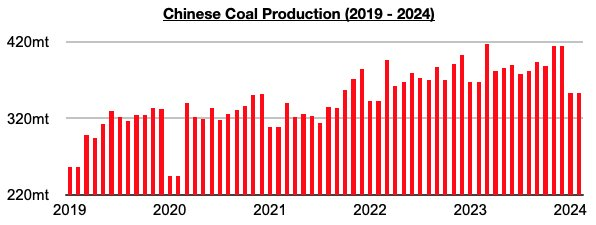
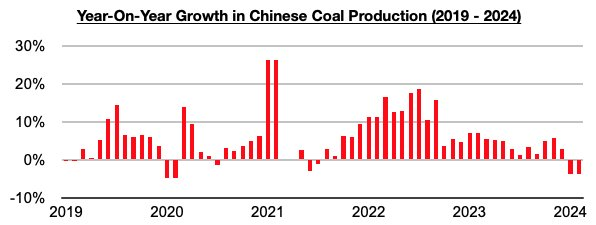

# We Live in a Strange World

**Date:** April 12, 2024  
**Publisher:** Breakwave Advisors | **Category:** Market Insights  
**Original URL:** [https://www.breakwaveadvisors.com/insights/2024/4/12/061a8etzmgixtlbj8xyekkp23a1glf](https://www.breakwaveadvisors.com/insights/2024/4/12/061a8etzmgixtlbj8xyekkp23a1glf)  

---

*By*[*Jeffrey Landsberg*](https://www.linkedin.com/in/jeffrey-landsberg-70ab957/)

Catching our attention last week was a Bloomberg article that discussed China’s coal production but amazingly managed to omit the fact that production this year is contracting. The article, ”China’s Coal Price Slump Likely to Persist Until Start of Summer”, discussed “record" coal production and stated “China’s domestic coal production rose 9% in 2022 and then by another 2.9% last year”. Somehow, though,*this year’s*production was not discussed.

> **Figure 1: Readers of the Bloomberg Piece**  
> *Readers of the Bloomberg piece, through no fault of their own, were left unaware China’s coal productionthis yearhas so far contracted year-on-year by 4%. This has marked the first contraction seen since July 2021. It is rare for China’s coal production to contract — but as we have been discussing in Commodore Research's Weekly Dry Bulk Reports and Weekly China Reports, we have been expecting that production would contract as China remains in the midst of a new significant coal mining safety overhaul that has been in place since December.*  
> [Local Asset](file:///C:/Users/Dell/Github/Shipping/corpus/03-breakwave/insights/2024/assets/2024-04-12_061a8etzmgixtlbj8xyekkp23a1glf_img_chart128129_524012dff6cb.jpg)

> **Figure 2: Chart 2 (1)**  
> [Local Asset](file:///C:/Users/Dell/Github/Shipping/corpus/03-breakwave/insights/2024/assets/2024-04-12_061a8etzmgixtlbj8xyekkp23a1glf_img_chart228129_62f61721ea53.jpg)

As we discussed for Commodore's subscribers last year, in late October Shanxi province held a special meeting to ensure safe coal production in November and December. However, two accidents occurred at local coal mines through the middle of November that resulted in deaths, and then a very large accident occurred on November 16th that resulted in the deaths of at least 26 people. This was all very tragic and also embarrassing for Shanxi officials who had just held their safety meeting. The following week then saw a large accident occur in Heilongjiang province that resulted in the deaths of at least 11 people. As a result of October’s failure and the wave of accidents, a major six-month safety overhaul was initiated in Shanxi province and other provinces. Some mines have been forced to suspend night shifts, others have had to suspend all operations, and various other restrictions and monitoring remain in place.

To us, Chinese coal production suddenly falling into contraction is worthy of making the news, or at the very least made mention of in a Bloomberg article that discusses Chinese coal production. How about when writing “China’s domestic coal production rose 9% in 2022 and then by another 2.9% last year”, also then state: the first two months of this year, however, have seen production fall 4%? Maybe also then discuss the large accidents and deaths that occurred late last year and the ongoing coal mining safety overhaul that remains in place this year? Perhaps a good idea, too, to follow that up with discussion on how new accidents continue to occur, including three (all resulting in deaths) in the last ten days of March alone, and discuss how the timing of these accidents is very likely to result in the safety overhaul being extended?

We live in a strange world. For some reason, Bloomberg will write about Chinese coal production, but they will omit how production is actually faring this year. Works out to be a good thing, though, for those who are aware of how things are actually going...

---

**Tags:** China, Drybulk, Ironore  
