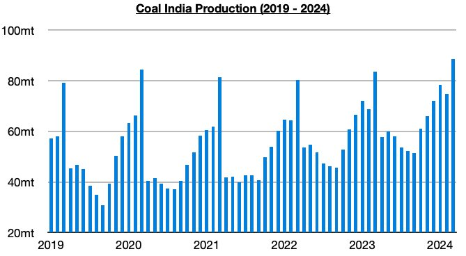
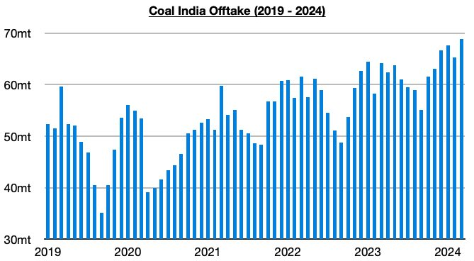

# Ongoing Climb in Coal India's Stockpiles

**Date:** April 15, 2024  
**Publisher:** Breakwave Advisors | **Category:** Market Insights  
**Original URL:** [https://www.breakwaveadvisors.com/insights/2024/4/15/ongoing-climb-in-coal-indias-stockpiles](https://www.breakwaveadvisors.com/insights/2024/4/15/ongoing-climb-in-coal-indias-stockpiles)  

---

*By*[*Jeffrey Landsberg*](https://www.linkedin.com/in/jeffrey-landsberg-70ab957/)

As we discussed in Commodore Research's most recent Weekly Dry Bulk Report, Coal India produced a record 88.6 million tons of coal in March. This has marked a month-on-month increase of 13.8 million tons (18%) and a year-on-year increase of 5.1 million tons (6%). Overall, Coal India's production always jumps every March. Coal India’s production has now increased on a year-on-year basis during thirty-five of the last thirty-six months. The days of Coal India’s production missing expectations remains a thing of the past.

> **Figure 1: Chart 1 (2)**  
> [Local Asset](file:///C:/Users/Dell/Github/Shipping/corpus/03-breakwave/insights/2024/assets/2024-04-15_ongoing-climb-in-coal-indias-stockpiles_img_chart128229_d4c4b63e3320.jpg)

Offtake (amount sent to customers) totaled 68.8 million tons in March. This has marked a month-on-month increase of 3.5 million tons (5%) and a year-on-year increase of 4.6 million tons (7%). Coal India's offtake has now increased on a year-on-year basis during thirty-six of the last thirty-seven months, but March again saw offtake come in less than production. Each of the last five months have seen offtake come in less than production, and as a result Coal India’s stockpiles have continued to increase. The company’s coal pithead stockpiles have now climbed to approximately 91 million tons.

> **Figure 2: Chart 2 (2)**  
> [Local Asset](file:///C:/Users/Dell/Github/Shipping/corpus/03-breakwave/insights/2024/assets/2024-04-15_ongoing-climb-in-coal-indias-stockpiles_img_chart228229_0cc54120ce7a.jpg)

---

**Tags:** Drybulk, Coal, Economy  
