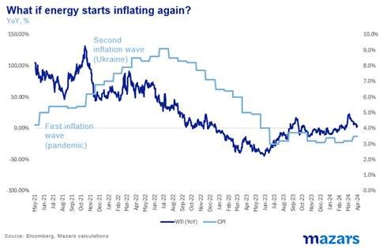
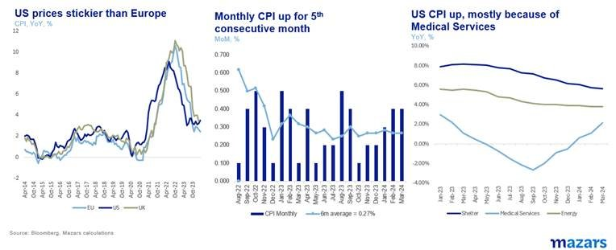
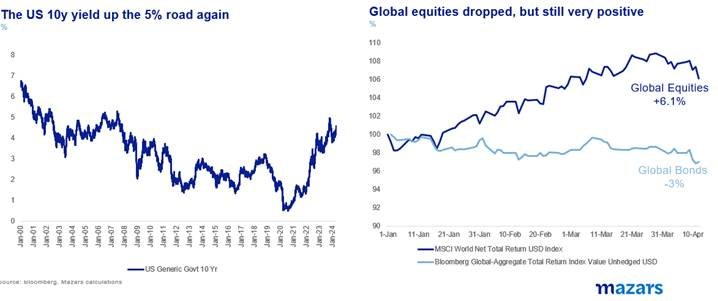
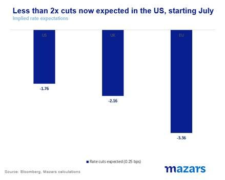
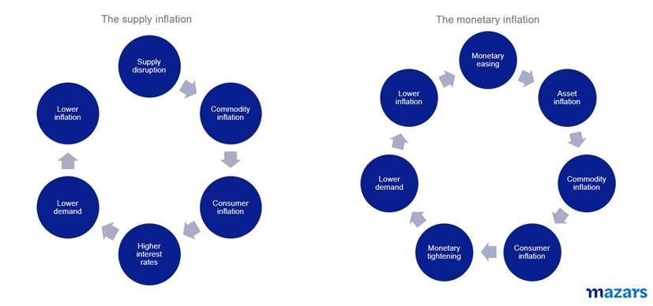
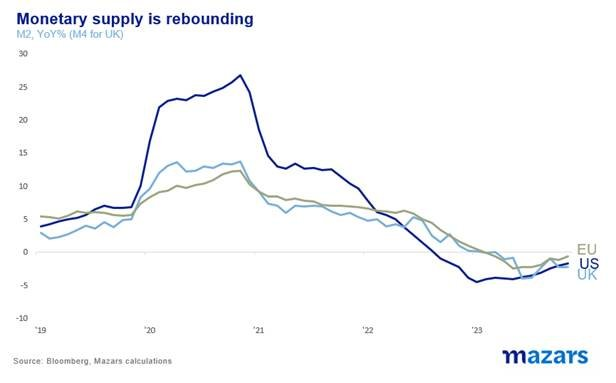
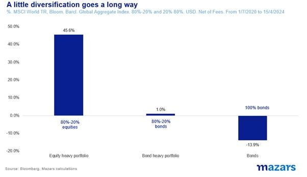

# The War of Jenkins’ Ear

**Date:** April 15, 2024  
**Publisher:** Breakwave Advisors | **Category:** Market Insights  
**Original URL:** [https://www.breakwaveadvisors.com/insights/2024/4/15/the-war-of-jenkins-ear](https://www.breakwaveadvisors.com/insights/2024/4/15/the-war-of-jenkins-ear)  

---

The three things investors should know this week:

1. Wars are not predictable, either in how they start or how they proceed.
2. US CPI numbers suggested that the US inflation is stickier than the respective EU and UK inflation numbers.
3. Markets now expect less than 2x cuts for the US, causing bond yields to rise further (and prices to fall). This is leaving defensive portfolios without much return, but still much better off than a wholesale allocation in just fixed-income assets.

*By*[*George Lagarias*](https://www.linkedin.com/in/george-lagarias-mba-3baa769/)

In March 1738, a British mariner called Robert Jenkins was ordered to testify in front of Parliament. He presented MPs with an unusually gruesome item: his decomposing ear. Seven years before, the ear had been severed by a Spanish officer off the coast of Florida. Parliament had had enough and voted to wage an outlandish war on Spain… over Jenkins’ ear. Eventually the conflict merged with the 1742 War of the Austrian Succession.

**The lesson here is simple: wars are not predictable, either in how they start or how they proceed.**

The plan was to talk about Core US inflation this morning. However, this weekend’s fresh tensions are forcing a discussion about headline instead. Energy has stopped dis-inflating since autumn 2023. In March, energy prices were 22% higher than last year.

> **Figure 1: Market Chart 1**  
> [Local Asset](file:///C:/Users/Dell/Github/Shipping/corpus/03-breakwave/insights/2024/assets/2024-04-15_the-war-of-jenkins-ear_img_image008_ac7420ca2ac9.jpg)

**In the back of every trader’s, investor’s, politician’s, central banker’s and consumer’s mind right now, there is but one question: what if oil starts another inflation wave?**

For the last two years, one of our key calls was that the era of macroeconomic stability, known as the Great Moderation, was over and we should expect more economic volatility. i.e.**it was always going to be a bumpy road towards structurally lower inflation.**The global economic and political centrifugal forces persist, causing supply chain and energy oscillations which are not too difficult to translate into harder wage negotiations.

For the moment, let us assume that geopolitical tensions don’t escalate much further and that energy prices do not cause another inflation wave. At the time of writing (Monday morning, too early to gauge proper market reactions), oil prices hadn’t moved much.

That means that the EU and the UK would, all other things being equal, be on their way to 2% inflation and summer rate cuts, albeit with bumps on the way, while the US would be left fighting an overhang of money supply, higher inflation and higher interest rates until the beginning of the year.

Last week’s US CPI announcement tells much of that story, registering 3.5%, up for the second month in a row.

> **Figure 2: Market Chart 2**  
> [Local Asset](file:///C:/Users/Dell/Github/Shipping/corpus/03-breakwave/insights/2024/assets/2024-04-15_the-war-of-jenkins-ear_img_image009_1babffc3f406.jpg)

Following the announcement, equities tumbled 1.5% and bond yields rose, with the US 10y back at 4.5% for the first time since November. Year to date, global equities are up 6.1% while bonds are having another bad year, down 3%. Various Fed officials took the podium last week, mostly suggesting that they are in no hurry to lower rates.

> **Figure 3: Market Chart 3**  
> [Local Asset](file:///C:/Users/Dell/Github/Shipping/corpus/03-breakwave/insights/2024/assets/2024-04-15_the-war-of-jenkins-ear_img_image010_cc66ac4b5ba2.jpg)

The market is now pricing in less than two rate cuts in the US, solidly below the Fed’s latest expectations for 3 cuts (although this may not necessarily be reflected in the latest statements by officials). However, they are pricing in two-plus cuts for the UK and three for the EU.

> **Figure 4: Market Chart 4**  
> [Local Asset](file:///C:/Users/Dell/Github/Shipping/corpus/03-breakwave/insights/2024/assets/2024-04-15_the-war-of-jenkins-ear_img_image011_6a96ca5b95a3.jpg)

Back to the basics then. There are two major types of inflation. One that starts from supply chain dislocations (supply side inflation) and one that starts from an excess amount of money in the economy (demand side inflation).

Those two are not mutually exclusive. They can run co-currently and even affect each other. Monetary policy can have a much bigger effect on the latter type, rather than exogenously generated inflation cycles. Interest rates going up or down do not help much if oil taps are shut or ports are blocked. Most importantly, the timing of their cycles can’t be predicted. Past data are scant and involve very different economies and demographics than what we have today. I am sure hindsight will prove an excellent helper for future academics, but for the time being the collective output of consumer psychology regarding inflation lies beyond our modelling capabilities.

> **Figure 5: Market Chart 5**  
> [Local Asset](file:///C:/Users/Dell/Github/Shipping/corpus/03-breakwave/insights/2024/assets/2024-04-15_the-war-of-jenkins-ear_img_image012_4e00536f506c.jpg)

What we know is that American inflation has not been tamed. Every Fed official has told us as much. To some extent, this may reflect the US administration’s practice of sending cheques and increasing monetary supply significantly back in 2020 to fight COVID-19. So, supply chain disruptions were aggravated by excessive money supply.

> **Figure 6: Market Chart 6**  
> [Local Asset](file:///C:/Users/Dell/Github/Shipping/corpus/03-breakwave/insights/2024/assets/2024-04-15_the-war-of-jenkins-ear_img_image013_f64ae88eda69.jpg)

European nations, who chose to subsidise employment rather than unemployment, seem to be getting out of this inflation wave more easily (again, no telling what happens when and if the next one hits).

### So What Does It All Mean for Investors?

For equities, geopolitical tensions have been a large part of the risk for some time, along with sticky inflation. So what is happening is not new, and should be somewhat priced in. So far, investors have chosen to look away from these and ride the tech-driven rally. Apart from possibly a renewed focus on the energy sector, which is up 19% since February but trading at a 53% discount versus its own average, and some money-shifting ahead of May (algorithmic trading reinforces past trends), we wouldn’t be too surprised if the equity market reaction, bar some volatility, remained muted. Outside tech, valuations aren’t high enough to cause a rout.

The main problem is with the bond market. As inflation expectations rise, bond prices fall. So far, for the year, the Global Investment Grade Aggregate Bond index is down 3.7%. It is the third year in the last four, where bond performance is negative.

Since mid-2020 a theoretical defensive 80% bond, 20% equity portfolio (USD, no fees or costs) has been nearly flat (+1%). A more aggressive 80% equity, 20% bond portfolio has gained 45.5%, more than 10% per annum. This is not what one should expect during turbulent times.

However, the more important point here is one of diversification. A 100% allocation in mid-duration bonds, would have resulted in a whopping 14% net loss for investors. Adding just 20% equities at least resulted in capital reservation (although not in real terms as inflation soared).

> **Figure 7: Market Chart 7**  
> [Local Asset](file:///C:/Users/Dell/Github/Shipping/corpus/03-breakwave/insights/2024/assets/2024-04-15_the-war-of-jenkins-ear_img_image014_6f0bba1afd4d.jpg)

It’s not too long ago when the investing world lost trust in professionals. DIY low-fee investing was all the rage. This is easy when we are in a QE-fuelled bull market. Times, however, are now different. This is not the time to be picking single assets. It’s a time to diversify, rely on long-term return and risk trends, and wait. Strategic Asset Allocation is a narrow path, with some obstacles to be sure. But outside it, the dangers are exponentially higher.

---

**Tags:** Markets, Economy, Macro  
