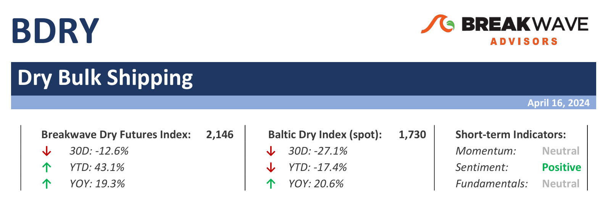
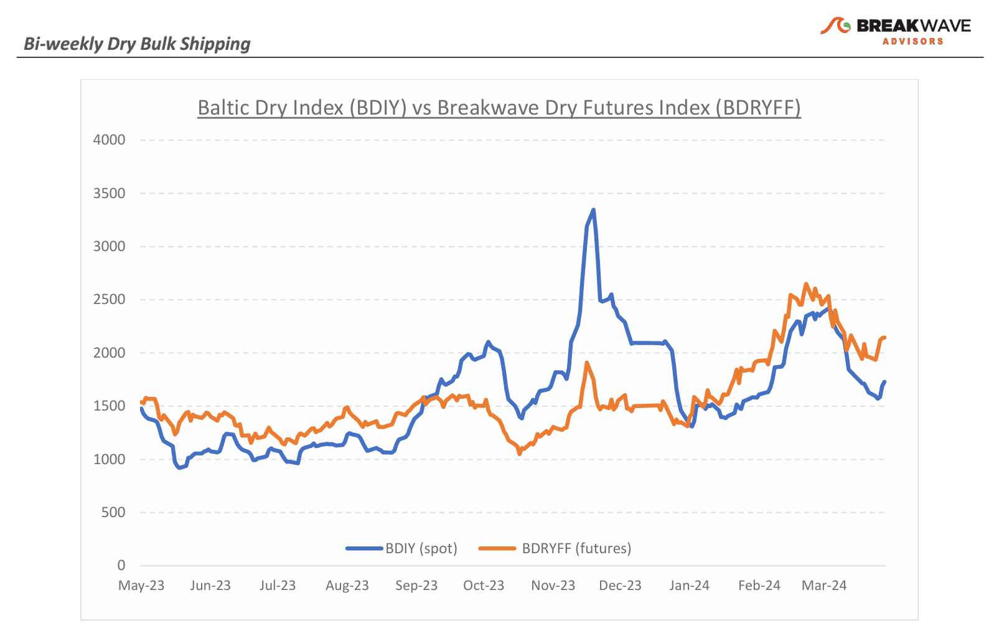
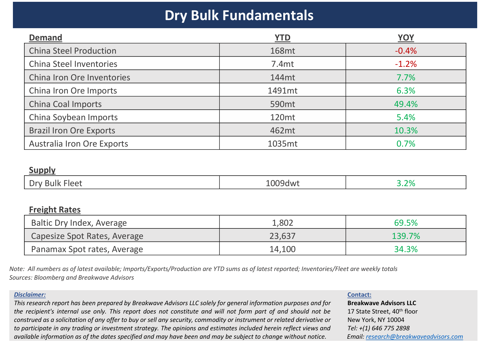

# Breakwave Bi-Weekly Dry Bulk Report - April 16, 2024

**Date:** April 16, 2024  
**Publisher:** Breakwave Advisors | **Category:** Market Insights  
**Original URL:** [https://www.breakwaveadvisors.com/insights/2024416dry](https://www.breakwaveadvisors.com/insights/2024416dry)  

---

> **Figure 1: Dryreporttop**  
> [Local Asset](file:///C:/Users/Dell/Github/Shipping/corpus/03-breakwave/insights/2024/assets/2024-04-16_2024416dry_img_dryreporttop_745d19241421.png)

**· Dry Bulk Rates Bounce, but Excitement seems to Fizzle as Market Balance Remains Unfavorable –**Following a ~50% drop over the last month, Capesize spot rates bounced back, and currently stand above the 20,000 mark once again. The**freight futures market**has remained**optimistic**throughout this recent correction, believing that rates will eventually turn higher, something that is indeed now happening. However, the**futures curve**keeps**steepening**further, with the May contract now trading some 30% above spot, supporting the belief that rates will continue to recover for the remainder of the year and beyond.**Iron ore trade**for the first quarter has been**exceptionally strong**, as good weather in Brazil led to five-year high iron ore exports from the country while**coal imports into China**continue to run at a surprisingly**strong rate**. Yet, extrapolating past trends in dry bulk trade has proven a wrong strategy, as the cyclicality of the shipping business usually translates to an inevitable**reversion to the mean**. Are we about to experience a slowdown in dry bulk trade, at least versus a strong first quarter adjusted base? Iron ore prices have declined, pointing to**weaker demand for the steelmaking material**while at the same time port inventories have been steadily increasing and stand above the five-year average levels (as well as higher compared to last year).**Coal trading**has been particularly strong, but once again, weather is about to get warmer in the northern hemisphere and thus**demand for heating tends to decline**. Signs of caution are ample, yet the most important factor when it comes to freight rates is**sentiment**, which**continues to run red hot**across all shipping sectors. Betting against sentiment has proven a costly investment strategy, and the**lukewarm fundaments**of the sector might have to wait a bit longer to harm futures prices, even in an environment where spot rates continue to underperform.

**· Iron Ore Prices follow Metals Markets Higher, but Fundamentals Remain Negative –**In the past few days, iron ore traders’ attention has turned away from a relatively**bearish fundamental picture**of the Chinese steel market, as global metal prices have staged an impressive rally on the back of renewed optimism around China, sanctions against Russian metals production, and a broader commodity run on geopolitical fears. Yet, the reasons that brought this market below the $100/ton mark are firmly in place and, if anything, are**getting worse**. We see**little reason to be optimistic**about iron ore prices, at least until we see some solid renewed demand for steel coming out of China, something that should originate primarily from better housing demand. For now, any**bounce**in iron ore will be**short lived**, and although it is difficult to pinpoint tops and troughs in commodities, our feeling is that we are close to a near-term inflection point that will bring an end to the recent mini rally and push prices back below $100/ton once again.

**· Our Long-term View****–**The last few years have been characterized by increased geopolitical uncertainty. Going forward, we expect such events to continue to affect global trade and have a meaningful impact on effective vessel supply. Combined with the potential for a multi-year rebound in China’s economic activity following the recent economic turmoil, dry bulk shipping should experience higher volatility on top of a secular tightness driven by increasing bulk commodity demand and a slower fleet growth as a result of a relatively low orderbook.

> **Figure 2: Dryreportchart**  
> [Local Asset](file:///C:/Users/Dell/Github/Shipping/corpus/03-breakwave/insights/2024/assets/2024-04-16_2024416dry_img_dryreportchart_91699a419fcf.png)

> **Figure 3: Dryreportbottom**  
> [Local Asset](file:///C:/Users/Dell/Github/Shipping/corpus/03-breakwave/insights/2024/assets/2024-04-16_2024416dry_img_dryreportbottom_a5f15b1a1f8c.png)

### Subscribe:
