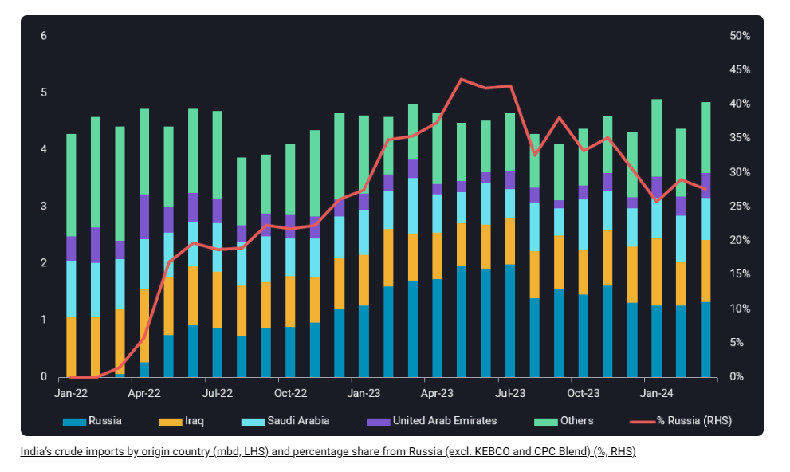
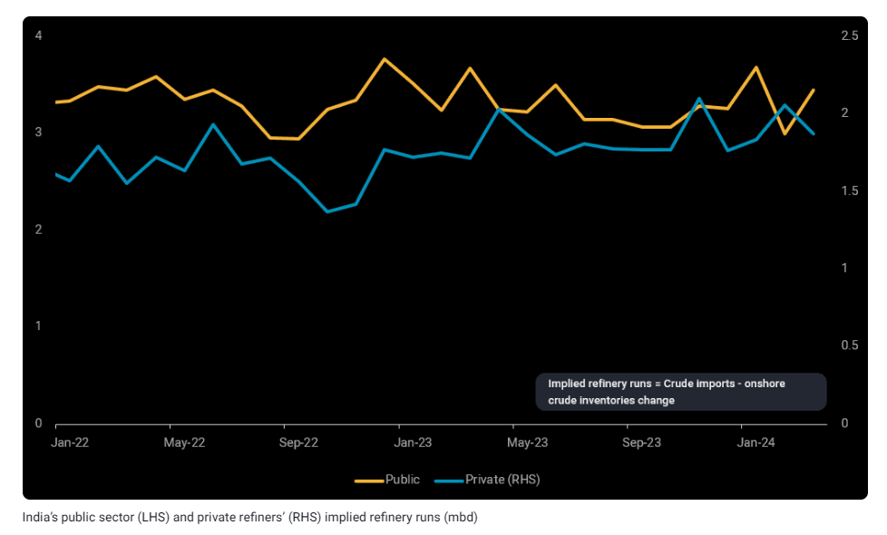

# Is the sun setting on Russia’s crude exports to India?

**Date:** April 17, 2024  
**Publisher:** Breakwave Advisors | **Category:** Market Insights  
**Original URL:** [https://www.breakwaveadvisors.com/insights/2024/4/17/is-the-sun-setting-on-russias-crude-exports-to-india](https://www.breakwaveadvisors.com/insights/2024/4/17/is-the-sun-setting-on-russias-crude-exports-to-india)  

---

India’s refiners are pivoting from Russian crude towards their traditional Middle Eastern crude diet, as Russia’s crude exports are facing growing headwinds.

*By*[*Serena Huang*](https://www.linkedin.com/in/serena-huang-2466b489/)

Over the past two years, Russia has rapidly risen up the ranks to establish itself as the largest crude supplier to India, displacing Iraq as the long-standing top exporter. At its peak in May 2023, Russian crude accounted for over 40% of India’s crude imports. But sentiments are shifting, with India’s imports of Russian crude slowing in the first three months of this year.

Russia’s crude market share in India fell to 28% last month, with growing US sanctions on Russia-related shipping companies and narrowing discounts of Russian Urals against Brent curbing Indian refiners’ interest in Russian crude. Between the private and public sector refiners, the latter have seen a larger decline in Russian crude imports, plummeting over 40% in March compared to its peak imports last June. The private sector refiners, in comparison, saw a 17% decline in March versus their highest in April 2023.

> **Figure 1: Στιγμιότυπο Οθόνης 2024 04 17 113413 Vort**  
> **Interactive Data & Source:** [Vortexa](https://www.vortexa.com//oil-gas-data-traders-analysts-data-scientists?gclid=Cj0KCQjw8_qRBhCXARIsAE2AtRZKOvMnbilZ_6_91d7huSFFy71pWLrnPwGwOHVzXsmsG-1a1mZnQw8aAt89EALw_wcB&hsa_acc=1782073842&hsa_ad=548425387665&hsa_cam=14746637662&hsa_grp=125038601902&hsa_kw=&hsa_mt=&hsa_net=adwords&hsa_src=g&hsa_tgt=dsa-1431852288425&hsa_ver=3&utm_campaign=%5BCD%5D%20-%20DSA%20-%20EMEA&utm_medium=cpc&utm_medium=ppc&utm_source=google&utm_source=adwords&utm_term=) | [Local Asset](file:///C:/Users/Dell/Github/Shipping/corpus/03-breakwave/insights/2024/assets/2024-04-17_is-the-sun-setting-on-russias-crude-exports-to-india_img_cea3cf84ceb9ceb3cebcceb9cf8ccf84cf85_ab4566b5d936.png)

Recent US sanctions on Russia’s state-owned shipping company, Sovcomflot, have curtailed India’s imports of Sokol crude. Inflows averaged 140kbd last year but declined to 30kbd over Q1 this year. The last Sokol cargo discharged in India on 5 April, with no new cargoes seen heading towards the country so far. Repercussions of US sanctions on Sovcomflot on India’s imports of Russian crude are limited, as the share of India’s imports of Russian crude delivered by its vessel fleet has averaged only 12% this year, with ample non-sanctioned fleet available for substitution for now.

Indian refiners are now pivoting back to Middle Eastern crude to supplement their lower Russian crude imports. Public sector refiners have increased their imports from Iraq, the UAE and Nigeria in the first three months of this year, compared to last June, the peak of their Russian crude imports. Meanwhile, the private refiners have turned towards purchasing more Saudi Arabian, US and UAE crude this year compared to last April. It is also worth highlighting that India’s imports of crude from Kuwait have almost dried in March, in line with the latter’s diversion of its crude to its domestic refinery and Oman’s Duqm refinery.

Using Vortexa’s crude imports and onshore crude inventories data, we have assessed that both private and public sector refiners have been running at full capacity this year, with crude runs at 1.88 and 3.45mbd in March respectively. Strong domestic demand coupled with ample export interest will likely keep refinery runs elevated in the near-term.

> **Figure 2: Στιγμιότυπο Οθόνης 2024 04 17 113621 Vortexa**  
> **Interactive Data & Source:** [Vortexa](https://www.vortexa.com//oil-gas-data-traders-analysts-data-scientists?gclid=Cj0KCQjw8_qRBhCXARIsAE2AtRZKOvMnbilZ_6_91d7huSFFy71pWLrnPwGwOHVzXsmsG-1a1mZnQw8aAt89EALw_wcB&hsa_acc=1782073842&hsa_ad=548425387665&hsa_cam=14746637662&hsa_grp=125038601902&hsa_kw=&hsa_mt=&hsa_net=adwords&hsa_src=g&hsa_tgt=dsa-1431852288425&hsa_ver=3&utm_campaign=%5BCD%5D%20-%20DSA%20-%20EMEA&utm_medium=cpc&utm_medium=ppc&utm_source=google&utm_source=adwords&utm_term=) | [Local Asset](file:///C:/Users/Dell/Github/Shipping/corpus/03-breakwave/insights/2024/assets/2024-04-17_is-the-sun-setting-on-russias-crude-exports-to-india_img_cea3cf84ceb9ceb3cebcceb9cf8ccf84cf85_f00f6076649e.png)

## Will Russia Strive to Recover Its Market Share in India?

Russia is threading a fine balance in its domestic production and crude pricing with many constraints to meet. Despite its keenness to maximise oil revenues, it may try to fulfil its OPEC production commitments, avoid attracting more punitive western sanctions and maintain buying interest of Asian refiners by pricing its crude at the right price point. Ensuring that it has stable crude export outlets has become even more critical at a time when a significant proportion of its refining capacity has been taken offline due to Ukrainian drone attacks amplifying scheduled refinery maintenance, with uncertainties on when they can be restored given historical dependencies on western manufacturers for replacement equipment. Negotiations on long-term contracts between Russian producers and Indian refiners are ongoing, and the outcome would provide a good baseline on Russian crude exports to India for the rest of this year.

Data Source:[Vortexa](https://www.vortexa.com//oil-gas-data-traders-analysts-data-scientists?gclid=Cj0KCQjw8_qRBhCXARIsAE2AtRZKOvMnbilZ_6_91d7huSFFy71pWLrnPwGwOHVzXsmsG-1a1mZnQw8aAt89EALw_wcB&hsa_acc=1782073842&hsa_ad=548425387665&hsa_cam=14746637662&hsa_grp=125038601902&hsa_kw=&hsa_mt=&hsa_net=adwords&hsa_src=g&hsa_tgt=dsa-1431852288425&hsa_ver=3&utm_campaign=%5BCD%5D%20-%20DSA%20-%20EMEA&utm_medium=cpc&utm_medium=ppc&utm_source=google&utm_source=adwords&utm_term=)

---

**Tags:** Oil, Shipping, Tankers  
