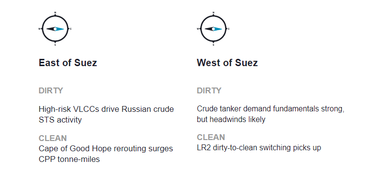
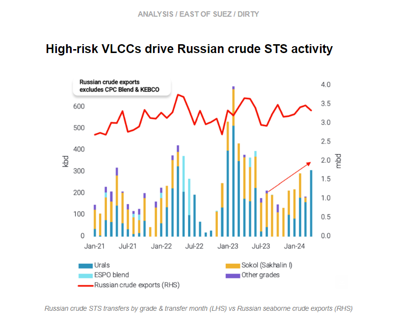
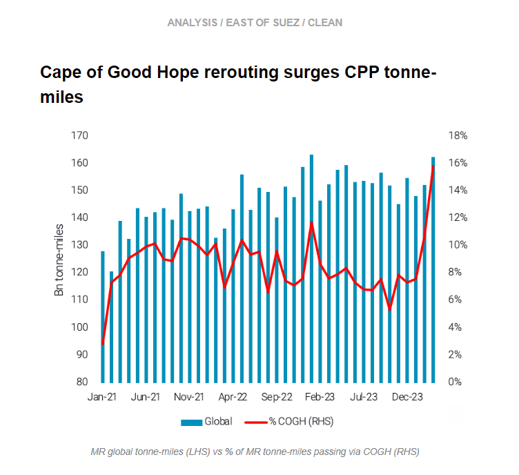
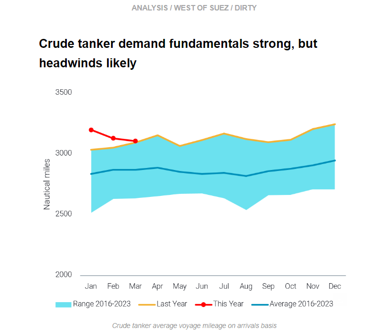
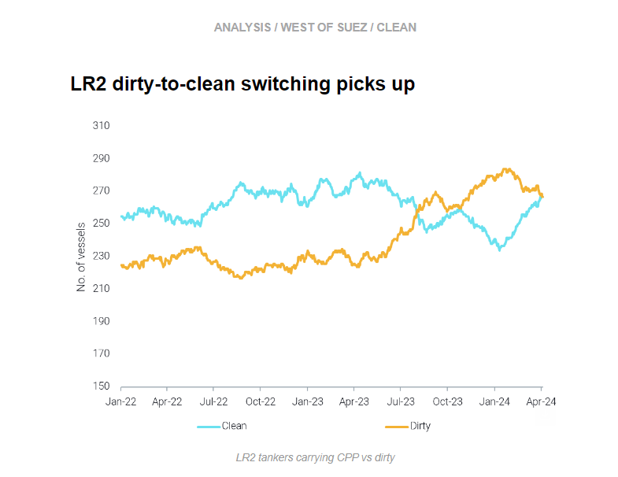

# High-risk VLCCs drive Russian crude STS activity || Crude tanker demand fundamentals strong, but headwinds likely

**Date:** April 18, 2024  
**Publisher:** Breakwave Advisors | **Category:** Market Insights  
**Original URL:** [https://www.breakwaveadvisors.com/insights/2024/4/18/7pv4plvvygl7696vai7leb4q6610t5](https://www.breakwaveadvisors.com/insights/2024/4/18/7pv4plvvygl7696vai7leb4q6610t5)  

---

This week, in the East, we discuss increasing Russian crude STS driven by VLCCs and how both MR and LR demand is benefiting from Red Sea rerouting. Over in the West, we examine why healthy crude tanker demand could have headwinds, and we look at the increasing rate of LR2s “cleaning up” and switching from dirty-to-clean.

*By*[*Mary Melton*](https://www.linkedin.com/search/results/all/?fetchDeterministicClustersOnly=true&heroEntityKey=urn%3Ali%3Afsd_profile%3AACoAABXVyecBtg-pRnIrZe0BoWk0ygPiUfbvhsw&keywords=mary%20melton&origin=RICH_QUERY_SUGGESTION&position=0&searchId=40e8d7d2-c4d0-4022-81e7-176f6eba418b&sid=H_Y&spellCorrectionEnabled=false)

> **Figure 1: Στιγμιότυπο Οθόνης 2024 04 18 095641**  
> **Interactive Data & Source:** [Marketingmail Vortexa](https://marketingmail.vortexa.com/ODM3LU1aRS01NzgAAAGSi6b_63aINpNugWDXMPTpKS_qbfcnJ21Xuwf-lay4gYMFp-Ukhr5VrUw2nZvi_pVN57rawWU=) | [Local Asset](file:///C:/Users/Dell/Github/Shipping/corpus/03-breakwave/insights/2024/assets/2024-04-18_7pv4plvvygl7696vai7leb4q6610t5_img_cea3cf84ceb9ceb3cebcceb9cf8ccf84cf85_5273802bd2db.png)

> **Figure 2: Στιγμιότυπο Οθόνης 2024 04 18 100947**  
> **Interactive Data & Source:** [Marketingmail Vortexa](https://marketingmail.vortexa.com/ODM3LU1aRS01NzgAAAGSi6b_63aINpNugWDXMPTpKS_qbfcnJ21Xuwf-lay4gYMFp-Ukhr5VrUw2nZvi_pVN57rawWU=) | [Local Asset](file:///C:/Users/Dell/Github/Shipping/corpus/03-breakwave/insights/2024/assets/2024-04-18_7pv4plvvygl7696vai7leb4q6610t5_img_cea3cf84ceb9ceb3cebcceb9cf8ccf84cf85_8d876b541b69.png)

- [Russian Urals STS activity reached 310kbd in April (days 1-15)](https://marketingmail.vortexa.com/ODM3LU1aRS01NzgAAAGSi6b_63aINpNugWDXMPTpKS_qbfcnJ21Xuwf-lay4gYMFp-Ukhr5VrUw2nZvi_pVN57rawWU=), a 10-month high. VLCCs have been the driving force behind Russian Urals STS activity moving upwards in recent months. More than 60% of the Urals transferred in April were because of VLCCs loading via STS from Aframaxes, which increased STS volumes (three Aframaxes feed one VLCC) ([read more here](https://marketingmail.vortexa.com/ODM3LU1aRS01NzgAAAGSi6b_65eR9Tx9NlpNcz0ZlX3I8clv1b69GXWSTH2kfhd8Otu8Un74TMmVlYo1x2fOwa1BAKk=)).

- In 2024 so far, we have observed[nine VLCCs transfer Russian crude via STS](https://marketingmail.vortexa.com/ODM3LU1aRS01NzgAAAGSi6b_61xRHpzRsC75meBlmhg2JxYkkQQwVsx6Cpl0U8pYNmGm1T2RcBrPMPlKIY6Q2KkkWP4=). All nine of these VLCCs have previously been involved in Iranian and/or Venezuelan trade (the latter being whilst under sanctions/before 18th Oct 2023). This return of these VLCCs to the Russian trade suggests there is surplus tonnage in the VLCC segment of the opaque fleet and a tightness on the Afra/Suez fleet carrying Russian crude.
- Even if Venezuela sanctions are reintroduced from tomorrow (18th April) onwards, there is still likely to be surplus VLCC tonnage in this fleet, which could carry Russian volumes in the continually shrinking Russian fleet. As Russian crude exports have continued to remain at the top of the seasonal range, it is likely that VLCCs will need to be utilised to maximise logistical efficiency on these longer voyages in order to keep smaller tonnage (Aframaxes) closer to the Baltics.

> **Figure 3: Στιγμιότυπο Οθόνης 2024 04 18 100001**  
> **Interactive Data & Source:** [Marketingmail Vortexa](https://marketingmail.vortexa.com/ODM3LU1aRS01NzgAAAGSi6b_6xnfM7YwlkiQVqUR0Yht_zY8pPR1NthMD10GuOWi3I6_cuXRhBP7r3z3B8N8lwei12I=) | [Local Asset](file:///C:/Users/Dell/Github/Shipping/corpus/03-breakwave/insights/2024/assets/2024-04-18_7pv4plvvygl7696vai7leb4q6610t5_img_cea3cf84ceb9ceb3cebcceb9cf8ccf84cf85_40eef079ac11.png)

- East to West CPP flows via the Cape of Good Hope (COGH) have become the new norm as Bal-el Mandeb transits for clean tankers continue to be 70% down from late November figures, with no upside on the horizon at the moment.

- This rerouting has assisted MRs in reaching[all-time highs in tonne-miles](https://marketingmail.vortexa.com/ODM3LU1aRS01NzgAAAGSi6b_6xnfM7YwlkiQVqUR0Yht_zY8pPR1NthMD10GuOWi3I6_cuXRhBP7r3z3B8N8lwei12I=)in March. COGH transits have[added 8%](https://marketingmail.vortexa.com/ODM3LU1aRS01NzgAAAGSi6b_6zpNMKZ6yMasINoe76-2m0CX9Ida29wmlO6Eo2i3LxjVxz_5OWa-RSW7a7jJuexgru4=)to global tonne-miles since the Red Sea attacks (essentially doubling their contribution), which is similar to the m-o-m overall increase for the vessel class.
- At the same time COGH transits are becoming ever more important for LRs,[contributing almost half of global tonne-mile demand](https://marketingmail.vortexa.com/ODM3LU1aRS01NzgAAAGSi6b_6zFzcO7fPRc4xfD8_SwVhPTTW_M-_2Yln_GTifuzKDypy6yjt8Aq7Ga6iwMUEViV8I4=), as naphtha flows are weakening amidst economics and steam cracker maintenance in Asia.

> **Figure 4: Στιγμιότυπο Οθόνης 2024 04 18 100141**  
> **Interactive Data & Source:** [Marketingmail Vortexa](https://marketingmail.vortexa.com/ODM3LU1aRS01NzgAAAGSi6b_6wlDmQySH5rPz8jfbzl8e7rz4Vzk2qup6i8uEZpett8k9o1wFBEEspSxzHsBvb_hCxA=) | [Local Asset](file:///C:/Users/Dell/Github/Shipping/corpus/03-breakwave/insights/2024/assets/2024-04-18_7pv4plvvygl7696vai7leb4q6610t5_img_cea3cf84ceb9ceb3cebcceb9cf8ccf84cf85_97107774f9f7.png)

- The crude tanker market is performing at healthy levels. However, to a certain extent both voyage counts and average voyage mileage are declining since the start of 2024. This is influencing the trajectory of freight rates for the main crude tanker classes (VLCCs, Suezmax, Aframax) which are hovering near or slightly below 2023 average levels according to our freight rate index.

- This must be caveated with how well these segments are performing from a historical perspective. The levels of freight rates are persistently high, even though rates may be trending downwards. Additionally, in March[crude tanker average voyage mileage](https://marketingmail.vortexa.com/ODM3LU1aRS01NzgAAAGSi6b_6wlDmQySH5rPz8jfbzl8e7rz4Vzk2qup6i8uEZpett8k9o1wFBEEspSxzHsBvb_hCxA=)was at a seasonal all-time high, and[voyage counts](https://marketingmail.vortexa.com/ODM3LU1aRS01NzgAAAGSi6b_614ddCRgEeTiSvm8M0_jKz4fwGzI6T9XyHJMZub6BCoV8iOOAUYMse77aqXDzDh5UHM=)were only slightly below the seasonal high from 2016-2023.
- Moving forward, VLCC mileage appears likely to decline due to increasing shorter-haul voyages from MEG-to-Asia at the expense of Atlantic Basin-to-Asia voyages. Aframaxes are also positioned to lose out from increasing tonnage entering mainstream trades from Russian trade and after the likely reimposition of Venezuela sanctions. Suezmaxes are currently the bright spot in the crude fleet, with[employment around all-time highs](https://marketingmail.vortexa.com/ODM3LU1aRS01NzgAAAGSi6b_6y_6gn8W7-c3DX1ujNGKKrxhJo-MKZXN_mbLJK7zzF7k73ZzdvNis-JH4GQo_1i3zxM=)and healthy demand prospects in the Atlantic Basin and MEG-to-Europe trade.

> **Figure 5: Στιγμιότυπο Οθόνης 2024 04 18 100327**  
> **Interactive Data & Source:** [Marketingmail Vortexa](https://marketingmail.vortexa.com/ODM3LU1aRS01NzgAAAGSi6b_6yE_MQDSISuxysacARxyQiN3VGiiNxybR2tjeEzEUZQbHxFXew_FhqrKEgyslH16bzI=) | [Local Asset](file:///C:/Users/Dell/Github/Shipping/corpus/03-breakwave/insights/2024/assets/2024-04-18_7pv4plvvygl7696vai7leb4q6610t5_img_cea3cf84ceb9ceb3cebcceb9cf8ccf84cf85_37f921806673.png)

- Last week we discussed downside risks to[Aframax prospects in Q2](https://marketingmail.vortexa.com/ODM3LU1aRS01NzgAAAGSi6b_6yE_MQDSISuxysacARxyQiN3VGiiNxybR2tjeEzEUZQbHxFXew_FhqrKEgyslH16bzI=), mainly increased tonnage competing in mainstream trades and weaker demand for voyages on Aframaxes US-to-Europe. In contrast, fundamentals in the LR2 market are robust, with[laden voyage counts at record-setting highs](https://marketingmail.vortexa.com/ODM3LU1aRS01NzgAAAGSi6b_68T3JCcERpNnvckaooniyy34n6KJDmMVyvtwz20FkVbdGCmz0apL0zFz4AmU95LB_8s=)and freight rates well-above 2023 averages.

- After many LR2s switched from carrying CPP to crude/DPP in 2023 because of strong Aframax fundamentals due to Russian flows reshuffling, the trend is now reversing as a result of the Red Sea crisis. Beginning mid-Jan the number of LR2s carrying CPP stopped declining and increased, and the split between LR2s[trading clean](https://marketingmail.vortexa.com/ODM3LU1aRS01NzgAAAGSi6b_6_eRA-40z0IfWq1mOW03loOgs3Dsb8ZVq2wGZzJefi5PkfnYi4oMGWKrkoeepP2RGqI=)and[dirty](https://marketingmail.vortexa.com/ODM3LU1aRS01NzgAAAGSi6b_6zt_W2QAhFe34eggA5slB1IdsliSpVr8uVXLKPuX_U5dIH_0V7W8b-rCv5QmHxh5Xss=)is currently at par.
- Naphtha demand is not particularly strong and could result in weak demand for voyages MEG-to-NE Asia moving forward. However, the continued prospect of high tonne-miles and rates for LR voyages due to rerouting around the Cape of Good Hope will likely absorb the vessels switching from dirty-to-clean. Ultimately, this could alleviate some excess tonnage in the Aframax market and provide a silver lining for the segment.

Data Source:[Vortexa](https://www.vortexa.com//oil-gas-data-traders-analysts-data-scientists?gclid=Cj0KCQjw8_qRBhCXARIsAE2AtRZKOvMnbilZ_6_91d7huSFFy71pWLrnPwGwOHVzXsmsG-1a1mZnQw8aAt89EALw_wcB&hsa_acc=1782073842&hsa_ad=548425387665&hsa_cam=14746637662&hsa_grp=125038601902&hsa_kw=&hsa_mt=&hsa_net=adwords&hsa_src=g&hsa_tgt=dsa-1431852288425&hsa_ver=3&utm_campaign=%5BCD%5D%20-%20DSA%20-%20EMEA&utm_medium=cpc&utm_medium=ppc&utm_source=google&utm_source=adwords&utm_term=)

---

**Tags:** Shipping, Crude Oil, Tankers  
