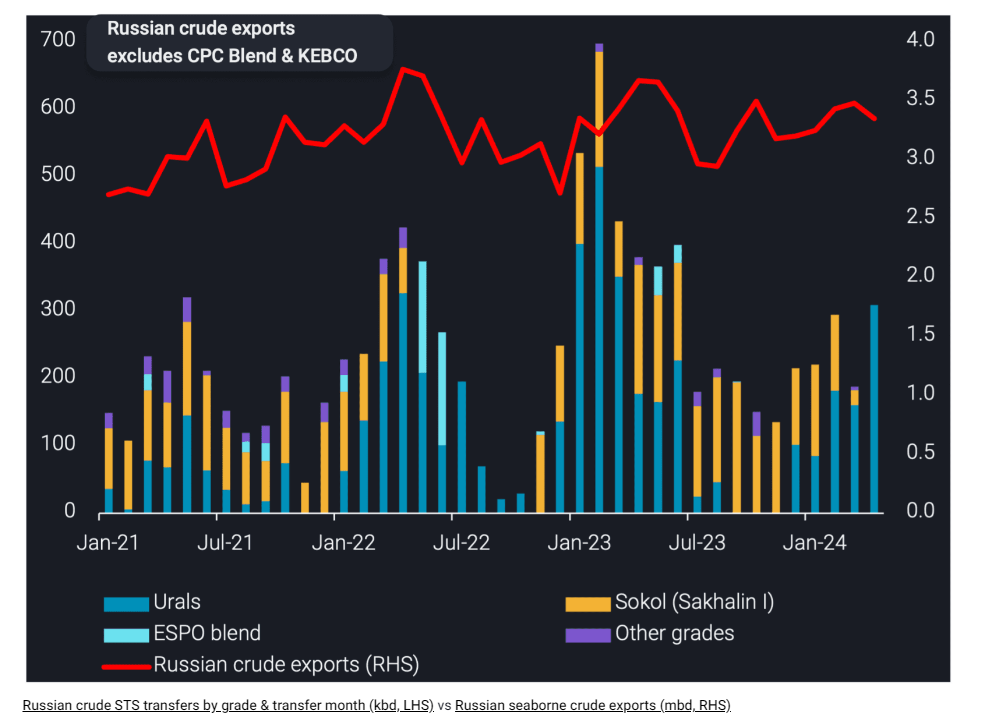
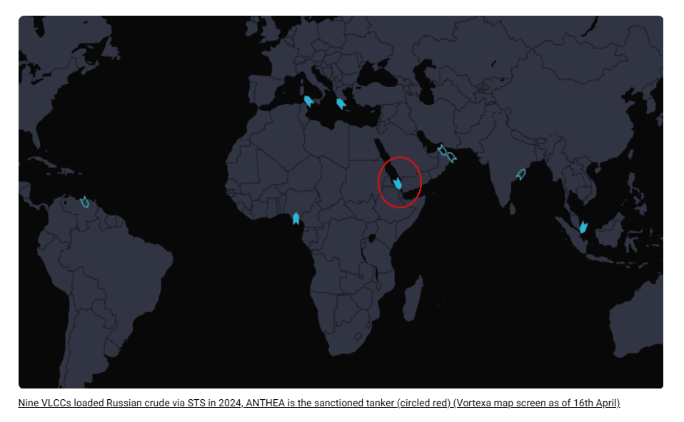

# High-risk VLCCs drive Russian crude STS activity

**Date:** April 19, 2024  
**Publisher:** Breakwave Advisors | **Category:** Market Insights  
**Original URL:** [https://www.breakwaveadvisors.com/insights/2024/4/17/high-risk-vlccs-drive-russian-crude-sts-activity](https://www.breakwaveadvisors.com/insights/2024/4/17/high-risk-vlccs-drive-russian-crude-sts-activity)  

---

This insight discusses the increase in Russian crude STS activity driven by VLCCs and delves into the fleet profiles.

*By*[*Armen Azizian*](https://www.linkedin.com/in/armenazizian/)

## Russian Crude Sts Transfers Reach 10-Month High

Russian crude STS activity (excluding CPC Blend & KEBCO) reached 310kbd in April (days 1-15), a 120kbd increase m-o-m and a 10-month high. Russian Urals is the sole grade transferred via STS in April so far, which has reached a 12-month high.

VLCCs have been the driving force behind Russian Urals STS activity moving upwards in recent months, especially in April. More than 60% of the Urals transferred in April were because of VLCCs loading via STS from Aframaxes, which increased the STS volumes (three Aframaxes feed one VLCC). These STS operations took place offshore Kalamata (Greece) and Port Said (Egypt).

The economies of scale incentivise STS transfers of Russian crude from smaller sized tankers to VLCCs, which will travel further (most likely East) as opposed to sending Aframaxes to sail directly (which would result in less tonnage availability near Russian ports). The VLCCs can either sail via the Cape of Good Hope if fully laden or via the Suez Canal if half-laden.

It’s important to note there have been no STS transfers of Sokol in April so far, the first time this occurred since October 2022. This is likely a function of[US sanctions on Sovcomflot tankers](https://www.vortexa.com/insights/crude/exclusive-report-sanctions-impact-review-of-russian-crude-flows-to-asia/?utm_source=Homepage-banner&utm_medium=Banner&utm_campaign=3000.RussianCrudeFlows_ExclusiveReport), which were transferring Sokol in Q4 before entering floating storage due to issues with buyers. Since these tankers discharged Sokol in China in March, they have been left largely idle, bringing STS volumes of Sokol down with them.

> **Figure 1: Vortexa 17 04**  
> **Interactive Data & Source:** [Vortexa](https://www.vortexa.com/insights/crude/new-key-locations-emerging-for-russian-urals-sts-activity/) | [Local Asset](file:///C:/Users/Dell/Github/Shipping/corpus/03-breakwave/insights/2024/assets/2024-04-19_high-risk-vlccs-drive-russian-crude-sts-activity_img_vortexa1704_1c91e356218a.png)

## VLCC Profiles Suggest Spare Capacity in the Opaque Fleet

In 2024 so far, we have observed nine VLCCs transfer Russian crude via STS. All nine of these VLCCs have previously been involved in Iranian and/or Venezuelan trade (the latter being whilst under sanctions/before 18th October 2023). They average 20 years old (the same average age observed when[offshore Ceuta became a STS hotspot in 2023](https://www.vortexa.com/insights/crude/new-key-locations-emerging-for-russian-urals-sts-activity/)) with the oldest tanker being 24 years old. Five of the nine VLCCs are Panama-flagged.

This return of VLCCs to the Russian trade, specifically these tankers involved in the sanctioned trade, suggests there is surplus tonnage in the VLCC segment of the opaque fleet. When the US lifted sanctions from Venezuela temporarily in October, there was idle VLCC tonnage which found its way into Russian trade, especially because Merey was no longer trading at deep discounts. Iran’s VLCC fleet has also doubled since 2021, with spare capacity available for switching into the Russian trade whilst sustaining its own crude/condensate exports.

These VLCCs have largely been sailing to China, but there have been exceptions. The ERECTOR discharged Sokol in India in early April. ERECTOR was the final leg in a STS chain involving three tankers offshore Yeosu. Another notable tanker is the LIGERA, which loaded Urals via STS offshore Kalamata and discharged to MARBELLA offshore Amuay, Venezuela, which has since been discharging to smaller tankers via STS for refinery feedstock in Cardon and Amuay. This was the first Urals cargo to be consumed by a Venezuelan refinery.

One of these nine tankers is now sanctioned by the US (circled red). This VLCC loaded 1.2mb of Russian Urals via STS before it was sanctioned and is now sailing southbound in the Red Sea, declaring for Singapore. It is probable that this tanker will sail to offshore Malaysia for STS to a non-sanctioned tanker, which could then take the cargo to its end buyer. This supports the high-risk profile of these VLCCs and the potential logistical constraints facing buyers of these barrels, which is causing STS operations to increase on VLCCs.

> **Figure 2: Vortexa 2 17 Apr**  
> **Interactive Data & Source:** [Vortexa](https://www.vortexa.com//oil-gas-data-traders-analysts-data-scientists?gclid=Cj0KCQjw8_qRBhCXARIsAE2AtRZKOvMnbilZ_6_91d7huSFFy71pWLrnPwGwOHVzXsmsG-1a1mZnQw8aAt89EALw_wcB&hsa_acc=1782073842&hsa_ad=548425387665&hsa_cam=14746637662&hsa_grp=125038601902&hsa_kw=&hsa_mt=&hsa_net=adwords&hsa_src=g&hsa_tgt=dsa-1431852288425&hsa_ver=3&utm_campaign=%5BCD%5D%20-%20DSA%20-%20EMEA&utm_medium=cpc&utm_medium=ppc&utm_source=google&utm_source=adwords&utm_term=) | [Local Asset](file:///C:/Users/Dell/Github/Shipping/corpus/03-breakwave/insights/2024/assets/2024-04-19_high-risk-vlccs-drive-russian-crude-sts-activity_img_vortexa217apr_16da575ec548.png)

Data Source:[Vortexa](https://www.vortexa.com//oil-gas-data-traders-analysts-data-scientists?gclid=Cj0KCQjw8_qRBhCXARIsAE2AtRZKOvMnbilZ_6_91d7huSFFy71pWLrnPwGwOHVzXsmsG-1a1mZnQw8aAt89EALw_wcB&hsa_acc=1782073842&hsa_ad=548425387665&hsa_cam=14746637662&hsa_grp=125038601902&hsa_kw=&hsa_mt=&hsa_net=adwords&hsa_src=g&hsa_tgt=dsa-1431852288425&hsa_ver=3&utm_campaign=%5BCD%5D%20-%20DSA%20-%20EMEA&utm_medium=cpc&utm_medium=ppc&utm_source=google&utm_source=adwords&utm_term=)

---

**Tags:** Shipping, Crude Oil, Tankers  
