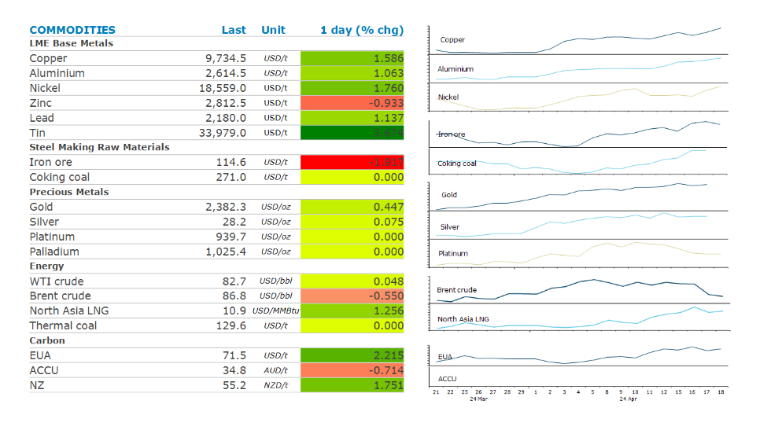
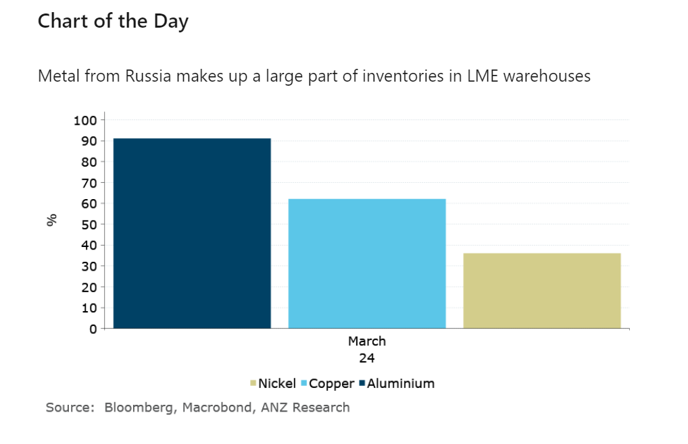

# Metals gains following sanctions on Russian supply

**Date:** April 19, 2024  
**Publisher:** Breakwave Advisors | **Category:** Market Insights  
**Original URL:** [https://www.breakwaveadvisors.com/insights/2024/4/19/metals-gains-following-sanctions-on-russian-supply](https://www.breakwaveadvisors.com/insights/2024/4/19/metals-gains-following-sanctions-on-russian-supply)  

---

Supply disruption across the metals sector continues to provide support. Oil markets were on edge as it waits for Israels response to Iran’s recent attack.

*By*[*Daniel Hynes*](https://www.linkedin.com/in/dahynes/)

> **Figure 1: Στιγμιότυπο Οθόνης 2024 04 19 101419**  
> [Local Asset](file:///C:/Users/Dell/Github/Shipping/corpus/03-breakwave/insights/2024/assets/2024-04-19_metals-gains-following-sanctions-on-russian-supply_img_cea3cf84ceb9ceb3cebcceb9cf8ccf84cf85_07eecbc891f3.png)

The rally across the**base metals**continued amid fears of tightening supplies. Tin led the gains as a slew of supply disruptions from Southeast Asia to Africa have led one market participant to build a holding of 40% of long positions for LME tin contracts for May delivery. In other metals, there were large orders to withdraw metal from LME warehouses as the market adjusts to the US and UK bans on Russian metals. Trade flows for these metals were already adjusting to European, UK and US sanctions on Russia following its invasion of Ukraine in 2022. Increasing amounts have found their way to Asia. However, there has also been a build-up of Russian-origin metal in LME warehouses, including off-warrant material. LME’s position as the global hub of metals trading means these bans could cause disruption to trade flows in the short term. This comes amid already tight markets, which should[**support prices in the short term**](../pdfs/2024-04-19_metals-gains-following-sanctions-on-russian-supply_commodity-call-sanctioned-metals_7070ad848de0.pdf). However, we expect the sanctions to only temporarily disrupt supply. Moreover, premiums in certain regions (such as Europe) are likely to rise as the pool of non-sanction metal shrinks rapidly.

**Gold**gained despite positive economic data lowering expectations of an imminent rate cut by the Fed. Initial jobless claims in the US remain subdued last week, suggesting a healthy job market. Meanwhile, the Philadelphia Fed gauge of manufacturing activity beat expectations. Fed speakers were also hawkish, with John Williams saying there was no urgency to cut. Raphael Bostic doesn’t expect policy easing until year end. This saw the Treasury selloff deepen, with 10y yields rising. Signs of sluggish physical demand also failed to dent sentiment. Swiss gold exports were down 6.6% m/m in March, driven by a sharp slowdown in sales to India. Nevertheless, investor safe haven buying remains strong amid elevated geopolitical risks.

**Iron ore**futures fell as the US placed new restrictions on Chinese steel. The US is tripling the existing 7.5% tariff on Chinese steel imports. It’s also placing pressure on Mexico to prevent China from shipping steel to the US via its ports. However, the move is unlikely to have an impact on the steel market, with the US only a very small part of Chinese exports.

**Crude oil**prices fluctuated as a stronger USD offset rising tensions in the Middle East. Iran warned Israel against attacking its nuclear facilities, threatening to respond in kind if its atomic sites are targeted. The market has been on edge since Iran launched a missile and drone attack on the Jewish state over the weekend. Israel’s response could determine whether oil supplies are ultimately under threat. Elsewhere, ongoing disruptions remain high. The US announced it has reinstated sanctions on Venezuela’s oil industry, which could disrupt its 600kb/d exports. Mexico also cut back exports due to strong domestic demand.

**Global gas**markets were higher amid signs of stronger demand.**North Asian LNG**spot prices found support as buyers look to counter power shortages forecast for the summer. Supply disruptions also remain a risk, creating an urgency for spot LNG cargoes.

> **Figure 2: Στιγμιότυπο Οθόνης 2024 04 19 101606**  
> **Interactive Data & Source:** [Linkedin](https://www.linkedin.com/newsletters/commodities-wrap-6692196755876012032/?fbclid=IwAR3kiXJqZdxmp9ZcRwBNI7FsBySI-XSC0pfPur1qzjt7OZp7PTE59Tsl1QI) | [Local Asset](file:///C:/Users/Dell/Github/Shipping/corpus/03-breakwave/insights/2024/assets/2024-04-19_metals-gains-following-sanctions-on-russian-supply_img_cea3cf84ceb9ceb3cebcceb9cf8ccf84cf85_69a3780ac7fe.png)

Data source:[Commodities Wrap](https://www.linkedin.com/newsletters/commodities-wrap-6692196755876012032/?fbclid=IwAR3kiXJqZdxmp9ZcRwBNI7FsBySI-XSC0pfPur1qzjt7OZp7PTE59Tsl1QI)

---

**Tags:** Commodities, Crude Oil, Ironore  
