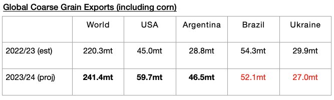
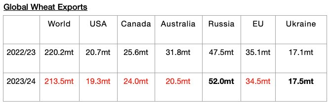
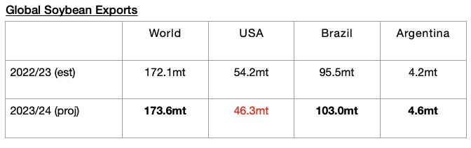
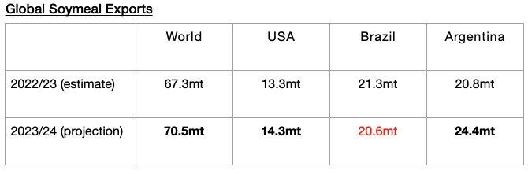

# Global Grain Trade Forecast Raised Again

**Date:** April 22, 2024  
**Publisher:** Breakwave Advisors | **Category:** Market Insights  
**Original URL:** [https://www.breakwaveadvisors.com/insights/2024/4/22/global-grain-trade-forecast-raised-again](https://www.breakwaveadvisors.com/insights/2024/4/22/global-grain-trade-forecast-raised-again)  

---

*By*[*Jeffrey Landsberg*](https://www.linkedin.com/in/jeffrey-landsberg-70ab957/)

As we first discussed for our subscribers in Commodore Research's April 15th Weekly Dry Bulk Report, the United States Department of Agriculture (USDA) is now predicting that global coarse grain, wheat, soybean, and soymeal exports in 2023/24 will collectively total 699 million tons. This is 100,000 tons more than the USDA predicted a month ago and would mark a year-on-year increase of 19.1 million tons (3%). The USDA's forecast for global grain exports has now been raised during each of the last six months.

The USDA is now forecasting that global coarse grain exports in 2023/24 will total 241.4 million tons. This is 1.8 million tons (-1%) less than was predicted a month ago but is up year-on-year by 21.1 million tons (10%). Coarse grain will continue to serve as the dry bulk market’s largest volume grain cargo and is still expected to experience the largest year-on-year increase in exports. Significant year-on-year increases are still expected for both Argentinean coarse grain exports and US coarse grain exports. Significant strength in coarse grain import demand is still expected for China due to stronger consumption and greater stockpiling.

> **Figure 1: Chart 1**  
> [Local Asset](file:///C:/Users/Dell/Github/Shipping/corpus/03-breakwave/insights/2024/assets/2024-04-22_global-grain-trade-forecast-raised-again_img_chart1_d5cf12dce019.jpg)

Global wheat exports in 2023/24 are now expected to total 213.5 million tons. This is 1.4 million tons (1%) more than was predicted a month ago but is down year-on-year by 6.7 million tons (-3%). Year-on-year declines in wheat exports are expected from the United States, Canada, Australia, and the European Union. Year-on-year increases in wheat exports are expected from Russia and Ukraine. New is that a month ago, a year-on-year decline was expected from Ukraine and a year-on-year increase was expected from the European Union.

> **Figure 2: Chart 2**  
> [Local Asset](file:///C:/Users/Dell/Github/Shipping/corpus/03-breakwave/insights/2024/assets/2024-04-22_global-grain-trade-forecast-raised-again_img_chart2_d642ad4d729f.jpg)

Global soybean exports in 2023/24 are now expected to total 173.6 million tons, which is unchanged from a month ago and up year-on-year by 1 million tons. A large year-on-year decline in soybean exports is still expected from the United States. Brazil is still expected to see their exports increase by a large amount, and Argentina is still expected to see their exports rise by a relatively small amount.

> **Figure 3: Chart 3**  
> [Local Asset](file:///C:/Users/Dell/Github/Shipping/corpus/03-breakwave/insights/2024/assets/2024-04-22_global-grain-trade-forecast-raised-again_img_chart3_29e14e5947ff.jpg)

Global soymeal exports in 2023/24 are now expected to total 70.5 million tons, which is 500,000 tons (1%) more than was predicted a month ago and is up year-on-year by 3.2 million tons (5%) Only Argentina is expected to see a significant year-on-year change in soybean exports. Their exports are still expected to rise year-on-year by 3.6 million tons (17%).

> **Figure 4: Chart 4**  
> [Local Asset](file:///C:/Users/Dell/Github/Shipping/corpus/03-breakwave/insights/2024/assets/2024-04-22_global-grain-trade-forecast-raised-again_img_chart4_725d7a428fa6.jpg)

---

**Tags:** Drybulk, Economy, Grains  
