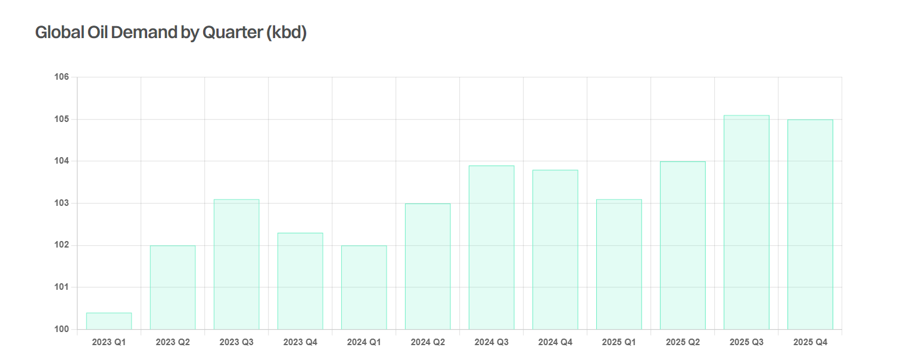

# Looking into 2025

**Date:** April 24, 2024  
**Publisher:** Breakwave Advisors | **Category:** Market Insights  
**Original URL:** [https://www.breakwaveadvisors.com/insights/2024/4/24/looking-into-2025](https://www.breakwaveadvisors.com/insights/2024/4/24/looking-into-2025)  

---

> **Figure 1: Tankers 3 Square**  
> **Interactive Data & Source:** [Gibsons Co](https://www.gibsons.co.uk/market-reports) | [Local Asset](file:///C:/Users/Dell/Github/Shipping/corpus/03-breakwave/insights/2024/assets/2024-04-24_looking-into-2025_img_tankers-3-square_62842be147f5.jpg)

Earlier this month the IEA released its monthly oil report, offering for the first time their analysis of how oil markets could shape up in 2025. The agency expects global oil demand to grow by 1.1 mbd next year, just marginally below 1.2 mbd expected in 2024. Despite the accelerating uptake of clean energy technologies, projected growth in demand in 2025 is reasonably robust, in line with average growth rates seen since 2011. Demand growth will continue to be led by non-OECD countries; however, China’s share of total increase will decline significantly due to a rapid domestic uptake of electric vehicles and high-speed rail as the country’s post-lockdown rebound dwindles. China’s demand is projected to account for just 27% of non-OECD demand growth next year, compared to 43% in 2024 and 80% last year. Strong demand growth next year is also seen in India, other developing Asian economies and the Middle East. Total OECD demand will see just a marginal drop, with the decline in European consumption decelerating notably as economic conditions improve.

On the supply side, the IEA expects continued robust gain in non-OPEC production, led by the US, Brazil, Guyana and Canada. The US will once again be the largest contributor, although growth rates will continue to slow. Total non-OPEC supply is forecast to rise by 1.4 mbd in 2025, outstripping the increase in oil demand, which indicates an even smaller call on OPEC+ supply and highlights the risk of extended OPEC+ production constrain.

The refining landscape is set for further changes next year, with higher-cost operators feeling the pressure. European crude refining runs are projected to decline by 300 kbd due to announced capacity closures at the Grangemouth and Wesseling plants, whilst LyondellBasell also plans to close its 260 kbd Houston refinery by spring 2025. Mexico’s 340 kbd Olmeca refinery, intended to meet domestic demand, is anticipated to start operating in 2025, whilst the IEA is also pencilling in a 300 kbd gain in Africa’s throughput in 2024 and another 300 kbd in 2025 as the 650kbd Dangote plant ramps up operations.

East of Suez, China’s refining runs are projected to rise by 200 kbd next year and India’s throughput is projected to grow by 190 kbd. In the Middle East, refining runs are likely to grow by just 100 kbd next year, although throughput could increase by 0.7 mbd this year as newly commissioned plants ramp up operations.

Overall, the IEA’s 2025 projections are a mixed bag of news for the tanker market. It is largely positive for the crude segment, particularly considering increases in oil supply in the Americas and rising demand in the East. For the product tanker market, it is not such a clear cut. The anticipated decline in European crude throughput will support incremental import demand but will be more than offset by declining imports into West Africa and Mexico.

> **Figure 2: Στιγμιότυπο Οθόνης 2024 04 24 095844**  
> **Interactive Data & Source:** [Gibsons Co](https://www.gibsons.co.uk/market-reports) | [Local Asset](file:///C:/Users/Dell/Github/Shipping/corpus/03-breakwave/insights/2024/assets/2024-04-24_looking-into-2025_img_cea3cf84ceb9ceb3cebcceb9cf8ccf84cf85_119417fb0500.png)

Data source:[Gibson Shipbrokers](https://www.gibsons.co.uk/market-reports)

---

**Tags:** Tankers, Shipping, Crude Oil  
