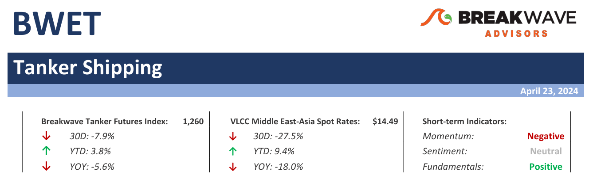
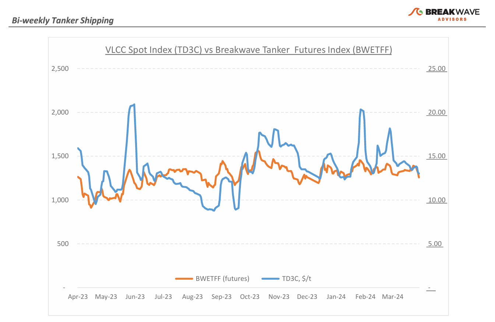
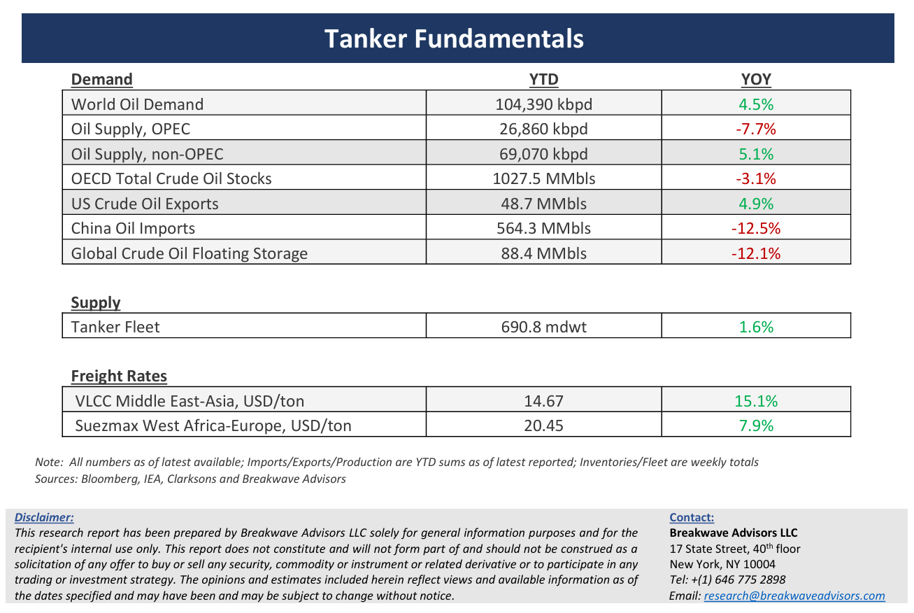

# Breakwave Bi-Weekly Tanker Report - April 23, 2024

**Date:** April 25, 2024  
**Publisher:** Breakwave Advisors | **Category:** Market Insights  
**Original URL:** [https://www.breakwaveadvisors.com/insights/2024423wet-Dphxd](https://www.breakwaveadvisors.com/insights/2024423wet-Dphxd)  

---

> **Figure 1: Tankerreporttop**  
> [Local Asset](file:///C:/Users/Dell/Github/Shipping/corpus/03-breakwave/insights/2024/assets/2024-04-25_2024423wet-dphxd_img_tankerreporttop_3143ac36196b.png)

**· VLCC Rates Continue to Soften Amid Subdued Activity and a Cautious Charterer Stance –**With May fixing activity in full force, the VLCC freight market continued its descent, a trend evident across both the Atlantic and Pacific regions. Such decline unfolded against a backdrop of subdued activity, mirroring the prevailing market sentiment. In the Middle East Gulf, an area of significant VLCC activity, the market found itself in a transitional phase between April and May cargo dates, as charterers adopted a cautious stance with the purpose of applying pressure to rates. Spot rates for voyages from the Middle East Gulf to China saw a substantial 25% decrease from recent highs by the third week of April, underscoring a pronounced downward trajectory. Similarly, in the Atlantic market, rates for 260,000 tons of cargo from West Africa to China witnessed a notable 20% decline over the month. On the owners' side, there appears to be a resolve to hold firm, with vessel tonnage lists reportedly not excessively lengthy compared to historical averages. Nevertheless, the outlook for VLCC shipowners remains challenging as ongoing geopolitical tensions continue to impact the freight market, coupled with factors affecting oil supply and demand dynamics. It seems that the second quarter of the year is shaping up to be particularly arduous for VLCC owners and crude tanker investors alike.

**· Oil Prices Remain Elevated Amidst Geopolitical Turmoil on Top of an Upward-Revised Oil Demand Outlook –**The IEA's 2025 market outlook forecasts painted an encouraging picture for the tanker market, highlighting positive trends in the crude oil segment driven by increasing oil supply and demand from Eastern countries. Despite the rise of clean energy, global oil demand is expected to still grow, albeit more modestly, primarily due to non-OECD countries, though China's contribution to growth is anticipated to decline. Non-OPEC production is set to continue its robust growth, led by key players like the US, Brazil, Guyana, and Canada, potentially further reducing dependence on OPEC+ supply. The IEA now projects a moderate global oil demand growth of 1.1 million barrels per day (mbd) for 2025, slightly below 2024 anticipated growth of 1.2 mbd. Notably, significant oil demand growth is expected in India, other developing Asian economies, and the Middle East, while OECD demand is forecasted to decline slightly. On the actual oil markets, once again, the recent tensions in the Middle East have highlighted the influence of geopolitical risks. With lots of nervousness amongst traders and numerous reports of multiple missile and drone attacks between Iran and Israel, oil prices have been reacting to every piece of news, highlighting once again that the world economy remains reliant on oil, and the potential of any disruption could very well send prices back to record highs, contingent on the importance of the disruption.

**· Our Long-term View –**The tanker market is recovering from a long period of staggered rates as the growth in new vessel supply shrinks while oil demand is recovering in line with the global economy. A historically low orderbook combined with favorable demand fundamentals should continue to support increased spot rate volatility, which combined with the ongoing geopolitical turmoil, should support freight rates in the medium to long term.

> **Figure 2: Tankerreportchart**  
> [Local Asset](file:///C:/Users/Dell/Github/Shipping/corpus/03-breakwave/insights/2024/assets/2024-04-25_2024423wet-dphxd_img_tankerreportchart_535b09737d9a.png)

> **Figure 3: Tankerreportbottom**  
> [Local Asset](file:///C:/Users/Dell/Github/Shipping/corpus/03-breakwave/insights/2024/assets/2024-04-25_2024423wet-dphxd_img_tankerreportbottom_e7542d605349.png)

### Subscribe:
