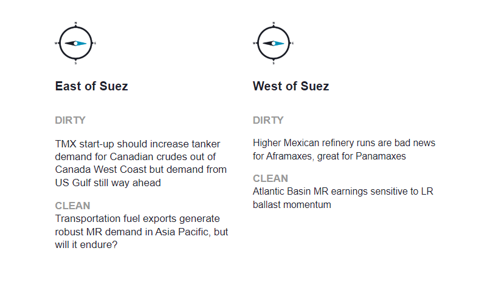
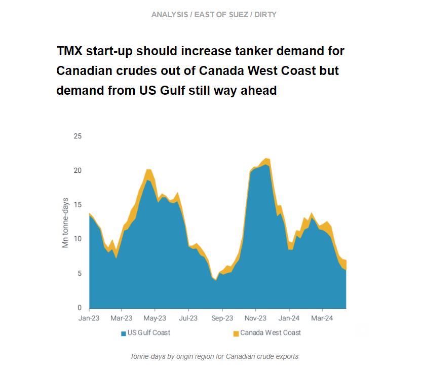
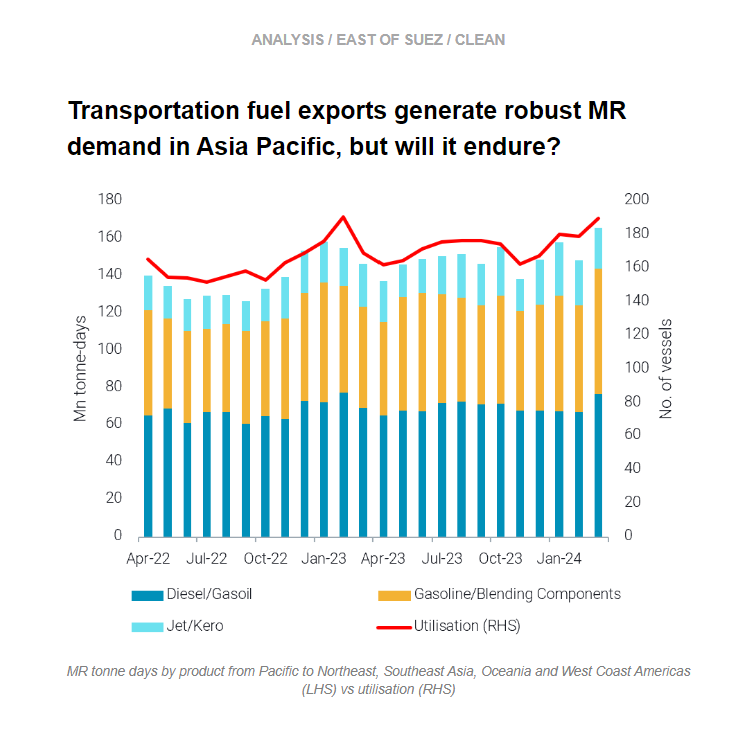
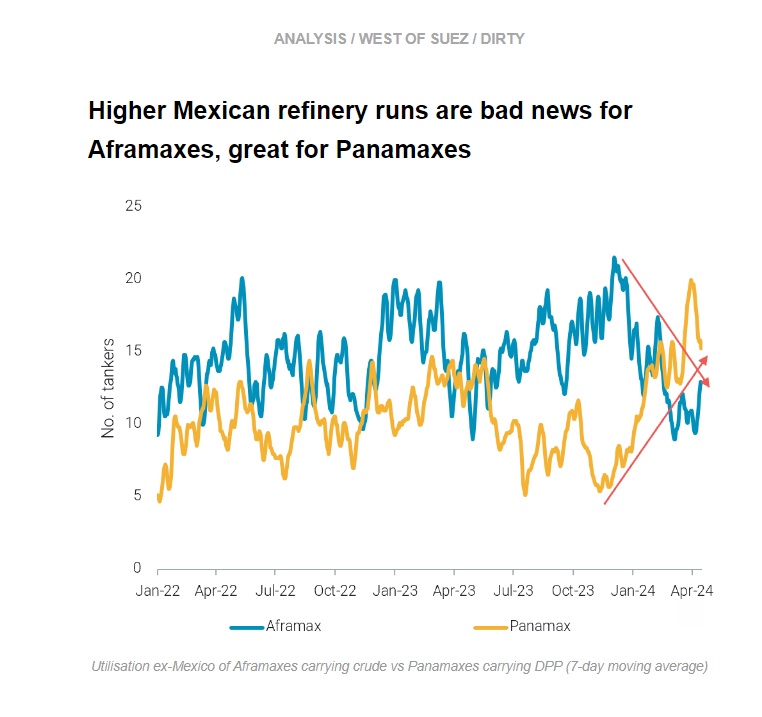
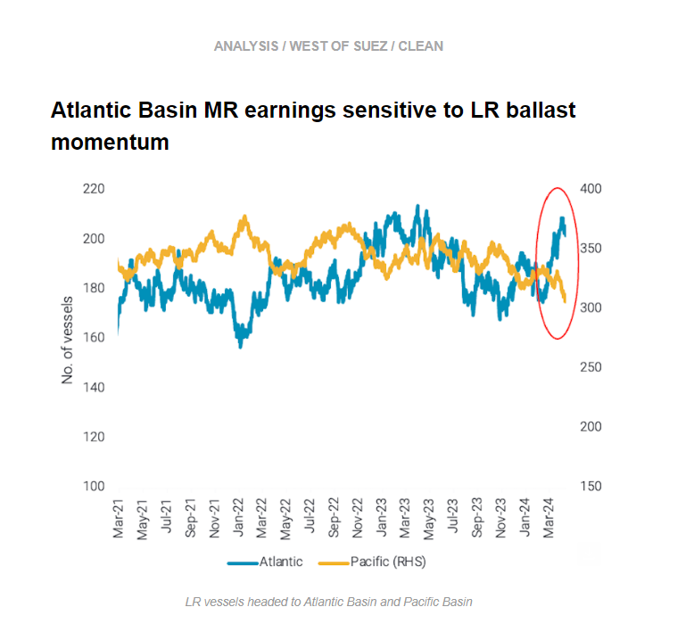

# TMX start-up imminent || High Mexico refinery runs boost Panamaxes

**Date:** April 25, 2024  
**Publisher:** Breakwave Advisors | **Category:** Market Insights  
**Original URL:** [https://www.breakwaveadvisors.com/insights/2024/4/25/z638p1s4cizcj3h35ov87fap198xw7](https://www.breakwaveadvisors.com/insights/2024/4/25/z638p1s4cizcj3h35ov87fap198xw7)  

---

This week, in the East, we discuss the imminent startup of the TMX pipeline and . what it could mean for Canadian crude exports to Asia. On the clean side, we look at why MR earnings in the Pacific are robust. Over in the West, we investigate the effect of Mexico’s higher refinery runs on the tanker market, and we explore how MR Atlantic earnings are sensitive to LR ballast momentum.

*By*[*Mary Melton*](https://www.linkedin.com/search/results/all/?fetchDeterministicClustersOnly=true&heroEntityKey=urn%3Ali%3Afsd_profile%3AACoAABXVyecBtg-pRnIrZe0BoWk0ygPiUfbvhsw&keywords=mary%20melton&origin=RICH_QUERY_SUGGESTION&position=0&searchId=40e8d7d2-c4d0-4022-81e7-176f6eba418b&sid=H_Y&spellCorrectionEnabled=false)

> **Figure 1: Στιγμιότυπο Οθόνης 2024 04 25 095609**  
> **Interactive Data & Source:** [Marketingmail Vortexa](https://marketingmail.vortexa.com/ODM3LU1aRS01NzgAAAGSr2ET5FryIZh0EQ7E6UcsAkNJvPfSw_QdHty6xEey1cno-rXICgl20zIZoiAA8uPNH3w8EqA=) | [Local Asset](file:///C:/Users/Dell/Github/Shipping/corpus/03-breakwave/insights/2024/assets/2024-04-25_z638p1s4cizcj3h35ov87fap198xw7_img_cea3cf84ceb9ceb3cebcceb9cf8ccf84cf85_f14e3e61d412.png)

> **Figure 2: Στιγμιότυπο Οθόνης 2024 04 25 095630**  
> **Interactive Data & Source:** [Marketingmail Vortexa](https://marketingmail.vortexa.com/ODM3LU1aRS01NzgAAAGSr2ET5FryIZh0EQ7E6UcsAkNJvPfSw_QdHty6xEey1cno-rXICgl20zIZoiAA8uPNH3w8EqA=) | [Local Asset](file:///C:/Users/Dell/Github/Shipping/corpus/03-breakwave/insights/2024/assets/2024-04-25_z638p1s4cizcj3h35ov87fap198xw7_img_cea3cf84ceb9ceb3cebcceb9cf8ccf84cf85_af3dd1d78007.png)

- With the TMX start-up likely on 1 May, the subsequent increase in Canadian crude exports out of Vancouver are likely to drive increased Aframax demand as well.

- At present, the[US Gulf Coast](https://marketingmail.vortexa.com/ODM3LU1aRS01NzgAAAGSr2ET5FryIZh0EQ7E6UcsAkNJvPfSw_QdHty6xEey1cno-rXICgl20zIZoiAA8uPNH3w8EqA=)still remains the preferred destination for[Canadian Crude exports](https://marketingmail.vortexa.com/ODM3LU1aRS01NzgAAAGSr2ET8LkG0Eo-TNHddBjT6ep_Wgn1TTRpeJTh5-RvqHBuLLGp_dwla9564TqX1dG62jkrLIM=), driving the majority of tonne-days due to both larger volumes and larger vessel classes utilised. Asia has been the preferred destination for these exports, and the TMX pipeline was an effort to find an alternative outlet to the US Gulf Coast for Western Canadian crudes.
- Moving forward, we expect crude exports out of Vancouver to increase, but it is unlikely they will eclipse those from the US Gulf coast.[Tonne-days from Canada West Coast](https://marketingmail.vortexa.com/ODM3LU1aRS01NzgAAAGSr2ET8KUGwur26L9QkJI0RrhsRfPiChGvv_-dChokZeD6yyIVaMACninqRs4zrNz7MsTk2Pw=)will also increase but whether these are directed towards Asia remains to be seen, with most volumes on Aframaxes likely to be directed towards US West Coast refineries. As US Gulf Aframax employment has been relatively lacklustre recently, the TMX opening could absorb some tonnage.

> **Figure 3: Στιγμιότυπο Οθόνης 2024 04 25 095659**  
> **Interactive Data & Source:** [Marketingmail Vortexa](https://marketingmail.vortexa.com/ODM3LU1aRS01NzgAAAGSr2ET8DKSqVeRPBdsSSiH5RkuT4G-UqhNIu8OrfhhZsdYk8oaMIRj91f5tayDWyHmHHzZgY0=) | [Local Asset](file:///C:/Users/Dell/Github/Shipping/corpus/03-breakwave/insights/2024/assets/2024-04-25_z638p1s4cizcj3h35ov87fap198xw7_img_cea3cf84ceb9ceb3cebcceb9cf8ccf84cf85_4f65498edaed.png)

- [Robust exports of transportation fuels](https://marketingmail.vortexa.com/ODM3LU1aRS01NzgAAAGSr2ET8DKSqVeRPBdsSSiH5RkuT4G-UqhNIu8OrfhhZsdYk8oaMIRj91f5tayDWyHmHHzZgY0=)(diesel, gasoline, jet) from Asia to Pacific Basin destinations are keeping MR demand elevated.[MR tonne-days for Asia-to-Pacific Basin voyages](https://marketingmail.vortexa.com/ODM3LU1aRS01NzgAAAGSr2ET71a7_ruBNpSJdyFUydPNUfVFqnIop41qqcHApzv_YqQeVk9tvLEKDxs_6FZjb5jpNYQ=)carrying transportation fuels were at multi-year highs in March.

- Healthy demand in the Pacific is reflected in the higher earnings currently in the Pacific over the Atlantic (Baltic Exchange).[Reduced transatlantic diesel demand](https://marketingmail.vortexa.com/ODM3LU1aRS01NzgAAAGSr2ET8FGqnLiq6tBYDFxyV6ESGeFY_jyjNdooceE68UftVT2guFxknxZZigkAH-5jrZc_NHM=)from Europe, declining[TC2 utilisation](https://marketingmail.vortexa.com/ODM3LU1aRS01NzgAAAGSr2ET8OMT6CQDcmib3AsvddH0o10cHbC0WvIENEa05o19p0Gt_aB4sL6OBuPcBn7CUcMfzig=), and consistently[weak demand from Brazil](https://marketingmail.vortexa.com/ODM3LU1aRS01NzgAAAGSr2ET8MY6tpfJZ95NNsoU6pINUpxHKjHXi05_hh0Z2h9cJCdtuoK3UzrG2cqSXixPLHpSxi4=)for US diesel are affecting Atlantic Basin earnings.
- However, headwinds may be on the horizon in the Pacific Basin, as refinery maintenance in NE Asia peaks in April and May, which could dampen MR demand. Also, reports of economic run cuts in South Korea (Bloomberg) may additionally limit demand for the vessel class. Additionally, as Panama Canal transits increase,[more vessels are repositioning to the Pacific](https://marketingmail.vortexa.com/ODM3LU1aRS01NzgAAAGSr2ET5BEKSZQVNw-RpkPsPjXi7N_c8dbNNVbnvAEZ0SPtf48EnmZ5G2QPlNE56i5PpPn_ICg=), eliminating transpacific flows and capping rates.

> **Figure 4: Στιγμιότυπο Οθόνης 2024 04 25 095726**  
> **Interactive Data & Source:** [Marketingmail Vortexa](https://marketingmail.vortexa.com/ODM3LU1aRS01NzgAAAGSr2ET7zL0aYH50qJs9xfq1RGiGN_IeR59yukAlJoNcrwiPHEcmSNeIpNZAkh_8aI4OCCqdLo=) | [Local Asset](file:///C:/Users/Dell/Github/Shipping/corpus/03-breakwave/insights/2024/assets/2024-04-25_z638p1s4cizcj3h35ov87fap198xw7_img_cea3cf84ceb9ceb3cebcceb9cf8ccf84cf85_8d49ed610b9b.png)

- Six-months of[declining Mexican crude exports](https://marketingmail.vortexa.com/ODM3LU1aRS01NzgAAAGSr2ET7zL0aYH50qJs9xfq1RGiGN_IeR59yukAlJoNcrwiPHEcmSNeIpNZAkh_8aI4OCCqdLo=), roughly coinciding with declining[onshore crude inventories](https://marketingmail.vortexa.com/ODM3LU1aRS01NzgAAAGSr2ET5H8yqmdrWK6tQ14tj1Tc45eHd9ECN4x74NYyeTfnTp_hW0W-69epEtGBIqRLKj2vBi8=)reflect higher refinery runs in Mexico.[Short-haul employment of Aframaxes out of Mexico](https://marketingmail.vortexa.com/ODM3LU1aRS01NzgAAAGSr2ET8FP2Lk8jSff8tDxJklg4jgQaitEcBbuDOa_iVdwJP8ND1pW3F7Cu2Q35Tm7mWqA7IFs=)continued to decline in Q1, putting pressure on a segment already suffering from low TD25 employment in March as Europe imported less US crude.

- At the same time, Mexico’s increased refinery utilisation led to a remarkable rise in[Mexico’s fuel oil exports](https://marketingmail.vortexa.com/ODM3LU1aRS01NzgAAAGSr2ET8ENgxK-HrstDQr7qvo5zSNNtvXMfI5N8w7cT7g0z2sIIH-4TLvO04sFX4D0YBaVj-Ts=), which are at multi-year highs. Because US refiners have been unable to fully replace Russian fuel oil imports following the ban, US importers are eager for Mexican fuel oil. This demand has been filled by Panamaxes, boosting[utlisation on this route to multi-year highs](https://marketingmail.vortexa.com/ODM3LU1aRS01NzgAAAGSr2ET79B6ATx2lQnAQ-zzbU_pEfLhsKSPZNuWTaQbYBspnPjfLCMS4oLqjSuiTC-xqlS7GOM=)at the end of March.
- As Mexico is approaching an election in early June, it is likely these refinery runs will remain high, which could continue to dampen demand for Aframaxes but support Panamaxes from higher fuel oil exports. Though the start-up of production at the Olmeca refinery looks relatively unlikely to happen this year, when it does come online and Mexico’s crude exports are further reduced, Aframax demand will be affected. However, the lack of investment in the other refineries’ infrastructure is likely to keep other elements of the domestic refinery sector capped at relatively low utilisation rates.

> **Figure 5: Στιγμιότυπο Οθόνης 2024 04 25 095757**  
> **Interactive Data & Source:** [Marketingmail Vortexa](https://marketingmail.vortexa.com/ODM3LU1aRS01NzgAAAGSr2ET8Hg_njnTbIaxZRnqh_u8PfVj0mbuIp_8Zhxa3FE1XLjG6fwOxsHdPBlHpchXfZAQD-Q=) | [Local Asset](file:///C:/Users/Dell/Github/Shipping/corpus/03-breakwave/insights/2024/assets/2024-04-25_z638p1s4cizcj3h35ov87fap198xw7_img_cea3cf84ceb9ceb3cebcceb9cf8ccf84cf85_226bb0aec60d.png)

- After the Red Sea attacks, MR Atlantic and Pacific earnings have become more sensitive to the LR ballaster dynamics between the two basins. As LRs are predominantly used via Cape of Good Hope (COGH) for East-to-West middle distillate flows, operators are incentivised to stay in the West as the backhaul ballast to reposition has become considerably longer.

- As demand for “traditional” LR cargoes (gasoline to West Africa, and naphtha to East Asia) has become softer, the LRs heading to the Atlantic will increasingly compete for Atlantic Basin cargoes with MRs.
- According to our data, there is currently a record-number of[LRs heading to the Atlantic](https://marketingmail.vortexa.com/ODM3LU1aRS01NzgAAAGSr2ET8Hg_njnTbIaxZRnqh_u8PfVj0mbuIp_8Zhxa3FE1XLjG6fwOxsHdPBlHpchXfZAQD-Q=), which will likely put pressure on Atlantic Basin MR earnings at the onset of the summer driving season.

Data Source:[Vortexa](https://www.vortexa.com//oil-gas-data-traders-analysts-data-scientists?gclid=Cj0KCQjw8_qRBhCXARIsAE2AtRZKOvMnbilZ_6_91d7huSFFy71pWLrnPwGwOHVzXsmsG-1a1mZnQw8aAt89EALw_wcB&hsa_acc=1782073842&hsa_ad=548425387665&hsa_cam=14746637662&hsa_grp=125038601902&hsa_kw=&hsa_mt=&hsa_net=adwords&hsa_src=g&hsa_tgt=dsa-1431852288425&hsa_ver=3&utm_campaign=%5BCD%5D%20-%20DSA%20-%20EMEA&utm_medium=cpc&utm_medium=ppc&utm_source=google&utm_source=adwords&utm_term=)

---

**Tags:** Shipping, Crude Oil, Tankers  
