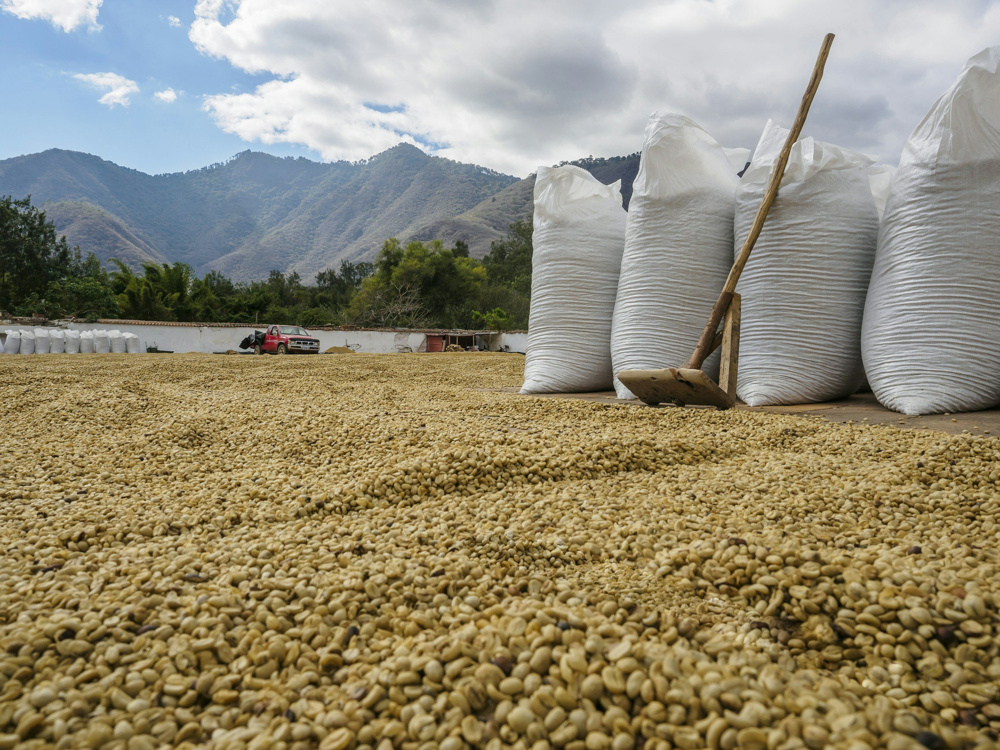

# Weekly Insights Review

**Date:** April 26, 2024  
**Publisher:** Breakwave Advisors | **Category:** Market Insights  
**Original URL:** [https://www.breakwaveadvisors.com/insights/2024/4/26/weekly-insights-review](https://www.breakwaveadvisors.com/insights/2024/4/26/weekly-insights-review)  

---

## Welcome to Our Weekly Insights Review

## Read Here Everything You Need to Know

## Breakwave Tanker Report

**VLCC Rates Continue to Soften Amid Subdued Activity and a Cautious Charterer Stance –**With May fixing activity in full force, the VLCC freight market continued its descent, a trend evident across both the Atlantic and Pacific regions.

[Read More](https://www.breakwaveadvisors.com/insights/2024423wet-Dphxd)

April 22, 2024

## Oil Prices Slipping While Baltic Indices Trend Upwards

> **Figure 1: Doric Weekly Market Insight**  
> *Doric Weekly Market Insight*  
> **Interactive Data & Source:** [Breakwave Advisors Market Insights](https://www.breakwaveadvisors.com/insights/2024/4/22/cb55w0sl76aayp8dvimjgf8pbmodt0) | [Local Asset](file:///C:/Users/Dell/Github/Shipping/corpus/03-breakwave/insights/2024/assets/2024-04-26_weekly-insights-review_img_image-asset_bee16203f469.jpeg)

In the current economic landscape, the International Monetary Fund has emphasized that geoeconomic fragmentation could exert pressure on global trade and income growth in the forthcoming years.

[Read More](https://www.breakwaveadvisors.com/insights/2024/4/22/cb55w0sl76aayp8dvimjgf8pbmodt0)

April 22, 2024

## Global Grain Trade Forecast Raised Again

> **Figure 2: From Commodore's Weekly Dry Bulk Reports**  
> *From Commodore's Weekly Dry Bulk Reports*  
> **Interactive Data & Source:** [Breakwave Advisors Market Insights](https://www.breakwaveadvisors.com/insights/2024/4/22/global-grain-trade-forecast-raised-again) | [Local Asset](file:///C:/Users/Dell/Github/Shipping/corpus/03-breakwave/insights/2024/assets/2024-04-26_weekly-insights-review_img_image-asset28129_cf65c3fb4d6d.jpeg)

As we first discussed for our subscribers in Commodore Research's April 15th Weekly Dry Bulk Report, the United States Department of Agriculture (USDA) is now predicting that global coarse grain, wheat, soybean, and soymeal exports in 2023/24 will collectively total 699 million tons.

[Read More](https://www.breakwaveadvisors.com/insights/2024/4/22/global-grain-trade-forecast-raised-again)

April 22, 2024

## Should We Fear the Correction?

> **Figure 3: Mazars Weekly Note**  
> *Mazars Weekly Note*  
> **Interactive Data & Source:** [Breakwave Advisors Market Insights](https://www.breakwaveadvisors.com/insights/2024/4/22/should-we-fear-the-correction) | [Local Asset](file:///C:/Users/Dell/Github/Shipping/corpus/03-breakwave/insights/2024/assets/2024-04-26_weekly-insights-review_img_image-asset28229_9ddb7a0da23a.jpeg)

William of Ockham was a 14th-century English Franciscan friar. As an unusually clever person, he wasn’t very much liked by either the church

...

[Read More](https://www.breakwaveadvisors.com/insights/2024/4/22/should-we-fear-the-correction)

April 23, 2024

## The Recent Surge in Weekly Cargo Has Chiefly Benefitted the Panamaxes

> **Figure 4: Fix - Global Market Updatethe Past Week Saw the Baltic Dry Index**  
> *The Fix - Global Market UpdateThe past week saw the Baltic Dry Index rise by eleven per cent, with much of the upward momentum provided by the panamaxes and capesizes. Among the commodities, iron ore and base metals belonged to the winners.Read More*  
> **Interactive Data & Source:** [Breakwave Advisors Market Insights](https://www.breakwaveadvisors.com/insights/2024/4/22/the-recent-surge-in-weekly-cargo-has-chiefly-benefitted-the-panamaxes) | [Local Asset](file:///C:/Users/Dell/Github/Shipping/corpus/03-breakwave/insights/2024/assets/2024-04-26_weekly-insights-review_img_seanergy8_3ca31b579b38.jpg)

April 24, 2024

## Looking Into 2025

> **Figure 5: Gibson Tanker Market Report**  
> *Gibson Tanker Market Report*  
> **Interactive Data & Source:** [Breakwave Advisors Market Insights](https://www.breakwaveadvisors.com/insights/2024/4/24/looking-into-2025) | [Local Asset](file:///C:/Users/Dell/Github/Shipping/corpus/03-breakwave/insights/2024/assets/2024-04-26_weekly-insights-review_img_tankers-3-square_6c3468de468d.jpg)

Earlier this month the IEA released its monthly oil report, offering for the first time their analysis of how oil markets could shape up in 2025.

[Read More](https://www.breakwaveadvisors.com/insights/2024/4/24/looking-into-2025)

April 24, 2024

## Crude Oil Trade Remains Resilient

> **Figure 6: Intermodal Weekly Market Report**  
> *Intermodal Weekly Market Report*  
> **Interactive Data & Source:** [Breakwave Advisors Market Insights](https://www.breakwaveadvisors.com/insights/2024/4/24/crude-oil-trade-remains-resilient) | [Local Asset](file:///C:/Users/Dell/Github/Shipping/corpus/03-breakwave/insights/2024/assets/2024-04-26_weekly-insights-review_img_image-asset28329_4f89a79a5ab4.jpeg)

The first quarter of 2024 saw a great deal of movement and disturbance in the crude oil market, mostly due to strategic production adjustments and geopolitical conflicts.

[Read More](https://www.breakwaveadvisors.com/insights/2024/4/24/crude-oil-trade-remains-resilient)

April 25, 2024

## Tmx Start-Up Imminent || High Mexico Refinery Runs Boost Panamaxes

> **Figure 7: Vortexa Freight Weekly**  
> *Vortexa Freight Weekly*  
> **Interactive Data & Source:** [Breakwave Advisors Market Insights](https://www.breakwaveadvisors.com/insights/2024/4/25/z638p1s4cizcj3h35ov87fap198xw7) | [Local Asset](file:///C:/Users/Dell/Github/Shipping/corpus/03-breakwave/insights/2024/assets/2024-04-26_weekly-insights-review_img_image-asset28429_e39a4fe54bc1.jpeg)

This week, in the East, we discuss the imminent startup of the TMX pipeline and . what it could mean for Canadian crude exports to Asia. On the clean side, we look at why MR earnings in the Pacific are robust.

[Read More](https://www.breakwaveadvisors.com/insights/2024/4/25/z638p1s4cizcj3h35ov87fap198xw7)

April 26, 2024

## Strength in China’s Coal Imports Still Very Much Needed to Offset Moderate Fleet Growth

> **Figure 8: From Commodore's Weekly Dry Bulk Reports**  
> *From Commodore's Weekly Dry Bulk Reports*  
> **Interactive Data & Source:** [Breakwave Advisors Market Insights](https://www.breakwaveadvisors.com/insights/2024/4/26/strength-in-chinas-coal-imports-still-very-much-needed-to-offset-moderate-fleet-growth) | [Local Asset](file:///C:/Users/Dell/Github/Shipping/corpus/03-breakwave/insights/2024/assets/2024-04-26_weekly-insights-review_img_seanergy2_49565a5491c2.jpg)

Last week was another good week in the dry bulk spot market, although the 1% growth shown with the publication of China’s March coal-derived electricity generation data did come as a surprise to us.

[Read More](https://www.breakwaveadvisors.com/insights/2024/4/26/strength-in-chinas-coal-imports-still-very-much-needed-to-offset-moderate-fleet-growth)

April 26, 2024

## Will Global Supplies Be Sufficient to Cover Future Demand Levels?

> **Figure 9: Fix - Global Market Update**  
> *The Fix - Global Market Update*  
> **Interactive Data & Source:** [Breakwave Advisors Market Insights](https://www.breakwaveadvisors.com/insights/2024/4/26/concerns-have-been-growing-that-global-supplies-will-be-insufficient-to-cover-future-demand-levels) | [Local Asset](file:///C:/Users/Dell/Github/Shipping/corpus/03-breakwave/insights/2024/assets/2024-04-26_weekly-insights-review_img_unsplash-image-t0acfiv5eac_3b9aea856a71.jpg)

The Baltic Dry Index retreated by nearly two per cent yesterday, extending losses into a fourth consecutive session.

[Read More](https://www.breakwaveadvisors.com/insights/2024/4/26/concerns-have-been-growing-that-global-supplies-will-be-insufficient-to-cover-future-demand-levels)

---

**Tags:** Shipping, Markets, Economy  
