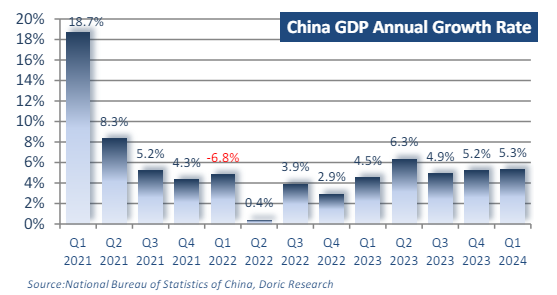
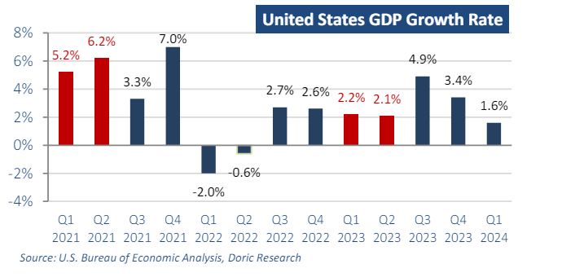
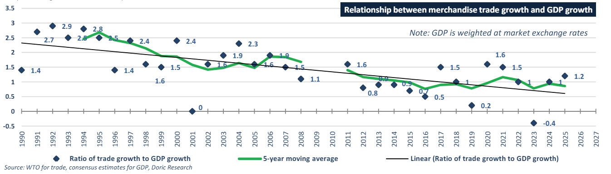

# The Chinese economy had a strong start in the first quarter

**Date:** April 29, 2024  
**Publisher:** Breakwave Advisors | **Category:** Market Insights  
**Original URL:** [https://www.breakwaveadvisors.com/insights/2024/4/29/bkql25bg3bufqvioabueoj1k2f7eb9](https://www.breakwaveadvisors.com/insights/2024/4/29/bkql25bg3bufqvioabueoj1k2f7eb9)  

---

*By*[*Michalis Voutsinas*](https://www.linkedin.com/in/michalis-voutsinas-587544163/)

Following last week's optimistic Chinese GDP data, Sheng Laiyun, a spokesperson for the National Bureau of Statistics, emphasized that "The Chinese economy had a strong start in the first quarter... laying a solid foundation for achieving the annual goals." In fact, China's GDP in the first quarter of 2024 amounted to RMB 29.63 trillion (US$4.1 trillion) according to preliminary calculations. This marks a 5.3 percent increase from the previous year and a 1.6 percent rise from the previous quarter when adjusted for constant prices

> **Figure 1: Στιγμιότυπο Οθόνης 2024 04 29 101503 Doric**  
> **Interactive Data & Source:** [Doric](https://www.doric.gr/) | [Local Asset](file:///C:/Users/Dell/Github/Shipping/corpus/03-breakwave/insights/2024/assets/2024-04-29_bkql25bg3bufqvioabueoj1k2f7eb9_img_cea3cf84ceb9ceb3cebcceb9cf8ccf84cf85_d2abb547537c.png)

The secondary industry (comprising industry and manufacturing) demonstrated the highest growth rate, climbing by 6 percent year-onyear to reach RMB 10.98 trillion (US$1.52 trillion). Concurrently, the tertiary sector (services) experienced a 5 percent year-on-year growth, while the primary sector (encompassing agriculture and resource extraction) saw a 3.3 percent increase compared to the previous year. Moreover, the manufacturing purchasing manager’s index (PMI) rebounded to 50.8 percent in March 2024, signaling a resurgence in expansion after languishing below 50 percent for five consecutive months.

China's foreign trade has experienced a notable resurgence in recent months following a year of subdued imports and exports. In the first quarter, the total import and export of goods amounted to RMB 10.17 trillion (US$1.41 trillion), marking a 5 percent increase compared to the previous year. This growth represents the highest recorded rate in the last six quarters, showcasing a significant acceleration from the 1.6 percent year-on-year increase observed in the fourth quarter of 2023. Out of the total trade volume, exports totaled RMB 5.74 trillion (US$793 billion), up 4.9 percent, while imports reached RMB 4.4 trillion (US$607.89 billion), reflecting a 5 percent year-on-year rise. However, despite the substantial improvement in foreign trade witnessed in January and February, March saw a downturn once again, with foreign trade contracting by 1.3 percent year-on-year. This decline was primarily attributed to a 3.8 percent year-on-year decrease in exports. Analysts maintain a cautious outlook regarding the course of Chinese exports, citing concerns over sluggish external demand and geopolitical factors that could potentially challenge their trajectory.

In contrast, the US gross domestic product (GDP) expanded at a 1.6 percent annualized pace when adjusted for seasonality and inflation, according to the Department’s Bureau of Economic Analysis. Economists surveyed by Dow Jones had anticipated a 2.4 percent increase following a 3.4 percent gain in the fourth quarter of 2023.

Compared to the fourth quarter, the slowdown in real GDP growth in the first quarter was primarily driven by decelerations in consumer spending, exports, and state and local government spending, along with a downturn in federal government spending. However, these declines were partially offset by an uptick in residential fixed investment. Import activity also accelerated during this period. Although consumer spending, which constitutes a significant portion of economic output, experienced a slowdown earlier in the year, it still contributed to growth in the first quarter. Despite these fluctuations, a key measure of demand in the economy – final sales to private domestic purchasers – remained robust during the January-through-March period, showing only a slight slowdown compared to the fourth quarter.

> **Figure 2: Στιγμιότυπο Οθόνης 2024 04 29 102105 Doric**  
> **Interactive Data & Source:** [Doric](https://www.doric.gr/) | [Local Asset](file:///C:/Users/Dell/Github/Shipping/corpus/03-breakwave/insights/2024/assets/2024-04-29_bkql25bg3bufqvioabueoj1k2f7eb9_img_cea3cf84ceb9ceb3cebcceb9cf8ccf84cf85_cb11a235aeed.png)

Over time, the responsiveness of goods trade to global income fluctuations has diminished, though this relationship seems to have stabilized in recent years. In the 1990s, the volume of merchandise trade grew more than twice as fast as real-world GDP, and 1.5 times as fast in the early 2000s. However, the ratio declined from 2.3-to-1 in the 1990s to 1.5-to-1 in the 2000s. Since 2010, the ratio has further decreased to an average of 0.9-to-1, with fluctuations intensifying in later years. For the current trading year, World Trade Organization (WTO) anticipates that world merchandise trade will grow by 2.6 percent, with a projected increase of 3.3 percent in 2025 as demand for traded goods rebounds following a contraction in 2023. Despite a 3.0 percent expansion in 2022, trade volume experienced a decline of 1.2 percent last year. The enduring impacts of high energy prices and inflation particularly dampened demand for trade-intensive manufactured goods, but gradual recovery is expected by the WTO over the next two years as inflationary pressures alleviate and real household incomes improve. Should the WTO's forecast for the current trading year materialize, the ratio of trade to GDP is poised to rebound to 0.94-to-1 in 2024.

Concurrently, while the World Trade Organization anticipates increased trading activity for the current year, BIMCO predicts a strengthening of the supply/demand balance in the dry bulk sector for 2024, followed by a decline in 2025. Conversely, Baltic indices eased off this week, with the leading Baltic Dry Index weighed down mainly by the lackluster performance of Capesize segment and concluding at 1721 points.

> **Figure 3: Στιγμιότυπο Οθόνης 2024 04 29 102540 Doric**  
> **Interactive Data & Source:** [Doric](https://www.doric.gr/) | [Local Asset](file:///C:/Users/Dell/Github/Shipping/corpus/03-breakwave/insights/2024/assets/2024-04-29_bkql25bg3bufqvioabueoj1k2f7eb9_img_cea3cf84ceb9ceb3cebcceb9cf8ccf84cf85_cb6dc0553e4e.png)

Data source:[Doric](https://www.doric.gr/)

---

**Tags:** Drybulk, Shipping, China  
