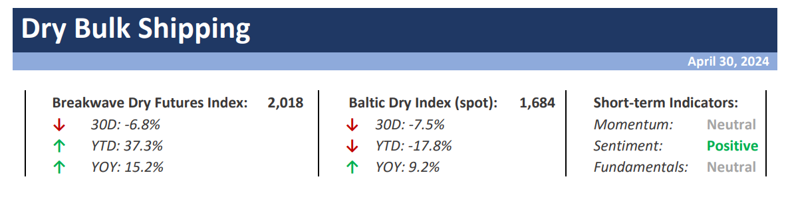
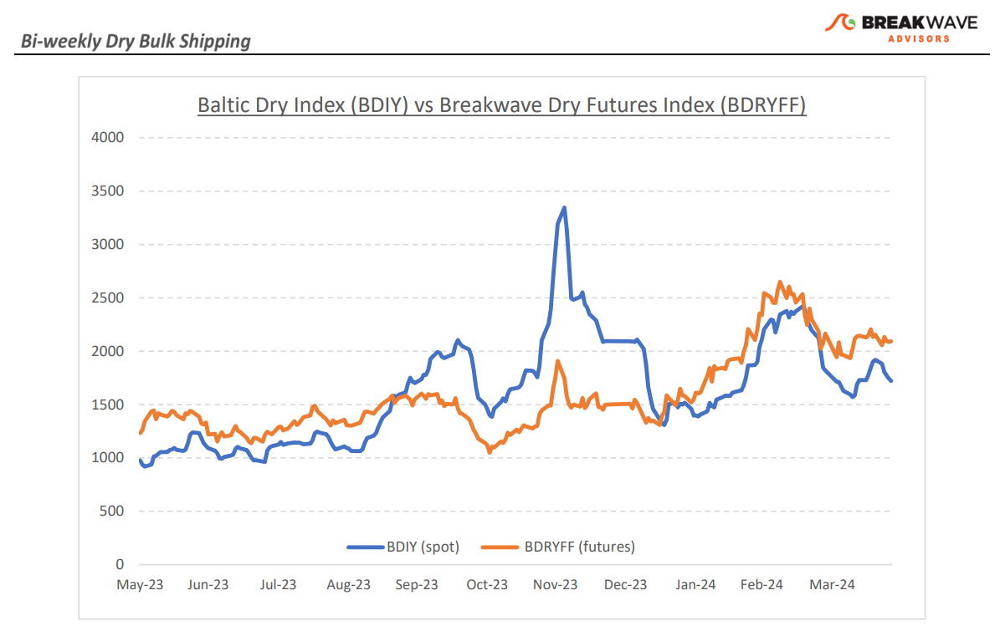
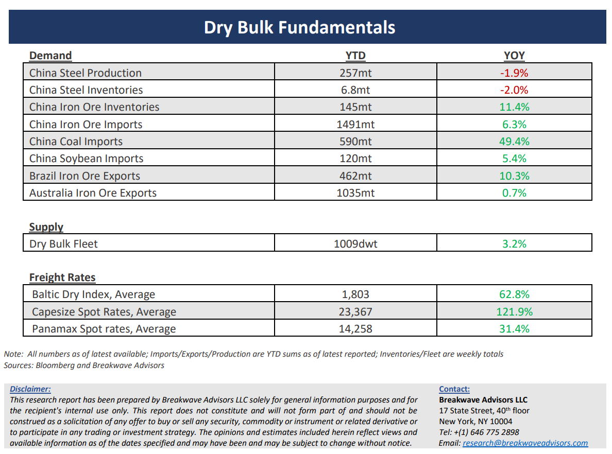

# Breakwave Bi-Weekly Dry Bulk Report - April 30, 2024

**Date:** April 30, 2024  
**Publisher:** Breakwave Advisors | **Category:** Market Insights  
**Original URL:** [https://www.breakwaveadvisors.com/insights/2024430dry](https://www.breakwaveadvisors.com/insights/2024430dry)  

---

> **Figure 1: Dryreporttop**  
> [Local Asset](file:///C:/Users/Dell/Github/Shipping/corpus/03-breakwave/insights/2024/assets/2024-04-30_2024430dry_img_dryreporttop_58bb46895315.png)

**· Spot Dry Bulk Rates Continue to Underperform Although Expectations Remain High –**The month of April proved to be a disappointment for freight futures traders as earlier**expectations**for a rebound in rates failed to materialize. In fact, the average spot Capesize rate for the month ended up being some**40% lower**than what was anticipated just a month prior, reflecting the**significant optimism**in the dry bulk industry on the future progression of dry bulk rates. It is difficult to pinpoint a specific reason for such underperformance versus expectations, but the freight futures market is known for**extrapolating past trends**to the future, something that we feel**is unwise**for such a cyclical industry. For now, spot Capesize rates remain in the mid/high teens, with the North Atlantic market down to the single digits. Early signs point to mediocre activity in the short term, despite a futures curve that remains at a sharp premium to spot rates. Dry bulk is**highly volatile**and should be viewed as a trading sector, and yet, a flat and elevated futures curve is a testament of a**different psychology**among the freight trading community. We expect**lower trading volumes for iron ore**in the next few months to limit cargo flow, as the strong cargo movement during the first quarter is being absorbed by steel mills, and with summer inclement weather in West Africa, a major growing exporter of bauxite, the**risk remains**that spot rates**fail to match**the elevated**futures**curve. Of course, one should remember that**disruptions**around the globe that is constraining vessel supply (Red Sea, Panama Canal) are**still with us**and remain a driver of**tighter market balance**, but the initial shock is now behind us, and thus, available vessel supply might now be better matched for what we think is going to be a slower demand growth environment during the next several months.

**· Steel Margins in China Collapse back to Recent Lows as Iron Ore Prices Rebound –**With the global rally in metals prices in full swing,**iron ore prices**also remained at relatively**elevated**levels, pushing**profit margins**for steel mills back down to recent**lows**. Despite the fact that portside Chinese**inventories**continue to**increase**week after week, there is significant buying appetite for the steelmaking ingredient and expectations are driving the**bullish sentiment**once again. The global iron ore production**cost curve**that historically has been a floor for iron ore prices, has moved higher over the years, and probably now stands just**below the $100/ton mark**, but the fact that the spot market has failed to hold that level for a long period of time reveals the traders belief that sooner rather than later Chinese demand for steel will increase and provide support for iron ore prices. However, iron ore**imports into China are running some 6%****higher**year-to-date, and with expectations for flattish steel production for 2024, the**risk remains on softer demand**for the remainder of the year, making the risk reward balance unfavorable for the time being.

**· Our Long-term View –**The last few years have been characterized by increased geopolitical uncertainty. Going forward, we expect such events to continue to affect global trade and have a meaningful impact on effective vessel supply. Combined with the potential for a multi-year cyclical rebound in China’s economic activity following the recent economic turmoil, dry bulk shipping should experience higher volatility on top of a secular tightness driven by increasing bulk commodity demand and a slower fleet growth as a result of a relatively low orderbook.

> **Figure 2: Dryreportchart**  
> [Local Asset](file:///C:/Users/Dell/Github/Shipping/corpus/03-breakwave/insights/2024/assets/2024-04-30_2024430dry_img_dryreportchart_c93eff4daf3a.png)

> **Figure 3: Dryreportbottom**  
> [Local Asset](file:///C:/Users/Dell/Github/Shipping/corpus/03-breakwave/insights/2024/assets/2024-04-30_2024430dry_img_dryreportbottom_276b5d34f6ba.png)

### Subscribe:
