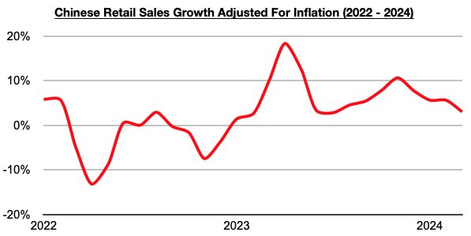
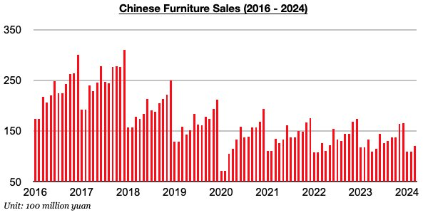

# Consumer Strength in China Continues to Lessen

**Date:** April 30, 2024  
**Publisher:** Breakwave Advisors | **Category:** Market Insights  
**Original URL:** [https://www.breakwaveadvisors.com/insights/2024/4/29/consumer-strength-in-china-continues-to-lessen](https://www.breakwaveadvisors.com/insights/2024/4/29/consumer-strength-in-china-continues-to-lessen)  

---

*By*[*Jeffrey Landsberg*](https://www.linkedin.com/in/jeffrey-landsberg-70ab957/)

As we discussed in Commodore Research's April 22nd Weekly China Report, China’s retail sales in March grew year-on-year by only 3.1%. This has marked the lowest growth seen since July. Taking March’s 0.1% inflation into account, retail sales adjusted for inflation grew year-on-year by only 3%, which also marks the lowest growth seen since July.

> **Figure 1: Chart 1**  
> [Local Asset](file:///C:/Users/Dell/Github/Shipping/corpus/03-breakwave/insights/2024/assets/2024-04-30_consumer-strength-in-china-continues-to-lessen_img_chart1_ef7b8f544fdb.jpg)

China’s retail sales growth has clearly continued to decline from November’s recent peak. Significant, though, is that retail sales have still come in higher than inflation during each of the last fifteen months (prior to these last fifteen months, retail sales growth had come in lower than inflation for four straight months). Overall, it remains positive that Chinese consumers continue to buy more goods than they did a year ago, which cannot be said about consumers in many other major economies. Nevertheless, the strength in China’s consumer sector is clearly continuing to lessen.

Overall, China continues to fare better than many other economies, but all is still not well as we have continued to discuss in our Weekly China Reports. Furniture sales, in particular, continue to fare particularly poorly. Furthnites in China in March fell year-on-year by 10%. Sales have now contracted on a year-on-year basis for twelve straight months, and this ongoing construction remains a direct result of the weakness in China’s housing market.

> **Figure 2: Chart 2**  
> [Local Asset](file:///C:/Users/Dell/Github/Shipping/corpus/03-breakwave/insights/2024/assets/2024-04-30_consumer-strength-in-china-continues-to-lessen_img_chart2_32416227ead8.jpg)

---

**Tags:** Drybulk, China, Economy  
