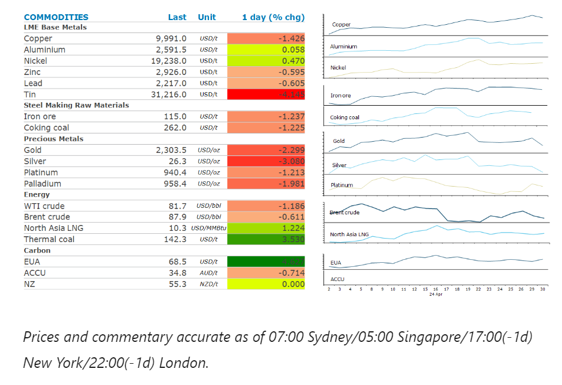
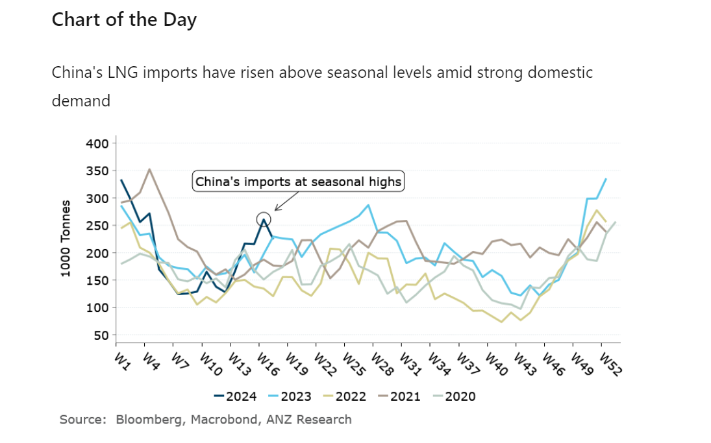

# Positive economic data in China boosts sentiment

**Date:** May 01, 2024  
**Publisher:** Breakwave Advisors | **Category:** Market Insights  
**Original URL:** [https://www.breakwaveadvisors.com/insights/2024/5/1/positive-economic-data-in-china-boosts-sentiment](https://www.breakwaveadvisors.com/insights/2024/5/1/positive-economic-data-in-china-boosts-sentiment)  

---

Ongoing inflationary pressures in the US put further doubts on imminent rate cuts. A weaker USD also weighed on investor appetite for commodities.

*By*[*Daniel Hynes*](https://www.linkedin.com/in/dahynes/)

> **Figure 1: Στιγμιότυπο Οθόνης 2024 05 01 111505**  
> **Interactive Data & Source:** [Linkedin](https://www.linkedin.com/newsletters/commodities-wrap-6692196755876012032/?fbclid=IwAR3kiXJqZdxmp9ZcRwBNI7FsBySI-XSC0pfPur1qzjt7OZp7PTE59Tsl1QI) | [Local Asset](file:///C:/Users/Dell/Github/Shipping/corpus/03-breakwave/insights/2024/assets/2024-05-01_positive-economic-data-in-china-boosts-sentiment_img_cea3cf84ceb9ceb3cebcceb9cf8ccf84cf85_559acced9fd3.png)

**Copper**rallied past USD10,000/t following better-than-expected economic data in China. Manufacturing activity in China rebounded in April, with the Caixin PMI coming in at 51.4. This was followed by the official PMI, which rose to 50.4. However, new export orders were behind the gains, signalling ongoing sluggishness in domestic demand. The gains were reversed after data showed US labour costs continue to rise, raising concerns about inflation and subsequent rate cuts by the US Federal Reserve. Nevertheless, copper locked in its biggest monthly gain in over two years. Closures to key copper mines triggered the over three-month rally. Those concerns over supply have only intensified in recent weeks. Operational issues in Chile continue to plague Codelco’s output. Access to water is expected to remain a challenge, with PWC estimating half of global copper mining will be in areas that are at significant risk of drought in coming years. Easing supply concerns saw**zinc**prices fall sharply. Nystar said it will restart an idled smelter in the Netherlands next month. The smelter was originally closed due to excessive energy costs; however, the Dutch government’s temporary measures have helped reduced the burden on the company.

**Gold**slumped back below USD2,300/oz amid easing expectations of rate cuts. The ongoing signs of inflation come as the FOMC meet to discuss whether to cut rates. However, the market is bracing for the possibility that central bankers may backtrack from previous hints of swifter rate cuts. Swap traders are now pricing in two rate cuts by year end, the fewest number of expected reductions since November 2023. A stronger USD also weighed on investor demand.

**Iron ore**futures rallied on hopes of further government support for China’s ailing property sector. The Communist Party vowed to explore new measures to tackle the protracted housing crisis, including ways to deal with unsold properties. The official Xinhua News Agency also reported that the 24-main Politburo are also looking at ways to lower borrowing costs. The steel market was also buoyed by the manufacturing data which showed new orders rose. The steel industry’s purchasing managers index reached 47.9 in April, up from 44.2 in March.

**Crude oil**fell to its lowest level in a month as tensions in the Middle East continue to ease. The potential for a ceasefire agreement between Israel and Hamas has eased concerns of an escalation of the conflict and any possible disruptions to supply. US Secretary of State Antony Blinken, who is currently in the Middle East, continues to urge leaders of the Hamas militant group to quickly reach a decision on Israeli conditions for a ceasefire. Continued signs of inflation also raised concerns about demand for crude oil. This comes ahead of the US driving season, where demand for gasoline rises strongly.

**European gas**prices edged higher as traders’ eye increasing competition for supply with Asia. A heatwave across southeast Asia is likely to see rising demand for power. This comes following several weeks of stagnant injections in storage.**North Asia LNG**prices were also higher amid the better outlook for demand.

> **Figure 2: Στιγμιότυπο Οθόνης 2024 05 01 111641**  
> **Interactive Data & Source:** [Linkedin](https://www.linkedin.com/newsletters/commodities-wrap-6692196755876012032/?fbclid=IwAR3kiXJqZdxmp9ZcRwBNI7FsBySI-XSC0pfPur1qzjt7OZp7PTE59Tsl1QI) | [Local Asset](file:///C:/Users/Dell/Github/Shipping/corpus/03-breakwave/insights/2024/assets/2024-05-01_positive-economic-data-in-china-boosts-sentiment_img_cea3cf84ceb9ceb3cebcceb9cf8ccf84cf85_25be95547cf3.png)

Data source:[Commodities Wrap](https://www.linkedin.com/newsletters/commodities-wrap-6692196755876012032/?fbclid=IwAR3kiXJqZdxmp9ZcRwBNI7FsBySI-XSC0pfPur1qzjt7OZp7PTE59Tsl1QI)

---

**Tags:** Commodities, Economy, China  
