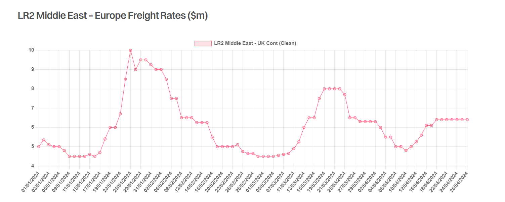

# Shifting Supply Chains

**Date:** May 01, 2024  
**Publisher:** Breakwave Advisors | **Category:** Market Insights  
**Original URL:** [https://www.breakwaveadvisors.com/insights/2024/5/1/shifting-supply-chains](https://www.breakwaveadvisors.com/insights/2024/5/1/shifting-supply-chains)  

---

> **Figure 1: Research Γçô Square 1**  
> **Interactive Data & Source:** [Gibsons Co](https://www.gibsons.co.uk/market-reports) | [Local Asset](file:///C:/Users/Dell/Github/Shipping/corpus/03-breakwave/insights/2024/assets/2024-05-01_shifting-supply-chains_img_research-ce93c387c3b4-square-1_50df22bb5158.jpg)

With the one third of the year already over and the Red Sea still off limits to the majority of the tanker market, we examine how crude and product trade flows have changed to account for the necessary rerouting. Evidently different subsectors have been impacted differently. Volatility in clean product freight rates has been far higher than in the crude market. However, both sectors have had to adjust supply chains in response to changes in freight and commodity prices.

For products trade, Europe was always going to be the most impacted given its import dependence on Middle distillates, with the Middle East becoming the single largest source following sanctions against Russia since early 2023. Volumes from East of Suez into Europe have dropped, with the United States increasing its foothold in on the Continent as a result. So far in 2024, total US clean product exports to Europe have risen almost threefold vs the same period of 2023, whilst volumes from East of Suez have dropped almost 20%. Part of the drop from the East is due to stockpiling early in 2023 as the embargo on Russian products into Europe took effect, but still that doesn’t account for the increase from the United States, which evidently is linked to better economics vs. Eastern cargoes.

Flows from the Middle East/India to East of Suez have edged higher due to fewer logistical challenges vs. trading to the West, and stronger regional demand growth, contributing to a glut of products in the region and pressure on domestic refining margins for middle distillates. Russian product flows from West to East have also not been immune, although in general terms do not appear to be a primary target of the Houthi’s. Exports from Russia have also been affected by drone strikes on their own refineries.

For the crude market, flows have also been impacted by similar dynamics with European refineries where possible looking to take advantage of crudes with fewer logistical challenges. Again the United States has benefitted here, alongside Guyana and Brazil. Volumes from the Middle East have declined but VLCCs have been clear beneficiaries, with cargoes shifted from Suezmaxes to benefit from improved economies of scale when routing via the Cape of Good Hope.

On a macro level, tonne miles are up across the board, but not to the extent that they would be have been if volumes remained the same, albeit with routing via the Cape of Good Hope. Overall this highlights how the global crude, products and associated freight markets have adapted to major logistical challenges. However, with supply chains now stretched and persistent geopolitical stability the tanker markets remain on a knife edge.

> **Figure 2: Στιγμιότυπο Οθόνης 2024 05 01 141626**  
> **Interactive Data & Source:** [Gibsons Co](https://www.gibsons.co.uk/market-reports) | [Local Asset](file:///C:/Users/Dell/Github/Shipping/corpus/03-breakwave/insights/2024/assets/2024-05-01_shifting-supply-chains_img_cea3cf84ceb9ceb3cebcceb9cf8ccf84cf85_9f2e13a2b4a7.png)

Data source:[Gibson Shipbrokers](https://www.gibsons.co.uk/market-reports)

---

**Tags:** Tankers, Shipping, Crude Oil  
