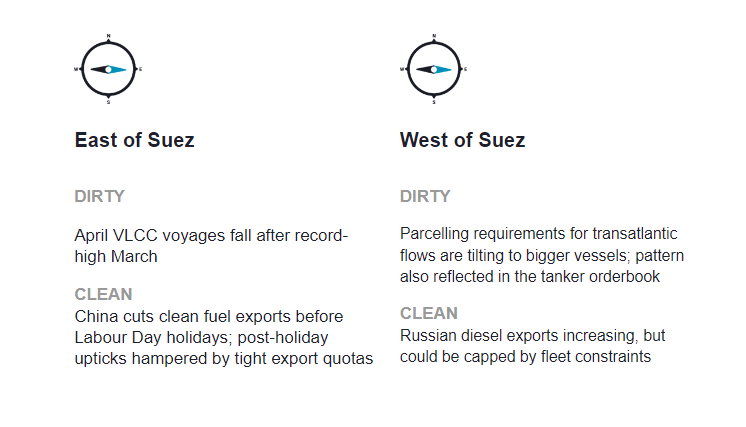
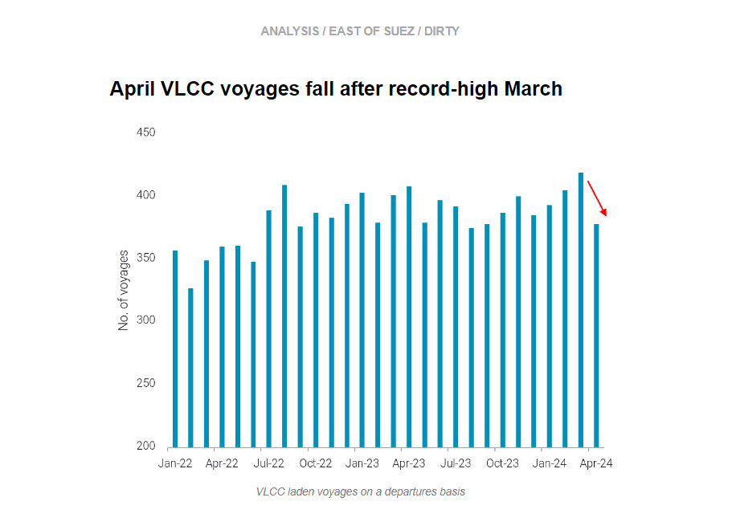
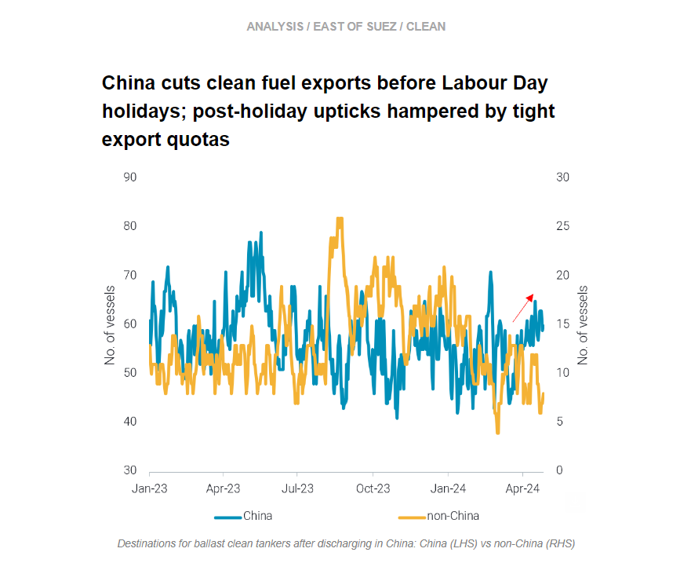
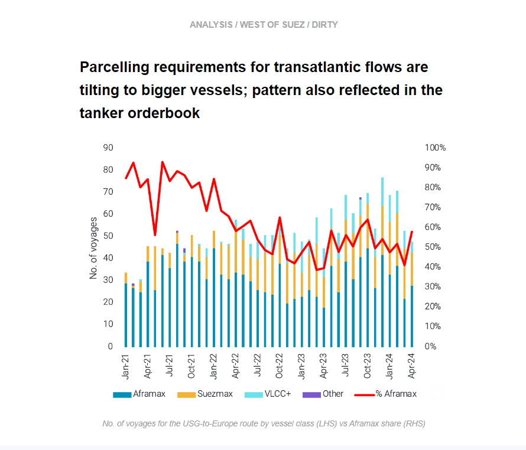
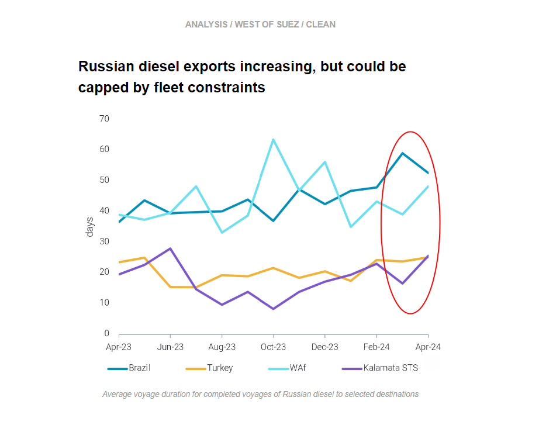

# Falling VLCC voyages

**Date:** May 02, 2024  
**Publisher:** Breakwave Advisors | **Category:** Market Insights  
**Original URL:** [https://www.breakwaveadvisors.com/insights/2024/5/2/falling-vlcc-voyages](https://www.breakwaveadvisors.com/insights/2024/5/2/falling-vlcc-voyages)  

---

This week, in the East, we discuss falling VLCC voyage counts after a record-high March and why MRs are remaining in China despite tight export quotas. In the West, we look at the longer-term trend of increased parcelling requirements for USG-to-Europe crude cargoes. On the clean side, we investigate preliminary signs of increasing Russian diesel exports which could be hampered by fleet constraints.

*By*[*Mary Melton*](https://www.linkedin.com/search/results/all/?fetchDeterministicClustersOnly=true&heroEntityKey=urn%3Ali%3Afsd_profile%3AACoAABXVyecBtg-pRnIrZe0BoWk0ygPiUfbvhsw&keywords=mary%20melton&origin=RICH_QUERY_SUGGESTION&position=0&searchId=40e8d7d2-c4d0-4022-81e7-176f6eba418b&sid=H_Y&spellCorrectionEnabled=false)

> **Figure 1: Στιγμιότυπο Οθόνης 2024 05 02 140442**  
> **Interactive Data & Source:** [Marketingmail Vortexa](https://marketingmail.vortexa.com/ODM3LU1aRS01NzgAAAGS0xsn5sSZqNQfpJ2ArxyBiwtfSqrb-zr26SKs2bAADXZIy--3OmzC4nhNdDy05yXDKMGzY-w=) | [Local Asset](file:///C:/Users/Dell/Github/Shipping/corpus/03-breakwave/insights/2024/assets/2024-05-02_falling-vlcc-voyages_img_cea3cf84ceb9ceb3cebcceb9cf8ccf84cf85_d63f4fe0743e.png)

> **Figure 2: Στιγμιότυπο Οθόνης 2024 05 02 140524**  
> **Interactive Data & Source:** [Marketingmail Vortexa](https://marketingmail.vortexa.com/ODM3LU1aRS01NzgAAAGS0xsn5sSZqNQfpJ2ArxyBiwtfSqrb-zr26SKs2bAADXZIy--3OmzC4nhNdDy05yXDKMGzY-w=) | [Local Asset](file:///C:/Users/Dell/Github/Shipping/corpus/03-breakwave/insights/2024/assets/2024-05-02_falling-vlcc-voyages_img_cea3cf84ceb9ceb3cebcceb9cf8ccf84cf85_178fc1fa215e.png)

- [VLCC laden voyage counts](https://marketingmail.vortexa.com/ODM3LU1aRS01NzgAAAGS0xsn5sSZqNQfpJ2ArxyBiwtfSqrb-zr26SKs2bAADXZIy--3OmzC4nhNdDy05yXDKMGzY-w=)declined over 10% in April after all-time highs in March. High March employment came from a few factors: increased[MEG loadings towards NE Asia](https://marketingmail.vortexa.com/ODM3LU1aRS01NzgAAAGS0xsn6e6aZ8CUpkTfAX2Roq7oQ3c1MbV3hSjJj0eFgTOvzylsHJVViyI4DWZSTyJB4qJ_XGA=)and a 58% increase in the number of[voyages ex-USG to NE and SE Asia](https://marketingmail.vortexa.com/ODM3LU1aRS01NzgAAAGS0xsn6PA-caNVXO8FitVQK6bgWmCrVb1CUM5e7zox9CzQjuemW-NYNqBS-1rmhIfcVAh6q8E=). In April, these USG long-haul voyages to Asia halved, partially due to unfavourable arbitrage economics for WTI to Asia, which is sending more barrels to Europe on smaller vessel classes.

- These factors, combined with falling employment for[VLCCs from WAf and Brazil to Asia](https://marketingmail.vortexa.com/ODM3LU1aRS01NzgAAAGS0xsn5wYv1eNT-m2_y2oA1tu_h4-Ts9ixDLW1IK1gqpWE4l65bfLnwJkdIT976MKGZG3_1co=), are limiting global VLCC tonne-mile demand and preventing upward momentum in Atlantic Basin VLCC freight rates.
- [China’s onshore crude inventories](https://marketingmail.vortexa.com/ODM3LU1aRS01NzgAAAGS0xsn5z2pYyr6KsRkc2vY8n2HQAGOcAFdzsACSRp9UulnpTNOVaYEpsXnk3k22dncB42QxMI=)had a net build over the last two months after drawing since August. If this continues, this could translate into upside for VLCC demand. However, reports of refinery run cuts in NE Asia combined with peak refinery maintenance season in the region makes this increase in demand seem unlikely in the short-term.

> **Figure 3: Στιγμιότυπο Οθόνης 2024 05 02 140551**  
> **Interactive Data & Source:** [Marketingmail Vortexa](https://marketingmail.vortexa.com/ODM3LU1aRS01NzgAAAGS0xsn6CYjWQivFUYMKuAcir4WrGzMGrNpzu16vDvFSTbfAQQDXnSTXvnqyO0E6EPMUq-R_qs=) | [Local Asset](file:///C:/Users/Dell/Github/Shipping/corpus/03-breakwave/insights/2024/assets/2024-05-02_falling-vlcc-voyages_img_cea3cf84ceb9ceb3cebcceb9cf8ccf84cf85_1448d7c7cdb2.png)

- China’s[clean fuel exports hit year-to-date lows in April](https://marketingmail.vortexa.com/ODM3LU1aRS01NzgAAAGS0xsn6CYjWQivFUYMKuAcir4WrGzMGrNpzu16vDvFSTbfAQQDXnSTXvnqyO0E6EPMUq-R_qs=), as CPP production declined m-o-m amid the refinery maintenance peak and refiners prioritised domestic supplies to meet rising travel demand during the Labour Day Golden Week holidays.

- After discharging in China, ballast tankers are opting to remain in China instead of[leaving Chinese waters](https://marketingmail.vortexa.com/ODM3LU1aRS01NzgAAAGS0xsn6H9kZSUC86s27MeqZEy_cLB5QIa1DD-LOT-KPfGKIj3tv_GuOqcDq0wtoa0byDQ72Uk=). Non-China MR freight rates in the region ([TC7](https://marketingmail.vortexa.com/ODM3LU1aRS01NzgAAAGS0xsn5yZ-qkWS46sjuFdy-NnDzVuOeR9JhCSAYXxbXNcfIUfiO9a2k6cph5Wrzif8t3MZIMM=),[TC10](https://marketingmail.vortexa.com/ODM3LU1aRS01NzgAAAGS0xsn57oOpaoNJFBINeAjY4l5f9vmvyK_n5baGGyaDKKzLTv5IWJajfZNzy3oMkZSd6DZM-s=),[TC11](https://marketingmail.vortexa.com/ODM3LU1aRS01NzgAAAGS0xsn50dI-5zm8jsiyJSbe-oYUNditTFslYpseNmFoI8ONFLQuzgS7AlQPQrEVuWnO2kaX1U=)) are hovering around their ytd nadirs and making owners reluctant to ballast away from the country amidst expectation of the new batch of export quotas.
- With strong jet fuel consumption (considered as exports) in Q1 this year, Chinese refiners have substantially ultilised their initial batch of export quotas, leaving limited volumes for Q2 compared to last year. Currently, the market is expecting a second batch of quotas after the Golden Week holidays, which may prompt Chinese refiners to increase exports in 2H May. If these quotas materialise, this will increase MR2 demand in NE Asia.

> **Figure 4: Στιγμιότυπο Οθόνης 2024 05 02 140614**  
> **Interactive Data & Source:** [Marketingmail Vortexa](https://marketingmail.vortexa.com/ODM3LU1aRS01NzgAAAGS0xsn5r0J0NZLM5OoOIOx4LKzBPn6_R6NhMS2l09bHaXbshHjLyeFY-2oZfS3Hb-FQxrvCbk=) | [Local Asset](file:///C:/Users/Dell/Github/Shipping/corpus/03-breakwave/insights/2024/assets/2024-05-02_falling-vlcc-voyages_img_cea3cf84ceb9ceb3cebcceb9cf8ccf84cf85_6307666763f8.png)

- The[market share of Aframaxes](https://marketingmail.vortexa.com/ODM3LU1aRS01NzgAAAGS0xsn5r0J0NZLM5OoOIOx4LKzBPn6_R6NhMS2l09bHaXbshHjLyeFY-2oZfS3Hb-FQxrvCbk=)(from a number of voyages perspective) operating in the transatlantic US Gulf-to-Europe route has drastically declined over the past 3 years from 85-90% to hovering around 50%.

- This has been triggered by flows reshuffling following EU sanctions on Russian crude. Parcelling requirements increased for transatlantic cargoes to satisfy Europe’s crude demand as the region wound down its dependence on Urals.
- A similar trend is observed when looking at the shipowners' investing behaviour. Despite Aframaxes being the most ageing fleet, (around 50% of active Aframaxes are 15 years old and above. acc. to Braemar), the segment has the lowest number of orders when compared to VLCCs and Suezmaxes.This demonstrates the belief of the sector in bigger parcelling requirements and longer routes based on the current geopolitical background.

> **Figure 5: Στιγμιότυπο Οθόνης 2024 05 02 140651**  
> **Interactive Data & Source:** [Marketingmail Vortexa](https://marketingmail.vortexa.com/ODM3LU1aRS01NzgAAAGS0xsn6G21yiGCAq8fev4kX5jpoGSImgWnKSwUPENebns4mJZ3V9gOcBktEUaldooDhZh_wyc=) | [Local Asset](file:///C:/Users/Dell/Github/Shipping/corpus/03-breakwave/insights/2024/assets/2024-05-02_falling-vlcc-voyages_img_cea3cf84ceb9ceb3cebcceb9cf8ccf84cf85_4d9fb9f23257.png)

- Russia has reportedly managed to restore partial operations at some of the refineries affected by Ukrainian drone strikes (Argus), though strikes are continuing. From a seasonal perspective, Russian diesel exports in April (days 1-27) are over 15% lower yoy. However, in the week ending 28 Apr,[diesel exports](https://marketingmail.vortexa.com/ODM3LU1aRS01NzgAAAGS0xsn6G21yiGCAq8fev4kX5jpoGSImgWnKSwUPENebns4mJZ3V9gOcBktEUaldooDhZh_wyc=)were 167kbd higher yoy.

- Despite these preliminary signs that Russian diesel exports may be recovering, the fleet carrying Russian CPP may face constraints.[Russian diesel in floating storage](https://marketingmail.vortexa.com/ODM3LU1aRS01NzgAAAGS0xsn6JZkvi9KLhOtBUSW9yRXuheGSXp15IjVmr8zlo9LxGhknLxaM6vNF4sOLHTIBSJ05c8=)remains exceptionally high at around 8.5mb. It appears the main reason for the floating storage (defined as a vessel remaining stationary over 7 days) is a lack of buyers for Russian diesel. High volumes of EoS diesel imported in Atlantic Basin markets in the month of March has increased diesel supply and capped demand. A surge in vessels laden with Russian diesel sitting stationary around Gibraltar over the last week attests to this: vessels are waiting in a strategic position to find a buyer before heading to Brazil or turning around and going towards Turkey or Africa.
- Additionally, for completed voyages, average voyage duration in March and April for key Russian diesel discharge points increased (Brazil, Turkey, WAf, Kalamata STS). Prolongation of voyages and difficulty to find buyers which leave laden vessels stranded could cap fleet capacity. Within natural fixing windows,[MR availability in Russia](https://marketingmail.vortexa.com/ODM3LU1aRS01NzgAAAGS0xsn54qePzfWF8VLva27OaJoj8w6bSd5NVHaAgTJb8aCUdhTvel1Te2IUsJlnajRpXXaUwE=)is around a 2.5 month low, suggesting that if Russian diesel exports do continue to increase there may be a lack of tonnage to transport them.

Data Source:[Vortexa](https://www.vortexa.com//oil-gas-data-traders-analysts-data-scientists?gclid=Cj0KCQjw8_qRBhCXARIsAE2AtRZKOvMnbilZ_6_91d7huSFFy71pWLrnPwGwOHVzXsmsG-1a1mZnQw8aAt89EALw_wcB&hsa_acc=1782073842&hsa_ad=548425387665&hsa_cam=14746637662&hsa_grp=125038601902&hsa_kw=&hsa_mt=&hsa_net=adwords&hsa_src=g&hsa_tgt=dsa-1431852288425&hsa_ver=3&utm_campaign=%5BCD%5D%20-%20DSA%20-%20EMEA&utm_medium=cpc&utm_medium=ppc&utm_source=google&utm_source=adwords&utm_term=)

---

**Tags:** Shipping, Crude Oil, Tankers  
