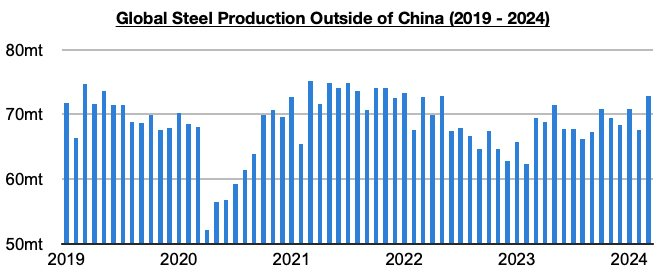
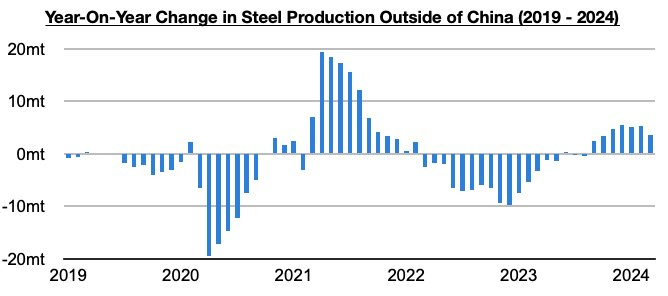
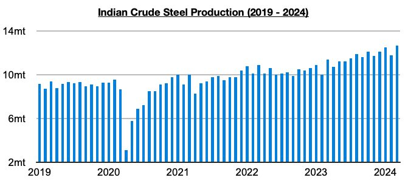

# Ongoing Growth in Steel Production Outside of China

**Date:** May 03, 2024  
**Publisher:** Breakwave Advisors | **Category:** Market Insights  
**Original URL:** [https://www.breakwaveadvisors.com/insights/2024/5/3/7dm0lkx6wwi6hahl8sv0qhm4o9tvgl](https://www.breakwaveadvisors.com/insights/2024/5/3/7dm0lkx6wwi6hahl8sv0qhm4o9tvgl)  

---

*By*[*Jeffrey Landsberg*](https://www.linkedin.com/in/jeffrey-landsberg-70ab957/)

Global steel production totaled approximately 161.2 million tons in March. This is up month-on-month by 12.4 million tons (8%) but is 3.9 million tons (-2%) less than was reported last year for March 2023’s production. Steel production outside of China totaled approximately 72.9 million tons. This is up month-on-month by 5.3 million tons (8%) and is 3.5 million tons (5%) more than was reported last year for March 2023’s production. Steel production outside of China has now increased on a year-on-year basis for seven straight months. Production has remained particularly strong in India.

> **Figure 1: Chart 1**  
> [Local Asset](file:///C:/Users/Dell/Github/Shipping/corpus/03-breakwave/insights/2024/assets/2024-05-03_7dm0lkx6wwi6hahl8sv0qhm4o9tvgl_img_chart1_6d66c025d7a1.jpg)

As we have been discussing in Commodore Research Weekly Dry Bulk Reports and Weekly China Reports, June last year saw an inflection point of sorts as there was finally growth in steel production outside of China. Prior to June, steel production outside of China had fallen on a year-on-year basis for fifteen straight months (during those fifteen months, production outside of China contracted year-on-year by 77 million tons). The turnaround has remained a major element of support for the dry bulk market.

> **Figure 2: Chart 2**  
> [Local Asset](file:///C:/Users/Dell/Github/Shipping/corpus/03-breakwave/insights/2024/assets/2024-05-03_7dm0lkx6wwi6hahl8sv0qhm4o9tvgl_img_chart2_8654ffb307a0.jpg)

In total, the last seven months have seen steel production outside of China grow year-on-year by 30.1 million tons. India’s steel production is where the growth remains the strongest, and where production again set a record last month. Indian steel production totaled a record 12.7 million tons in March. This is 900,000 tons (8%) more than was produced in February and is 1.3 million tons (11%) more than was reported last year for March 2023’s production.

> **Figure 3: Chart 3**  
> [Local Asset](file:///C:/Users/Dell/Github/Shipping/corpus/03-breakwave/insights/2024/assets/2024-05-03_7dm0lkx6wwi6hahl8sv0qhm4o9tvgl_img_chart3_e653e26f222b.jpg)

---

**Tags:** Drybulk, China, Economy  
