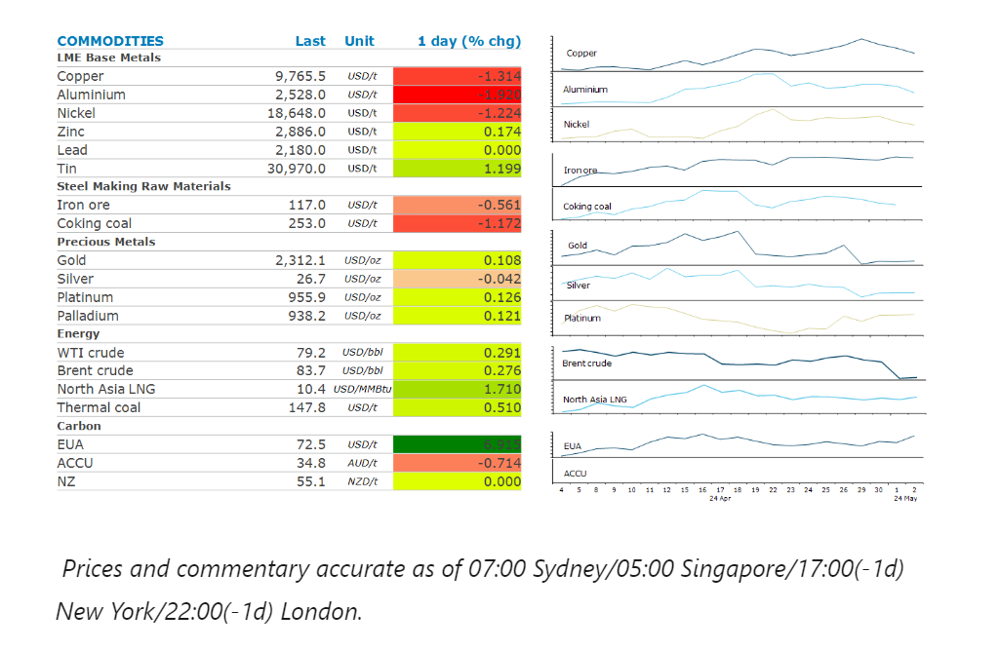
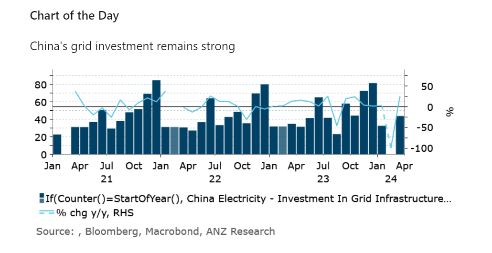

# Sentiment weighed down by uncertain economic backdrop

**Date:** May 03, 2024  
**Publisher:** Breakwave Advisors | **Category:** Market Insights  
**Original URL:** [https://www.breakwaveadvisors.com/insights/2024/5/3/sentiment-weighed-down-by-uncertain-economic-backdrop](https://www.breakwaveadvisors.com/insights/2024/5/3/sentiment-weighed-down-by-uncertain-economic-backdrop)  

---

A risk-off tone across markets weighed on sentiment across the commodity complex. Easing geopolitical risks and burgeoning stockpiles were also headwinds.

*By*[*Daniel Hynes*](https://www.linkedin.com/in/dahynes/)

> **Figure 1: Στιγμιότυπο Οθόνης 2024 05 03 102803**  
> **Interactive Data & Source:** [Publications Anz](https://publications.anz.com/SingletrackCMS__DownloadDocument?docRef=df562568-fb7d-487a-8be2-3e4f48980946&uid=bd219b92-f5cc-400e-9646-4178791864b7&jobRef=e64af8bb-fada-40c2-95ac-2126406e71d2) | [Local Asset](file:///C:/Users/Dell/Github/Shipping/corpus/03-breakwave/insights/2024/assets/2024-05-03_sentiment-weighed-down-by-uncertain-economic-backdrop_img_cea3cf84ceb9ceb3cebcceb9cf8ccf84cf85_ac604a667d85.png)

**Copper**started the day strongly as the USD weakened after the Fed said it was unlikely to raise rates amid persistent high inflation. However, prices fell late in the session amid concerns of the impact of tighter monetary policy remaining in place for longer than expected. Even so, the economic backdrop remains positive. Recent data showed that China’s Q1 GDP growth rose to 1.6% from 1.2% in Q4 2023 on a quarter-on-quarter basis, suggesting a significant gain in growth momentum. However, the composition of growth continues to shift in favour of commodity demand. China’s power demand saw another strong period of growth. New power generating capacity continues to be dominated by renewable energy. The electric vehicle (EV) sector saw a strong rebound after a weak start to the year. Overall, the green economy has become China’s biggest growth driver for demand of some commodities, such as metals.[**This should be broadly positive for commodities**](https://publications.anz.com/SingletrackCMS__DownloadDocument?docRef=df562568-fb7d-487a-8be2-3e4f48980946&uid=bd219b92-f5cc-400e-9646-4178791864b7&jobRef=e64af8bb-fada-40c2-95ac-2126406e71d2)in the near term.

**Gold**eased lower in the fallout from yesterday’s FOMC meeting. The Fed decided to leave rates unchanged, citing the lack of progress on inflation. The market latched onto the fact they kept the language referring to a future reduction in rates. However, the realisation that interest rates are likely to remain higher for longer eventually weighed on sentiment.

**Iron ore**futures eased lower amid rising supply and weaker demand. Australian iron ore exports rose 26% m/m to 78.41mt in April. Operations have overcome recent maintenance issues and weather events which had been impacting exports. Reports that China may look to tweak its production limits for steel amid oversupply and declining prices also weighed on sentiment.

**Crude oil**prices were little changed as the market contemplates the geopolitical and economic backdrop. The prospect of interest rates remaining higher for longer could see demand come under pressure. With the US driving season almost upon us, high inflation may see consumers opt for shorter drives over the holiday period. This comes following the surprise build in oil inventories in the US last week, suggesting demand is already deteriorating. Geopolitical risks are also fading. Reports suggest Hamas is studying a proposal for a temporary ceasefire in a “positive spirit” and plans to send a delegation to Egypt to continue talks. Yesterday a Bloomberg report suggested the US and Saudi Arabia are nearing a historic pact that would offer the kingdom security guarantees and lay out a possible pathway to diplomatic ties with Israel.

**Global gas**prices rose as emerging supply side issues threaten to suppress next winter’s inventory rebuild. Egypt, traditionally an LNG exporter, signed a deal with Norway to rent a floating LNG storage terminal as it tries to procure more fuel to deal with strong domestic demand. This comes as demand in Asia rises amid sweltering heat.

> **Figure 2: Στιγμιότυπο Οθόνης 2024 05 03 102828**  
> **Interactive Data & Source:** [Linkedin](https://www.linkedin.com/newsletters/commodities-wrap-6692196755876012032/?fbclid=IwAR3kiXJqZdxmp9ZcRwBNI7FsBySI-XSC0pfPur1qzjt7OZp7PTE59Tsl1QI) | [Local Asset](file:///C:/Users/Dell/Github/Shipping/corpus/03-breakwave/insights/2024/assets/2024-05-03_sentiment-weighed-down-by-uncertain-economic-backdrop_img_cea3cf84ceb9ceb3cebcceb9cf8ccf84cf85_3fbbdb3ee3c3.png)

Data source:[Commodities Wrap](https://www.linkedin.com/newsletters/commodities-wrap-6692196755876012032/?fbclid=IwAR3kiXJqZdxmp9ZcRwBNI7FsBySI-XSC0pfPur1qzjt7OZp7PTE59Tsl1QI)

---

**Tags:** Commodities, Economy, Markets  
