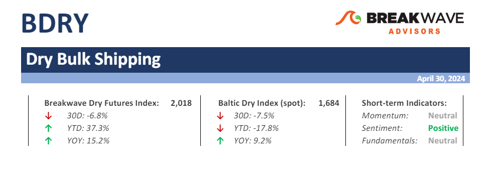

# Weekly Insights Review

**Date:** May 04, 2024  
**Publisher:** Breakwave Advisors | **Category:** Market Insights  
**Original URL:** [https://www.breakwaveadvisors.com/insights/2024/5/4/t73qz6pfuu0gb2ohbflvl5kcym5v55](https://www.breakwaveadvisors.com/insights/2024/5/4/t73qz6pfuu0gb2ohbflvl5kcym5v55)  

---

## Welcome to Our Weekly Insights Review

## Read Here Everything You Need to Know

**Spot Dry Bulk Rates Continue to Underperform Although Expectations Remain High –**The month of April proved to be a disappointment for freight futures traders as earlier**expectations**for a rebound in rates failed to materialize.

> **Figure 1: Στιγμιότυπο Οθόνης 2024 05 04 135545**  
> **Interactive Data & Source:** [Breakwave Advisors Market Insights](https://www.breakwaveadvisors.com/insights/2024/4/29/bkql25bg3bufqvioabueoj1k2f7eb9) | [Local Asset](file:///C:/Users/Dell/Github/Shipping/corpus/03-breakwave/insights/2024/assets/2024-05-04_t73qz6pfuu0gb2ohbflvl5kcym5v55_img_cea3cf84ceb9ceb3cebcceb9cf8ccf84cf85_c3e1bb54a7be.png)

> **Figure 2: Read More**  
> **Interactive Data & Source:** [Breakwave Advisors Market Insights](https://www.breakwaveadvisors.com/insights/2024/4/29/bkql25bg3bufqvioabueoj1k2f7eb9) | [Local Asset](file:///C:/Users/Dell/Github/Shipping/corpus/03-breakwave/insights/2024/assets/2024-05-04_t73qz6pfuu0gb2ohbflvl5kcym5v55_img_image-asset28429_b2a33f9ea212.jpeg)

## The Chinese Economy Had a Strong Start in the First Quarter

Doric Weekly Market Insight

Following last week's optimistic Chinese GDP data, Sheng Laiyun, a spokesperson for the National Bureau of Statistics, emphasized that "The Chinese economy had a strong start in the first quarter...

> **Figure 3: 016 Chrisea 24 01 24**  
> **Interactive Data & Source:** [Breakwave Advisors Market Insights](https://www.breakwaveadvisors.com/insights/2024/4/29/steel-on-the-wheel) | [Local Asset](file:///C:/Users/Dell/Github/Shipping/corpus/03-breakwave/insights/2024/assets/2024-05-04_t73qz6pfuu0gb2ohbflvl5kcym5v55_img_016-chrisea-24-01-24_5bf83b085371.jpg)

## Steel on the Wheel

BRS Weekly Dry Bulk Newsletter

The World Steel Association (WSA) in its short-term outlook this month projects decent growth in global steel demand this year after a period of extreme market volatility emerging from several black swan events since the Covid outbreak.

[Read More](https://www.breakwaveadvisors.com/insights/2024/4/29/steel-on-the-wheel)

> **Figure 4: Market Chart 4**  
> **Interactive Data & Source:** [Breakwave Advisors Market Insights](https://www.breakwaveadvisors.com/insights/2024/4/29/consumer-strength-in-china-continues-to-lessen) | [Local Asset](file:///C:/Users/Dell/Github/Shipping/corpus/03-breakwave/insights/2024/assets/2024-05-04_t73qz6pfuu0gb2ohbflvl5kcym5v55_img_image-asset28529_bd277c787d23.jpeg)

## Consumer Strength in China Continues to Lessen

From Commodore's Weekly Dry Bulk Reports

As we discussed in Commodore Research's April 22nd Weekly China Report, China’s retail sales in March grew year-on-year by only 3.1%.

> **Figure 5: Three Things Investors Need to Know This Week**  
> *The three things investors need to know this week*  
> **Interactive Data & Source:** [Breakwave Advisors Market Insights](https://www.breakwaveadvisors.com/insights/2024/4/29/and-then-there-were-none-whats-the-impact-of-the-feds-higher-for-longer) | [Local Asset](file:///C:/Users/Dell/Github/Shipping/corpus/03-breakwave/insights/2024/assets/2024-05-04_t73qz6pfuu0gb2ohbflvl5kcym5v55_img_image-asset28629_8a091bd9c8d7.jpeg)

## And Then There Were None: What’s the Impact of the Fed’s “Higher for Longer”?

Mazars Weekly Note

1. *The Fed has pivoted back into hawkish mode. While our cardinal rule has been and shall remain, that we “don’t fight the Fed”, we now know that “forward guidance” is less potent than before.*

...

[Read More](https://www.breakwaveadvisors.com/insights/2024/4/29/and-then-there-were-none-whats-the-impact-of-the-feds-higher-for-longer)

> **Figure 6: Στιγμιότυπο+οθόνης+2024 05 01+110753**  
> **Interactive Data & Source:** [Breakwave Advisors Market Insights](https://www.breakwaveadvisors.com/insights/2024/5/1/global-oil-prices-stabilise-is-this-the-calm-before-the-storm) | [Local Asset](file:///C:/Users/Dell/Github/Shipping/corpus/03-breakwave/insights/2024/assets/2024-05-04_t73qz6pfuu0gb2ohbflvl5kcym5v55_img_cea3cf84ceb9ceb3cebcceb9cf8ccf84cf85_ada1370e4c50.png)

## Global Oil Prices Stabilise. Is This the Calm Before the Storm?

Vortexa Freight Weekly

The global oil price rally has stalled. Rising onshore crude inventories and falling middle distillate cracks are posing downside risks on prices.

[Read More](https://www.breakwaveadvisors.com/insights/2024/5/1/global-oil-prices-stabilise-is-this-the-calm-before-the-storm)

> **Figure 7: Market Chart 7**  
> **Interactive Data & Source:** [Breakwave Advisors Market Insights](https://www.breakwaveadvisors.com/insights/2024/5/1/positive-economic-data-in-china-boosts-sentiment) | [Local Asset](file:///C:/Users/Dell/Github/Shipping/corpus/03-breakwave/insights/2024/assets/2024-05-04_t73qz6pfuu0gb2ohbflvl5kcym5v55_img_image-asset28729_6b9a2d724b8d.jpeg)

## Positive Economic Data in China Boosts Sentiment

Commodities Wrap

Ongoing inflationary pressures in the US put further doubts on imminent rate cuts. A weaker USD also weighed on investor appetite for commodities.

[Read More](https://www.breakwaveadvisors.com/insights/2024/5/1/positive-economic-data-in-china-boosts-sentiment)

> **Figure 8: Research Γçô Square 1**  
> **Interactive Data & Source:** [Breakwave Advisors Market Insights](https://www.breakwaveadvisors.com/insights/2024/5/1/shifting-supply-chains) | [Local Asset](file:///C:/Users/Dell/Github/Shipping/corpus/03-breakwave/insights/2024/assets/2024-05-04_t73qz6pfuu0gb2ohbflvl5kcym5v55_img_research-ce93c387c3b4-square-1_c5975705eb43.jpg)

## Shifting Supply Chains

Gibson Tanker Market Report

With the one third of the year already over and the Red Sea still off limits to the majority of the tanker market, we examine how crude and product trade flows have changed to account for the necessary rerouting.

[Read More](https://www.breakwaveadvisors.com/insights/2024/5/1/shifting-supply-chains)

> **Figure 9: Market Chart 9**  
> **Interactive Data & Source:** [Breakwave Advisors Market Insights](https://www.breakwaveadvisors.com/insights/2024/5/2/big-picture-tankers-in-2025) | [Local Asset](file:///C:/Users/Dell/Github/Shipping/corpus/03-breakwave/insights/2024/assets/2024-05-04_t73qz6pfuu0gb2ohbflvl5kcym5v55_img_image-asset_85a16aa3c4bb.jpeg)

## Big Picture: Tankers in 2025

Braemar - Contain your excitement

From the perspective of oil demand growth vs. tanker supply growth, we concede things look good. Taking the mid-point of the IEA’s and OPEC’s forecasts, oil demand could grow 3.25% over the next two years.

[Read More](https://www.breakwaveadvisors.com/insights/2024/5/2/big-picture-tankers-in-2025)

> **Figure 10: Market Chart 10**  
> **Interactive Data & Source:** [Breakwave Advisors Market Insights](https://www.breakwaveadvisors.com/insights/2024/5/2/falling-vlcc-voyages) | [Local Asset](file:///C:/Users/Dell/Github/Shipping/corpus/03-breakwave/insights/2024/assets/2024-05-04_t73qz6pfuu0gb2ohbflvl5kcym5v55_img_image-asset28129_0121bd230132.jpeg)

## Falling VLCC Voyages

Vortexa Freight Weekly

This week, in the East, we discuss falling VLCC voyage counts after a record-high March and why MRs are remaining in China despite tight export quotas. In the West, we look at the longer-term trend ...

[Read More](https://www.breakwaveadvisors.com/insights/2024/5/2/falling-vlcc-voyages)

> **Figure 11: Market Chart 11**  
> **Interactive Data & Source:** [Breakwave Advisors Market Insights](https://www.breakwaveadvisors.com/insights/2024/5/3/7dm0lkx6wwi6hahl8sv0qhm4o9tvgl) | [Local Asset](file:///C:/Users/Dell/Github/Shipping/corpus/03-breakwave/insights/2024/assets/2024-05-04_t73qz6pfuu0gb2ohbflvl5kcym5v55_img_image-asset28229_4ddde39c3d9d.jpeg)

## Ongoing Growth in Steel Production Outside of China

From Commodore's Weekly Dry Bulk Reports

Global steel production totaled approximately 161.2 million tons in March. This is up month-on-month by 12.4 million tons (8%) but is 3.9 million tons (-2%) less than was reported last year for March 2023’s production.

[Read More](https://www.breakwaveadvisors.com/insights/2024/5/3/7dm0lkx6wwi6hahl8sv0qhm4o9tvgl)

> **Figure 12: Market Chart 12**  
> **Interactive Data & Source:** [Breakwave Advisors Market Insights](https://www.breakwaveadvisors.com/insights/2024/5/3/sentiment-weighed-down-by-uncertain-economic-backdrop) | [Local Asset](file:///C:/Users/Dell/Github/Shipping/corpus/03-breakwave/insights/2024/assets/2024-05-04_t73qz6pfuu0gb2ohbflvl5kcym5v55_img_image-asset28329_b5e3e4c9e918.jpeg)

## Sentiment Weighed Down by Uncertain Economic Backdrop

Commodities Wrap

A risk-off tone across markets weighed on sentiment across the commodity complex. Easing geopolitical risks and burgeoning stockpiles were also headwinds.

[Read More](https://www.breakwaveadvisors.com/insights/2024/5/3/sentiment-weighed-down-by-uncertain-economic-backdrop)

---

**Tags:** Shipping, Markets, Economy  
